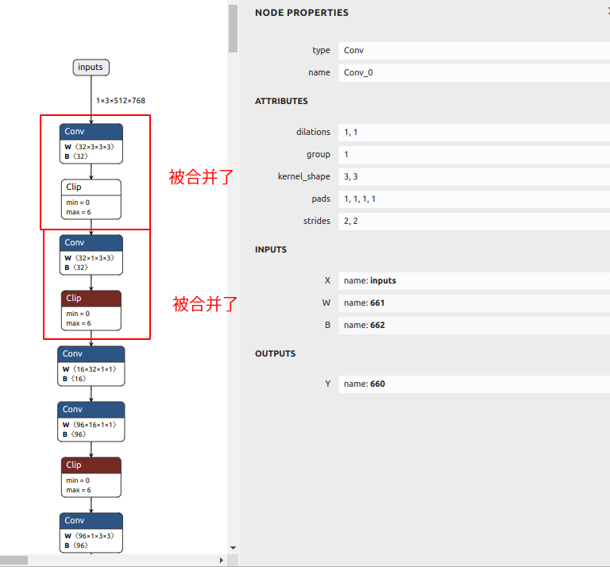
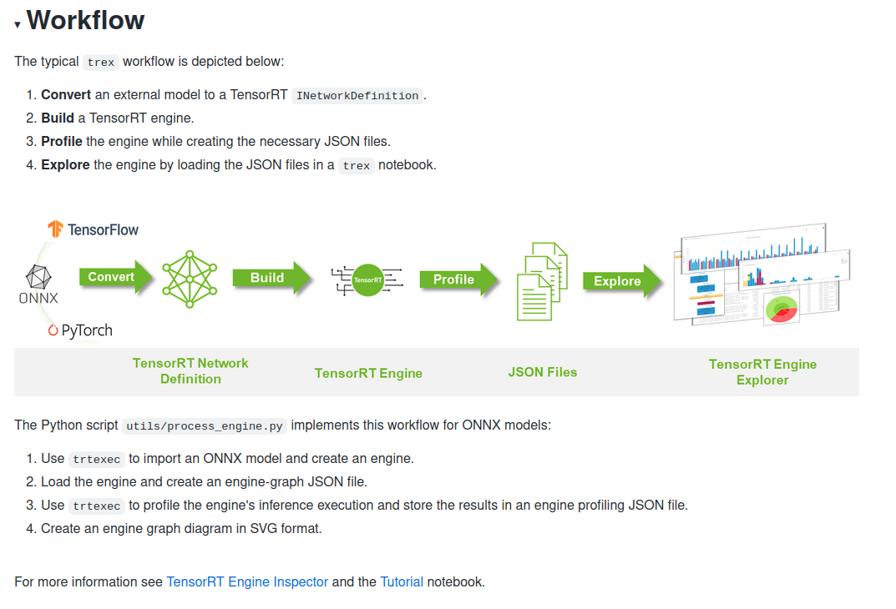
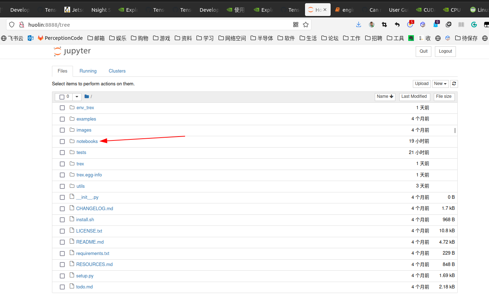
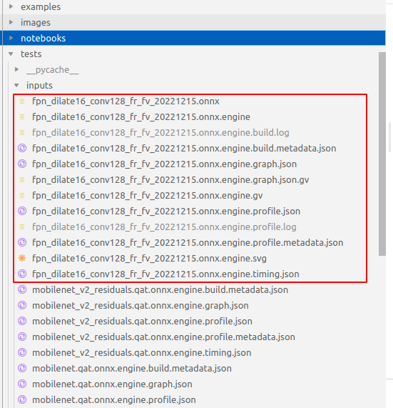
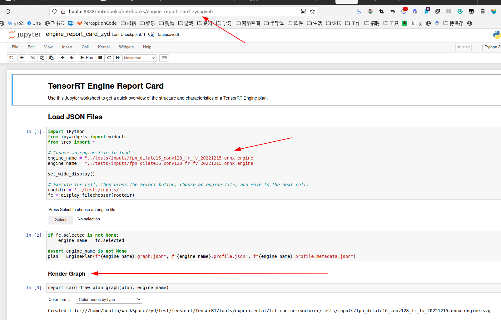
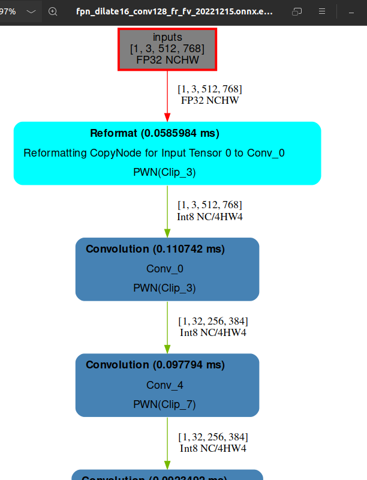
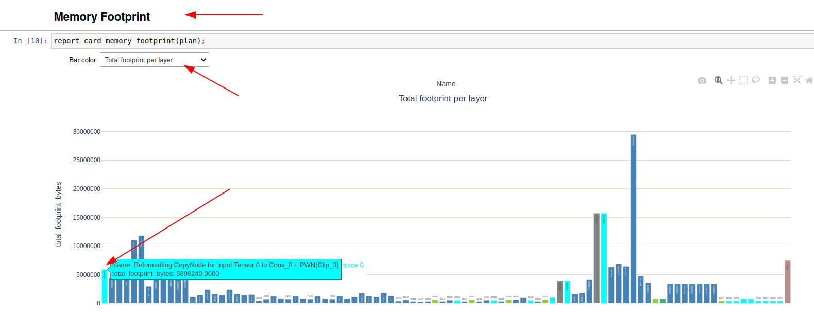
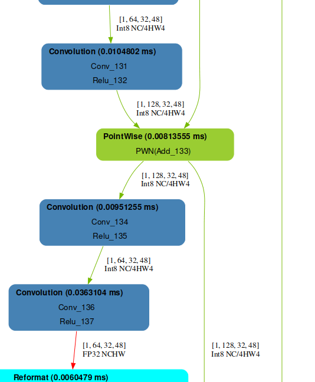
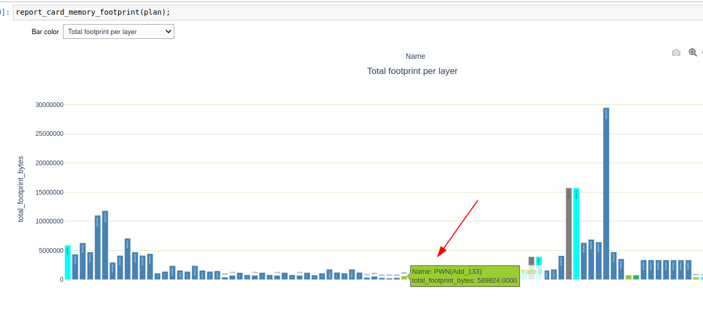

# 说明

本文档记录了使用tensort过程中的琐碎知识点总结，因为没哟总的归类，就汇总到一起吧。

现在慢慢养成了记录的习惯（之前是写博客，但是博客维护成本太高了，不是停服就是网络需求，还是写离线吧）

# 1 engine文件显存占用计算及层结构

使用trtexec或者编写代码从onnx文件生成engine文件后，因为tensorrt合并了一些层，为了方便的查看合并后的层结构和每一层的显存占用，因此有了以下的记录。


## 1.1 engine的模型结构绘制

### 1.1.1 使用trtexec生成的engine文件信息

因为原始的onnx模型文件经过trtexec转换为engine文件后有合并层等的优化操作，同时也会添加一些层，从trtexec的日志记录可以看出输出的层信息，但是没有图形的展示。

下面是使用trtexec转换onnx为engine的命令

```bash
trtexec --onnx=fpn_dilate16_conv128_fr_fv_20221215.onnx --verbose --dumpLayerInfo --dumpProfile --fp16 --calib=CalibratorFile.txt --exportProfile=fpn_dilate16_conv128_fr_fv_20221215.onnx_qnx.log
```

生成的文件`fpn_dilate16_conv128_fr_fv_20221215.onnx_qnx.log`中有engine文件的层信息如下

```bash
[
  { "count" : 625 }
, { "name" : "Reformatting CopyNode for Input Tensor 0 to Conv_0 + PWN(Clip_3)", "timeMs" : 36.6844, "averageMs" : 0.058695, "percentage" : 1.20497 }
, { "name" : "Conv_0 + PWN(Clip_3)", "timeMs" : 41.4232, "averageMs" : 0.0662771, "percentage" : 1.36062 }
, { "name" : "Conv_4 + PWN(Clip_7)", "timeMs" : 68.3092, "averageMs" : 0.109295, "percentage" : 2.24374 }
, { "name" : "Reformatting CopyNode for Input Tensor 0 to Conv_8", "timeMs" : 0, "averageMs" : 0, "percentage" : 0 }
, { "name" : "Conv_8", "timeMs" : 39.2477, "averageMs" : 0.0627963, "percentage" : 1.28917 }
, { "name" : "Conv_9 + PWN(Clip_12)", "timeMs" : 97.8789, "averageMs" : 0.156606, "percentage" : 3.21502 }
, { "name" : "Reformatting CopyNode for Input Tensor 0 to Conv_13 + PWN(Clip_16)", "timeMs" : 0, "averageMs" : 0, "percentage" : 0 }
, { "name" : "Conv_13 + PWN(Clip_16)", "timeMs" : 100.892, "averageMs" : 0.161428, "percentage" : 3.314 }
, { "name" : "Conv_17", "timeMs" : 27.2649, "averageMs" : 0.0436238, "percentage" : 0.895568 }
, { "name" : "Conv_18 + PWN(Clip_21)", "timeMs" : 41.8032, "averageMs" : 0.0668851, "percentage" : 1.37311 }
, { "name" : "Conv_22 + PWN(Clip_25)", "timeMs" : 78.7759, "averageMs" : 0.126041, "percentage" : 2.58754 }
, { "name" : "Conv_26 + Add_27", "timeMs" : 42.7776, "averageMs" : 0.0684441, "percentage" : 1.40511 }
, { "name" : "Conv_28 + PWN(Clip_31)", "timeMs" : 41.834, "averageMs" : 0.0669343, "percentage" : 1.37412 }
, { "name" : "Conv_32 + PWN(Clip_35)", "timeMs" : 47.1058, "averageMs" : 0.0753692, "percentage" : 1.54728 }
, { "name" : "Reformatting CopyNode for Input Tensor 0 to Conv_36", "timeMs" : 0, "averageMs" : 0, "percentage" : 0 }
, { "name" : "Conv_36", "timeMs" : 10.03, "averageMs" : 0.0160481, "percentage" : 0.329456 }
, { "name" : "Conv_37 + PWN(Clip_40)", "timeMs" : 13.9596, "averageMs" : 0.0223354, "percentage" : 0.45853 }
, { "name" : "Reformatting CopyNode for Input Tensor 0 to Conv_41 + PWN(Clip_44)", "timeMs" : 0, "averageMs" : 0, "percentage" : 0 }
, { "name" : "Conv_41 + PWN(Clip_44)", "timeMs" : 28.4746, "averageMs" : 0.0455594, "percentage" : 0.935302 }
, { "name" : "Reformatting CopyNode for Input Tensor 0 to Conv_45 + Add_46", "timeMs" : 0, "averageMs" : 0, "percentage" : 0 }
, { "name" : "Conv_45 + Add_46", "timeMs" : 10.4463, "averageMs" : 0.0167141, "percentage" : 0.34313 }
, { "name" : "Conv_47 + PWN(Clip_50)", "timeMs" : 13.6577, "averageMs" : 0.0218523, "percentage" : 0.448614 }
, { "name" : "Reformatting CopyNode for Input Tensor 0 to Conv_51 + PWN(Clip_54)", "timeMs" : 0, "averageMs" : 0, "percentage" : 0 }
, { "name" : "Conv_51 + PWN(Clip_54)", "timeMs" : 28.3749, "averageMs" : 0.0453998, "percentage" : 0.932027 }
, { "name" : "Reformatting CopyNode for Input Tensor 0 to Conv_55 + Add_56", "timeMs" : 0, "averageMs" : 0, "percentage" : 0 }
, { "name" : "Conv_55 + Add_56", "timeMs" : 10.3606, "averageMs" : 0.0165769, "percentage" : 0.340312 }
, { "name" : "Conv_57 + PWN(Clip_60)", "timeMs" : 13.599, "averageMs" : 0.0217584, "percentage" : 0.446684 }
, { "name" : "Reformatting CopyNode for Input Tensor 0 to Conv_61 + PWN(Clip_64)", "timeMs" : 0, "averageMs" : 0, "percentage" : 0 }
, { "name" : "Conv_61 + PWN(Clip_64)", "timeMs" : 13.7449, "averageMs" : 0.0219918, "percentage" : 0.451477 }
, { "name" : "Conv_65", "timeMs" : 7.07921, "averageMs" : 0.0113267, "percentage" : 0.23253 }
, { "name" : "Conv_66 + PWN(Clip_69)", "timeMs" : 11.4821, "averageMs" : 0.0183714, "percentage" : 0.377153 }
, { "name" : "Conv_70 + PWN(Clip_73)", "timeMs" : 16.4786, "averageMs" : 0.0263658, "percentage" : 0.541271 }
, { "name" : "Conv_74 + Add_75", "timeMs" : 8.47745, "averageMs" : 0.0135639, "percentage" : 0.278458 }
, { "name" : "Conv_76 + PWN(Clip_79)", "timeMs" : 10.9282, "averageMs" : 0.0174852, "percentage" : 0.358958 }
, { "name" : "Conv_80 + PWN(Clip_83)", "timeMs" : 16.2116, "averageMs" : 0.0259386, "percentage" : 0.532501 }
, { "name" : "Conv_84 + Add_85", "timeMs" : 7.86362, "averageMs" : 0.0125818, "percentage" : 0.258295 }
, { "name" : "Conv_86 + PWN(Clip_89)", "timeMs" : 10.9425, "averageMs" : 0.017508, "percentage" : 0.359426 }
, { "name" : "Conv_90 + PWN(Clip_93)", "timeMs" : 16.1701, "averageMs" : 0.0258722, "percentage" : 0.531138 }
, { "name" : "Conv_94 + Add_95", "timeMs" : 7.76089, "averageMs" : 0.0124174, "percentage" : 0.254921 }
, { "name" : "Conv_96 + PWN(Clip_99)", "timeMs" : 10.9261, "averageMs" : 0.0174818, "percentage" : 0.358889 }
, { "name" : "Conv_100 + PWN(Clip_103)", "timeMs" : 16.2166, "averageMs" : 0.0259466, "percentage" : 0.532667 }
, { "name" : "Reformatting CopyNode for Input Tensor 0 to Conv_104", "timeMs" : 0, "averageMs" : 0, "percentage" : 0 }
, { "name" : "Conv_104", "timeMs" : 10.0316, "averageMs" : 0.0160506, "percentage" : 0.329508 }
, { "name" : "Conv_105 + PWN(Clip_108)", "timeMs" : 13.8249, "averageMs" : 0.0221199, "percentage" : 0.454106 }
, { "name" : "Reformatting CopyNode for Input Tensor 0 to Conv_109 + PWN(Clip_112)", "timeMs" : 0, "averageMs" : 0, "percentage" : 0 }
, { "name" : "Conv_109 + PWN(Clip_112)", "timeMs" : 21.7933, "averageMs" : 0.0348693, "percentage" : 0.715844 }
, { "name" : "Reformatting CopyNode for Input Tensor 1 to Conv_113 + Add_114", "timeMs" : 0, "averageMs" : 0, "percentage" : 0 }
, { "name" : "Conv_113 + Add_114", "timeMs" : 13.4224, "averageMs" : 0.0214758, "percentage" : 0.440883 }
, { "name" : "Reformatting CopyNode for Input Tensor 0 to Conv_115 + PWN(Clip_118)", "timeMs" : 0, "averageMs" : 0, "percentage" : 0 }
, { "name" : "Conv_115 + PWN(Clip_118)", "timeMs" : 13.4326, "averageMs" : 0.0214922, "percentage" : 0.441221 }
, { "name" : "Reformatting CopyNode for Input Tensor 0 to Conv_119 + PWN(Clip_122)", "timeMs" : 0, "averageMs" : 0, "percentage" : 0 }
, { "name" : "Conv_119 + PWN(Clip_122)", "timeMs" : 22.1088, "averageMs" : 0.0353741, "percentage" : 0.726207 }
, { "name" : "Conv_123 + Add_124", "timeMs" : 12.7532, "averageMs" : 0.0204052, "percentage" : 0.418904 }
, { "name" : "Conv_125", "timeMs" : 8.06134, "averageMs" : 0.0128981, "percentage" : 0.26479 }
, { "name" : "Conv_126", "timeMs" : 17.4966, "averageMs" : 0.0279946, "percentage" : 0.574709 }
, { "name" : "Conv_127 + Relu_128", "timeMs" : 7.43609, "averageMs" : 0.0118977, "percentage" : 0.244253 }
, { "name" : "Conv_129 + Relu_130", "timeMs" : 10.0724, "averageMs" : 0.0161159, "percentage" : 0.330849 }
, { "name" : "Conv_131 + Relu_132", "timeMs" : 6.08119, "averageMs" : 0.0097299, "percentage" : 0.199748 }
, { "name" : "Add_133", "timeMs" : 5.89997, "averageMs" : 0.00943995, "percentage" : 0.193796 }
, { "name" : "Conv_134 + Relu_135", "timeMs" : 6.44957, "averageMs" : 0.0103193, "percentage" : 0.211848 }
, { "name" : "Conv_136 + Relu_137", "timeMs" : 8.9456, "averageMs" : 0.014313, "percentage" : 0.293835 }
, { "name" : "Conv_138 + Relu_139", "timeMs" : 5.99814, "averageMs" : 0.00959702, "percentage" : 0.19702 }
, { "name" : "Add_140", "timeMs" : 5.22041, "averageMs" : 0.00835266, "percentage" : 0.171474 }
, { "name" : "Conv_141 + Relu_142", "timeMs" : 6.07344, "averageMs" : 0.0097175, "percentage" : 0.199494 }
, { "name" : "Reformatting CopyNode for Input Tensor 0 to Conv_143 + Relu_144", "timeMs" : 0, "averageMs" : 0, "percentage" : 0 }
, { "name" : "Conv_143 + Relu_144", "timeMs" : 10.1038, "averageMs" : 0.0161661, "percentage" : 0.331879 }
, { "name" : "Reformatting CopyNode for Input Tensor 0 to Conv_145 + Relu_146", "timeMs" : 0, "averageMs" : 0, "percentage" : 0 }
, { "name" : "Conv_145 + Relu_146", "timeMs" : 6.02717, "averageMs" : 0.00964348, "percentage" : 0.197974 }
, { "name" : "Add_147", "timeMs" : 5.21741, "averageMs" : 0.00834785, "percentage" : 0.171376 }
, { "name" : "Conv_148 + Relu_149", "timeMs" : 6.30953, "averageMs" : 0.0100953, "percentage" : 0.207249 }
, { "name" : "Reformatting CopyNode for Input Tensor 0 to Conv_150 + Relu_151", "timeMs" : 0, "averageMs" : 0, "percentage" : 0 }
, { "name" : "Conv_150 + Relu_151", "timeMs" : 10.126, "averageMs" : 0.0162016, "percentage" : 0.332607 }
, { "name" : "Reformatting CopyNode for Input Tensor 0 to Conv_152 + Relu_153", "timeMs" : 0, "averageMs" : 0, "percentage" : 0 }
, { "name" : "Conv_152 + Relu_153", "timeMs" : 6.01293, "averageMs" : 0.00962068, "percentage" : 0.197506 }
, { "name" : "Add_154", "timeMs" : 5.22432, "averageMs" : 0.00835892, "percentage" : 0.171603 }
, { "name" : "Resize_157", "timeMs" : 7.46377, "averageMs" : 0.011942, "percentage" : 0.245162 }
, { "name" : "Reformatting CopyNode for Input Tensor 0 to Conv_158 + Relu_159", "timeMs" : 0, "averageMs" : 0, "percentage" : 0 }
, { "name" : "Conv_158 + Relu_159", "timeMs" : 15.01, "averageMs" : 0.0240159, "percentage" : 0.49303 }
, { "name" : "Conv_155 + Add_160", "timeMs" : 15.0216, "averageMs" : 0.0240346, "percentage" : 0.493414 }
, { "name" : "Conv_161 + Relu_162", "timeMs" : 38.0131, "averageMs" : 0.0608209, "percentage" : 1.24861 }
, { "name" : "Reformatting CopyNode for Input Tensor 0 to Resize_165", "timeMs" : 0, "averageMs" : 0, "percentage" : 0 }
, { "name" : "Resize_165", "timeMs" : 31.0258, "averageMs" : 0.0496413, "percentage" : 1.0191 }
, { "name" : "Reformatting CopyNode for Input Tensor 0 to Conv_166 + Relu_167", "timeMs" : 0, "averageMs" : 0, "percentage" : 0 }
, { "name" : "Conv_166 + Relu_167", "timeMs" : 54.3879, "averageMs" : 0.0870207, "percentage" : 1.78647 }
, { "name" : "Reformatting CopyNode for Input Tensor 1 to Conv_163 + Add_168", "timeMs" : 0, "averageMs" : 0, "percentage" : 0 }
, { "name" : "Conv_163 + Add_168", "timeMs" : 56.0092, "averageMs" : 0.0896147, "percentage" : 1.83973 }
, { "name" : "Conv_169 + Relu_170", "timeMs" : 138.43, "averageMs" : 0.221489, "percentage" : 4.54701 }
, { "name" : "Conv_171 + Relu_172 || Conv_178 + Relu_179 || Conv_181 + Relu_182 || Conv_184 + Relu_185 || Conv_187 + Relu_188 || Conv_190 + Relu_191 || Conv_193 + Relu_194 || Conv_196 + Relu_197", "timeMs" : 1009.24, "averageMs" : 1.61478, "percentage" : 33.1504 }
, { "name" : "Conv_173 + Relu_174", "timeMs" : 79.4247, "averageMs" : 0.12708, "percentage" : 2.60886 }
, { "name" : "Reformatting CopyNode for Output Tensor 0 to Conv_173 + Relu_174", "timeMs" : 6.45267, "averageMs" : 0.0103243, "percentage" : 0.21195 }
, { "name" : "Conv_175", "timeMs" : 35.6162, "averageMs" : 0.056986, "percentage" : 1.16988 }
, { "name" : "PWN(Sigmoid_176)", "timeMs" : 5.94893, "averageMs" : 0.00951829, "percentage" : 0.195404 }
, { "name" : "MaxPool_177", "timeMs" : 7.83373, "averageMs" : 0.012534, "percentage" : 0.257314 }
, { "name" : "Conv_180", "timeMs" : 34.9889, "averageMs" : 0.0559822, "percentage" : 1.14928 }
, { "name" : "Conv_183", "timeMs" : 31.2683, "averageMs" : 0.0500292, "percentage" : 1.02707 }
, { "name" : "Conv_186", "timeMs" : 31.3358, "averageMs" : 0.0501372, "percentage" : 1.02928 }
, { "name" : "Conv_189", "timeMs" : 31.303, "averageMs" : 0.0500847, "percentage" : 1.02821 }
, { "name" : "Conv_192", "timeMs" : 31.2051, "averageMs" : 0.0499282, "percentage" : 1.02499 }
, { "name" : "Conv_195", "timeMs" : 31.2451, "averageMs" : 0.0499922, "percentage" : 1.0263 }
, { "name" : "Conv_198", "timeMs" : 31.2507, "averageMs" : 0.050001, "percentage" : 1.02649 }
, { "name" : "Reformatting CopyNode for Input Tensor 0 to PWN(Sigmoid_199)", "timeMs" : 4.70352, "averageMs" : 0.00752563, "percentage" : 0.154496 }
, { "name" : "PWN(Sigmoid_199)", "timeMs" : 4.01456, "averageMs" : 0.0064233, "percentage" : 0.131866 }
, { "name" : "639 copy", "timeMs" : 4.81315, "averageMs" : 0.00770104, "percentage" : 0.158097 }
, { "name" : "636 copy", "timeMs" : 4.79504, "averageMs" : 0.00767206, "percentage" : 0.157502 }
, { "name" : "632 copy", "timeMs" : 4.8806, "averageMs" : 0.00780896, "percentage" : 0.160313 }
, { "name" : "633 copy", "timeMs" : 4.92234, "averageMs" : 0.00787574, "percentage" : 0.161684 }
, { "name" : "642 copy", "timeMs" : 4.84118, "averageMs" : 0.00774589, "percentage" : 0.159018 }
, { "name" : "648 copy", "timeMs" : 5.03843, "averageMs" : 0.00806148, "percentage" : 0.165497 }
, { "name" : "645 copy", "timeMs" : 5.05811, "averageMs" : 0.00809298, "percentage" : 0.166143 }
, { "name" : "651 copy", "timeMs" : 5.28234, "averageMs" : 0.00845174, "percentage" : 0.173508 }
, { "name" : "Reformatting CopyNode for Input Tensor 0 to Reshape_202 + Transpose_203", "timeMs" : 43.4376, "averageMs" : 0.0695001, "percentage" : 1.42679 }
, { "name" : "Reshape_202 + Transpose_203", "timeMs" : 38.8628, "averageMs" : 0.0621805, "percentage" : 1.27652 }
, { "name" : "Reformatting CopyNode for Output Tensor 0 to Reshape_202 + Transpose_203", "timeMs" : 0, "averageMs" : 0, "percentage" : 0 }
]

```

截取原始的部分onnx模型如下



### 1.1.2 engine模型结构绘制

上面的日志可以看出来模型的结构的确发生了变化，但是不直观。为了画出engine文件的结构，这里找到了官方的工具。

[**trt-engine-explorer**](https://github.com/NVIDIA/TensorRT/tree/main/tools/experimental/trt-engine-explorer)，用于分析engine文件结构和简单性能分析。



按照官方的步骤安装后，跑一下测试。上来就碰到了错误

```bash
(env_trex) huolin@huolin:~/WorkSpace/zyd/test/tensorrt/TensorRT/tools/experimental/trt-engine-explorer$ pytest tests
============================= test session starts ==============================
platform linux -- Python 3.8.10, pytest-7.2.1, pluggy-1.0.0
rootdir: /home/huolin/WorkSpace/zyd/test/tensorrt/TensorRT/tools/experimental/trt-engine-explorer
plugins: dash-2.8.1, anyio-3.6.2
collected 0 items / 2 errors                                                   

==================================== ERRORS ====================================
___________________ ERROR collecting tests/test_alignment.py ___________________
tests/test_alignment.py:20: in <module>
    from trex import *
trex/__init__.py:25: in <module>
    from trex.plotting import *
trex/plotting.py:30: in <module>
    from .notebook import display_df
trex/notebook.py:27: in <module>
    import qgrid
env_trex/lib/python3.8/site-packages/qgrid/__init__.py:3: in <module>
    from .grid import (
env_trex/lib/python3.8/site-packages/qgrid/grid.py:524: in <module>
    @widgets.register()
E   TypeError: register() missing 1 required positional argument: 'widget'
_____________________ ERROR collecting tests/test_basic.py _____________________
tests/test_basic.py:20: in <module>
    from trex import *
trex/__init__.py:25: in <module>
    from trex.plotting import *
trex/plotting.py:30: in <module>
    from .notebook import display_df
trex/notebook.py:27: in <module>
    import qgrid
env_trex/lib/python3.8/site-packages/qgrid/__init__.py:3: in <module>
    from .grid import (
env_trex/lib/python3.8/site-packages/qgrid/grid.py:524: in <module>
    @widgets.register()
E   TypeError: register() missing 1 required positional argument: 'widget'
=========================== short test summary info ============================
ERROR tests/test_alignment.py - TypeError: register() missing 1 required positional argument: 'widget'
ERROR tests/test_basic.py - TypeError: register() missing 1 required positional argument: 'widget'
!!!!!!!!!!!!!!!!!!! Interrupted: 2 errors during collection !!!!!!!!!!!!!!!!!!!!
============================== 2 errors in 1.69s ===============================

```

貌似是因为一个python包的版本问题。使用命令修改版本即可

```bash
pip3 install ipywidgets==7.7.2
```

搞定之后就可以测试了，官方是使用的jupyter-notebook，我们也用

```shell
(env_trex) huolin@huolin:~/WorkSpace/zyd/test/tensorrt/TensorRT/tools/experimental/trt-engine-explorer$ jupyter-notebook --ip=0.0.0.0 --no-browser
[W 14:45:25.665 NotebookApp] Loading JupyterLab as a classic notebook (v6) extension.
[C 14:45:25.665 NotebookApp] You must use Jupyter Server v1 to load JupyterLab as notebook extension. You have v2.2.1 installed.
    You can fix this by executing:
        pip install -U "jupyter-server<2.0.0"
[I 14:45:25.666 NotebookApp] Serving notebooks from local directory: /home/huolin/WorkSpace/zyd/test/tensorrt/TensorRT/tools/experimental/trt-engine-explorer
[I 14:45:25.666 NotebookApp] Jupyter Notebook 6.5.2 is running at:
[I 14:45:25.666 NotebookApp] http://huolin:8888/?token=7079ed4dd93772c52885039b2c8b25fe34733c0bb8750b2c
[I 14:45:25.666 NotebookApp]  or http://127.0.0.1:8888/?token=7079ed4dd93772c52885039b2c8b25fe34733c0bb8750b2c
[I 14:45:25.666 NotebookApp] Use Control-C to stop this server and shut down all kernels (twice to skip confirmation).
[C 14:45:25.668 NotebookApp] 
    
    To access the notebook, open this file in a browser:
        file:///home/huolin/.local/share/jupyter/runtime/nbserver-810431-open.html
    Or copy and paste one of these URLs:
        http://huolin:8888/?token=7079ed4dd93772c52885039b2c8b25fe34733c0bb8750b2c
     or http://127.0.0.1:8888/?token=7079ed4dd93772c52885039b2c8b25fe34733c0bb8750b2c

```

用浏览器打开上面提示的网址就可以了。打开下面的notebooks文件夹



参考里面的readme文件，首先提供onnx文件并生成engine文件。详细可以看`tutorial.ipynb`文件，重要的就是使用以下命令生成engine文件和json日志文件，后面分析就是根据日志文件来的

```shell
python3 ../utils/process_engine.py ../tests/inputs/mobilenet.qat.onnx ../tests/inputs best
```

我把自己的模型文件放在tests/inputs目录下，参考上面的命令生成一堆`json`日志文件



日志文件生成后就可以使用官方提供的`notebooks/engine_report_card.ipynb`文件进行分析了。这里参考复制了一份，并修改为自己的模型文件。



一步一步就可以运行了，其中`Render Graph`就是生成engine文件模型结构图片后缀是`.svg`，提示存放的路经。这里截取一部分图片如下



### 1.1.3 engine文件每一层的显存计算

继续运行上面的`engine_report_card.ipynb`其中有一个就是显存的分析。具体到每一层，这里的图标的展示，但是在生成的日志json文件中没有找到对应的数字，因此判断是通过日志的数据计算得出的。



## 1.2 engine文件每一层显存占用计算

反推代码，发现一段代码`trex/df_preprocessing.py`如下

```python
def annotate_convolutions(convs: pd.DataFrame):
    """Convolutions as implicit GEMM"""
    for index, conv in convs.iterrows():
        inputs, outputs = create_activations(conv)
        assert len(inputs)  > 0
        N, C, H, W = inputs[0].shape
        # K: number of channels; P: Height; Q: Width
        _, K, P, Q = outputs[0].shape
        R, S = convs.loc[index, 'attr.kernel']
        G = convs.loc[index, 'attr.groups']
        weights_vol = (K * C * R * S) / G
        input_vol = N * C * H * W
        output_vol = N * K * P * Q
        input_bytes = input_vol * inputs[0].data_size
        output_bytes = output_vol * outputs[0].data_size
        weights_bytes = weights_vol * inputs[0].data_size
        nb_bytes = input_bytes + weights_bytes + output_bytes
        nb_macs = N * K * P * Q * C * R * S / G
        convs.loc[index, 'attr.macs'] = nb_macs
        # Arithmetic intensity: ops/bytes
        convs.loc[index, 'attr.arithmetic_intensity'] = nb_macs / nb_bytes
        latency = convs.loc[index, 'latency.avg_time']
        convs.loc[index, 'attr.compute_efficiency'] = nb_macs / latency
        convs.loc[index, 'attr.memory_efficiency'] = nb_bytes / latency
        # Conversion to matrices (M, K) * (K, N)
        M = N * P * Q
        N = K
        K = C * R * S
        convs.loc[index, 'attr.M'] = M
        convs.loc[index, 'attr.N'] = N
        convs.loc[index, 'attr.K'] = K

    convs['attr.macs'] = convs['attr.macs'].astype('int64')
    convs['attr.M'] = convs['attr.M'].astype('int64')
    convs['attr.N'] = convs['attr.N'].astype('int64')
    convs['attr.K'] = convs['attr.K'].astype('int64')
```

这里关注几个重要一段

```python
        N, C, H, W = inputs[0].shape
        # K: number of channels; P: Height; Q: Width
        _, K, P, Q = outputs[0].shape
        R, S = convs.loc[index, 'attr.kernel']
        G = convs.loc[index, 'attr.groups']
        weights_vol = (K * C * R * S) / G
        input_vol = N * C * H * W
        output_vol = N * K * P * Q
        input_bytes = input_vol * inputs[0].data_size #输入的显存占用
        output_bytes = output_vol * outputs[0].data_size #输出的显存占用
        weights_bytes = weights_vol * inputs[0].data_size #参数显存占用
        nb_bytes = input_bytes + weights_bytes + output_bytes #这一层总的显存占用
```

这里重点关注

* N, C, H, W 分别是层输入的 batchsize、channel、高、宽
* K, P, Q分别是层输出的channel、高、宽
* R, S是卷积核的大小例如 3，3
* data_size=数量*数据类型
  * 例如针对输出，只有一个，类型是float32 那么outputs[0].data_size=1 * 3

### 1.2.1 计算举例：

下面就按照上面的公式计算两层的显存占用

先放出部分的日志信息，下面是build阶段的日志

```bash
[02/08/2023-15:25:35] [V] [TRT] Parsing node: Conv_0 [Conv]
[02/08/2023-15:25:35] [V] [TRT] Searching for input: inputs
[02/08/2023-15:25:35] [V] [TRT] Searching for input: 661
[02/08/2023-15:25:35] [V] [TRT] Searching for input: 662
[02/08/2023-15:25:35] [V] [TRT] Conv_0 [Conv] inputs: [inputs -> (1, 3, 512, 768)[FLOAT]], [661 -> (32, 3, 3, 3)[FLOAT]], [662 -> (32)[FLOAT]], 
[02/08/2023-15:25:35] [V] [TRT] Convolution input dimensions: (1, 3, 512, 768)
[02/08/2023-15:25:35] [V] [TRT] Registering layer: Conv_0 for ONNX node: Conv_0
[02/08/2023-15:25:35] [V] [TRT] Using kernel: (3, 3), strides: (2, 2), prepadding: (1, 1), postpadding: (1, 1), dilations: (1, 1), numOutputs: 32
[02/08/2023-15:25:35] [V] [TRT] Convolution output dimensions: (1, 32, 256, 384)
[02/08/2023-15:25:35] [V] [TRT] Registering tensor: 660 for ONNX tensor: 660
[02/08/2023-15:25:35] [V] [TRT] Conv_0 [Conv] outputs: [660 -> (1, 32, 256, 384)[FLOAT]], 
[02/08/2023-15:25:35] [V] [TRT] Parsing node: Constant_1 [Constant]
[02/08/2023-15:25:35] [V] [TRT] Constant_1 [Constant] inputs: 
[02/08/2023-15:25:35] [V] [TRT] Constant_1 [Constant] outputs: [393 -> ()[FLOAT]], 
[02/08/2023-15:25:35] [V] [TRT] Parsing node: Constant_2 [Constant]
[02/08/2023-15:25:35] [V] [TRT] Constant_2 [Constant] inputs: 
[02/08/2023-15:25:35] [V] [TRT] Constant_2 [Constant] outputs: [394 -> ()[FLOAT]], 
[02/08/2023-15:25:35] [V] [TRT] Parsing node: Clip_3 [Clip]
[02/08/2023-15:25:35] [V] [TRT] Searching for input: 660
[02/08/2023-15:25:35] [V] [TRT] Searching for input: 393
[02/08/2023-15:25:35] [V] [TRT] Searching for input: 394
.
.
.
.
[02/08/2023-15:25:37] [V] [TRT] Engine Layer Information:
Layer(Reformat): Reformatting CopyNode for Input Tensor 0 to Conv_0 + PWN(Clip_3), Tactic: 0x0000000000000000, inputs[Float(1,3,512,768)] -> Reformatted Input Tensor 0 to Conv_0 + PWN(Clip_3)[Int8(1,3,512,768)]
Layer(CaskConvolution): Conv_0 + PWN(Clip_3), Tactic: 0x02d9f5211e4d2d82, Reformatted Input Tensor 0 to Conv_0 + PWN(Clip_3)[Int8(1,3,512,768)] -> 395[Int8(1,32,256,384)]
Layer(CudaDepthwiseConvolution): Conv_4 + PWN(Clip_7), Tactic: 0xfffffffffffffffd, 395[Int8(1,32,256,384)] -> 400[Int8(1,32,256,384)]
Layer(CaskConvolution): Conv_8, Tactic: 0x9dcdcc67441d3742, 400[Int8(1,32,256,384)] -> 666[Int8(1,16,256,384)]
Layer(CaskConvolution): Conv_9 + PWN(Clip_12), Tactic: 0x9dcdcc67441d3742, 666[Int8(1,16,256,384)] -> 407[Int8(1,96,256,384)]
Layer(CudaDepthwiseConvolution): Conv_13 + PWN(Clip_16), Tactic: 0xfffffffffffffffd, 407[Int8(1,96,256,384)] -> 412[Int8(1,96,128,192)]
Layer(CaskConvolution): Conv_17, Tactic: 0x9dcdcc67441d3742, 412[Int8(1,96,128,192)] -> 675[Int8(1,24,128,192)]
Layer(CaskConvolution): Conv_18 + PWN(Clip_21), Tactic: 0x9dcdcc67441d3742, 675[Int8(1,24,128,192)] -> 419[Int8(1,144,128,192)]
Layer(CudaDepthwiseConvolution): Conv_22 + PWN(Clip_25), Tactic: 0xfffffffffffffffd, 419[Int8(1,144,128,192)] -> 424[Int8(1,144,128,192)]
Layer(CaskConvolution): Conv_26 + Add_27, Tactic: 0x9dcdcc67441d3742, 424[Int8(1,144,128,192)], 675[Int8(1,24,128,192)] -> 427[Int8(1,24,128,192)]
Layer(CaskConvolution): Conv_28 + PWN(Clip_31), Tactic: 0x9dcdcc67441d3742, 427[Int8(1,24,128,192)] -> 432[Int8(1,144,128,192)]
Layer(CudaDepthwiseConvolution): Conv_32 + PWN(Clip_35), Tactic: 0xfffffffffffffffd, 432[Int8(1,144,128,192)] -> 437[Int8(1,144,64,96)]
Layer(CaskConvolution): Conv_36, Tactic: 0x9dcdcc67441d3742, 437[Int8(1,144,64,96)] -> 693[Int8(1,32,64,96)]
Layer(CaskConvolution): Conv_37 + PWN(Clip_40), Tactic: 0x9dcdcc67441d3742, 693[Int8(1,32,64,96)] -> 444[Int8(1,192,64,96)]
Layer(CudaDepthwiseConvolution): Conv_41 + PWN(Clip_44), Tactic: 0xfffffffffffffffd, 444[Int8(1,192,64,96)] -> 449[Int8(1,192,64,96)]
Layer(CaskConvolution): Conv_45 + Add_46, Tactic: 0x9dcdcc67441d3742, 449[Int8(1,192,64,96)], 693[Int8(1,32,64,96)] -> 452[Int8(1,32,64,96)]
Layer(CaskConvolution): Conv_47 + PWN(Clip_50), Tactic: 0x9dcdcc67441d3742, 452[Int8(1,32,64,96)] -> 457[Int8(1,192,64,96)]
Layer(CudaDepthwiseConvolution): Conv_51 + PWN(Clip_54), Tactic: 0xfffffffffffffffd, 457[Int8(1,192,64,96)] -> 462[Int8(1,192,64,96)]
Layer(CaskConvolution): Conv_55 + Add_56, Tactic: 0x9dcdcc67441d3742, 462[Int8(1,192,64,96)], 452[Int8(1,32,64,96)] -> 465[Int8(1,32,64,96)]
Layer(CaskConvolution): Conv_57 + PWN(Clip_60), Tactic: 0x9dcdcc67441d3742, 465[Int8(1,32,64,96)] -> 470[Int8(1,192,64,96)]
Layer(CudaDepthwiseConvolution): Conv_61 + PWN(Clip_64), Tactic: 0xfffffffffffffffd, 470[Int8(1,192,64,96)] -> 475[Int8(1,192,32,48)]
Layer(CaskConvolution): Conv_65, Tactic: 0xc60aa554281a27f3, 475[Int8(1,192,32,48)] -> 720[Int8(1,64,32,48)]
Layer(CaskConvolution): Conv_66 + PWN(Clip_69), Tactic: 0xc60aa554281a27f3, 720[Int8(1,64,32,48)] -> 482[Int8(1,384,32,48)]
Layer(CudaDepthwiseConvolution): Conv_70 + PWN(Clip_73), Tactic: 0xfffffffffffffffd, 482[Int8(1,384,32,48)] -> 487[Int8(1,384,32,48)]
Layer(CaskConvolution): Conv_74 + Add_75, Tactic: 0xc60aa554281a27f3, 487[Int8(1,384,32,48)], 720[Int8(1,64,32,48)] -> 490[Int8(1,64,32,48)]
Layer(CaskConvolution): Conv_76 + PWN(Clip_79), Tactic: 0xc60aa554281a27f3, 490[Int8(1,64,32,48)] -> 495[Int8(1,384,32,48)]
Layer(CudaDepthwiseConvolution): Conv_80 + PWN(Clip_83), Tactic: 0xfffffffffffffffd, 495[Int8(1,384,32,48)] -> 500[Int8(1,384,32,48)]
Layer(CaskConvolution): Conv_84 + Add_85, Tactic: 0xc60aa554281a27f3, 500[Int8(1,384,32,48)], 490[Int8(1,64,32,48)] -> 503[Int8(1,64,32,48)]
Layer(CaskConvolution): Conv_86 + PWN(Clip_89), Tactic: 0xc60aa554281a27f3, 503[Int8(1,64,32,48)] -> 508[Int8(1,384,32,48)]
Layer(CudaDepthwiseConvolution): Conv_90 + PWN(Clip_93), Tactic: 0xfffffffffffffffd, 508[Int8(1,384,32,48)] -> 513[Int8(1,384,32,48)]
Layer(CaskConvolution): Conv_94 + Add_95, Tactic: 0xc60aa554281a27f3, 513[Int8(1,384,32,48)], 503[Int8(1,64,32,48)] -> 516[Int8(1,64,32,48)]
Layer(CaskConvolution): Conv_96 + PWN(Clip_99), Tactic: 0xc60aa554281a27f3, 516[Int8(1,64,32,48)] -> 521[Int8(1,384,32,48)]
Layer(CudaDepthwiseConvolution): Conv_100 + PWN(Clip_103), Tactic: 0xfffffffffffffffd, 521[Int8(1,384,32,48)] -> 526[Int8(1,384,32,48)]
Layer(CaskConvolution): Conv_104, Tactic: 0xc60aa554281a27f3, 526[Int8(1,384,32,48)] -> 756[Int8(1,96,32,48)]
Layer(CaskConvolution): Conv_105 + PWN(Clip_108), Tactic: 0xc60aa554281a27f3, 756[Int8(1,96,32,48)] -> 533[Int8(1,576,32,48)]
Layer(CudaDepthwiseConvolution): Conv_109 + PWN(Clip_112), Tactic: 0xfffffffffffffffd, 533[Int8(1,576,32,48)] -> 538[Int8(1,576,32,48)]
Layer(CaskConvolution): Conv_113 + Add_114, Tactic: 0xc60aa554281a27f3, 538[Int8(1,576,32,48)], 756[Int8(1,96,32,48)] -> 541[Int8(1,96,32,48)]
Layer(CaskConvolution): Conv_115 + PWN(Clip_118), Tactic: 0xc60aa554281a27f3, 541[Int8(1,96,32,48)] -> 546[Int8(1,576,32,48)]
Layer(CudaDepthwiseConvolution): Conv_119 + PWN(Clip_122), Tactic: 0xfffffffffffffffd, 546[Int8(1,576,32,48)] -> 551[Int8(1,576,32,48)]
Layer(CaskConvolution): Conv_123 + Add_124, Tactic: 0xc60aa554281a27f3, 551[Int8(1,576,32,48)], 541[Int8(1,96,32,48)] -> 554[Int8(1,96,32,48)]
Layer(CaskConvolution): Conv_125, Tactic: 0x959d53b45d11ebf9, 554[Int8(1,96,32,48)] -> 777[Int8(1,128,32,48)]
Layer(CaskConvolution): Conv_126, Tactic: 0x959d53b45d11ebf9, 777[Int8(1,128,32,48)] -> 780[Int8(1,128,32,48)]
Layer(CaskConvolution): Conv_127 + Relu_128, Tactic: 0xc60aa554281a27f3, 780[Int8(1,128,32,48)] -> 561[Int8(1,64,32,48)]
Layer(CaskConvolution): Conv_129 + Relu_130, Tactic: 0x959d53b45d11ebf9, 561[Int8(1,64,32,48)] -> 564[Int8(1,64,32,48)]
Layer(CaskConvolution): Conv_131 + Relu_132, Tactic: 0xc60aa554281a27f3, 564[Int8(1,64,32,48)] -> 567[Int8(1,128,32,48)]
Layer(PointWiseV2): PWN(Add_133), Tactic: 0x0000000000000003, 780[Int8(1,128,32,48)], 567[Int8(1,128,32,48)] -> 568[Int8(1,128,32,48)]
Layer(CaskConvolution): Conv_134 + Relu_135, Tactic: 0xc60aa554281a27f3, 568[Int8(1,128,32,48)] -> 571[Int8(1,64,32,48)]
Layer(CaskConvolution): Conv_136 + Relu_137, Tactic: 0xb48bd7ec82c8e9b0, 571[Int8(1,64,32,48)] -> 574[Float(1,64,32,48)]
```

首先是合并后的第二层`Conv_0 + PWN(Clip_3)`

和这一层相关的重要日志如下

```bash
[02/08/2023-15:25:35] [V] [TRT] Using kernel: (3, 3), strides: (2, 2), prepadding: (1, 1), postpadding: (1, 1), dilations: (1, 1), numOutputs: 32
.
.
Layer(CaskConvolution): Conv_0 + PWN(Clip_3), Tactic: 0x02d9f5211e4d2d82, Reformatted Input Tensor 0 to Conv_0 + PWN(Clip_3)[Int8(1,3,512,768)] -> 395[Int8(1,32,256,384)]
```

从上面的日志可以看出Conv_0卷积核为3，3

层输入是[Int8(1,3,512,768)]

层输出是[Int8(1,32,256,384)]

对应上面的公式就是

R,S = 3,3

N,C,H,W = 1,3,512,768

K,P,Q = 32,256,384

因此这一层占用的显存就是

```bash
nb_bytes = input_bytes + weights_bytes + output_bytes
= input_vol * inputs[0].data_size + weights_vol * inputs[0].data_size + output_vol * outputs[0].data_size
= N * C * H * W * 1 * 1 + ((K * C * R * S) / G ) * 1 * 1 + N * K * P * Q * 1 * 1
= 1 * 3 * 512 * 768 * 1 * 1 + ((32*3*3*3)/1)*1*1+1*32*256*384*1*1
= 1179648 + 864 + 3145728
= 4325376 + 864
= 4326240
```

和图表对上了。其中输入输出占用4325376 byte显存 weight占用864 byte显存

再看一下Add_133这一层

关键日志，可以看出是两个输入，一个输出

```bash
Layer(PointWiseV2): PWN(Add_133), Tactic: 0x0000000000000003, 780[Int8(1,128,32,48)], 567[Int8(1,128,32,48)] -> 568[Int8(1,128,32,48)]
```




这不是一个卷积层，因此R，S都是0

计算如下

```bash
nb_bytes = input_bytes + weights_bytes + output_bytes
= input_vol * inputs[0].data_size + weights_vol * inputs[0].data_size + output_vol * outputs[0].data_size
= N * C * H * W * 1 * 1 + ((K * C * R * S) / G ) * 1 * 1 + N * K * P * Q * 1 * 1
= 1*128*32*48*2 + 0 + 1*128*32*48*1 #因为输出两个，因此需要乘2
= 589824
```




# 附录：

官方

* [**trt-engine-explorer**](https://github.com/NVIDIA/TensorRT/tree/main/tools/experimental/trt-engine-explorer)，用于分析engine文件结构和简单性能分析。
* https://developer.nvidia.com/blog/exploring-tensorrt-engines-with-trex/