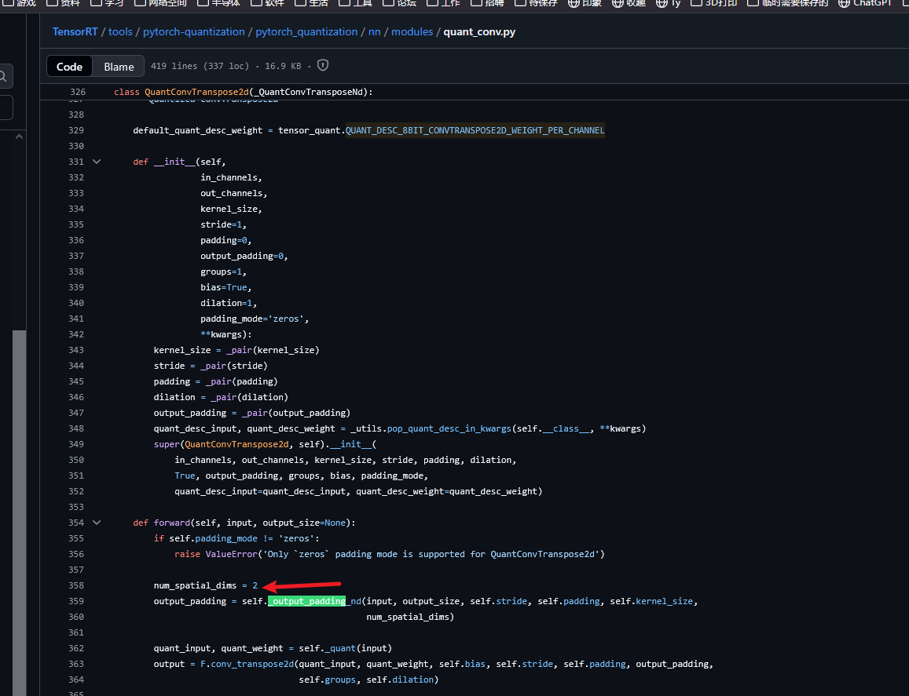
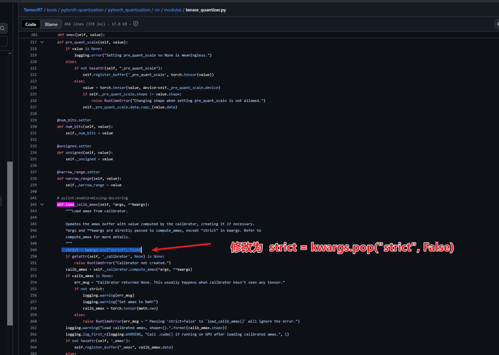

# 修改1

在进行PTQ量化时，出现TypeError: _output_padding() missing 1 required positional argument: 'num_spatial_dims'报错 

这个错误是官方的[pytorch_quantization](https://github.com/NVIDIA/TensorRT/tree/release/8.4/tools/pytorch-quantization/pytorch_quantization)有bug导致的。目前我是在tensorRT8.4版本下的安装的pytorch_quantization库。

需要进行的修改如下：

**lib/python3.10/site-packages/pytorch_quantization/nn/modules/quant_conv.py**
 change **output_padding = self._output_padding(input, output_size, self.stride, self.padding, self.kernel_size)**
 to **output_padding = self._output_padding(input, output_size, self.stride, self.padding, self.kernel_size, 2)**

备注：最新的tensorrt官方已经修改了（记录日期2025.09.08），如下图

# 修改2

在进行插入QDQ敏感层分析时，逐层打开（单独打开一层的QDQ）进行精度计算。会报错，因此需要修改如下

pytorch-quantization/pytorch_quantization/nn/modules/tensor_quantizer.py中def load_calib_amax(self, *args, **kwargs):修改如下

# 附录：

* https://github.com/meituan/YOLOv6/issues/811