# 1 简介

​	目前使用TensorRT量化模型有两种方式，一种是使用TensorRT的黑盒模式，给出量化的数据集和量化方法隐形量化，另一种是修改模型结构，插入QDQ节点，再给定数据集或者重新训练模型来调整QDQ节点参数做到计算scales。具体的方式这里就不多说了，以后详谈。

​	这里只是分析一下插入了QDQ的yolov8模型的 onnx文件在使用trtexec转换为GPU的engine时的日志分析，可以看到TensorRT的详细优化过程，方便我们理解。

所有的日志和模型都在坚果云的“公用-笔记-trtlog分析.zip”中

# 2 trtexec日志分析

如上所述，我们的带有QDQ的onnx已经是使用训练数据集校准过了，也就是已经有scales的值了。转换为engine的trtexec指令如下：

```bash
 trtexec --onnx=yolov8_test_qdq.onnx --int8 --verbose --dumpLayerInfo --dumpProfile --profilingVerbosity=detailed --exportLayerInfo=yolov8_test_qdq.onnxINT8.engine.layerInfo.json --saveEngine=yolov8_test_qdq.onnxINT8.engin
```

下面都是trtexec的日志与分析

## 2.1 基本信息

下面提示当前使用的TensorRT版本信息 这里是8.4.12

```bash
&&&& RUNNING TensorRT.trtexec [TensorRT v8412] # trtexec --onnx=yolov8_test_qdq.onnx --int8 --verbose --dumpLayerInfo --dumpProfile --profilingVerbosity=detailed --exportLayerInfo=yolov8_test_qdq.onnxINT8.engine.layerInfo.json --saveEngine=yolov8_test_qdq.onnxINT8.engine
```

Batch信息

```bash
[01/10/2024-21:52:50] [I] Max batch: explicit batch
```

精度信息

```bash
[01/10/2024-21:52:50] [I] Precision: FP32+INT8
```

输入输出格式

```bash
[01/10/2024-21:52:50] [I] Input(s)s format: fp32:CHW

[01/10/2024-21:52:50] [I] Output(s)s format: fp32:CHW
```

推理的bash信息

```bash
[01/10/2024-21:52:50] [I] === Inference Options ===

[01/10/2024-21:52:50] [I] Batch: Explicit
```

硬件信息

```bash
[01/10/2024-21:52:50] [I] === Device Information ===

[01/10/2024-21:52:50] [I] Selected Device: Orin

[01/10/2024-21:52:50] [I] Compute Capability: 8.7

[01/10/2024-21:52:50] [I] SMs: 16

[01/10/2024-21:52:50] [I] Compute Clock Rate: 1.275 GHz

[01/10/2024-21:52:50] [I] Device Global Memory: 28826 MiB

[01/10/2024-21:52:50] [I] Shared Memory per SM: 164 KiB

[01/10/2024-21:52:50] [I] Memory Bus Width: 128 bits (ECC disabled)

[01/10/2024-21:52:50] [I] Memory Clock Rate: 1.275 GHz
```

TensorRT版本信息

```bash
[01/10/2024-21:52:50] [I] TensorRT version: 8.4.12
```

这一部分的信息不算太长全部贴在下面

```bash


[[01/10/2024-21:52:50] [I] === Model Options ===

[01/10/2024-21:52:50] [I] Format: ONNX

[01/10/2024-21:52:50] [I] Model: yolov8_test_qdq.onnx

[01/10/2024-21:52:50] [I] Output:

[01/10/2024-21:52:50] [I] === Build Options ===

[01/10/2024-21:52:50] [I] Max batch: explicit batch

[01/10/2024-21:52:50] [I] Memory Pools: workspace: default, dlaSRAM: default, dlaLocalDRAM: default, dlaGlobalDRAM: default

[01/10/2024-21:52:50] [I] minTiming: 1

[01/10/2024-21:52:50] [I] avgTiming: 8

[01/10/2024-21:52:50] [I] Precision: FP32+INT8

[01/10/2024-21:52:50] [I] LayerPrecisions:

[01/10/2024-21:52:50] [I] Calibration: Dynamic

[01/10/2024-21:52:50] [I] Refit: Disabled

[01/10/2024-21:52:50] [I] Sparsity: Disabled

[01/10/2024-21:52:50] [I] Safe mode: Disabled

[01/10/2024-21:52:50] [I] DirectIO mode: Disabled

[01/10/2024-21:52:50] [I] Restricted mode: Disabled

[01/10/2024-21:52:50] [I] Build only: Disabled

[01/10/2024-21:52:50] [I] Save engine: yolov8_test_qdq.onnxINT8.engine

[01/10/2024-21:52:50] [I] Load engine:

[01/10/2024-21:52:50] [I] Profiling verbosity: 2

[01/10/2024-21:52:50] [I] Tactic sources: Using default tactic sources

[01/10/2024-21:52:50] [I] timingCacheMode: local

[01/10/2024-21:52:50] [I] timingCacheFile:

[01/10/2024-21:52:50] [I] Input(s)s format: fp32:CHW

[01/10/2024-21:52:50] [I] Output(s)s format: fp32:CHW

[01/10/2024-21:52:50] [I] Input build shapes: model

[01/10/2024-21:52:50] [I] Input calibration shapes: model

[01/10/2024-21:52:50] [I] === System Options ===

[01/10/2024-21:52:50] [I] Device: 0

[01/10/2024-21:52:50] [I] DLACore:

[01/10/2024-21:52:50] [I] Plugins:

[01/10/2024-21:52:50] [I] === Inference Options ===

[01/10/2024-21:52:50] [I] Batch: Explicit

[01/10/2024-21:52:50] [I] Input inference shapes: model

[01/10/2024-21:52:50] [I] Iterations: 10

[01/10/2024-21:52:50] [I] Duration: 3s (+ 200ms warm up)

[01/10/2024-21:52:50] [I] Sleep time: 0ms

[01/10/2024-21:52:50] [I] Idle time: 0ms

[01/10/2024-21:52:50] [I] Streams: 1

[01/10/2024-21:52:50] [I] ExposeDMA: Disabled

[01/10/2024-21:52:50] [I] Data transfers: Enabled

[01/10/2024-21:52:50] [I] Spin-wait: Disabled

[01/10/2024-21:52:50] [I] Multithreading: Disabled

[01/10/2024-21:52:50] [I] CUDA Graph: Disabled

[01/10/2024-21:52:50] [I] Separate profiling: Disabled

[01/10/2024-21:52:50] [I] Time Deserialize: Disabled

[01/10/2024-21:52:50] [I] Time Refit: Disabled

[01/10/2024-21:52:50] [I] Inputs:

[01/10/2024-21:52:50] [I] === Reporting Options ===

[01/10/2024-21:52:50] [I] Verbose: Enabled

[01/10/2024-21:52:50] [I] Averages: 10 inferences

[01/10/2024-21:52:50] [I] Percentile: 99

[01/10/2024-21:52:50] [I] Dump refittable layers:Disabled

[01/10/2024-21:52:50] [I] Dump output: Disabled

[01/10/2024-21:52:50] [I] Profile: Enabled

[01/10/2024-21:52:50] [I] Export timing to JSON file:

[01/10/2024-21:52:50] [I] Export output to JSON file:

[01/10/2024-21:52:50] [I] Export profile to JSON file:

[01/10/2024-21:52:50] [I] 

[01/10/2024-21:52:50] [I] === Device Information ===

[01/10/2024-21:52:50] [I] Selected Device: Orin

[01/10/2024-21:52:50] [I] Compute Capability: 8.7

[01/10/2024-21:52:50] [I] SMs: 16

[01/10/2024-21:52:50] [I] Compute Clock Rate: 1.275 GHz

[01/10/2024-21:52:50] [I] Device Global Memory: 28826 MiB

[01/10/2024-21:52:50] [I] Shared Memory per SM: 164 KiB

[01/10/2024-21:52:50] [I] Memory Bus Width: 128 bits (ECC disabled)

[01/10/2024-21:52:50] [I] Memory Clock Rate: 1.275 GHz

[01/10/2024-21:52:50] [I] 

[01/10/2024-21:52:50] [I] TensorRT version: 8.4.12
```


## 2.2 开始分析model

下面的日志代表分析model的开始

```bash
[01/10/2024-21:52:51] [I] Start parsing network model
```

结束

```bash
[01/10/2024-21:52:52] [I] Finish parsing network model
```

包含一个信息是onnx的 opset version 可能是有点参考的，因为不同的版本算子是不太一样的

剩下的部分就是模型的输入、输出、还有模型的结构和参数信息导入分析

 ```bash
 [01/10/2024-21:52:52] [V] [TRT] Importing initializer: model.model.backbone0.conv.weight
 
 [01/10/2024-21:52:52] [V] [TRT] Importing initializer: model.model.backbone0.bn.weight
 
 [01/10/2024-21:52:52] [V] [TRT] Importing initializer: model.model.backbone0.bn.bias
 
 [01/10/2024-21:52:52] [V] [TRT] Importing initializer: model.model.backbone0.bn.running_mean
 
 [01/10/2024-21:52:52] [V] [TRT] Importing initializer: model.model.backbone0.bn.running_var
 
 [01/10/2024-21:52:52] [V] [TRT] Importing initializer: model.model.backbone1.conv.weight
 ```

```bashe
[01/10/2024-21:52:52] [V] [TRT] Importing initializer: onnx::Conv_2651

[01/10/2024-21:52:52] [V] [TRT] Importing initializer: onnx::Conv_2652
```

```bash
[01/10/2024-21:52:52] [V] [TRT] Parsing node: /model/backbone0/conv/_input_quantizer/QuantizeLinear [QuantizeLinear]

[01/10/2024-21:52:52] [V] [TRT] Searching for input: images

[01/10/2024-21:52:52] [V] [TRT] Searching for input: /model/backbone0/conv/_input_quantizer/Constant_2_output_0

[01/10/2024-21:52:52] [V] [TRT] Searching for input: /model/backbone0/conv/_input_quantizer/Constant_1_output_0

[01/10/2024-21:52:52] [V] [TRT] /model/backbone0/conv/_input_quantizer/QuantizeLinear [QuantizeLinear] inputs: [images -> (1, 3, 640, 960)[FLOAT]], [/model/backbone0/conv/_input_quantizer/Constant_2_output_0 -> ()[FLOAT]], [/model/backbone0/conv/_input_quantizer/Constant_1_output_0 -> ()[INT8]],

[01/10/2024-21:52:52] [V] [TRT] Registering layer: /model/backbone0/conv/_input_quantizer/Constant_2_output_0 for ONNX node: /model/backbone0/conv/_input_quantizer/Constant_2_output_0

[01/10/2024-21:52:52] [V] [TRT] Registering layer: /model/backbone0/conv/_input_quantizer/Constant_1_output_0 for ONNX node: /model/backbone0/conv/_input_quantizer/Constant_1_output_0

[01/10/2024-21:52:52] [V] [TRT] Registering tensor: /model/backbone0/conv/_input_quantizer/QuantizeLinear_output_0 for ONNX tensor: /model/backbone0/conv/_input_quantizer/QuantizeLinear_output_0

[01/10/2024-21:52:52] [V] [TRT] /model/backbone0/conv/_input_quantizer/QuantizeLinear [QuantizeLinear] outputs: [/model/backbone0/conv/_input_quantizer/QuantizeLinear_output_0 -> (1, 3, 640, 960)[FLOAT]],
```

```bash
[01/10/2024-21:52:51] [I] Start parsing network model

[01/10/2024-21:52:51] [I] [TRT] ----------------------------------------------------------------

[01/10/2024-21:52:51] [I] [TRT] Input filename:  yolov8_test_qdq.onnx

[01/10/2024-21:52:51] [I] [TRT] ONNX IR version:  0.0.7

[01/10/2024-21:52:51] [I] [TRT] Opset version:   13

[01/10/2024-21:52:51] [I] [TRT] Producer name:   pytorch

[01/10/2024-21:52:51] [I] [TRT] Producer version: 2.0.1

[01/10/2024-21:52:51] [I] [TRT] Domain:      

[01/10/2024-21:52:51] [I] [TRT] Model version:   0

[01/10/2024-21:52:51] [I] [TRT] Doc string:    

[01/10/2024-21:52:51] [I] [TRT] ----------------------------------------------------------------

[01/10/2024-21:52:52] [V] [TRT] Plugin creator already registered - ::GridAnchor_TRT version 1

[01/10/2024-21:52:52] [V] [TRT] Plugin creator already registered - ::GridAnchorRect_TRT version 1
```

## 2.3 trtexec的优化过程信息

这一部分详细记录了trtexec的优化过程，主要就是层的融合op和融合后的删除op过程。非常的长，慢慢分析

### 2.3.1 因为使用了QDQ，因此不需要Calibration 了

```bash
[01/10/2024-21:52:52] [W] [TRT] Calibrator won't be used in explicit precision mode. Use quantization aware training to generate network with Quantize/Dequantize nodes.
```

### 2.3.2 优化，去除无用的node（置空等op）

```bash
[01/10/2024-21:52:52] [V] [TRT] Applying generic optimizations to the graph for inference.

[01/10/2024-21:52:52] [V] [TRT] Original: 755 layers

[01/10/2024-21:52:52] [V] [TRT] After dead-layer removal: 755 layers
```

### 2.3.3 去除trt中的常量信息 融合常量信息

```bash
[01/10/2024-21:52:52] [V] [TRT] Running: ConstShuffleFusion on /model/taskhead22/Squeeze_output_0
[01/10/2024-21:52:52] [V] [TRT] ConstShuffleFusion: Fusing /model/taskhead22/Squeeze_output_0 with (Unnamed Layer* 635) [Shuffle]
```

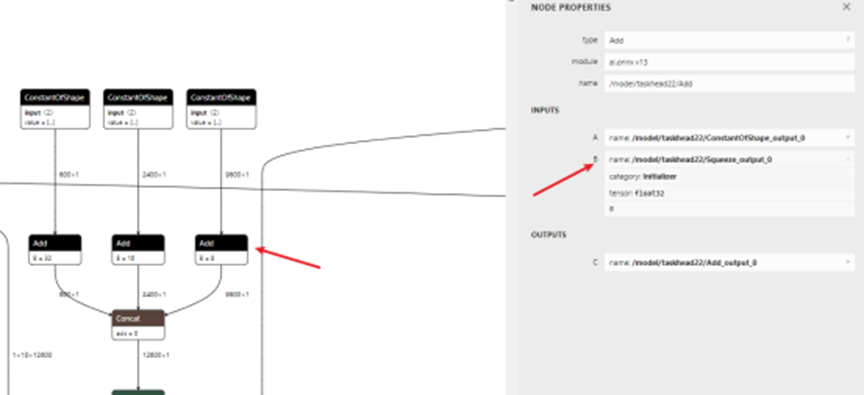

 

```bash
[01/10/2024-21:52:52] [V] [TRT] Running: ShuffleShuffleFusion on /model/taskhead22/dfl/Reshape
[01/10/2024-21:52:52] [V] [TRT] ShuffleShuffleFusion: Fusing /model/taskhead22/dfl/Reshape with /model/taskhead22/dfl/Transpose

```

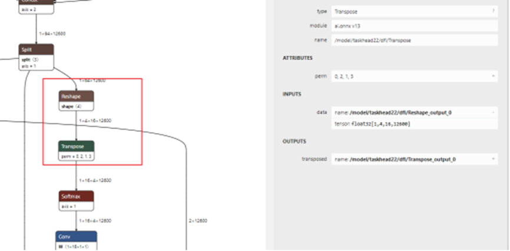

### 2.3.4 QDQ优化

```bash
[01/10/2024-21:52:52] [V] [TRT] QDQ graph optimizer - constant folding of Q/DQ initializers
[01/10/2024-21:52:52] [V] [TRT] Running: ConstQDQInitializersFusion on /model/backbone0/conv/_input_quantizer/QuantizeLinear
[01/10/2024-21:52:52] [V] [TRT] Running: ConstQDQInitializersFusion on /model/backbone0/conv/_weight_quantizer/QuantizeLinear
[01/10/2024-21:52:52] [V] [TRT] Running: ConstQDQInitializersFusion on /model/backbone1/conv/_weight_quantizer/QuantizeLinear
[01/10/2024-21:52:52] [V] [TRT] Running: ConstQDQInitializersFusion on /model/backbone2/cv1/conv/_weight_quantizer/QuantizeLinear
[01/10/2024-21:52:52] [V] [TRT] Running: ConstQDQInitializersFusion on /model/backbone2/m.0/cv1/conv/_weight_quantizer/QuantizeLinear
[01/10/2024-21:52:52] [V] [TRT] Running: ConstQDQInitializersFusion on /model/backbone2/m.0/cv2/conv/_weight_quantizer/QuantizeLinear

```

其中的Q节点优化融合

```bash
[01/10/2024-21:52:52] [V] [TRT] Running: ConstQDQInitializersFusion on /model/backbone0/conv/_input_quantizer/QuantizeLinear
[01/10/2024-21:52:52] [V] [TRT] Running: ConstQDQInitializersFusion on /model/backbone0/conv/_weight_quantizer/QuantizeLinear
[01/10/2024-21:52:52] [V] [TRT] Running: ConstQDQInitializersFusion on /model/backbone1/conv/_weight_quantizer/QuantizeLinear

```

分别是下图的红框部分，都是融合的QuantizeLinear 除了input 其他都是Conv的weight

 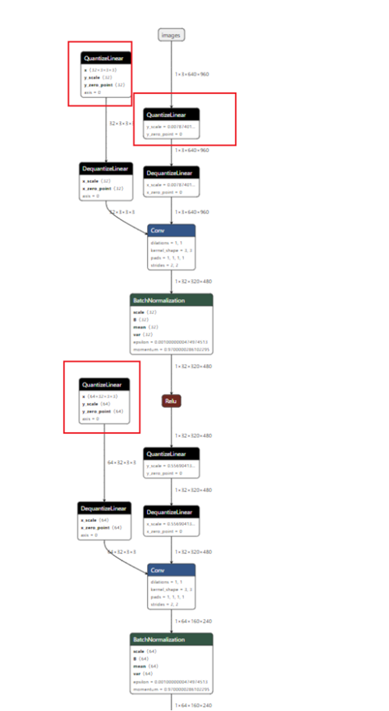

### 2.3.5 DQ融合和删除常量

```bash
[01/10/2024-21:52:52] [V] [TRT] Running: ConstQDQInitializersFusion on /model/backbone0/conv/_input_quantizer/DequantizeLinear
[01/10/2024-21:52:52] [V] [TRT] Removing /model/backbone0/conv/_input_quantizer/Constant_2_output_0
[01/10/2024-21:52:52] [V] [TRT] Running: ConstQDQInitializersFusion on /model/backbone0/conv/_weight_quantizer/DequantizeLinear
[01/10/2024-21:52:52] [V] [TRT] Removing /model/backbone0/conv/_weight_quantizer/Constant_output_0
[01/10/2024-21:52:52] [V] [TRT] Running: ConstQDQInitializersFusion on /model/backbone1/conv/_weight_quantizer/DequantizeLinear
[01/10/2024-21:52:52] [V] [TRT] Removing /model/backbone1/conv/_weight_quantizer/Constant_output_0
[01/10/2024-21:52:52] [V] [TRT] Running: ConstQDQInitializersFusion on /model/backbone2/cv1/conv/_weight_quantizer/DequantizeLinear
[01/10/2024-21:52:52] [V] [TRT] Removing /model/backbone2/cv1/conv/_weight_quantizer/Constant_output_0
[01/10/2024-21:52:52] [V] [TRT] Running: ConstQDQInitializersFusion on /model/backbone2/m.0/cv1/conv/_weight_quantizer/DequantizeLinear
[01/10/2024-21:52:52] [V] [TRT] Removing /model/backbone2/m.0/cv1/conv/_weight_quantizer/Constant_output_0

```

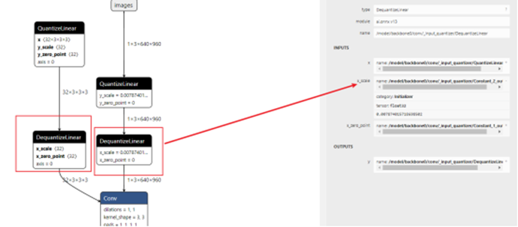

 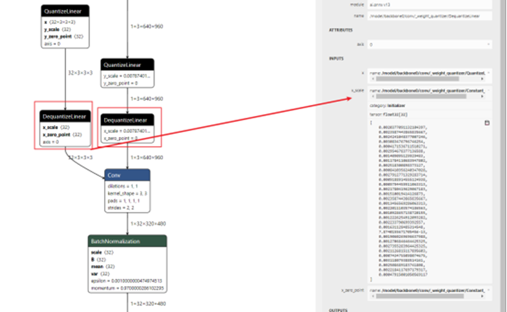

### 2.3.6 激活融合

```bash
[01/10/2024-21:52:52] [V] [TRT] Running: ScaleActivationFusion on /model/backbone0/bn/BatchNormalization
[01/10/2024-21:52:52] [V] [TRT] ScaleActivationFusion: Fusing /model/backbone0/bn/BatchNormalization with /model/backbone0/act/Relu
[01/10/2024-21:52:52] [V] [TRT] Running: ScaleActivationFusion on /model/backbone1/bn/BatchNormalization
[01/10/2024-21:52:52] [V] [TRT] ScaleActivationFusion: Fusing /model/backbone1/bn/BatchNormalization with /model/backbone1/act/Relu
[01/10/2024-21:52:52] [V] [TRT] Running: ScaleActivationFusion on /model/backbone2/cv1/bn/BatchNormalization
[01/10/2024-21:52:52] [V] [TRT] ScaleActivationFusion: Fusing /model/backbone2/cv1/bn/BatchNormalization with /model/backbone2/cv1/act/Relu
[01/10/2024-21:52:52] [V] [TRT] Running: ScaleActivationFusion on /model/backbone2/m.0/cv1/bn/BatchNormalization

```

也就是融合下面的BN和Relu

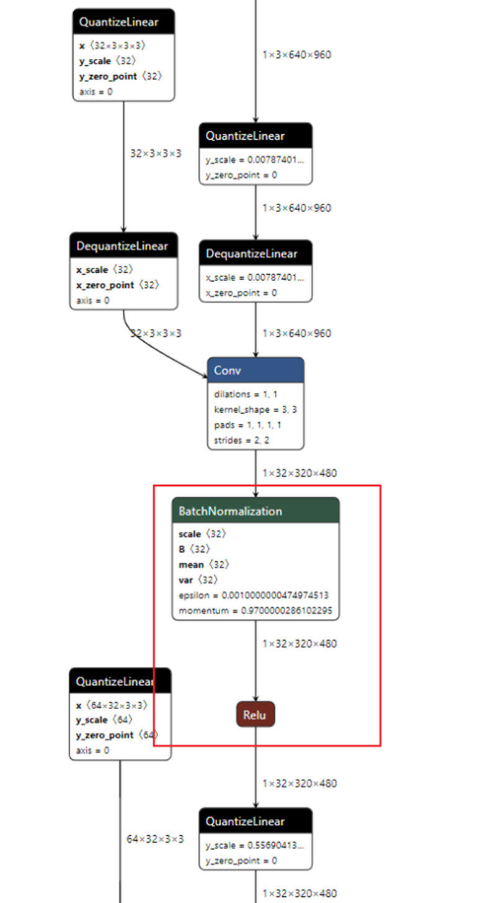

 

### 2.3.7 融合Conv的weight和Q

 ```bash
 [01/10/2024-21:52:52] [V] [TRT] Running: ConstWeightsQuantizeFusion on model.model.backbone0.conv.weight
 [01/10/2024-21:52:52] [V] [TRT] ConstWeightsQuantizeFusion: Fusing model.model.backbone0.conv.weight with /model/backbone0/conv/_weight_quantizer/QuantizeLinear
 [01/10/2024-21:52:52] [V] [TRT] Running: ConstWeightsQuantizeFusion on model.model.backbone1.conv.weight
 [01/10/2024-21:52:52] [V] [TRT] ConstWeightsQuantizeFusion: Fusing model.model.backbone1.conv.weight with /model/backbone1/conv/_weight_quantizer/QuantizeLinear
 [01/10/2024-21:52:52] [V] [TRT] Running: ConstWeightsQuantizeFusion on model.model.backbone2.cv1.conv.weight
 [01/10/2024-21:52:52] [V] [TRT] ConstWeightsQuantizeFusion: Fusing model.model.backbone2.cv1.conv.weight with /model/backbone2/cv1/conv/_weight_quantizer/QuantizeLinear
 
 ```

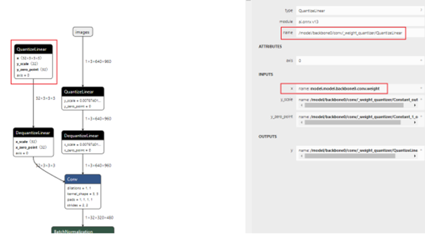

 我的理解这里的融合后的就是如下图，上半部分是原始的op，下半部分是融合后的op。蓝色线代表数据是FP32 绿色是INT8。浅绿色框是融合在一起的op

 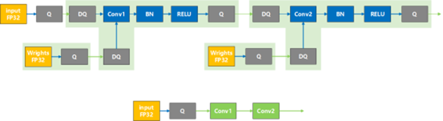

 这个从画出的engine图也可以验证一下

 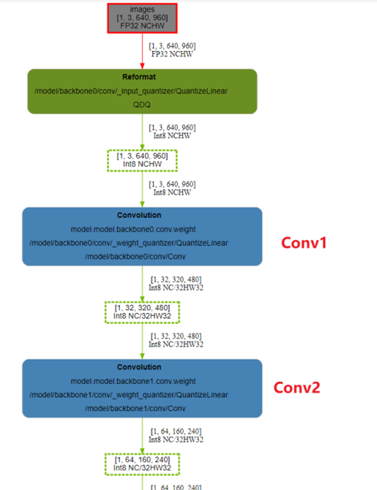

 

###  2.3.8 Conv和Relu的融合

```bash
[01/10/2024-21:52:53] [V] [TRT] Running: ConvReluFusion on /model/taskhead22/cv4.0/cv4.0.0/conv/Conv
[01/10/2024-21:52:53] [V] [TRT] ConvReluFusion: Fusing /model/taskhead22/cv4.0/cv4.0.0/conv/Conv with /model/taskhead22/cv4.0/cv4.0.0/act/Relu
[01/10/2024-21:52:53] [V] [TRT] Running: ConvReluFusion on /model/taskhead22/cv4.0/cv4.0.1/conv/Conv
[01/10/2024-21:52:53] [V] [TRT] ConvReluFusion: Fusing /model/taskhead22/cv4.0/cv4.0.1/conv/Conv with /model/taskhead22/cv4.0/cv4.0.1/act/Relu
[01/10/2024-21:52:53] [V] [TRT] Running: ConvReluFusion on /model/taskhead22/cv2.0/cv2.0.1/conv/Conv
[01/10/2024-21:52:53] [V] [TRT] ConvReluFusion: Fusing /model/taskhead22/cv2.0/cv2.0.1/conv/Conv with /model/taskhead22/cv2.0/cv2.0.1/act/Relu

```

下红框中的Conv和Relu进行融合

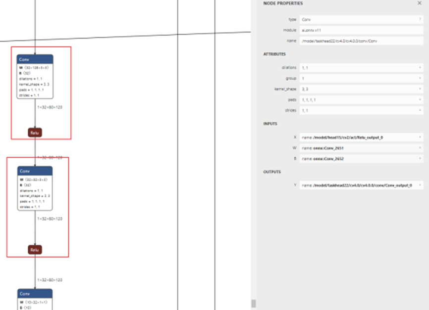

###  2.3.9 Concat的优化

 ```bash
 [01/10/2024-21:52:53] [V] [TRT] Running: SplitQAcrossPrecedingFanIn on /model/backbone2/Concat
 [01/10/2024-21:52:53] [V] [TRT] Running: SplitQAcrossPrecedingFanIn on /model/backbone4/Concat
 [01/10/2024-21:52:53] [V] [TRT] Running: SplitQAcrossPrecedingFanIn on /model/backbone6/Concat
 [01/10/2024-21:52:53] [V] [TRT] Running: SplitQAcrossPrecedingFanIn on /model/backbone8/Concat
 [01/10/2024-21:52:53] [V] [TRT] Running: SplitQAcrossPrecedingFanIn on /model/backbone9/Concat
 
 ```

不太清楚这里是做什么的，从gpt获取的答案是
 SplitQAcrossPrecedingFanIn 是一个与量化相关的优化操作。在量化过程中，TensorRT 会对模型的各个节点进行分析，并尝试优化量化方案。具体来说，这个操作可能涉及将量化操作分散到前面的分支中，以优化计算流程。

SplitQAcrossPrecedingFanIn：这个操作可能意味着 TensorRT 正在尝试将量化操作应用于 Concat 操作之前的分支，而不是在 Concat 之后进行统一量化。这样做可以更好地利用低精度计算的优势，同时保持模型的准确性。

### 2.3.10 交换节点位置

```bash
[01/10/2024-21:52:53] [V] [TRT] Swapping /model/backbone2/Slice with /model/backbone2/cv2/conv/_input_quantizer/QuantizeLinear_clone_0
[01/10/2024-21:52:53] [V] [TRT] Running: VanillaSwapWithFollowingQ on /model/backbone4/Slice
[01/10/2024-21:52:53] [V] [TRT] Swapping /model/backbone4/Slice with /model/backbone4/cv2/conv/_input_quantizer/QuantizeLinear_clone_0
```

配合上面的Concatc层的信息一起看

原始的模型是

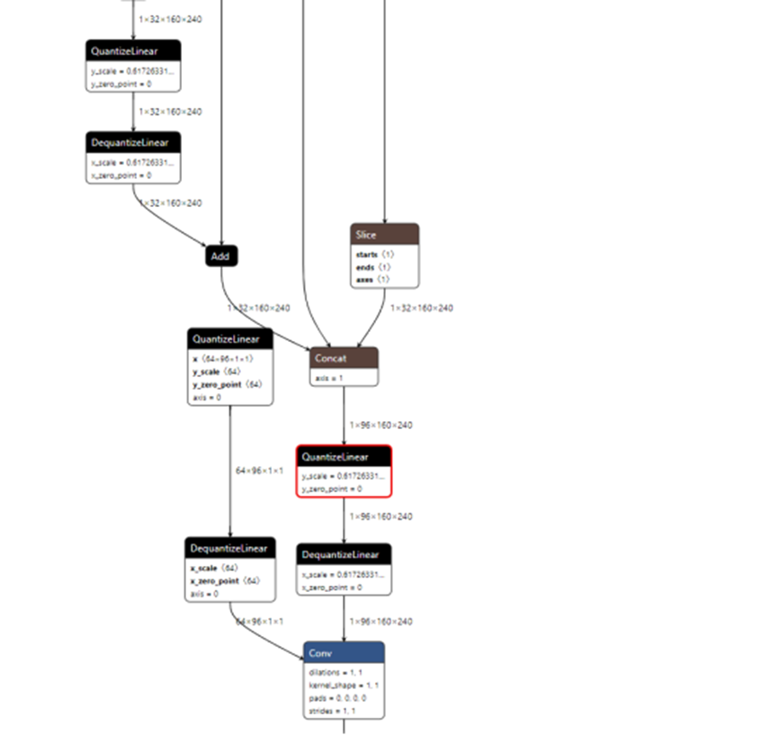

经过转换节点后是如engine下图，大概意思应该就是先在Concat前进行量化，交换了下面的Conv层的Q。

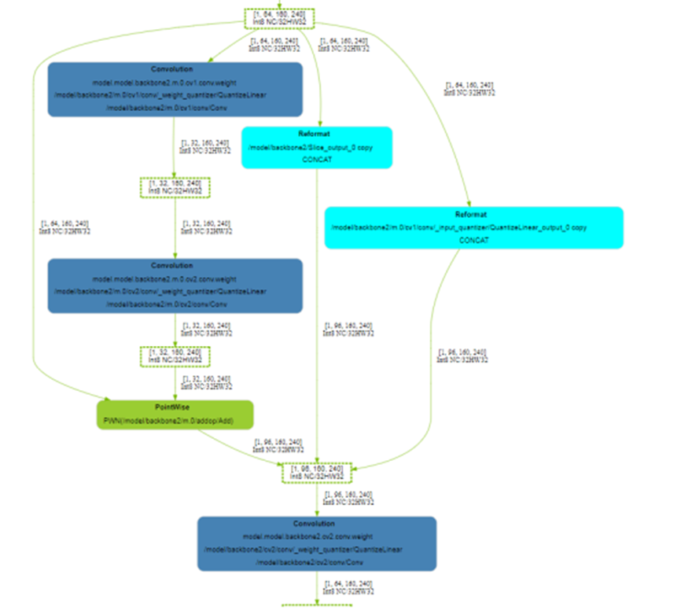

### 2.3.11 合并量化节点

```bash
[01/10/2024-21:52:53] [V] [TRT] Running: HorizontalMergeQNodes on /model/backbone2/m.0/cv1/conv/_input_quantizer/QuantizeLinear
[01/10/2024-21:52:53] [V] [TRT] Eliminating /model/backbone2/cv2/conv/_input_quantizer/QuantizeLinear_clone_1 which duplicates (Q) /model/backbone2/m.0/cv1/conv/_input_quantizer/QuantizeLinear
[01/10/2024-21:52:53] [V] [TRT] Removing /model/backbone2/cv2/conv/_input_quantizer/QuantizeLinear_clone_1
[01/10/2024-21:52:53] [V] [TRT] Running: HorizontalMergeQNodes on /model/backbone4/m.0/cv1/conv/_input_quantizer/QuantizeLinear
[01/10/2024-21:52:53] [V] [TRT] Eliminating /model/backbone4/cv2/conv/_input_quantizer/QuantizeLinear_clone_1 which duplicates (Q) /model/backbone4/m.0/cv1/conv/_input_quantizer/QuantizeLinear
[01/10/2024-21:52:53] [V] [TRT] Removing /model/backbone4/cv2/conv/_input_quantizer/QuantizeLinear_clone_1

```

HorizontalMergeQNodes 这是一个优化操作的名字，用于合并量化节点。这个操作通常涉及到将多个量化节点合并成一个，以减少冗余和提高效率。

HorizontalMergeQNodes：这个操作的目标是合并具有相似功能的量化节点，以减少重复计算和提高模型的效率。在量化过程中，可能会出现多个量化节点对同一数据流进行处理的情况。通过合并这些节点，可以简化模型并提高性能。

消除重复的量化节点：第二条日志信息表明，trtexec 发现了一个重复的量化节点，并决定将其删除。这通常是因为在模型中存在多个路径，这些路径在某些点上汇合，并且汇合后的数据流需要经过同样的量化处理。通过删除重复的节点，可以避免不必要的计算，并简化模型。

Eliminating：表示正在消除或删除某个节点。

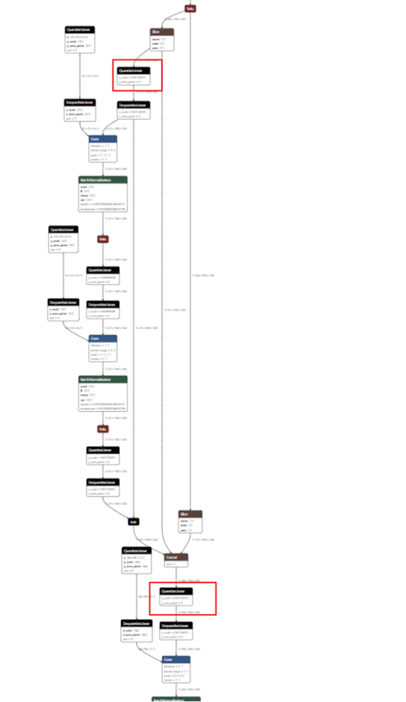

### 2.3.12 量化节点交换

 ```bash
 [01/10/2024-21:52:53] [V] [TRT] Running: VanillaSwapWithFollowingQ on /model/backbone2/Slice_1
 [01/10/2024-21:52:53] [V] [TRT] Swapping /model/backbone2/Slice_1 with /model/backbone2/m.0/cv1/conv/_input_quantizer/QuantizeLinear
 [01/10/2024-21:52:53] [V] [TRT] Running: VanillaSwapWithFollowingQ on /model/backbone4/Slice_1
 [01/10/2024-21:52:53] [V] [TRT] Swapping /model/backbone4/Slice_1 with /model/backbone4/m.0/cv1/conv/_input_quantizer/QuantizeLinear
 
 ```

VanillaSwapWithFollowingQ：这是一个优化操作的名字，意味着将一个操作（在这个例子中是 /model/backbone2/Slice_1）与紧随其后的量化操作（QuantizeLinear）进行交换。

如下图红框

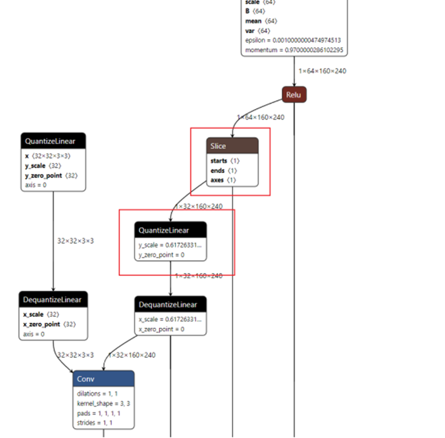

### 2.3.13 融合add与div

```bash
[01/10/2024-21:52:53] [V] [TRT] Running: PointWiseFusion on /model/taskhead22/Add_5
[01/10/2024-21:52:53] [V] [TRT] PointWiseFusion: Fusing /model/taskhead22/Add_5 with /model/taskhead22/Div_1
```

这两条信息描述了 TensorRT 在优化模型过程中的一种融合操作。具体来说，PointWiseFusion 是一个优化技术，用于将多个逐元素操作（point-wise operations）融合成一个单一的操作，从而提高计算效率和减少内存开销。

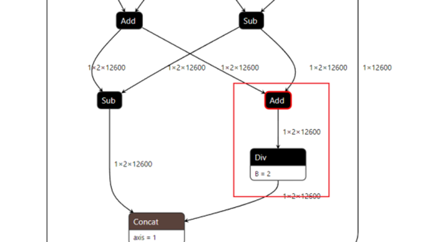

### 2.3.14 融合Conv BN Relu

```bash
[01/10/2024-21:52:53] [V] [TRT] Running: QConvScaleFusion on /model/backbone0/conv/Conv
[01/10/2024-21:52:53] [V] [TRT] Removing /model/backbone0/bn/BatchNormalization + /model/backbone0/act/Relu
[01/10/2024-21:52:53] [V] [TRT] Running: QConvScaleFusion on /model/backbone1/conv/Conv
[01/10/2024-21:52:53] [V] [TRT] Removing /model/backbone1/bn/BatchNormalization + /model/backbone1/act/Relu
```

QConvScaleFusion：这个优化操作的目标是将卷积操作（Convolution）与量化和缩放操作融合在一起，以减少计算开销并提高性能。

移除 BatchNormalization 和 ReLU 层：在某些情况下，当卷积层后面跟着 BatchNormalization 和 ReLU 层时，TensorRT 可以通过融合操作将这些层的功能合并到卷积层中，从而简化模型并提高计算效率

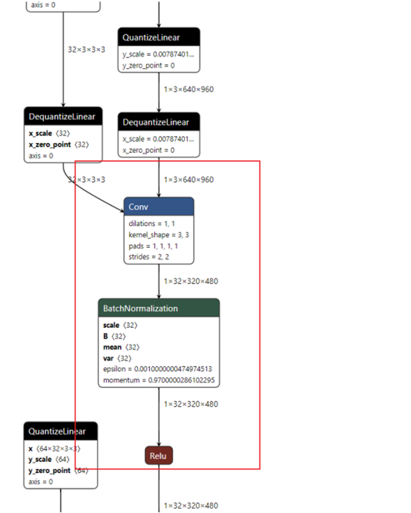

### 2.3.15 融合 Conv前后的Q和DQ 并删除Q和DQ op

```bash
[01/10/2024-21:52:53] [V] [TRT] Running: QuantizeDoubleInputNodes on /model/backbone0/conv/Conv
[01/10/2024-21:52:53] [V] [TRT] QuantizeDoubleInputNodes: fusing /model/backbone1/conv/_input_quantizer/QuantizeLinear into /model/backbone0/conv/Conv
[01/10/2024-21:52:53] [V] [TRT] QuantizeDoubleInputNodes: fusing (/model/backbone0/conv/_input_quantizer/DequantizeLinear and /model/backbone0/conv/_weight_quantizer/DequantizeLinear) into /model/backbone0/conv/Conv
[01/10/2024-21:52:53] [V] [TRT] Removing /model/backbone1/conv/_input_quantizer/QuantizeLinear
[01/10/2024-21:52:53] [V] [TRT] Removing /model/backbone0/conv/_input_quantizer/DequantizeLinear
[01/10/2024-21:52:53] [V] [TRT] Removing /model/backbone0/conv/_weight_quantizer/DequantizeLinear
[01/10/2024-21:52:53] [V] [TRT] Running: QuantizeDoubleInputNodes on /model/backbone1/conv/Conv
[01/10/2024-21:52:53] [V] [TRT] QuantizeDoubleInputNodes: fusing /model/backbone2/cv1/conv/_input_quantizer/QuantizeLinear into /model/backbone1/conv/Conv
[01/10/2024-21:52:53] [V] [TRT] QuantizeDoubleInputNodes: fusing (/model/backbone1/conv/_input_quantizer/DequantizeLinear and /model/backbone1/conv/_weight_quantizer/DequantizeLinear) into /model/backbone1/conv/Conv
[01/10/2024-21:52:53] [V] [TRT] Removing /model/backbone2/cv1/conv/_input_quantizer/QuantizeLinear
[01/10/2024-21:52:53] [V] [TRT] Removing /model/backbone1/conv/_input_quantizer/DequantizeLinear
[01/10/2024-21:52:53] [V] [TRT] Removing /model/backbone1/conv/_weight_quantizer/DequantizeLinear
[01/10/2024-21:52:53] [V] [TRT] Running: QuantizeDoubleInputNodes on /model/backbone2/cv1/conv/Conv
[01/10/2024-21:52:53] [V] [TRT] QuantizeDoubleInputNodes: fusing /model/backbone2/m.0/cv1/conv/_input_quantizer/QuantizeLinear into /model/backbone2/cv1/conv/Conv
[01/10/2024-21:52:53] [V] [TRT] QuantizeDoubleInputNodes: fusing (/model/backbone2/cv1/conv/_input_quantizer/DequantizeLinear and /model/backbone2/cv1/conv/_weight_quantizer/DequantizeLinear) into /model/backbone2/cv1/conv/Conv
```

QuantizeDoubleInputNodes：这个优化操作的目标是将涉及双输入的量化节点与卷积层进行融合。通常情况下，卷积层会有两个输入，一个是输入数据，另一个是权重数据。这两个输入都需要经过量化和去量化操作。
 由于上述融合操作已经将量化和去量化操作的功能内嵌到了卷积层中，因此不再需要原来的单独量化和去量化节点。因此，trtexec 移除了这些节点，以简化模型结构并提高计算效率。

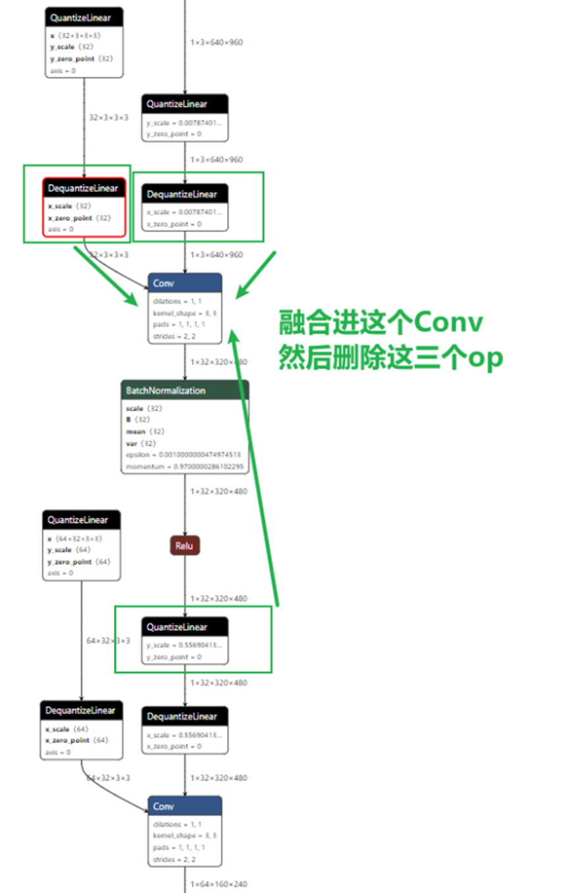

### 2.3.16 融合常量权重与Conv

```bash
[01/10/2024-21:52:53] [V] [TRT] Running: ConstWeightsFusion on model.model.backbone0.conv.weight + /model/backbone0/conv/_weight_quantizer/QuantizeLinear
[01/10/2024-21:52:53] [V] [TRT] ConstWeightsFusion: Fusing model.model.backbone0.conv.weight + /model/backbone0/conv/_weight_quantizer/QuantizeLinear with /model/backbone0/conv/Conv
[01/10/2024-21:52:53] [V] [TRT] Running: ConstWeightsFusion on model.model.backbone1.conv.weight + /model/backbone1/conv/_weight_quantizer/QuantizeLinear
[01/10/2024-21:52:53] [V] [TRT] ConstWeightsFusion: Fusing model.model.backbone1.conv.weight + /model/backbone1/conv/_weight_quantizer/QuantizeLinear with /model/backbone1/conv/Conv
```

ConstWeightsFusion：这是一个优化操作的名字，意味着将常量权重与卷积层进行融合。

这个优化操作的目标是将卷积层的常量权重与卷积层本身进行融合。通常情况下，卷积层的权重在训练过程中是固定的，而在推理过程中需要对这些权重进行量化处理。通过将权重直接融合到卷积层中，可以减少额外的量化操作，从而提高计算效率。

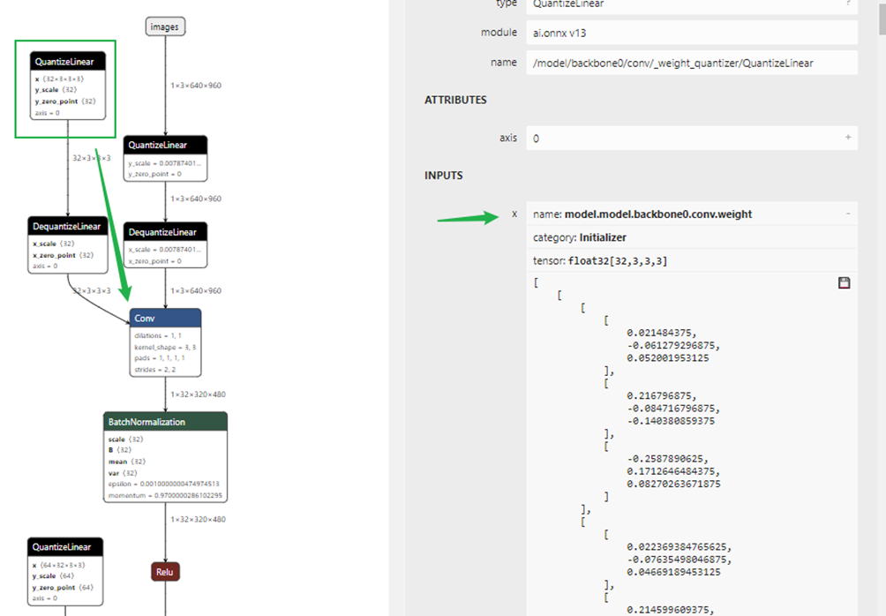

### 2.3.17 优化前后概述

```bash
[01/10/2024-21:52:53] [V] [TRT] After dupe layer removal: 153 layers
[01/10/2024-21:52:53] [V] [TRT] After final dead-layer removal: 153 layers
[01/10/2024-21:52:53] [V] [TRT] After tensor merging: 153 layers
[01/10/2024-21:52:53] [V] [TRT] QDQ graph optimizer quantization epilogue pass
[01/10/2024-21:52:53] [V] [TRT] QDQ optimization pass
[01/10/2024-21:52:53] [V] [TRT] QDQ graph optimizer constant fold dangling QDQ pass
```

中文就是
 [01/10/2024-21:52:53] [V] [TRT]去除双重层后:153层

[01/10/2024-21:52:53] [V] [TRT]最终去除死层后:153层

[01/10/2024-21:52:53] [V] [TRT]张量合并后:153层

[01/10/2024-21:52:53] [V] [TRT] QDQ图形优化器量化后记pass

[01/10/2024-21:52:53] [V] [TRT] QDQ优化pass

[01/10/2024-21:52:53] [V] [TRT] QDQ图形优化器常数折叠 QDQ pass

### 2.3.18 QDQ op的拷贝

```bash
[01/10/2024-21:52:53] [V] [TRT] Running: QDQToCopy on /model/backbone0/conv/_input_quantizer/QuantizeLinear
[01/10/2024-21:52:53] [V] [TRT] Swap the layer type of /model/backbone0/conv/_input_quantizer/QuantizeLinear from QUANTIZE to kQDQ
[01/10/2024-21:52:53] [V] [TRT] Running: QDQToCopy on /model/head12/cv1/conv/_input_quantizer/QuantizeLinear_clone_0
[01/10/2024-21:52:53] [V] [TRT] Swap the layer type of /model/head12/cv1/conv/_input_quantizer/QuantizeLinear_clone_0 from QUANTIZE to kQDQ
[01/10/2024-21:52:53] [V] [TRT] Running: QDQToCopy on /model/head15/cv1/conv/_input_quantizer/QuantizeLinear_clone_0
[01/10/2024-21:52:53] [V] [TRT] Swap the layer type of /model/head15/cv1/conv/_input_quantizer/QuantizeLinear_clone_0 from QUANTIZE to kQDQ

```

这个我没找到什么规律

### 2.3.19 元素级加法节点优化

```bash
[01/10/2024-21:52:53] [V] [TRT] Running: EltwiseAddToPwn on /model/backbone2/m.0/addop/Add
[01/10/2024-21:52:53] [V] [TRT] Swap the layer type of /model/backbone2/m.0/addop/Add from ELEMENTWISE to POINTWISE
[01/10/2024-21:52:53] [V] [TRT] Running: EltwiseAddToPwn on /model/backbone4/m.0/addop/Add
[01/10/2024-21:52:53] [V] [TRT] Swap the layer type of /model/backbone4/m.0/addop/Add from ELEMENTWISE to POINTWISE
```

EltwiseAddToPwn：这个优化操作的目标是将一个元素级加法节点（通常表示为 ELEMENTWISE_ADD）转换为逐点操作（POINTWISE）节点。元素级加法是指两个相同形状的张量逐元素相加，而逐点操作则可以包含更多的操作，如逐元素乘法、加法等。

ELEMENTWISE_ADD 节点：通常用于表示两个张量之间的逐元素加法操作。

POINTWISE 节点：这种节点可以表示更为通用的逐点操作，包括但不限于逐元素加法

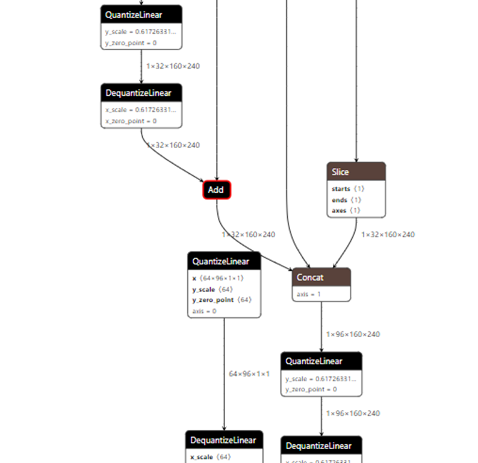

### 2.3.20 合并层 Q Conv 和常量Conv.weight

```bash
[01/10/2024-21:52:53] [V] [TRT] Merging layers: model.model.taskhead22.cv_occ.0.0.conv.weight + /model/taskhead22/cv_occ.0/cv_occ.0.0/conv/_weight_quantizer/QuantizeLinear + /model/taskhead22/cv_occ.0/cv_occ.0.0/conv/Conv || model.model.taskhead22.cv3.0.0.conv.weight + /model/taskhead22/cv3.0/cv3.0.0/conv/_weight_quantizer/QuantizeLinear + /model/taskhead22/cv3.0/cv3.0.0/conv/Conv || model.model.taskhead22.cv2.0.0.conv.weight + /model/taskhead22/cv2.0/cv2.0.0/conv/_weight_quantizer/QuantizeLinear + /model/taskhead22/cv2.0/cv2.0.0/conv/Conv
[01/10/2024-21:52:53] [V] [TRT] Merging layers: model.model.taskhead22.cv_occ.1.0.conv.weight + /model/taskhead22/cv_occ.1/cv_occ.1.0/conv/_weight_quantizer/QuantizeLinear + /model/taskhead22/cv_occ.1/cv_occ.1.0/conv/Conv || model.model.taskhead22.cv3.1.0.conv.weight + /model/taskhead22/cv3.1/cv3.1.0/conv/_weight_quantizer/QuantizeLinear + /model/taskhead22/cv3.1/cv3.1.0/conv/Conv
[01/10/2024-21:52:53] [V] [TRT] Merging layers: /model/taskhead22/cv2.1/cv2.1.0/conv/Conv + /model/taskhead22/cv2.1/cv2.1.0/act/Relu || /model/taskhead22/cv4.1/cv4.1.0/conv/Conv + /model/taskhead22/cv4.1/cv4.1.0/act/Relu
[01/10/2024-21:52:53] [V] [TRT] Merging layers: model.model.taskhead22.cv_occ.2.0.conv.weight + /model/taskhead22/cv_occ.2/cv_occ.2.0/conv/_weight_quantizer/QuantizeLinear + /model/taskhead22/cv_occ.2/cv_occ.2.0/conv/Conv || model.model.taskhead22.cv2.2.0.conv.weight + /model/taskhead22/cv2.2/cv2.2.0/conv/_weight_quantizer/QuantizeLinear + /model/taskhead22/cv2.2/cv2.2.0/conv/Conv
[01/10/2024-21:52:53] [V] [TRT] Merging layers: /model/taskhead22/cv3.2/cv3.2.0/conv/Conv + /model/taskhead22/cv3.2/cv3.2.0/act/Relu || /model/taskhead22/cv4.2/cv4.2.0/conv/Conv + /model/taskhead22/cv4.2/cv4.2.0/act/Relu
```

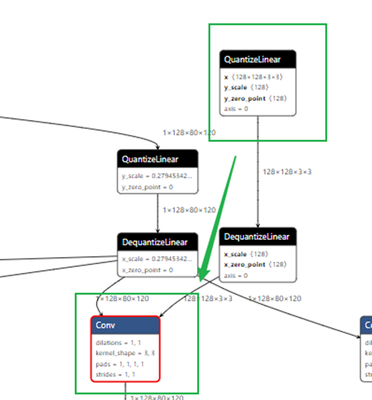

### 2.3.21 删除slice层，重定向输出

```bash
[01/10/2024-21:52:53] [V] [TRT] Eliminating slice /model/taskhead22/Split_1 by retargeting /model/taskhead22/Split_1_output_0 from /model/taskhead22/Split_1_output_0 to /model/taskhead22/Concat_4_output_0
[01/10/2024-21:52:53] [V] [TRT] Eliminating slice /model/taskhead22/Slice_1 by retargeting /model/taskhead22/Slice_1_output_0 from /model/taskhead22/Slice_1_output_0 to /model/taskhead22/dfl/Reshape_1_output_0
[01/10/2024-21:52:53] [V] [TRT] Eliminating slice /model/taskhead22/Slice by retargeting /model/taskhead22/Slice_output_0 from /model/taskhead22/Slice_output_0 to /model/taskhead22/dfl/Reshape_1_output_0
```

/model/taskhead22/dfl/Reshape_1_output_0

Eliminating slice：表示正在消除一个切片操作

retargeting /model/taskhead22/Slice_output_0：表示正在重新定向切片操作的输出。

重新定向输出：通过将切片操作的输出重新定向到另一个节点（通常是另一个操作的输出），可以避免执行切片操作，从而简化模型并提高计算效率。

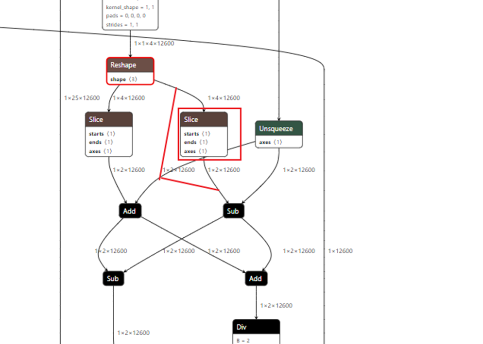

### 2.3.22 删除Concat层，重定向输出

```bash
[01/10/2024-21:52:53] [V] [TRT] Eliminating concatenation /model/taskhead22/Concat_10
[01/10/2024-21:52:53] [V] [TRT] Generating copy for /model/taskhead22/Div_1_output_0 to /model/taskhead22/Concat_10_output_0 because of stomping hazard.
[01/10/2024-21:52:53] [V] [TRT] Retargeting /model/taskhead22/Sub_1_output_0 to /model/taskhead22/Concat_10_output_0
[01/10/2024-21:52:53] [V] [TRT] Eliminating concatenation /model/taskhead22/Concat_4
[01/10/2024-21:52:53] [V] [TRT] Retargeting /model/taskhead22/Reshape_3_output_0 to /model/taskhead22/Concat_4_output_0
[01/10/2024-21:52:53] [V] [TRT] Retargeting /model/taskhead22/Reshape_4_output_0 to /model/taskhead22/Concat_4_output_0
[01/10/2024-21:52:53] [V] [TRT] Retargeting /model/taskhead22/Reshape_5_output_0 to /model/taskhead22/Concat_4_output_0
```

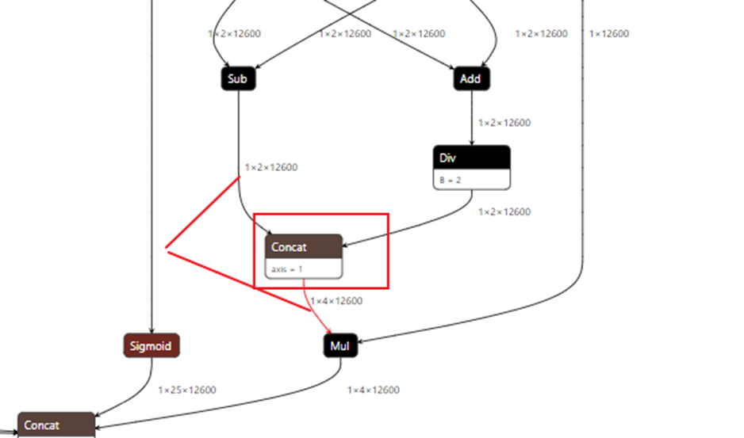

### 2.3.22 提示融合优化完

```bash
[01/10/2024-21:52:53] [V] [TRT] Graph construction and optimization completed in 0.971241 seconds.
```

### 2.3.23 提示层运行在GPU还是DLA

提示哪些层在DLA上，哪些层在GPU上，因为我的trt指令没有制定DLA，因此所有的层都是在GPU上。DLA下面是空的

```bash
[01/10/2024-21:52:53] [I] [TRT] ---------- Layers Running on DLA ----------
[01/10/2024-21:52:53] [I] [TRT] ---------- Layers Running on GPU ----------
[01/10/2024-21:52:53] [I] [TRT] [GpuLayer] MYELIN: {ForeignNode[/model/taskhead22/Constant_12_output_0.../model/taskhead22/Unsqueeze_6]}
[01/10/2024-21:52:53] [I] [TRT] [GpuLayer] COPY: /model/backbone0/conv/_input_quantizer/QuantizeLinear
[01/10/2024-21:52:53] [I] [TRT] [GpuLayer] CONVOLUTION: model.model.backbone0.conv.weight + /model/backbone0/conv/_weight_quantizer/QuantizeLinear + /model/backbone0/conv/Conv
[01/10/2024-21:52:53] [I] [TRT] [GpuLayer] CONVOLUTION: model.model.backbone1.conv.weight + /model/backbone1/conv/_weight_quantizer/QuantizeLinear + /model/backbone1/conv/Conv
[01/10/2024-21:52:53] [I] [TRT] [GpuLayer] CONVOLUTION: model.model.backbone2.cv1.conv.weight + /model/backbone2/cv1/conv/_weight_quantizer/QuantizeLinear + /model/backbone2/cv1/conv/Conv
[01/10/2024-21:52:53] [I] [TRT] [GpuLayer] CONVOLUTION: model.model.backbone2.m.0.cv1.conv.weight + /model/backbone2/m.0/cv1/conv/_weight_quantizer/QuantizeLinear + /model/backbone2/m.0/cv1/conv/Conv
[01/10/2024-21:52:53] [I] [TRT] [GpuLayer] CONVOLUTION: model.model.backbone2.m.0.cv2.conv.weight + /model/backbone2/m.0/cv2/conv/_weight_quantizer/QuantizeLinear + /model/backbone2/m.0/cv2/conv/Conv
```

MYELIN：这是 TensorRT 的一个优化框架的名字，用于自动识别和优化计算图。

ForeignNode：表示这是一个外部节点，即 TensorRT 标记为不在其默认优化范围内的节点，但它可能被 MYELIN 优化框架处理。/model/taskhead22/Constant_12_output_0.../model/taskhead22/Unsqueeze_6：这是模型中的一个具体操作序列，从一个常量节点开始，到一个 Unsqueeze 操作结束。

CONVOLUTION：这是一个优化操作的名字，意味着将卷积相关的操作进行融合

### 2.3.24 优化计算

```bash
[01/10/2024-21:52:54] [V] [TRT] =============== Computing reformatting costs
[01/10/2024-21:52:54] [V] [TRT] =============== Computing reformatting costs
[01/10/2024-21:52:54] [V] [TRT] =============== Computing reformatting costs
[01/10/2024-21:52:54] [V] [TRT] *************** Autotuning Reformat: Float(1,1,1) -> Float(1:4,1,1) ***************
[01/10/2024-21:52:54] [V] [TRT] --------------- Timing Runner: Optimizer Reformat(<in> -> (Unnamed Layer* 689) [Shuffle]_output) (Reformat)
[01/10/2024-21:52:54] [V] [TRT] Tactic: 0x00000000000003e8 Time: 0.00582967
[01/10/2024-21:52:54] [V] [TRT] Tactic: 0x00000000000003ea Time: 0.0141162
[01/10/2024-21:52:54] [V] [TRT] Tactic: 0x0000000000000000 Time: 0.00526547
[01/10/2024-21:52:54] [V] [TRT] Fastest Tactic: 0x0000000000000000 Time: 0.00526547
[01/10/2024-21:52:54] [V] [TRT] *************** Autotuning Reformat: Float(1,1,1) -> Float(1:32,1,1) ***************
[01/10/2024-21:52:54] [V] [TRT] --------------- Timing Runner: Optimizer Reformat(<in> -> (Unnamed Layer* 689) [Shuffle]_output) (Reformat)
[01/10/2024-21:52:54] [V] [TRT] Tactic: 0x00000000000003e8 Time: 0.00507949
[01/10/2024-21:52:54] [V] [TRT] Tactic: 0x00000000000003ea Time: 0.0140251
[01/10/2024-21:52:54] [V] [TRT] Tactic: 0x0000000000000000 Time: 0.00603105
[01/10/2024-21:52:54] [V] [TRT] Fastest Tactic: 0x00000000000003e8 Time: 0.00507949
```

 

直到 应该是选中了优化的方式，可能主要是Reformatted

```bash
 [01/10/2024-21:55:12] [V] [TRT] >>>>>>>>>>>>>>> Chose Runner Type: Myelin Tactic: 0x0000000000000000
```

输出优化后的层信息

```bash
[01/10/2024-21:55:12] [V] [TRT] Engine Layer Information:

Layer(Myelin): {ForeignNode[/model/taskhead22/Constant_12_output_0.../model/taskhead22/Unsqueeze_6]}, Tactic: 0x0000000000000000,  -> /model/taskhead22/Transpose_output_0[Float(2,12600)], /model/taskhead22/Transpose_1_output_0[Float(1,12600)], (Unnamed Layer* 689) [Shuffle]_output[Float(1,1,1)], (Unnamed Layer* 693) [Shuffle]_output[Float(1,1,12600)], /model/taskhead22/Unsqueeze_6_output_0[Float(1,2,12600)]

Layer(Reformat): /model/backbone0/conv/_input_quantizer/QuantizeLinear, Tactic: 0x00000000000003ea, images[Float(1,3,640,960)] -> /model/backbone0/conv/_input_quantizer/QuantizeLinear_output_0[Int8(1,3,640,960)]
```


最后是内存占用还有输入输出的bind信息，**注意这里的bind顺序是和onnx可能不一样的，最好通过名称来判断真正的engine输出的顺序**

```bash


 [01/10/2024-21:55:12] [V] [TRT] Total per-runner device persistent memory is 130560

[01/10/2024-21:55:12] [V] [TRT] Total per-runner host persistent memory is 168256

[01/10/2024-21:55:13] [V] [TRT] Allocated activation device memory of size 39865856

[01/10/2024-21:55:13] [I] [TRT] [MemUsageChange] TensorRT-managed allocation in IExecutionContext creation: CPU +0, GPU +39, now: CPU 0, GPU 57 (MiB)

[01/10/2024-21:55:13] [I] Using random values for input images

[01/10/2024-21:55:13] [I] Created input binding for images with dimensions 1x3x640x960

[01/10/2024-21:55:13] [I] Using random values for output output0

[01/10/2024-21:55:13] [I] Created output binding for output0 with dimensions 1x12600x16

[01/10/2024-21:55:13] [I] Using random values for output output1

[01/10/2024-21:55:13] [I] Created output binding for output1 with dimensions 1x12600x128

[01/10/2024-21:55:13] [I] Layer Information:

[01/10/2024-21:55:13] [I] [TRT] [MemUsageChange] Init CUDA: CPU +0, GPU +0, now: CPU 1606, GPU 13551 (MiB)

[01/10/2024-21:55:13] [I] Layers:

Name: {ForeignNode[/model/taskhead22/Constant_12_output_0.../model/taskhead22/Unsqueeze_6]}, LayerType: Myelin, Inputs: [], Outputs: [ { Name: /model/taskhead22/Transpose_output_0, Location: Device, Dimensions: [2,12600], Format/Datatype: Row major linear FP32 }, { Name: /model/taskhead22/Transpose_1_output_0, Location: Device, Dimensions: [1,12600], Format/Datatype: Row major linear FP32 }, { Name: (Unnamed Layer* 689) [Shuffle]_output, Location: Device, Dimensions: [1,1,1], Format/Datatype: Row major linear FP32 }, { Name: (Unnamed Layer* 693) [Shuffle]_output, Location: Device, Dimensions: [1,1,12600], Format/Datatype: Row major linear FP32 }, { Name: /model/taskhead22/Unsqueeze_6_output_0, Location: Device, Dimensions: [1,2,12600], Format/Datatype: Row major linear FP32 }], TacticValue: 0x0000000000000000

Name: /model/backbone0/conv/_input_quantizer/QuantizeLinear, LayerType: Reformat, Inputs: [ { Name: images, Location: Device, Dimensions: [1,3,640,960], Format/Datatype: Row major linear FP32 }], Outputs: [ { Name: /model/backbone0/conv/_input_quantizer/QuantizeLinear_output_0, Location: Device, Dimensions: [1,3,640,960], Format/Datatype: Row major Int8 format }], ParameterType: Reformat, Origin: QDQ, TacticValue: 0x00000000000003ea

Name: model.model.backbone0.conv.weight + /model/backbone0/conv/_weight_quantizer/QuantizeLinear + /model/backbone0/conv/Conv, LayerType: CaskConvolution, Inputs: [ { Name: /model/backbone0/conv/_input_quantizer/QuantizeLinear_output_0, Location: Device, Dimensions: [1,3,640,960], Format/Datatype: Row major Int8 format }], Outputs: [ { Name: /model/backbone1/conv/_input_quantizer/QuantizeLinear_output_0, Location: Device, Dimensions: [1,32,320,480], Format/Datatype: Thirty-two wide channel vectorized row major Int8 format }], ParameterType: Convolution, Kernel: [3,3], PaddingMode: kEXPLICIT_ROUND_DOWN, PrePadding: [1,1], PostPadding: [1,1], Stride: [2,2], Dilation: [1,1], OutMaps: 32, Groups: 1, Weights: {"Type": "Int8", "Count": 864}, Bias: {"Type": "Float", "Count": 32}, HasSparseWeights: 0, Activation: RELU, HasBias: 1, HasReLU: 1, TacticName: ampere_first_layer_filter3x3_imma_fwd, TacticValue: 0x9ae0c0d2fb3a01e5
```

