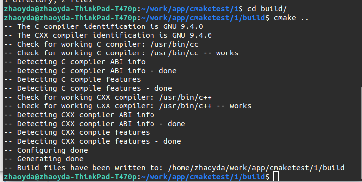
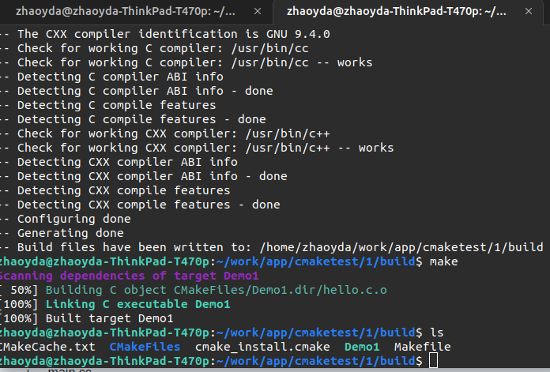
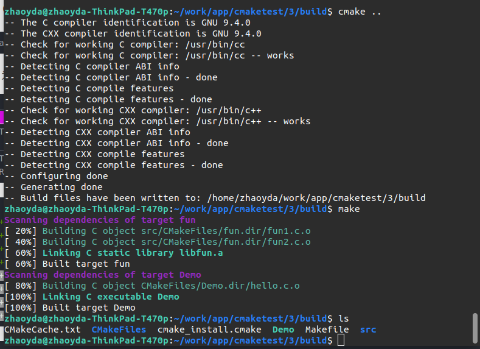
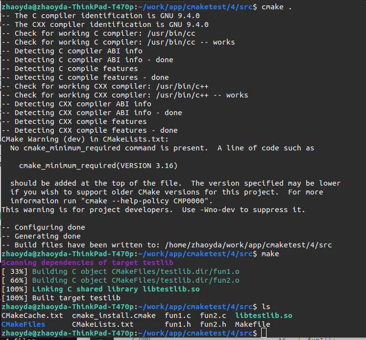
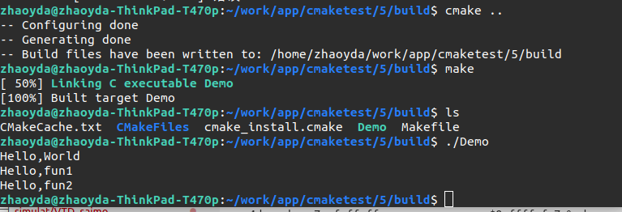

# 2 cmake简单示例

## 2.1 编译单个源文件

创建一个hello.c文件

```C
#include <stdio.h>
int main(void)
{
  printf("Hello,World\n");
  return 0;
}
```

在hello.c当前目录创建一个CMakeLists.txt（名字需要一致，大小写也一致），它就是 cmake所处理的“代码“

```cmake
# CMake 最低版本号要求
CMAKE_MINIMUM_REQUIRED (VERSION 2.8)
# #项目名称 任意
PROJECT (Demo1)
# 指定生成目标 Demo1
ADD_EXECUTABLE(Demo1 hello.c)
```

编辑后文件结构如下

```shell
.
├── build
├── CMakeLists.txt
└── hello.c

1 directory, 2 files

```

生成makefile文件：在当前目录执行`cmake .`(注意后面有一个点)（也可以创建一个build目录，在build目录执行`cmake ..`），执行后如图：




编译项目：在build目录执行`make`编译,生成Demo1可执行文件



## 2.2 编译多个源文件

### 2.2.1 同一目录多个源文件

源文件都在一个目录内如下，两个源文件helloc.和fun.c

```shell
.
├── build
├── CMakeLists.txt
├── fun.c
└── hello.c

1 directory, 3 files

```

对应的CMakeLists.txt 如下

```cmake
# CMake 最低版本号要求
cmake_minimum_required (VERSION 2.8)
# 项目信息
project (Demo2)
# 指定生成目标
add_executable(Demo hello.c fun.c)
```

唯一的改动只是在 add_executable 命令中增加了一个 fun.c源文件但是如果源文件很多，把所有源文件的名字都加进去将是一件烦人的工作。更省事的方法是使用 aux_source_directory 命令，该命令会查找指定目录下的所有源文件，然后将结果存进指定变量名。其语法如下：

```cmake
aux_source_directory(<dir> <variable>)
```

因此可以修改CMakeLists.txt如下

```cmake
#cmake最低版本需求，不加入此行会受到警告信息
CMAKE_MINIMUM_REQUIRED(VERSION 2.6)
PROJECT(HELLO) #项目名称 任意
#把当前目录(.)下所有源代码文件和头文件加入变量SRC_LIST
AUX_SOURCE_DIRECTORY(. SRC_LIST)
#生成可执行程序 hello
ADD_EXECUTABLE(Demo2 ${SRC_LIST})
```

这样，CMake 会将当前目录所有源文件的文件名赋值给变量 DIR_SRCS ，再指示变量 DIR_SRCS 中的源文件需要编译成一个名称为 Demo2 的可执行文件。

### 2.2.2 多个目录，多个源文件

目录结构如下

```shell
3
├── build
├── CMakeLists.txt
├── hello.c
└── src
    ├── CMakeLists.txt
    ├── fun1.c
    ├── fun1.h
    ├── fun2.c
    └── fun2.h

2 directories, 7 files
```

对于这种情况，需要分别在项目根目录 3 和 src 目录里各编写一个 CMakeLists.txt 文件。为了方便，我们可以先将 src 目录里的文件编译成静态库再由 main 函数调用。

根目录的CMakeLists.txt如下

```cmake
# CMake 最低版本号要求
CMAKE_MINIMUM_REQUIRED (VERSION 2.8)
# 项目信息
PROJECT (Demo3)
# 指定头文件目录
INCLUDE_DIRECTORIES(${PROJECT_SOURCE_DIR}/src)
# 查找当前目录下的所有源文件
# 并将名称保存到 DIR_SRCS 变量
AUX_SOURCE_DIRECTORY(. DIR_SRCS)
# 添加 src 子目录
ADD_SUBDIRECTORY(src)
# 指定生成目标
ADD_EXECUTABLE(Demo ${DIR_SRCS})
# 添加链接库
TARGET_LINK_LIBRARIES(Demo fun)
```

该文件添加了下面的内容: 

* INCLUDE_DIRECTORIES 添加头文件路径

* 使用命令 ADD_SUBDIRECTORY 指明本项目包含一个子目录 src，这样 src 目录下的  CMakeLists.txt 文件和源代码也会被处理 。
* 使用命令 TARGET_LINK_LIBRARIES 指明可执行文件 Demo  需要连接一个名为 fun 的链接库 。

子目录src下的CMakeLists.txt如下

```cmake
# 查找当前目录下的所有源文件
# 并将名称保存到 DIR_LIB_SRCS 变量
aux_source_directory(. DIR_LIB_SRCS)
# 生成链接库
add_library (fun ${DIR_LIB_SRCS})
```

 在该文件中使用命令 add_library 将 src 目录中的源文件编译为静态链接库`fun`。具体就是`libfun.a`

编译如下：



## 2.3 编译库

目录结构和上面目录多源文件一致，目的是将src的fun文件编译为库

```shell
3
├── build
├── CMakeLists.txt
├── hello.c
└── src
    ├── CMakeLists.txt
    ├── fun1.c
    ├── fun1.h
    ├── fun2.c
    └── fun2.h

2 directories, 7 files
```

在src文件夹中创建CMakeLists.txt

```cmake
project(lib_test)
set(CMAKE_BUILD_TYPE Release)

#Bring the headers, such as Student.h into the project
include_directories(.)

#However, the file(GLOB...) allows for wildcard additions:
file(GLOB SOURCES "*.c")

#Generate the shared library from the sources
#生成文件名testlib
add_library(testlib SHARED ${SOURCES})

#Set the location for library installation -- i.e., /usr/lib in this case
# not really necessary in this example. Use "sudo make install" to apply
# install 指定安装目录，执行sudo make install时动态库将被安装在/usr/lib目录
# install(TARGETS testStudent DESTINATION /usr/lib)
```

上面的变化

* `file`指令，这里的作用和`aux_source_directory`类似
* `add_library`而不是`ADD_EXECUTABLE`生成库文件，而不是可执行文件，`SHARED`参数是表明生成动态库，如果是需要生成静态库就是`STATIC`

编译如下



## 2.4 使用其他库

现在使用上面生成的库libtestlib.so，文件结构如下

```shell
5
├── build
├── CMakeLists.txt
├── hello.c
└── lib
    ├── fun1.h
    ├── fun2.h
    └── libtestlib.so

2 directories, 5 files
```

在根目录下创建CMakeLists.txt如下

```cmake
# CMake 最低版本号要求
CMAKE_MINIMUM_REQUIRED (VERSION 2.8)
# 项目信息
PROJECT (Demo3)
# 指定头文件目录
INCLUDE_DIRECTORIES(${PROJECT_SOURCE_DIR}/lib)
#添加共享库搜索路径
link_directories(${PROJECT_SOURCE_DIR}/lib)
# 查找当前目录下的所有源文件
# 并将名称保存到 DIR_SRCS 变量
AUX_SOURCE_DIRECTORY(. DIR_SRCS)

# 指定生成目标
ADD_EXECUTABLE(Demo ${DIR_SRCS})
# 添加链接库
TARGET_LINK_LIBRARIES(Demo testlib)
```

编译如下



## 2.5 交叉编译 

交叉编译官方说明 https://cmake.org/cmake/help/latest/manual/cmake-toolchains.7.html#variables-and-properties

### 2.5.1 arm-linux

#### 2.5.1.1. 设置系统和工具链

对于交叉编译，CMake并不知道目标系统是什么，所以需要设置一些CMake变量来告知CMake，

- CMAKE_SYSTEM_NAME：即目标系统名，这里是Linux
- CMAKE_SYSTEM_PROCESSOR ：目标系统的处理器名，这里是arm

对于工具链，则是通过下面2个变量来定位，

- CMAKE_C_COMPILER：C编译器的可执行文件名称
- CMAKE_CXX_COMPILER：C++编译器的可执行文件名称

这些变量可以在调用CMake时通过命令行传递，但是这种做法容易出错，而且用起来不方便，所以CMake提供了工具链文件的方式来传递这些变量信息。

#### 2.5.1.2. 工具链文件

我们在工程里新建一个文件叫arm_linux_toolchain.cmake，放置位置如下（也可以放在别的地方），

```cmake
set(CMAKE_SYSTEM_NAME Linux)
set(CMAKE_SYSTEM_PROCESSOR arm)

set(tools /home/wh/work/cross_compile/gcc-linaro-7.3.1-2018.05-x86_64_arm-linux-gnueabihf)
set(CMAKE_C_COMPILER ${tools}/bin/arm-linux-gnueabihf-gcc)
set(CMAKE_CXX_COMPILER ${tools}/bin/arm-linux-gnueabihf-g++)
```

**注意：**

- 上述命令必须写入脚本中，使用 -DCMAKE_TOOLCHAIN_FILE=xxx.cmake 的方式使用。不能直接写入 CMakeLists.txt 或使用 include(xx.cmake) 。
- set(CMAKE_SYSTEM_NAME  Linux)：该指令必须存在，其目的是设置目标机使用的操作系统名称，支持Linux，QNX，WindowsCE，Android等。如果没有操作系统，那么就写 Generic。执行该指令后，cmake 变量CMAKE_CROSSCOMPILING 会自动被设置为 TRUE，此时 cmake  就会“知道“现在执行的是交叉编译；

tools是本人使用的交叉工具链路径，可以根据自己的实际文件来做修改。

#### 2.5.1.3 编译

使用CMake的变量CMAKE_TOOLCHAIN_FILE来指定工具链文件，cd到build目录，然后执行下面的命令，

```shell
# 注意，工具链文件的指定一定要紧跟cmake命令之后，不能放到 .. 后面
cmake -DCMAKE_TOOLCHAIN_FILE=../arm_linux_toolchain.cmake ..
# 使用make开始安装编译源代码
make
```

使用工具链文件的好处就是只要编写一遍，然后在任意地方只需要使用CMAKE_TOOLCHAIN_FILE去指定其位置就可以了，非常方便。


### 2.5.2 官方的例子

#### 2.5.2.1 Cross Compiling for Linux

```cmake
set(CMAKE_SYSTEM_NAME Linux)
set(CMAKE_SYSTEM_PROCESSOR arm)

set(CMAKE_SYSROOT /home/devel/rasp-pi-rootfs)
set(CMAKE_STAGING_PREFIX /home/devel/stage)

set(tools /home/devel/gcc-4.7-linaro-rpi-gnueabihf)
set(CMAKE_C_COMPILER ${tools}/bin/arm-linux-gnueabihf-gcc)
set(CMAKE_CXX_COMPILER ${tools}/bin/arm-linux-gnueabihf-g++)

set(CMAKE_FIND_ROOT_PATH_MODE_PROGRAM NEVER)
set(CMAKE_FIND_ROOT_PATH_MODE_LIBRARY ONLY)
set(CMAKE_FIND_ROOT_PATH_MODE_INCLUDE ONLY)
set(CMAKE_FIND_ROOT_PATH_MODE_PACKAGE ONLY)
```

* CMAKE_SYSTEM_NAME要构建目标平台名称。

* CMAKE_SYSTEM_PROCESER目标系统的处理

* CMAKE_SYSROOT是可选的，如果有Sysroot可用，则可以指定

* CMAKE_STAGING_PREFIX也是可选的。它可用于指定主机上要安装的路径。即使在交叉编译时，CMAKE_INSTALL_PREFIX始终是运行时安装位置。

* CMAKE_C_COMPLIER C语言编译器

* CMAKE_CXX_COMPLIER C++语言编译器

* CMAKE_FIND_ROOT_PATH

  一般工程都包含一些外部依赖的库或者工具，cmake提供给我们一些变量可以进行查找FIND_PROGRAM(), FIND_LIBRARY(), FIND_FILE(), FIND_PATH() and FIND_PACKAGE() 查找文件和返回结果。`FIND_PACKAGE()`其实并不进行查找，而是通过执行`FindXXX.cmake`模块，进而调用`FIND_PROGRAM(), FIND_LIBRARY(), FIND_FILE(), FIND_PATH()`去查找文件。例如当你编译软件时候，希望程序链接文件 `/usr/lib/libjpeg.so`，`FIND_PACKAGE(JPEG)`会直接在主机的相对位置查找此链接文件，所以我们必须设定CMake在指定的位置查找需要的文件。

  下面的设置可以帮助我们完成相应的操作

  * 这是一个文件夹列表，如果你的目标环境安装在`/opt/eldk/ppc_74xx`，配置CMAKE_FIND_ROOT_PATH指向此处，然后FIND_LIBRARY(BZ2_LIB bz2)将会搜索`/opt/eldk/ppc_74xx/lib`, `/opt/eldk/ppc_74xx/usr/lib`, `/lib`, `/usr/lib` 之后会将 `/opt/eldk/ppc_74xx/usr/lib/libbz2.so` 作为结果返回。

    CMAKE_FIND_ROOT_PATH默认设置为空。如果设置之后，cmake默认会首先搜索具有这个前缀的位置下文件，之后去其他位置查找。

    - 每个FIND_XXX()可以通过参数`NO_CMAKE_FIND_ROOT_PATH`, `ONLY_CMAKE_FIND_ROOT_PATH` 和`CMAKE_FIND_ROOT_PATH_BOTH`设置查找范围
    - 或者采用对所有的FIND_XXX()都起作用的的参数`CMAKE_FIND_ROOT_PATH_MODE_PROGRAM`, `CMAKE_FIND_ROOT_PATH_MODE_LIBRARY` 和 `CMAKE_FIND_ROOT_PATH_MODE_INCLUDE`进行设置。

    如果你的工程不仅需要toolchain里面的工具，还有目标平台的附加库。我们还需要为这些依赖包建立一个安装文件夹，例如`/home/ke/install`,同时需要添加这个位置进去`CMAKE_FIND_ROOT_PATH`，之后FIND_XXX()才可以在这些位置进行查找。

#### 2.5.2.2 Cross Compiling for QNX

```cmake
set(CMAKE_SYSTEM_NAME QNX)

set(arch gcc_ntoarmv7le)

set(CMAKE_C_COMPILER qcc)
set(CMAKE_C_COMPILER_TARGET ${arch})
set(CMAKE_CXX_COMPILER QCC)
set(CMAKE_CXX_COMPILER_TARGET ${arch})

set(CMAKE_SYSROOT $ENV{QNX_TARGET})
```

# 