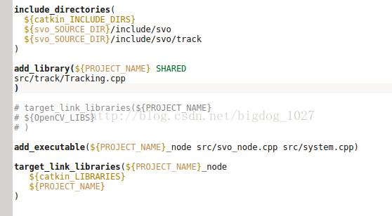

# 6 cmake指令参考

## 6.1 cmake_minimum_required

cmake_minimum_required(VERSION 3.10)：指定CMake的最小~最大版本，一般只需指定最小版本。

## 6.2 project

```cmake
形式1：
project(<PROJECT-NAME> [<language-name>...])
形式2：
project(<PROJECT-NAME>
        [VERSION <major>[.<minor>[.<patch>[.<tweak>]]]]
        [DESCRIPTION <project-description-string>]
        [HOMEPAGE_URL <url-string>]
        [LANGUAGES <language-name>...])
```

**该命令\*最主要的功能是指定camke工程的名字\*，此外他还可以指定版本号、描述、主页链接以及编译工程所使用的的语言**

project(Tutorial VERSION 1.0)：指定项目名称及版本号，初始化项目相关变量。

- **PROJECT_NAME** : 必选——用来设置工程名，设置后，会把设置的值存储在`CMAKE_PROJECT_NAME`变量中
- **VERSION **：可选，工程版本号，有主版本号、次版本号、补丁版本号
- **DESCRIPTION **：工程简单的的描述
- **HOMEPAGE_URL **：工程主页url
- **LANGUAGES **：工程使用的语言，默认为C或CXX

## 6.3 工程名称

```cmake
#只指定工程名（最常用形式）
project(cmaketest )
```

这样就指定了工程名为cmaketest，并且在调用project指定工程名字的同时，camke内部还会为下边的一些变量赋值：

```shell
 - PROJECT_NAME: 将名称赋值给PROJECT_NAME，即${PROJECT_NAME} = cmaketest
 - PROJECT_SOURCE_DIR: 当前工程的源码路径
 - <PROJECT-NAME>_SOURCE_DIR：指定工程的源码路径。如果PROJECT_NAME就是当前工程，则与PROJECT_SOURCE_DIR相同。
 - PROJECT_BINARY_DIR：当前工程的二进制路径
 - <PROJECT-NAME>_BINARY_DIR: 指定工程的二进制路径。若PROJECT_NAME
 - CMAKE_PROJECT_NAME：顶层工程的名称。cmake命令首次调用那个CMakeLists.txt对应工程的名字
```

## 6.4 版本号

```cmake
 - 指定版本号
project(cmaketest VERSION 10.2.1.3)
```

指定版本号会为以下变量赋值

```
- PROJECT_VERSION: 项目版本号
- <PROJECT_NAME>_VERSION
- PROJECT_VERSION_MAJOR
- <PROJECT_NAME>_VERSION_MAJOR
- PROJECT_VERSION_MINOR
- <PROJECT_NAME>_VERSION_MINOR
- PROJECT_VERSION_PATCH
- <PROJECT_NAME>_VERSION_PATCH
- PROJECT_VERSION_TWEAK
- <PROJECT_NAME>_VERSION_TWEAK
- CMAKE_PROJECT_VERSION
带PROJECT_NAME的是指定工程名下的版本号，不带PROJECT_NAME的是当前工程的版本号，CMAKE_PROJECT_VERSION存储的是顶层CMakeLists.txt中project命令指定的版本号
```

```cmake
```cpp
示例代码：
# 设置最低Cmake版本要求
cmake_minimum_required(VERSION 3.5)

# 指定项目名
project(cmaketest VERSION 10.2.1.3)

message("CMAKE_PROJECT_NAME = ${CMAKE_PROJECT_NAME}")
message("PROJECT_VERSION = ${PROJECT_VERSION}")
message("PROJECT_VERSION_MAJOR    = ${PROJECT_VERSION_MAJOR}")
message("PROJECT_VERSION_MINOR = ${PROJECT_VERSION_MINOR}")
message("PROJECT_VERSION_PATCH = ${PROJECT_VERSION_PATCH}")
message("PROJECT_VERSION_TWEAK = ${PROJECT_VERSION_TWEAK}")

add_executable(hello_cmake main.cpp)
```

```shell
输出结果
CMAKE_PROJECT_NAME = cmaketest
PROJECT_VERSION = 10.2.1.3
PROJECT_VERSION_MAJOR    = 10
PROJECT_VERSION_MINOR = 2
PROJECT_VERSION_PATCH = 1
PROJECT_VERSION_TWEAK = 3
```

## 6.5 工程描述

```cmake
指定工程描述
project(cmaketest DESCRIPTION "This is a test project")
```

指定工程描述会为以下变量赋值：

```shell
- PROJECT_DESCRIPTION
- <PROJECT-NAME>_DESCRIPTION
- CMAKE_PROJECT_DESCRIPTION
带PROJECT_NAME的是指定工程名下描述，不带PROJECT_NAME  
的是当前调用工程的描述，当CMakeLists.txt位于顶层目录，  
CMAKE_PROJECT_DESCRIPTION存储的是顶层CMakeLists.txt  
中project命令指定的工程描述，不会随着调用工程的变化而变化。
```

```cmake
```cpp
示例代码：
# 设置最低Cmake版本要求
cmake_minimum_required(VERSION 3.5)

# 指定项目名
project(cmaketest DESCRIPTION "This is a test project")

message("CMAKE_PROJECT_NAME = ${CMAKE_PROJECT_NAME}")
message("PROJECT_DESCRIPTION = ${PROJECT_DESCRIPTION}")

add_executable(hello_cmake main.cpp)
```

```shell
CMAKE_PROJECT_NAME = cmaketest
PROJECT_DESCRIPTION = This is a test project
-- Configuring done
-- Generating done
```

## 6.6 指定构建工程所需的编程语言

```cmake
#指定需要的编程语言
project(cmaketest LANGUAGE "CXX")
```

LANGUAGE选项可以有两种调用方式，一种是直接跟在工程名后边，可以省略LANGUAGE关键字，如project (cmaketest “CXX”)另一种是跟在其他关键字后边，LANGUAGE关键字不能省略,如project (camketest VERSION 10.2.1.3 LANGUAGES “CXX”)

LANGUAGE选择性支持的语言包括C、CXX(即C++)、CUDA、OBJC(即Objective-C)、OBJCXX、Fortran、HIP、ISPC和ASM，如果没有指定LANGUAGE选项，则默认为C和C++。
 指定LANGUAGE NONE或者仅添加LANGUAGE选项但没有列出任何语言，表示跳过所有语言。如果启用ASM，则将其放在最后，以便 CMake 可以检查其他语言的编译器如C语言是否也适用于汇编。

```cmake
#LANGUAGE选项的主要目的是检测工程编译需要的语言编译器是否存在，如果不存在，则会提示报错
# 示例代码：
# 设置最低Cmake版本要求
cmake_minimum_required(VERSION 3.5)
# 制定项目名
project(cmaketest LANGUAGE "HIP")
add_executable(hello_cmake main.cpp)
```

```shell
输出：
No CMAKE_HIP_COMPILER could be found
```

1. 如果多次调用了project命令，则`CMAKE_PROJECT_NAME、CMAKE_PROJECT_NAME、CMAKE_PROJECT_DESCRIPTION、CMAKE_PROJECT_HOMEPAGE_URL`等变量是以最后一次调用的project命令为准。
2. `project`命令需要放置在其他命令调用之前，在`cmake_minimum_required`命令之后。

## 6.7 set

```cmake
set(<variable> <value>... [PARENT_SCOPE]) #设置普通变量
set(<variable> <value>... CACHE <type> <docstring> [FORCE]) #设置缓存条目
set(ENV{<variable>} [<value>]) #设置环境变量
```

`set`命令可以设置普通变量、缓存条目、环境变量三种变量的值，分别对应上述三种命令格式。`set`的值`<value>...`表示可以给变量设置0个或者多个值，当设置多个值时（大于2个），多个值会通过`分号连接符`连接成一个真实的值赋值给变量，当设置0个值时，实际上是把变量变为未设置状态，相当于调用`unset`命令。

**命令解析**

下面分别对三种变量的设置进行说明。

### **6.7.1. 设置普通变量**

 **命令格式**：`set`(<variable> <value>... [`PARENT_SCOPE`])
  **命令含义**：将变量`variable`设置为值`<value>...`，变量`variable`的`作用域`为调用`set`命令的函数或者当前目录，如果使用了`PARENT_SCOPE`选项，意味着该变量的作用域会传递到上一层（也就是上一层目录或者当前函数的调用者，如果是函数则传递到函数的调用者，如果是目录则传递到上一层目录），并且在当前作用域该变量不受`带PARENT_SCOPE`选项的`set`命令的影响（如果变量之前没有定义，那么在当前作用域仍然是无定义的；如果之前有定义值，那么值和之前定义的值保持一致）。
  **关于变量的`作用域`**：每一个新的目录或者函数都会创建一个新的作用域，普通变量的作用域，如果不使用`PARENT_SCOPE`选项，只能从外层往内层传递。

- 1）先来看最常用的用法，设置变量为一个给定的值

  ```cmake
  cmake_minimum_required (VERSION 3.10.2)
  project (set_test)
  set (normal_var a)
  message (">>> value = ${normal_var}")
  ```

  输出为：

  ```shell
  >>> value = a
  ```

- 2）设置变量为多个给定的值

  ```cmake
  cmake_minimum_required (VERSION 3.10.2)
  project (set_test)
  set (normal_var a b c)
  message (">>> value = ${normal_var}")
  #value = a;b;c 可以看到多个值被;号连接最终的值之后赋给变量。
  ```

- 3）设置变量为空

  ```cmake
  cmake_minimum_required (VERSION 3.10.2)
  project (set_test)
  set (normal_var a b c)
  message (">>> value = ${normal_var}")#value = a;b;c
  set (normal_var) # 设置变量为空
  message (">>> value = ${normal_var}")#value =
  ```

- 4）在函数内使用选项`PARENT_SCOPE`，对应的作用域只能传递到调用它的函数。
  **场景1**：在函数内使用选项`PARENT_SCOPE`定义变量，在函数定义的文件中（非另一个函数中）使用该变量。
  **结果：**变量无定义。
  **结论：**函数内定义的变量，在函数定义的文件中调用，找不到变量的定义。

  ```cmake
  # CMakeLists.txt
  cmake_minimum_required (VERSION 3.10.2)
  project (set_test)
  
  function (test_fn arg1)
      set (normal_var_in_fn ${arg1} PARENT_SCOPE)
  endfunction (test_fn)
  message (">>> in directory, value = ${normal_var_fn}")
  #>>> in directory, value =
  #>>> in function, value =
  ```

  **场景2**：在函数内使用选项`PARENT_SCOPE`定义变量，在函数内使用该变量。
   **结果：**变量无定义。
   **结论：**函数内使用选项`PARENT_SCOPE`定义的变量，在函数内也是无定义的。

  ```cmake
  # CMakeLists.txt
  cmake_minimum_required (VERSION 3.10.2)
  project (set_test)
  
   function (test_fn arg1)
      set (normal_var_in_fn ${arg1} PARENT_SCOPE)
      message (">>> in function, value = ${normal_var_fn}")
  endfunction (test_fn)
  
  test_fn (hello)
  #>>> in function, value =
  ```

  **场景3**：在函数内使用选项`PARENT_SCOPE`定义变量，在函数内使用该变量，并且使用`set`命令`不带PARENT_SCOPE`选项定义过该变量。
   **结果：**函数内的变量值为`不带PARENT_SCOPE`选项的`set`命令所定义的。
   **结论：**选项`PARENT_SCOPE`定义的变量作用域在上一层函数，当前函数的变量必须使用不带选项`PARENT_SCOPE`定义。

  ```cmake
  # CMakeLists.txt
  cmake_minimum_required (VERSION 3.10.2)
  project (set_test)
  
  function (test_fn arg1)
      set (normal_var_in_fn nohello)
      set (normal_var_in_fn ${arg1} PARENT_SCOPE)
      message (">>> in function, value = ${normal_var_in_fn}")
  endfunction (test_fn)
  test_fn (hello)
  # in function, value = nohello
  ```

  **场景4**：在函数（示例中为`test_fn`）内使用选项`PARENT_SCOPE`定义变量，在另一个函数（调用者，示例中为`test_fn_parent`）内调用该函数。
   **结果：**调用者函数内有该变量的定义。
   **结论：**选项`PARENT_SCOPE`将变量传递到上一层调用函数。

  ```cmake
  # CMakeLists.txt
  cmake_minimum_required (VERSION 3.10.2)
  project (set_test)
  
  function (test_fn arg1)
      set (normal_var_in_fn nohello)
      set (normal_var_in_fn ${arg1} PARENT_SCOPE)
      message (">>> in function, value = ${normal_var_in_fn}")
  endfunction (test_fn)
  
  function (test_fn_parent arg1)
      test_fn (${arg1})
      message (">>> in parent function, value = ${normal_var_in_fn}")
  endfunction (test_fn_parent)
  
  test_fn_parent (hello)
  #>>> in function, value = nohello
  #>>> in parent function, value = hello
  ```

  **场景5**：在目录内使用选项`PARENT_SCOPE`，对应的作用域只能传递到上层目录，变量的传递过程与4）中函数的场景类似，不再赘述。注意一点：本例在`test`和`test/sub`下分别创建一个`CMakeLists.txt`文件。
   示例如下：

  ```cmake
  # test/sub/CMakeLists.txt
  cmake_minimum_required (VERSION 3.10.2)
  project (set_sub_test)
  
  set (normal_var_in_sub_dir sub_hello)
  set (normal_var_in_sub_dir hello PARENT_SCOPE)
  
  message (">>>>>> in sub directory, value = ${normal_var_in_sub_dir}")
  
  ```

  ```cmake
  # test/CMakeLists.txt
  cmake_minimum_required (VERSION 3.10.2)
  project (set_test)
  
  add_subdirectory (sub)
  
  message (">>> in top level, value = ${normal_var_in_sub_dir}")
  #>>>>>> in sub directory, value = sub_hello
  #>>> in top level, value = hello
  ```

### **6.7.2. 设置缓存条目**

**命令格式**：`set`(<variable> <value>... `CACHE` <type> <docstring> [`FORCE`])
  **命令含义**：将缓存条目`variable`设置为值`<value>...`，除非用户进行设置或使用了选项`FORCE`，默认情况下缓存条目的值不会被覆盖。缓存条目可以通过CMAKE的GUI界面的`add entry`按钮来增加。缓存条目的实质为可以跨层级进行传递的变量，类似于全局变量。
  缓存条目的`<type>`主要有以下几类：

- `BOOL`：布尔值`ON/OFF`,CMAKE的GUI界面对此类缓存条目会提供一个复选框。

- `FILEPATH`：文件路径，CMAKE的GUI界面对此类缓存条目会提供一个文件选择框。

- `PATH`：目录路径，CMAKE的GUI界面对此类缓存条目会提供一个目录选择框。

- `STRING / STRINGS`：文本行，CMAKE的GUI界面对此类缓存条目会提供一个文本框（对应`STRING`）或下拉选择框（对应`STRINGS`）。

- `INTERNAL`：文本行，但是只用于内部，不对外呈现。主要用于运行过程中存储变量，因此使用该`type`意味着使用`FORCE`。
  缓存条目的几个注意事项：
  1）如果变量先前未定义或者使用了`FORCE`选项，则缓存条目会直接被赋值。
  2）可以在使用cmake构建的使用通过`-D`选项来给缓存条目赋值，这样CMakeLists.txt内的`set`命令只会为缓存条目添加类型。
  3）如果变量类型是目录或者文件路径，通过`-D`选项传入的若只是相对路径，那么`set`会给这个相对路径前添加当前的工作目录以变成绝对路径（如果已经是绝对路径则不会处理）。

  ```cmake
  # CMakeLists.txt
  cmake_minimum_required (VERSION 3.10.2)
  project (set_test)
  
  set (cache_entry_val ON OFF CACHE BOOL "choose ON to enable")
  message (">>> value = ${cache_entry_val}")
  
  set (cache_entry_val2 ON CACHE BOOL "choose ON to enable" FORCE)
  message (">>> value2 = ${cache_entry_val2}")
  
  set (cache_entry_val3 ON)
  set (cache_entry_val3 OFF CACHE BOOL "choose ON to enable")
  message (">>> value3 = ${cache_entry_val3}")
  
  set (cache_entry_input OFF CACHE BOOL "choose ON to enable")
  message (">>> value4 = ${cache_entry_input}")
  
  set (mypath "test" CACHE FILEPATH "choose a file path")
  message (">>> value5 = ${mypath}")
  
  ```

  ```shell
  # 输入cmake构建，使用-D选项
  cmake . -Dcache_entry_input=ON -Dmypath=sub
  
  # 输出
  >>> value = ON;OFF
  >>> value2 = ON
  >>> value3 = ON
  >>> value4 = ON
  >>> value5 = /XXX/XXX/XXX/sub
  
  ```

### **6.7.3. 设置环境变量**

**命令格式**：`set`(`ENV`{<variable>} [<value>])
  **命令含义**：将环境变量设置为值`<value>`（注意没有`...`），接着使用`$ENV{<variable>}`会得到新的值。cmake中的环境变量可以参考：[环境变量](https://links.jianshu.com/go?to=https%3A%2F%2Fcmake.org%2Fcmake%2Fhelp%2Flatest%2Fmanual%2Fcmake-env-variables.7.html%23manual%3Acmake-env-variables(7))。
  环境变量设置的几个注意事项：
 1）该命令设置的环境变量只在当前的cmake进程生效，既不会影响调用者的环境变量，也不会影响系统环境变量。
 2）如果`<value>`值为空或者`ENV{<variable>}`后没有参数，则该命令会清除掉当前环境变量的值。
 3）`<value>`后的参数会被忽略。

```cmake
# CMakeLists.txt
cmake_minimum_required (VERSION 3.10.2)
project (set_test)

message (">>> value = $ENV{CMAKE_PREFIX_PATH}")
set (ENV{CMAKE_PREFIX_PATH} "/test/sub")
message (">>> value = $ENV{CMAKE_PREFIX_PATH}")
set (ENV{CMAKE_PREFIX_PATH})
message (">>> value = $ENV{CMAKE_PREFIX_PATH}")
set (ENV{CMAKE_PREFIX_PATH} "/test/top/") 
message (">>> value = $ENV{CMAKE_PREFIX_PATH}")
set (ENV{CMAKE_PREFIX_PATH} "") 
message (">>> value = $ENV{CMAKE_PREFIX_PATH}")
# 输出
#>>> value =
#>>> value = /test/sub
#>>> value =
#>>> value = /test/top
#>>> value =
```


## 6.8 add_library

```cmake
add_library(libname [SHARED|STATIC|MODULE] [EXCLUDE_FROM_ALL] source1 source2 ... sourceN)
```

add_library根据源码来生成一个库供他人使用。<name>是个逻辑名称，在项目中必须唯一。完整的库名依赖于具体构建方式（可能为lib<name>.a or <name>.lib）。

STATIC指静态库，SHARED指动态库，MODULE指在运行期通过类似于dlopen的函数动态加载。

## 6.9 add_subdirectory

**命令格式**

> `add_subdirectory` (source_dir [binary_dir] [`EXCLUDE_FROM_ALL`])
> **添加一个子目录并构建该子目录。**

**命令解析**

- **`source_dir`**
  **必选参数**。该参数指定一个子目录，子目录下应该包含`CMakeLists.txt`文件和代码文件。子目录可以是相对路径也可以是绝对路径，如果是相对路径，则是相对当前目录的一个相对路径。
- **`binary_dir`**
  **可选参数**。该参数指定一个目录，用于存放输出文件。可以是相对路径也可以是绝对路径，如果是相对路径，则是相对当前输出目录的一个相对路径。如果该参数没有指定，则默认的输出目录使用`source_dir`。
- **`EXCLUDE_FROM_ALL`**
  **可选参数**。当指定了该参数，则子目录下的目标不会被父目录下的目标文件包含进去，父目录的`CMakeLists.txt`不会构建子目录的目标文件，必须在子目录下显式去构建。`例外情况：当父目录的目标依赖于子目录的目标，则子目录的目标仍然会被构建出来以满足依赖关系（例如使用了target_link_libraries）`。

**举例说明**

目录结构及说明如下：

> ├── CMakeLists.txt    #父目录的CMakeList.txt
> ├── main.cpp    #源文件，包含main函数
> ├── sub    #子目录
> └── CMakeLists.txt    #子目录的CMakeLists.txt
> └── test.h    #子目录头文件
> └── test.cpp    #子目录源文件

子目录`sub` 下的`test.cpp`定义了一个函数`test()`，将输入参数打印出来，相应的头文件`test.h`则对`test()`进行声明，`CMakelists.txt`则将`sub`下的源文件编译成库文件。

```cpp
//  sub/test.cpp  
#include "test.h"
#include <iostream>

void test(std::string str)
{
    std::cout << str << std::endl;
}
```

```cpp
//  sub/test.h
#include <string>

void test(std::string str);
```

```bash
# sub/CMakeLists.txt
cmake_minimum_required(VERSION 3.10.2)
project(sub)
add_library(sub test.cpp)
```

- **场景1**：父目录`CMakeLists.txt`的`add_subdirectory` 只指定了`source_dir`。

  ```cmake
  # 父目录下的CMakeLists.txt
  cmake_minimum_required(VERSION 3.10.2)
  project(test)
  
  add_subdirectory(sub) 
  ```

在父目录下调用`cmake .`构建之后，在`sub`目录下会出现`libsub.a`库，说明当不指定`binary_dir`，输出目标文件就会放到`source_dir`目录下。

- **场景2**：父目录`CMakeLists.txt`的`add_subdirectory` 指定了`source_dir`和`binary_dir`。

  ```cmake
  # 父目录下的CMakeLists.txt
  cmake_minimum_required(VERSION 3.10.2)
  project(test)
  
  add_subdirectory(sub output) 
  ```

  在父目录下调用`cmake .`构建之后，在`output`目录下会出现`libsub.a`库，`sub`目录下则没有`libsub.a`。说明当指定`binary_dir`，输出目标文件就会放到`binary_dir`目录下。这里就是`output`目录

- **场景3**：父目录`CMakeLists.txt`的`add_subdirectory` 指定了`EXCLUDE_FROM_ALL`选项。

  ```cmake
  # 父目录下的CMakeLists.txt
  cmake_minimum_required(VERSION 3.10.2)
  project(test)
  
  add_subdirectory(sub output EXCLUDE_FROM_ALL) 
  add_executable(test main.cpp)
  
  ```

  在父目录下调用`cmake .`构建之后，在`output`目录或`sub`目录下`不会`出现`libsub.a`库，说明当指定`EXCLUDE_FROM_ALL`选项，子目录的目标文件不会生成。

- **场景4**：父目录`CMakeLists.txt`的`add_subdirectory` 指定了`EXCLUDE_FROM_ALL`选项，且父目录的目标文件依赖子目录的目标文件。

  ```cmake
  # 父目录下的CMakeLists.txt
  cmake_minimum_required(VERSION 3.10.2)
  project(test)
  
  add_subdirectory(sub output EXCLUDE_FROM_ALL) 
  add_executable(test main.cpp)
  target_link_libraries(test sub)
  
  ```

  在父目录下调用`cmake .`构建之后，在`output`目录`会`出现`libsub.a`库，说明即使指定`EXCLUDE_FROM_ALL`选项，当父目录目标文件对子目录目标文件存在依赖关系时，子目录的目标文件仍然会生成以满足依赖关系。

- 完成的例子

  最后，以一个完整的例子来结束本文（`sub`目录下的`CMakeList.txt`、`test.h`、`test.cpp`等文件内容如上文所示，没有变化），父目录下的`main.cpp`和`CMakeList.txt`如下：

  ```cmake
  # 父目录下的CMakeLists.txt
  cmake_minimum_required(VERSION 3.10.2)
  project(test)
  
  include_directories(sub)
  add_subdirectory(sub output) 
  
  add_executable(test main.cpp)
  target_link_libraries(test sub)
  
  ```

  ```c
  # 父目录下的main.cpp
  #include "test.h"
  #include <iostream>
  
  int main(int argc, char** argv)
  {
      std::cout << "In main..." << std::endl;
      test("hello, world!");
      return 0;
  }
  
  ```

  ```shell
  # 输出
  > cmake --build .
  Scanning dependencies of target sub
  [ 25%] Building CXX object output/CMakeFiles/sub.dir/test.cpp.o
  [ 50%] Linking CXX static library libsub.a
  [ 50%] Built target sub
  Scanning dependencies of target test
  [ 75%] Building CXX object CMakeFiles/test.dir/main.cpp.o
  [100%] Linking CXX executable test
  [100%] Built target test
  >./test
  In main...
  hello, world!
  
  ```

## 6.10 add_executable

```cmake
# 第一种：Normal Executables
add_executable(<name> [WIN32] [MACOSX_BUNDLE]
               [EXCLUDE_FROM_ALL]
               [source1] [source2 ...])
# 第二种：Imported Executables
add_executable(<name> IMPORTED [GLOBAL])
# 第三种：Alias Executables
add_executable(<name> ALIAS <target>)
```

使用指定的源文件来生成目标可执行文件。具体分为三类：普通、导入、别名。此处我们就以普通可执行文件进行说明。

其中<name>是可执行文件的名称，在cmake工程中必须唯一。

## 6.11 configure_file

```cmake
configure_file(input output options)
#将一个文件(由input参数指定)拷贝到指定位置(由output参数指定)，并根据options修改其内容。
```

configure_file命令一般用于自定义编译选项或者自定义宏的场景。configure_file命令会根据`options`指定的规则，自动对`input`文件中`cmakedefine`关键字及其内容进行转换。

具体来说，会做如下几个替换：

1. 将input文件中的`@var@`或者`${var}`替换成cmake中指定的值。

2. 将input文件中的`#cmakedefine var`关键字替换成`#define var`或者`#undef var`，取决于cmake是否定义了var。

**例子**

需要准备2个文件，config.h.in（input）、CMakeLists.txt，（output是自动生成的）内容如下：

**config.h.in**

```cmake
#cmakedefine var1
#cmakedefine var2 "@var2@" #注意：@@之间的名称要与cmakedefine后的变量名一样
#cmakedefine var3 "${var3}" #注意：${}之间的名称要与cmakedefine后的变量名一样
#ifdef _@var4@_${var5}_
#endif
```

**CMakeLists.txt**

```cmake
cmake_mininum_required(VERSION 2.8)
project (configure_file_test)
option (var1 "use var1..." ON)  #定义var1，也可以使用cmake -Dvar1=ON替代
set (var2 13) #指定var2的值
set (var3 "var3string") #指定var3的值
set (var4 "VARTEST4")
set (var5 "VARTEST5")

configure_file (config.h.in config.h)
```

执行cmake指令 `cmake .`会自动生成config.h文件如下

```c
#define var1
#define var2 "13"
#define var3 "var3string"
#ifdef _VARTEST4_VARTEST5_
#endif
```

**`input`** - 输入文件的路径，它是一个相对路径，以[`CMAKE_CURRENT_SOURCE_DIR`](https://links.jianshu.com/go?to=https%3A%2F%2Fcmake.org%2Fcmake%2Fhelp%2Fv3.14%2Fvariable%2FCMAKE_CURRENT_SOURCE_DIR.html%23variable%3A%22CMAKE_CURRENT_SOURCE_DIR%22)为路径前缀。此外，。

**`output`** - 输出文件或目录，它也是一个相对路径，以[`CMAKE_CURRENT_BINARY_DIR`](https://links.jianshu.com/go?to=https%3A%2F%2Fcmake.org%2Fcmake%2Fhelp%2Fv3.14%2Fvariable%2FCMAKE_CURRENT_BINARY_DIR.html%23variable%3ACMAKE_CURRENT_BINARY_DIR)为前缀。如果output的名称与已存在的目录名称相同，则会在该目录下生成一个与input文件名相同的文件。举个例子：如果input的文件名是inputfile，output是一个目录currentdir，那么生成的文件为currentdir/inputfile。

**cmakedefine**

```c
#  cmakedefine VAR
```

例如在配置文件foo.h.in中

```c
#cmakedefine FOO_ENABLE
#cmakedefine FOO_STRING "@FOO_STRING@"
```

```cmake
# CMakeLists.txt
option(FOO_ENABLE "Enable Foo" ON)
if(FOO_ENABLE)
  set(FOO_STRING "foo")
endif()
configure_file(foo.h.in foo.h @ONLY)
```

这将在与此源目录对应的构建目录中创建一个foo.h。如果FOO ENABLE选项是打开的，配置文件 `foo.h`将包含

```C
#define FOO_ENABLE
#define FOO_STRING "foo"
```

否则配置文件 `foo.h`将包含

```C
/* #undef FOO_ENABLE */
/* #undef FOO_STRING */
```


**cmakedefine01**

`#cmakedefine01 var`

  如果var有定义，则实际生成的效果为：`#define var 1`；如果var未定义，生成的效果为：`#define var 0`。

```C
config.h.in文件：
#cmakedefine01 var

CMakeLists.txt文件：
option(var "use var..." ON) # 实际也可以用cmake -Dvar=ON或者cmake -Dvar=OFF来定义或者不定义
#set (var XXX) # 用set来定义var也可以，验证发现XXX为0的时候相当于var未定义，XXX为非0的时候效果相当于var有定义

生成的config.h文件：
#define var 1 # 当var有定义
#define var 0 # 当var未定义

```


## 6.12 option

```cmake
option(<variable> "<help_text>" [value])
```

提供一个用户可以选择的布尔选项

option (USE_MYMATH "Use provided math implementation" ON)指令
 给变量赋值 ON，代表真;OFF关键字则代表 假

使用场景 : 编译脚本传递参数 -> CMake脚本接收option -> 源代码宏

* 编译脚本传入参数：传入一个cmake option TEST_DEBUG

  ```shell
  #!/bin/sh
  
  cmake -DTEST_DEBUG=ON .
  cmake --build .
  ```

* CMake脚本接收option
  cmake 脚本定义TEST_DEBUG 默认关闭OFF

  ```cmake
  #CMakeLists.txt
  project(test)
  
  option(TEST_DEBUG "option for debug" OFF)
  if (TEST_DEBUG)
  add_definitions(-DTEST_DEBUG)
  endif()
  ...
  ```

* 源代码宏 test.c

  ```c
  #include "test.h"
  
  #ifdef TEST_DEBUG
  ...
  #endif
  ```

  

## 6.13 link_directories

```cmake
link_directories([AFTER|BEFORE] directory1 [directory2 ...])
```

为链接器添加库的搜索路径，此命令调用之后生成的目标才能生效。link_directories()要放在add_executable()之前。

## 6.14 link_libraries

```cmake
link_libraries([item1 [item2 [...]]]
               [[debug|optimized|general] <item>] ...)
```

请参考target_link_libraries()的用法。

**link_libraries用在add_executable之前，target_link_libraries用在add_executable之后**，如下图



## 6.15 target_link_libraries

```cmake
target_link_libraries(<target>
                      <PRIVATE|PUBLIC|INTERFACE> <item>...
                     [<PRIVATE|PUBLIC|INTERFACE> <item>...]...)
```

为目标文件链接依赖的库。PUBLIC修饰的库或目标会被链接，并成为链接接口的一部分。PRIVATE修饰的目标或库会被链接，但不是链接接口的一部分。INTERFACE修饰的库会追加到链接接口中，但不会用来链接目标文件<target>。

**用于指定 target 需要链接 item1 item2 …。这里 target 必须已经被创建**

- target：目标文件；
- item1, ..., itemN：链接外部库文件；

```cmake
#注意 这里的main 必须已经由add_executable() or add_library() 创建
target_link_libraries(main hello)
```

## 6.16 include_directories

```cmake
include_directories([AFTER|BEFORE] [SYSTEM] dir1 [dir2 ...])
```

将指定目录添加到编译器的头文件搜索路径之下，指定目录被解释为当前源码路径的相对路径。[AFTER|BEFORE]定义了追加指定目录的方式在头还是尾。[SYSTEM]告诉编译器在一些平台上指定目录被当作系统头文件目录。


## 6.17 target_include_directories

```cmake
target_include_directories(<target> [SYSTEM] [AFTER|BEFORE]
  <INTERFACE|PUBLIC|PRIVATE> [items1...]
  [<INTERFACE|PUBLIC|PRIVATE> [items2...] ...])
```

在编译目标文件<target>时指定头文件。<target>必须是通过add_executable()或add_library()创建，且不能是ALIAS目标。<INTERFACE|PUBLIC|PRIVATE>修饰其紧跟参数items的作用范围。

`target_include_directories()` 的功能完全可以使用 `include_directories()` 实现。但是我还是建议使用 `target_include_directories()`。为什么？保持清晰！

`include_directories(header-dir)` 是一个全局包含，向下传递。什么意思呢？就是说如果某个目录的 CMakeLists.txt 中使用了该指令，其下所有的子目录默认也包含了`header-dir` 目录。

上述例子中，如果在顶层的 cmake-test/CMakeLists.txt 中加入：

```cmake
include_directories(hello-world)
include_directories(hello-world/hello)
include_directories(hello-world/world)
```

那么整个工程的源文件在编译时**都**会增加：

```shell
-I hello-world -I hello-world/hello -I hello-world/world ...
```

各级子目录中无需使用 `target_include_directories()` 或者 `include_directories()`了。如果此时查看详细的编译过程（`make VERBOSE=1`）就会发现编译过程是一大坨，很不舒服。

当然了，在**最终子目录**的 CMakeLists.txt 文件中，使用 `include_directories()` 和 `target_include_directories()` 的效果是相同的。

## 6.18 include

```cmake
include(<file|module> [OPTIONAL] [RESULT_VARIABLE <VAR>]
                      [NO_POLICY_SCOPE])
```

从指定的文件加载、运行CMake代码。如果指定文件，则直接处理。如果指定module，则寻找module.cmake文件，首先在${CMAKE_MODULE_PATH}中寻找，然后在CMake的module目录中查找。

## 6.19 find_package

```cmake
## 共支持两种模式
# mode1: Module, 此模式需访问Find<PackageName>.cmake文件
find_package(<PackageName> [version] [EXACT] [QUIET] [MODULE]
             [REQUIRED] [[COMPONENTS] [components...]]
             [OPTIONAL_COMPONENTS components...]
             [NO_POLICY_SCOPE])

# mode2: Config, 此模式需访问<lowercasePackageName>-config.cmake or <PackageName>Config.cmake
find_package(<PackageName> [version] [EXACT] [QUIET]
             [REQUIRED] [[COMPONENTS] [components...]]
             [OPTIONAL_COMPONENTS components...]
             [CONFIG|NO_MODULE]
             [NO_POLICY_SCOPE]
             [NAMES name1 [name2 ...]]
             [CONFIGS config1 [config2 ...]]
             [HINTS path1 [path2 ... ]]
             [PATHS path1 [path2 ... ]]
             [PATH_SUFFIXES suffix1 [suffix2 ...]]
             [NO_DEFAULT_PATH]
             [NO_PACKAGE_ROOT_PATH]
             [NO_CMAKE_PATH]
             [NO_CMAKE_ENVIRONMENT_PATH]
             [NO_SYSTEM_ENVIRONMENT_PATH]
             [NO_CMAKE_PACKAGE_REGISTRY]
             [NO_CMAKE_BUILDS_PATH] # Deprecated; does nothing.
             [NO_CMAKE_SYSTEM_PATH]
             [NO_CMAKE_SYSTEM_PACKAGE_REGISTRY]
             [CMAKE_FIND_ROOT_PATH_BOTH |
              ONLY_CMAKE_FIND_ROOT_PATH |
              NO_CMAKE_FIND_ROOT_PATH])
```

find_package一般用于加载外部库到项目中，并且会加载库的细节信息。如上find_package有两种模式：Module与Config。

## 6.20 打印编译详细信息

* 方法1

  执行命令cmake时追加：-DCMAKE_VERBOSE_MAKEFILE=ON

* 方法2:

  在CMakeLists.txt中添加：set(CMAKE_VERBOSE_MAKEFILEON ON)

* 方法3:

  make时追加： VERBOSE=1

# 附录

cmake官网：https://cmake.org/

官方手册：https://cmake.org/cmake/help/latest/

官方教程 ：https://cmake.org/cmake/help/latest/guide/tutorial/index.html

cmake指令参考：https://cmake.org/cmake/help/latest/manual/cmake-commands.7.html

参考博客 https://www.jianshu.com/nb/47538433

[Cmake传入项目版本号](