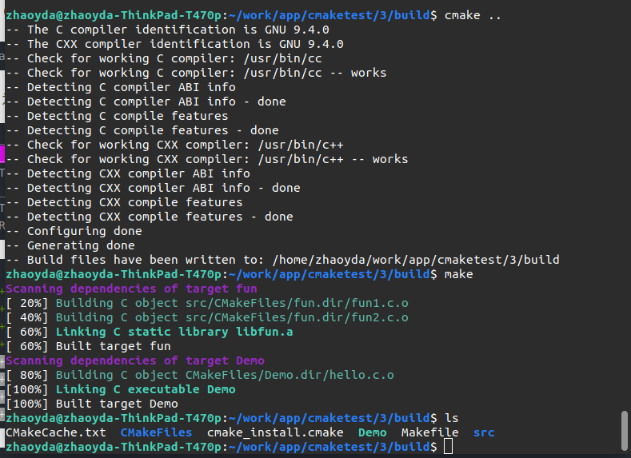
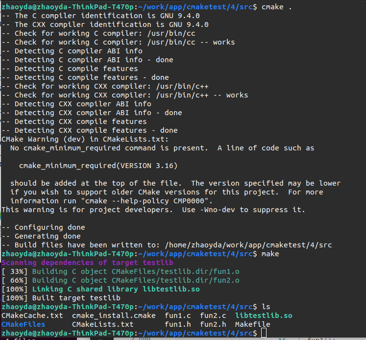

# cmake简介

cmake允许开发者编写一种平台无关的 CMakeList.txt 文件来定制整个编译流程，然后再根据目标用户的平台进一步生成所需的本地化  Makefile 和工程文件，如 Unix 的 Makefile 或 Windows 的 Visual Studio 工程。从而做到“Write once, run everywhere”。

其他的make工具如GNU Make ，QT 的 qmake ，微软的 MSnmake，BSD Make（pmake），Makepp，等等。这些 Make 工具遵循着不同的规范和标准，所执行的 Makefile 格式也千差万别。

##  编写流程

在linux下使用cmake生成makefile并编译的流程如下：

* 编写cmake的配置文件CMakeLists.txt
* 执行命令 cmake PATH 或者 ccmake PATH 生成 Makefile。其中， PATH 是 CMakeLists.txt 所在的目录。
* 使用 make 命令进行

## 编译和源代码分离

* CMake 背后的逻辑思想是编译和源代码分离的原则。 
* 通常 CMakeLists.txt 是和源代码放在一起的。一般每个子目录下都有一个 CMakeLists.txt 用于组织该目录下的文件。 
* 子目录的 CMakeLists.txt 自动继承了父目录里的 CMakeLists.txt 所定义的一切宏、变量。这极大地减少了重复的代码。 
* 而针对具体的平台和配置，我们可以单独创建一个目录，然后在该目录下生成特定平台和配置的工程文件。这样能够做到具体的工程文件不会和源代码文件混搭在一起。 例如后面讲到的交叉编译的例子，会有一个指定工具链等的cmake文件

## 安装cmake

在官网https://cmake.org/download/下载安转包

```shell
#tar -xvf cmake-3.22.0-rc2.tar.gz        
#cd cmake-3.22.0-rc2
#./bootstrap
#make
#make install
 
cmake 会默认安装在 /usr/local/bin 下面
```

安装完成后可以查看cmake版本信息

```shell
zhaoyda~$ cmake --version
cmake version 3.16.3

CMake suite maintained and supported by Kitware (kitware.com/cmake).

```


# cmake简单示例

## 编译单个源文件

创建一个hello.c文件

```C
#include <stdio.h>
int main(void)
{
  printf("Hello,World\n");
  return 0;
}
```

在hello.c当前目录创建一个CMakeLists.txt（名字需要一致，大小写也一致），它就是 cmake所处理的“代码“

```cmake
# CMake 最低版本号要求
CMAKE_MINIMUM_REQUIRED (VERSION 2.8)
# #项目名称 任意
PROJECT (Demo1)
# 指定生成目标 Demo1
ADD_EXECUTABLE(Demo1 hello.c)
```

编辑后文件结构如下

```shell
.
├── build
├── CMakeLists.txt
└── hello.c

1 directory, 2 files

```

生成makefile文件：在当前目录执行`cmake .`(注意后面有一个点)（也可以创建一个build目录，在build目录执行`cmake ..`），执行后如图：


编译项目：在build目录执行`make`编译,生成Demo1可执行文件


## 编译多个源文件

### 同一目录多个源文件

源文件都在一个目录内如下，两个源文件helloc.和fun.c

```shell
.
├── build
├── CMakeLists.txt
├── fun.c
└── hello.c

1 directory, 3 files

```

对应的CMakeLists.txt 如下

```cmake
# CMake 最低版本号要求
cmake_minimum_required (VERSION 2.8)
# 项目信息
project (Demo2)
# 指定生成目标
add_executable(Demo hello.c fun.c)
```

唯一的改动只是在 add_executable 命令中增加了一个 fun.c源文件但是如果源文件很多，把所有源文件的名字都加进去将是一件烦人的工作。更省事的方法是使用 aux_source_directory 命令，该命令会查找指定目录下的所有源文件，然后将结果存进指定变量名。其语法如下：

```cmake
aux_source_directory(<dir> <variable>)
```

因此可以修改CMakeLists.txt如下

```cmake
#cmake最低版本需求，不加入此行会受到警告信息
CMAKE_MINIMUM_REQUIRED(VERSION 2.6)
PROJECT(HELLO) #项目名称 任意
#把当前目录(.)下所有源代码文件和头文件加入变量SRC_LIST
AUX_SOURCE_DIRECTORY(. SRC_LIST)
#生成可执行程序 hello
ADD_EXECUTABLE(Demo2 ${SRC_LIST})
```

这样，CMake 会将当前目录所有源文件的文件名赋值给变量 DIR_SRCS ，再指示变量 DIR_SRCS 中的源文件需要编译成一个名称为 Demo2 的可执行文件。

### 多个目录，多个源文件

目录结构如下

```shell
3
├── build
├── CMakeLists.txt
├── hello.c
└── src
    ├── CMakeLists.txt
    ├── fun1.c
    ├── fun1.h
    ├── fun2.c
    └── fun2.h

2 directories, 7 files
```

对于这种情况，需要分别在项目根目录 3 和 src 目录里各编写一个 CMakeLists.txt 文件。为了方便，我们可以先将 src 目录里的文件编译成静态库再由 main 函数调用。

根目录的CMakeLists.txt如下

```cmake
# CMake 最低版本号要求
CMAKE_MINIMUM_REQUIRED (VERSION 2.8)
# 项目信息
PROJECT (Demo3)
# 指定头文件目录
INCLUDE_DIRECTORIES(${PROJECT_SOURCE_DIR}/src)
# 查找当前目录下的所有源文件
# 并将名称保存到 DIR_SRCS 变量
AUX_SOURCE_DIRECTORY(. DIR_SRCS)
# 添加 src 子目录
ADD_SUBDIRECTORY(src)
# 指定生成目标
ADD_EXECUTABLE(Demo ${DIR_SRCS})
# 添加链接库
TARGET_LINK_LIBRARIES(Demo fun)
```

该文件添加了下面的内容: 

* INCLUDE_DIRECTORIES 添加头文件路径

* 使用命令 ADD_SUBDIRECTORY 指明本项目包含一个子目录 src，这样 src 目录下的  CMakeLists.txt 文件和源代码也会被处理 。
* 使用命令 TARGET_LINK_LIBRARIES 指明可执行文件 Demo  需要连接一个名为 fun 的链接库 。

子目录src下的CMakeLists.txt如下

```cmake
# 查找当前目录下的所有源文件
# 并将名称保存到 DIR_LIB_SRCS 变量
aux_source_directory(. DIR_LIB_SRCS)
# 生成链接库
add_library (fun ${DIR_LIB_SRCS})
```

 在该文件中使用命令 add_library 将 src 目录中的源文件编译为静态链接库`fun`。具体就是`libfun.a`

编译如下：



## 编译库

目录结构和上面目录多源文件一致，目的是将src的fun文件编译为库

```shell
3
├── build
├── CMakeLists.txt
├── hello.c
└── src
    ├── CMakeLists.txt
    ├── fun1.c
    ├── fun1.h
    ├── fun2.c
    └── fun2.h

2 directories, 7 files
```

在src文件夹中创建CMakeLists.txt

```cmake
project(lib_test)
set(CMAKE_BUILD_TYPE Release)

#Bring the headers, such as Student.h into the project
include_directories(.)

#However, the file(GLOB...) allows for wildcard additions:
file(GLOB SOURCES "*.c")

#Generate the shared library from the sources
#生成文件名testlib
add_library(testlib SHARED ${SOURCES})

#Set the location for library installation -- i.e., /usr/lib in this case
# not really necessary in this example. Use "sudo make install" to apply
# install 指定安装目录，执行sudo make install时动态库将被安装在/usr/lib目录
# install(TARGETS testStudent DESTINATION /usr/lib)
```

上面的变化

* `file`指令，这里的作用和`aux_source_directory`类似
* `add_library`而不是`ADD_EXECUTABLE`生成库文件，而不是可执行文件，`SHARED`参数是表明生成动态库，如果是需要生成静态库就是`STATIC`

编译如下



## 使用其他库

现在使用上面生成的库libtestlib.so，文件结构如下

```shell
5
├── build
├── CMakeLists.txt
├── hello.c
└── lib
    ├── fun1.h
    ├── fun2.h
    └── libtestlib.so

2 directories, 5 files
```

在根目录下创建CMakeLists.txt如下

```cmake
# CMake 最低版本号要求
CMAKE_MINIMUM_REQUIRED (VERSION 2.8)
# 项目信息
PROJECT (Demo3)
# 指定头文件目录
INCLUDE_DIRECTORIES(${PROJECT_SOURCE_DIR}/lib)
#添加共享库搜索路径
link_directories(${PROJECT_SOURCE_DIR}/lib)
# 查找当前目录下的所有源文件
# 并将名称保存到 DIR_SRCS 变量
AUX_SOURCE_DIRECTORY(. DIR_SRCS)

# 指定生成目标
ADD_EXECUTABLE(Demo ${DIR_SRCS})
# 添加链接库
TARGET_LINK_LIBRARIES(Demo testlib)
```

编译如下


## 交叉编译 

交叉编译官方说明 https://cmake.org/cmake/help/latest/manual/cmake-toolchains.7.html#variables-and-properties

###  arm-linux

####  设置系统和工具链

对于交叉编译，CMake并不知道目标系统是什么，所以需要设置一些CMake变量来告知CMake，

- CMAKE_SYSTEM_NAME：即目标系统名，这里是Linux
- CMAKE_SYSTEM_PROCESSOR ：目标系统的处理器名，这里是arm

对于工具链，则是通过下面2个变量来定位，

- CMAKE_C_COMPILER：C编译器的可执行文件名称
- CMAKE_CXX_COMPILER：C++编译器的可执行文件名称

这些变量可以在调用CMake时通过命令行传递，但是这种做法容易出错，而且用起来不方便，所以CMake提供了工具链文件的方式来传递这些变量信息。

#### 工具链文件

我们在工程里新建一个文件叫arm_linux_toolchain.cmake，放置位置如下（也可以放在别的地方），

```cmake
set(CMAKE_SYSTEM_NAME Linux)
set(CMAKE_SYSTEM_PROCESSOR arm)

set(tools /home/wh/work/cross_compile/gcc-linaro-7.3.1-2018.05-x86_64_arm-linux-gnueabihf)
set(CMAKE_C_COMPILER ${tools}/bin/arm-linux-gnueabihf-gcc)
set(CMAKE_CXX_COMPILER ${tools}/bin/arm-linux-gnueabihf-g++)
```

**注意：**

- 上述命令必须写入脚本中，使用 -DCMAKE_TOOLCHAIN_FILE=xxx.cmake 的方式使用。不能直接写入 CMakeLists.txt 或使用 include(xx.cmake) 。
- set(CMAKE_SYSTEM_NAME  Linux)：该指令必须存在，其目的是设置目标机使用的操作系统名称，支持Linux，QNX，WindowsCE，Android等。如果没有操作系统，那么就写 Generic。执行该指令后，cmake 变量CMAKE_CROSSCOMPILING 会自动被设置为 TRUE，此时 cmake  就会“知道“现在执行的是交叉编译；

tools是本人使用的交叉工具链路径，可以根据自己的实际文件来做修改。

####  编译

使用CMake的变量CMAKE_TOOLCHAIN_FILE来指定工具链文件，cd到build目录，然后执行下面的命令，

```shell
# 注意，工具链文件的指定一定要紧跟cmake命令之后，不能放到 .. 后面
cmake -DCMAKE_TOOLCHAIN_FILE=../arm_linux_toolchain.cmake ..
# 使用make开始安装编译源代码
make
```

使用工具链文件的好处就是只要编写一遍，然后在任意地方只需要使用CMAKE_TOOLCHAIN_FILE去指定其位置就可以了，非常方便。


### 官方的例子

####  Cross Compiling for Linux

```cmake
set(CMAKE_SYSTEM_NAME Linux)
set(CMAKE_SYSTEM_PROCESSOR arm)

set(CMAKE_SYSROOT /home/devel/rasp-pi-rootfs)
set(CMAKE_STAGING_PREFIX /home/devel/stage)

set(tools /home/devel/gcc-4.7-linaro-rpi-gnueabihf)
set(CMAKE_C_COMPILER ${tools}/bin/arm-linux-gnueabihf-gcc)
set(CMAKE_CXX_COMPILER ${tools}/bin/arm-linux-gnueabihf-g++)

set(CMAKE_FIND_ROOT_PATH_MODE_PROGRAM NEVER)
set(CMAKE_FIND_ROOT_PATH_MODE_LIBRARY ONLY)
set(CMAKE_FIND_ROOT_PATH_MODE_INCLUDE ONLY)
set(CMAKE_FIND_ROOT_PATH_MODE_PACKAGE ONLY)
```

* CMAKE_SYSTEM_NAME要构建目标平台名称。

* CMAKE_SYSTEM_PROCESER目标系统的处理

* CMAKE_SYSROOT是可选的，如果有Sysroot可用，则可以指定

* CMAKE_STAGING_PREFIX也是可选的。它可用于指定主机上要安装的路径。即使在交叉编译时，CMAKE_INSTALL_PREFIX始终是运行时安装位置。

* CMAKE_C_COMPLIER C语言编译器

* CMAKE_CXX_COMPLIER C++语言编译器

* CMAKE_FIND_ROOT_PATH

  一般工程都包含一些外部依赖的库或者工具，cmake提供给我们一些变量可以进行查找FIND_PROGRAM(), FIND_LIBRARY(), FIND_FILE(), FIND_PATH() and FIND_PACKAGE() 查找文件和返回结果。`FIND_PACKAGE()`其实并不进行查找，而是通过执行`FindXXX.cmake`模块，进而调用`FIND_PROGRAM(), FIND_LIBRARY(), FIND_FILE(), FIND_PATH()`去查找文件。例如当你编译软件时候，希望程序链接文件 `/usr/lib/libjpeg.so`，`FIND_PACKAGE(JPEG)`会直接在主机的相对位置查找此链接文件，所以我们必须设定CMake在指定的位置查找需要的文件。

  下面的设置可以帮助我们完成相应的操作

  * 这是一个文件夹列表，如果你的目标环境安装在`/opt/eldk/ppc_74xx`，配置CMAKE_FIND_ROOT_PATH指向此处，然后FIND_LIBRARY(BZ2_LIB bz2)将会搜索`/opt/eldk/ppc_74xx/lib`, `/opt/eldk/ppc_74xx/usr/lib`, `/lib`, `/usr/lib` 之后会将 `/opt/eldk/ppc_74xx/usr/lib/libbz2.so` 作为结果返回。

    CMAKE_FIND_ROOT_PATH默认设置为空。如果设置之后，cmake默认会首先搜索具有这个前缀的位置下文件，之后去其他位置查找。

    - 每个FIND_XXX()可以通过参数`NO_CMAKE_FIND_ROOT_PATH`, `ONLY_CMAKE_FIND_ROOT_PATH` 和`CMAKE_FIND_ROOT_PATH_BOTH`设置查找范围
    - 或者采用对所有的FIND_XXX()都起作用的的参数`CMAKE_FIND_ROOT_PATH_MODE_PROGRAM`, `CMAKE_FIND_ROOT_PATH_MODE_LIBRARY` 和 `CMAKE_FIND_ROOT_PATH_MODE_INCLUDE`进行设置。

    如果你的工程不仅需要toolchain里面的工具，还有目标平台的附加库。我们还需要为这些依赖包建立一个安装文件夹，例如`/home/ke/install`,同时需要添加这个位置进去`CMAKE_FIND_ROOT_PATH`，之后FIND_XXX()才可以在这些位置进行查找。

#### Cross Compiling for QNX

```cmake
set(CMAKE_SYSTEM_NAME QNX)

set(arch gcc_ntoarmv7le)

set(CMAKE_C_COMPILER qcc)
set(CMAKE_C_COMPILER_TARGET ${arch})
set(CMAKE_CXX_COMPILER QCC)
set(CMAKE_CXX_COMPILER_TARGET ${arch})

set(CMAKE_SYSROOT $ENV{QNX_TARGET})
```

# cmake使用规则

## 从命令行定义全局变量

在执行 cmake 指令的时候，可以定义任意多个全局变量。这些全局变量可以直接在CMakeLists.txt 中被使用。这是一项很方便的功能。

例如

```shell
$cmake  ..   -DCONFIG=Debug   -DSSE=True 
```

这条指令定义了两个全局变量：`CONFIG` 和 `SSE`，其值分别是"Debug"和"True"。 不要被这两个变量前面的-D 所迷惑。那只是用来告诉 cmake，要定义变量了。

##  构建类型

 CMake 为我们提供了四种构建类型： 

* Debug 
* Release 
* MinSizeRel 
* RelWithDebInfo 

如果使用 CMake 生成 Makefile 时，我们需要做一些不同的工作。CMake 中存在一个变量 `CMAKE_BUILD_TYPE` 用于指定构建类型，此变量只用于基于 make 的生成器

例如

```shell
$ cmake  -DCMAKE_BUILD_TYPE=Debug 
```


下面是官方的翻译https://link.zhihu.com/?target=https%3A//cmake.org/cmake/help/latest/guide/tutorial/index.html

# cmake官方文档

CMake 教程提供了一个循序渐进的指南，涵盖了 CMake 帮助解决的常见构建系统问题。了解示例项目中各个主题是如何运作是很有帮助的。教程的文档和示例代码可以在 CMake 源代码的 `Help/guide/tutorial` 目录中找到。每个步骤都有自己的子目录，其中包含可以用作起点的代码。教程示例是渐进的，因此，每个步骤都为前一个步骤提供完整的解决方案。

## 一个基本的出发点（第一步）

最基本的项目是一个从源代码文件构建的可执行文件。对于简单的项目来说，仅需一份包含三行内容的 `CMakeLists.txt` 文件。这将是我们教程的起点。在 `Step1` 文件夹创建一个 `CMakeLists.txt` 文件，内容如下：

```cmake
cmake_minimum_required(VERSION 3.10)

# 设置项目名称
project(Tutorial)

# 生成可执行文件 Tutorial
add_executable(Tutorial tutorial.cxx)
```

请注意：在这个实例中，我们使用小写字母在 `CMakeLists.txt` 中书写命令。CMake 支持大写、小写以及大小写混合的命令形式。`tutorial.cxx` 文件的源码在 Step1 目录中，它可以用于计算一个数字的平方根。

### 添加一个版本号和配置的头文件

我们要添加的第一个特性是为可执行文件和项目提供一个版本号。尽管我们可以在源代码中执行这一操作，但是使用 `CMakeLists.txt` 可以提供更大的灵活性。

首先，修改 `CMakeLists.txt` 文件，使用 `project()` 命令来设置项目的名称和版本号。

```cmake
cmake_minimum_required(VERSION 3.10)

# 设置项目名称和版本
project(Tutorial VERSION 1.0)
```

然后，配置头文件来将版本号传递给源代码。

```cmake
configure_file(TutorialConfig.h.in TutorialConfig.h)
```

由于配置好的文件将被写入二进制目录，所以我们必须将该目录添加到 include 文件的搜索路径中。将以下内容添加到 `CMakeLists.txt` 文件的末尾。

```cmake
target_include_directories(Tutorial PUBLIC
                           "${PROJECT_BINARY_DIR}"
                           )
```

使用你喜欢的编辑器，在源代码目录创建 `TutorialConfig.h.in` 文件，内容如下：

```cpp
// Tutorial 的配置选项和设置
#define Tutorial_VERSION_MAJOR @Tutorial_VERSION_MAJOR@
#define Tutorial_VERSION_MINOR @Tutorial_VERSION_MINOR@
```

当 CMake 配置这个头文件的时候，`@Tutorial_VERSION_MAJOR@` 和 `@Tutorial_VERSION_MINOR@` 的值将被替换。

接下来，修改 `tutorial.cxx` 文件，让它 include 那个配置过的头文件：`TutorialConfig.h`。

最后，让我们通过修改 `tutorial.cxx` 来打印出可执行文件的名称和版本号，如下所示：

```cpp
if (argc < 2) {
    // 打印版本号
    std::cout << argv[0] << " Version " << Tutorial_VERSION_MAJOR << "."
              << Tutorial_VERSION_MINOR << std::endl;
    std::cout << "Usage: " << argv[0] << " number" << std::endl;
    return 1;
  }
```

### 指定 C++ 标准

接下来，让我们通过在 `tutorial.cxx` 中用 `std::stod` 替换 `atof`，来将一些 C++ 11 的特性添加到我们的项目中。同时，删除 `#include <cstdlib>`。

```cpp
const double inputValue = std::stod(argv[1]);
```

我们需要在 CMake 代码中显式地声明它需要使用正确的标识。在 CMake 中，启用对特定 C++ 标准支持的最简单做法是使用 `CMAKE_CXX_STANDARD` 变量。在本教程中，我们在 `CMakeLists.txt` 文件中将 `CMAKE_CXX_STANDARD` 变量设置为 11，并将 `CMAKE_CXX_STANDARD_REQUIRED` 变量设置为 True。确保将 `CMAKE_CXX_STANDARD` 声明添加到 `add_executable` 命令的上方。

```cmake
cmake_minimum_required(VERSION 3.10)

# 设置项目名称和版本
project(Tutorial VERSION 1.0)

# 指定 C++ 标准
set(CMAKE_CXX_STANDARD 11)
set(CMAKE_CXX_STANDARD_REQUIRED True)
```

### 构建并测试

运行 `cmake` 可执行文件或是 `cmake-gui` 来配置项目，然后使用你选择的构建工具进行构建。

例如，我们可以使用命令行导航到 CMake 源代码的 `Help/guide/tutorial` 目录，并创建一个构建目录。

```powershell
mkdir Step1_build
```

接下来，导航到构建目录并运行 CMake 来配置项目并生成一个本地构建系统。

```powershell
cd Step1_build
cmake ../Step1
```

然后调用构建系统来实际地编译和链接项目：

```powershell
#在 linux 下就是执行 make 命令。 
cmake --build .
```

最后，尝试通过下列命令使用新构建的 Tutorial：

```powershell
Tutorial 4294967296
Tutorial 10
Tutorial
```

## 添加一个库（第二步）

现在我们将向我们的项目中添加一个库。这个库将包含我们自己的计算数字平方根的实现。然后，可执行文件可以使用这个库，而非编译器提供的标准平方根函数。

**也就是先把自己实现的函数（文件）生成一个库，由另一个文件调用。**

在本教程中，我们将把库放到一个名为 `MathFunctions` 的子目录中。这个目录已经包含了一个头文件：`MathFunctions.h` 和一个源文件 `mysqrt.cxx`。源文件中有一个名为 `mysqrt` 的函数，它提供了和编译器的 `sqrt` 函数类似的功能。

将具有以下内容的 `CMakeLists.txt` 文件添加到 `MathFunctions` 目录中。

```cmake
# 添加一个子目录并构建该子目录
add_library(MathFunctions mysqrt.cxx)
```

为了使用这个新的库，我们将在顶级的 `CMakeLists.txt` 文件中添加一个 `add_subdirectory()` 的命令，以便构建该库。我们将新库添加到可执行文件，并将 MathFunctions 添加为 include 目录，以便可以找到 `mysqrt.h` 头文件。顶级 `CMakeLists.txt` 的最后几行现在应该是这样的：

```cmake
#添加一个子目录并构建该子目录
add_subdirectory(MathFunctions)

# 生成可执行文件
add_executable(Tutorial tutorial.cxx)
# 可执行程序 依赖MathFunctions库
target_link_libraries(Tutorial PUBLIC MathFunctions)

# 将二进制目录添加到 include 文件的搜索路径
# 这样我们就可以找到 TutorialConfig.h 了
target_include_directories(Tutorial PUBLIC
                          "${PROJECT_BINARY_DIR}"
                          "${PROJECT_SOURCE_DIR}/MathFunctions"
                          )
```

现在让我们将 `MathFunctions` 库设为可选的。虽然对于本教程来说没有必要这么做，但是对于大型项目而言这是很常见的情况。第一步是向顶层的 `CMakeLists.txt` 文件添加一个选项。

```cmake
option(USE_MYMATH "Use tutorial provided math implementation" ON)

# 配置一个头文件来将某些 CMake 设置
# 传递给源码
configure_file(TutorialConfig.h.in TutorialConfig.h)
```

这个选项将会在 `cmake-gui` 和 `ccmake` 中显示，默认值 `ON` 可以由用户更改。这个设置将被存储在缓存中，这样用户就无需每次在构建目录上运行 CMake 时都设置该值。

下一个修改是让构建和链接 MathFunctions 库成为有条件的。为此，我们将顶级 `CMakeLists.txt` 文件的结尾修改为如下的形式：

```cmake
if(USE_MYMATH)
  add_subdirectory(MathFunctions)
  #将MathFunctions追加到变量EXTRA_LIBS
  list(APPEND EXTRA_LIBS MathFunctions)
  list(APPEND EXTRA_INCLUDES "${PROJECT_SOURCE_DIR}/MathFunctions")
endif()

# 添加可执行文件
add_executable(Tutorial tutorial.cxx)

target_link_libraries(Tutorial PUBLIC ${EXTRA_LIBS})

# 配置一个头文件来将某些 CMake 设置
# 传递给源码
target_include_directories(Tutorial PUBLIC
                           "${PROJECT_BINARY_DIR}"
                           ${EXTRA_INCLUDES}
                           )
```

请注意：使用变量 `EXTRA_LIBS` 来收集所有可选库，以便稍后连接到可执行文件中。变量 `EXTRA_INCLUDES` 类似地用于可选的头文件。这是处理许多可选组件的经典方法，我们将在下一步讨论现代方法。

对源码的相应更改非常简单。首先，如果我们需要，在 `tutorial.cxx` 中包含 `MathFunctions.h` 标头。

```cpp
#ifdef USE_MYMATH
#  include "MathFunctions.h"
#endif
```

然后，还是这个文件中，让 `USE_MYMATH` 控制使用哪个平方根函数。

```cpp
#ifdef USE_MYMATH
  const double outputValue = mysqrt(inputValue);
#else
  const double outputValue = sqrt(inputValue);
#endif
```

由于源码现在需要使用 `USE_MYMATH`，因此我们可以使用下列内容将其添加到 `TutorialConfig.h.in` 中：

```cpp
#cmakedefine USE_MYMATH
```

**练习**：为什么在 `USE_MYMATH` 选项之后配置 `TutorialConfig.h.in` 如此重要？如果我们将二者颠倒会发生什么？

下面是完整的CMakeLists.txt

```cmake
#顶层CMakeLists.txt
cmake_minimum_required(VERSION 3.10)

# set the project name and version
project(Tutorial VERSION 1.0)

# specify the C++ standard
set(CMAKE_CXX_STANDARD 11)
set(CMAKE_CXX_STANDARD_REQUIRED True)

# should we use our own math functions
option(USE_MYMATH "Use tutorial provided math implementation" ON)

# configure a header file to pass some of the CMake settings
# to the source code
configure_file(TutorialConfig.h.in TutorialConfig.h)

# add the MathFunctions library
if(USE_MYMATH)
  add_subdirectory(MathFunctions)
  list(APPEND EXTRA_LIBS MathFunctions)
  list(APPEND EXTRA_INCLUDES "${PROJECT_SOURCE_DIR}/MathFunctions")
endif()

# add the executable
add_executable(Tutorial tutorial.cxx)

target_link_libraries(Tutorial PUBLIC ${EXTRA_LIBS})

# add the binary tree to the search path for include files
# so that we will find TutorialConfig.h
target_include_directories(Tutorial PUBLIC
                           "${PROJECT_BINARY_DIR}"
                           ${EXTRA_INCLUDES}
                           )
```

```cmake
#MathFunctions子文件夹的CMakeLists.txt
add_library(MathFunctions mysqrt.cxx)
```

```c
//TutorialConfig.h.in
// the configured options and settings for Tutorial
#define Tutorial_VERSION_MAJOR @Tutorial_VERSION_MAJOR@
#define Tutorial_VERSION_MINOR @Tutorial_VERSION_MINOR@
#cmakedefine USE_MYMATH
```


运行 `cmake` 可执行文件或者 `cmake-gui` 来配置项目，然后使用你选择的构建工具对其进行构建。接着运行被构建好的 Tutorial 可执行文件。

现在，让我们更新 `USE_MYMATH` 的值。最简单的方法是在终端使用 `cmake-gui` 或者 `ccmake`。或者，如果你想从命令行对选项进行修改，尝试以下命令：

```powershell
cmake ../Step2 -DUSE_MYMATH=OFF
```

重新构建并再次运行。

哪个函数提供的结果更佳，sqrt 还是 mysqrt ？

## 为库添加使用要求（第三步）

使用要求可以更好地控制库或可执行文件的链接以及 include 内容，同时还可以更好地控制 CMake 内部目标的传递属性。使用使用要求的主要命令有：

- `target_compile_definitions()`
  
- `target_compile_options()`
  
- `target_include_directories()`
  
- `target_link_libraries()`
  

让我们从添加一个库（第二步）的基础上重构代码，以使用具有使用要求的现代 CMake 方法。我们首先声明，任何连接到 MathFunctions 的人都必须 include 当前的源目录，而 MathFunctions 本身不需要。因此，这可以成为一个 `INTERFACE` 使用要求。

请记住，`INTERFACE` 指的是使用者需要而提供者不需要的东西。将以下内容添加到 `MathFunctions/CMakeLists.txt` 的末尾：

```cmake
target_include_directories(MathFunctions
          INTERFACE ${CMAKE_CURRENT_SOURCE_DIR}
          )
```

现在，我们已经指定了 MathFunctions 的使用要求，我们可以安全地从顶级 `CMakeLists.txt` 中删除对 `EXTRA_INCLUDES` 变量的使用，这里：

```cmake
if(USE_MYMATH)
  add_subdirectory(MathFunctions)
  list(APPEND EXTRA_LIBS MathFunctions)
endif()
```

还有这里：

```cmake
target_include_directories(Tutorial PUBLIC
                           "${PROJECT_BINARY_DIR}"
                           )
```

完整的CMakeList.txt如下

顶级 `CMakeLists.txt`

```cmake
cmake_minimum_required(VERSION 3.10)

# set the project name and version
project(Tutorial VERSION 1.0)

# specify the C++ standard
set(CMAKE_CXX_STANDARD 11)
set(CMAKE_CXX_STANDARD_REQUIRED True)

# should we use our own math functions
option(USE_MYMATH "Use tutorial provided math implementation" ON)

# configure a header file to pass some of the CMake settings
# to the source code
configure_file(TutorialConfig.h.in TutorialConfig.h)

# add the MathFunctions library
if(USE_MYMATH)
  add_subdirectory(MathFunctions)
  list(APPEND EXTRA_LIBS MathFunctions)
  #删除了list(APPEND EXTRA_INCLUDES "${PROJECT_SOURCE_DIR}/MathFunctions")

endif()

# add the executable
add_executable(Tutorial tutorial.cxx)

target_link_libraries(Tutorial PUBLIC ${EXTRA_LIBS})

# add the binary tree to the search path for include files
# so that we will find TutorialConfig.h
target_include_directories(Tutorial PUBLIC
                           "${PROJECT_BINARY_DIR}"
                           #删除了${EXTRA_INCLUDES}
                           )
```

`MathFunctions/CMakeLists.txt` 

```cmake
add_library(MathFunctions mysqrt.cxx)

# state that anybody linking to us needs to include the current source dir
# to find MathFunctions.h, while we don't.
# 下面的语句是多出来的
target_include_directories(MathFunctions
          INTERFACE ${CMAKE_CURRENT_SOURCE_DIR}
          )

```

完成之后，运行 `cmake` 可执行文件或者 `cmake-gui` 来配置项目，然后从构建目录使用你选择的构建工具或者使用 `cmake --build .` 进行构建。

## 安装并测试（第四步）

现在，我们可以开始向我们的项目中添加安装规则和测试支持了。

### 安装规则

安装规则十分简单：对于 MathFunctions，我们要安装库和头文件，对于应用程序，我们要安装可执行文件和配置的头文件。

因此，我们要在 MathFunctions/CMakeLists.txt 的末尾添加：

```cmake
install(TARGETS MathFunctions DESTINATION lib)
install(FILES MathFunctions.h DESTINATION include)
```

在顶级 CMakeLists.txt 的末尾添加：

```cmake
install(TARGETS Tutorial DESTINATION bin)
install(FILES "${PROJECT_BINARY_DIR}/TutorialConfig.h"
  DESTINATION include
  )
```

这就是创建本教程的基本本地安装所需的全部内容。

现在，运行 cmake 可执行文件或者 cmake-gui 来配置项目，然后使用你选择的构建工具对其进行构建。

然后，通过命令行使用 `cmake` 命令中的 `install` 选项（这一选项在 3.15 中被引入，较早版本的 CMake 必须使用 `make install`）运行安装步骤。对于多配置工具，记得使用 `--config` 参数来指定配置。如果你使用 IDE，只需要构建 `INSTALL` 目标。这一步将安装适当的头文件、库和可执行文件。例如：

```powershell
cmake --install .
```

CMake 变量 `CMAKE_INSTALL_PREFIX` 被用于确定文件安装的根目录。如果使用 `cmake --install` 命令，则可以通过 `--prefix` 参数修改安装目录。例如：

```powershell
cmake --install . --prefix "/home/myuser/installdir"
```

导航到安装目录，并验证已安装的 Tutorial 是否运行。

### 测试支持

接下来测试我们的应用程序。在顶级 `CMakeLists.txt` 文件的末尾，我们可以启用测试，然后添加一些基本测试以验证应用程序是否正常运行。

```cmake
enable_testing()

# 应用程序是否运行
add_test(NAME Runs COMMAND Tutorial 25)

# 用法消息有效吗？
add_test(NAME Usage COMMAND Tutorial)
set_tests_properties(Usage
  PROPERTIES PASS_REGULAR_EXPRESSION "Usage:.*number"
  )

# 定义一个函数以简化添加测试
function(do_test target arg result)
  add_test(NAME Comp${arg} COMMAND ${target} ${arg})
  set_tests_properties(Comp${arg}
    PROPERTIES PASS_REGULAR_EXPRESSION ${result}
    )
endfunction(do_test)

# 做一些基于结果的测试
do_test(Tutorial 4 "4 is 2")
do_test(Tutorial 9 "9 is 3")
do_test(Tutorial 5 "5 is 2.236")
do_test(Tutorial 7 "7 is 2.645")
do_test(Tutorial 25 "25 is 5")
do_test(Tutorial -25 "-25 is [-nan|nan|0]")
do_test(Tutorial 0.0001 "0.0001 is 0.01")
```

第一个测试只是验证应用程序正在运行，没有段错误或其他崩溃，并且返回值为零。这是 CTest 测试的基本形式。

下一个测试使用 `PASS_REGULAR_EXPRESSION` 测试属性来验证测试的输出是否包含某些字符串。在这种情况下验证在提供了错误数量的参数时是否打印了使用情况消息。

最后，我们有一个名为 `do_test` 的函数，该函数运行应用程序并验证所计算的平方根相对于给定输入是否正确。对于 `do_test` 的每次调用，都会根据传递的参数将另一个测试（带有名称，输入和预期结果）添加到项目中。

重建应用程序，然后导航到二进制目录并运行 `ctest` 可执行文件：`ctest -N` 和 `ctest -VV`。对于多配置生成器（例如 Visual Studio），必须指定配置类型。例如，要以 Debug 模式运行测试，请从构建目录（而非 Debug 子目录）中使用 `ctest -C Debug -VV`。或者，从 IDE 构建 `RUN_TESTS` 目标。

## 添加系统自检（第五步）

让我们考虑向我们的项目中添加一些依赖于目标平台可能没有的特性的代码。对于本例，我们将添加一些取决于目标平台是否具有 `log` 和 `exp` 函数的代码。当然，几乎每个平台都具有这些功能，但本教程假设它们并不常见。

如果平台具有 `log` 和 `exp`，那么我们将使用它们来计算 `mysqrt` 函数中的平方根。我们首先使用 `MathFunctions/CMakeLists.txt` 中的 `CheckSymbolExists` 模块测试这些功能的可用性。在某些平台上，我们将需要链接到 m 库。如果最初没有找到 `log` 和 `exp`，则请求 m 库，然后重试。

```cmake
include(CheckSymbolExists)
check_symbol_exists(log "math.h" HAVE_LOG)
check_symbol_exists(exp "math.h" HAVE_EXP)
if(NOT (HAVE_LOG AND HAVE_EXP))
  unset(HAVE_LOG CACHE)
  unset(HAVE_EXP CACHE)
  set(CMAKE_REQUIRED_LIBRARIES "m")
  check_symbol_exists(log "math.h" HAVE_LOG)
  check_symbol_exists(exp "math.h" HAVE_EXP)
  if(HAVE_LOG AND HAVE_EXP)
    target_link_libraries(MathFunctions PRIVATE m)
  endif()
endif()
```

如果可用，使用 `target_compile_definitions()` 指定 `HAVE_LOG` 和 `HAVE_EXP` 作为 `PRIVATE` 编译定义。

```cmake
if(HAVE_LOG AND HAVE_EXP)
  target_compile_definitions(MathFunctions
                             PRIVATE "HAVE_LOG" "HAVE_EXP")
endif()
```

如果 `log` 和 `exp` 在系统上可用，那么我们将使用它们来计算 `mysqrt` 函数中的平方根。将以下代码添加到 `MathFunctions/mysqrt.cxx` 中的 `mysqrt` 函数中（返回结果前不要忘记 `#endif`）：

```cpp
#if defined(HAVE_LOG) && defined(HAVE_EXP)
  double result = exp(log(x) * 0.5);
  std::cout << "Computing sqrt of " << x << " to be " << result
            << " using log and exp" << std::endl;
#else
  double result = x;
```

我们还需要修改 `mysqrt.cxx` 以 include `cmath`。

```cpp
#include <cmath>
```

运行 `cmake` 可执行文件或 `cmake-gui` 来配置项目，然后用你选择的构建工具构建它，并运行 Tutorial 可执行文件。

现在哪个函数给出了更好的结果，sqrt 还是 mysqrt？

## 添加自定义命令和生成的文件（第六步）

假设，出于本教程的目的，我们决定不再使用平台的 `log` 和 `exp` 函数，而是希望生成一个可在 `mysqrt` 函数中使用的预计算值表。在本节中，我们将在构建过程中创建表，然后将该表编译到我们的应用程序中。

首先，让我们在 `MathFunctions/CMakeLists.txt` 中删除对 `log` 和 `exp` 函数的检查。然后从 `mysqrt.cxx` 中删除对 `HAVE_LOG` 和 `HAVE_EXP` 的检查。同时，我们可以删除 `#include <cmath>`。

在 `MathFunctions` 子目录中，提供了一个名为 `MakeTable.cxx` 的新源文件来生成这张表。

我们可以看到该表是作为有效的 C++ 代码生成的，并且输出文件名已作为参数传递。

下一步是将适当的命令添加到 `MathFunctions/CMakeLists.txt` 文件中，以构建 MakeTable 可执行文件，然后在构建过程中运行它。我们需要一些命令来完成此操作。

首先，在 `MathFunctions/CMakeLists.txt` 的顶部，添加 MakeTable 的可执行文件，就像添加任何其他可执行文件一样。

```cmake
add_executable(MakeTable MakeTable.cxx)
```

然后，我们添加一个自定义命令，该命令指定如何通过运行 MakeTable 来产生 `Table.h`。

```cmake
add_custom_command(
  OUTPUT ${CMAKE_CURRENT_BINARY_DIR}/Table.h
  COMMAND MakeTable ${CMAKE_CURRENT_BINARY_DIR}/Table.h
  DEPENDS MakeTable
  )
```

接下来，我们必须让 CMake 知道 `mysqrt.cxx` 取决于生成的文件 `Table.h`。这是通过将生成的 `Table.h` 添加到库 MathFunctions 的源列表中来完成的。

```cmake
add_library(MathFunctions
            mysqrt.cxx
            ${CMAKE_CURRENT_BINARY_DIR}/Table.h
            )
```

我们还必须将当前的二进制目录添加到 include 目录列表中，以便 `mysqrt.cxx` 可以找到并包含 `Table.h`。

```cmake
target_include_directories(MathFunctions
          INTERFACE ${CMAKE_CURRENT_SOURCE_DIR}
          PRIVATE ${CMAKE_CURRENT_BINARY_DIR}
          )
```

现在，让我们使用生成的表。首先，修改 `mysqrt.cxx` 以包含 `Table.h`。接下来，我们可以重写 `mysqrt` 函数以使用该表：

```cpp
double mysqrt(double x)
{
  if (x <= 0) {
    return 0;
  }

  // 使用这张表来帮助寻找一个初始值
  double result = x;
  if (x >= 1 && x < 10) {
    std::cout << "Use the table to help find an initial value " << std::endl;
    result = sqrtTable[static_cast<int>(x)];
  }

  // 做十次迭代
  for (int i = 0; i < 10; ++i) {
    if (result <= 0) {
      result = 0.1;
    }
    double delta = x - (result * result);
    result = result + 0.5 * delta / result;
    std::cout << "Computing sqrt of " << x << " to be " << result << std::endl;
  }

  return result;
}
```

运行 `cmake` 可执行文件或 `cmake-gui` 来配置项目，然后用你选择的构建工具构建它。

构建此项目时，它将首先构建 `MakeTable` 可执行文件。然后它将运行 `MakeTable` 生成 `Table.h`。最后，它将编译包括 `Table.h` 的 `mysqrt.cxx`，以生成 MathFunctions 库。

运行 Tutorial 可执行文件，并验证它是否正在使用该表。

## 4.7 构建安装程序（第七步）

接下来，假设我们想将项目分发给其他人，以便他们可以使用它。我们希望在各种平台上提供二进制和源代码分发。这与之前在安装和测试（第四步）中进行的安装有些不同，在安装和测试中，我们安装的是根据源代码构建的二进制文件。在此示例中，我们将构建支持二进制安装和程序包管理功能的安装程序包。为此，我们将使用 CPack 创建特定于平台的安装程序。具体来说，我们需要在顶级 `CMakeLists.txt` 文件的底部添加几行。

```cmake
include(InstallRequiredSystemLibraries)
set(CPACK_RESOURCE_FILE_LICENSE "${CMAKE_CURRENT_SOURCE_DIR}/License.txt")
set(CPACK_PACKAGE_VERSION_MAJOR "${Tutorial_VERSION_MAJOR}")
set(CPACK_PACKAGE_VERSION_MINOR "${Tutorial_VERSION_MINOR}")
include(CPack)
```

就是这样。我们首先 include `InstallRequiredSystemLibraries`。该模块将包括项目当前平台所需的任何运行时库。接下来，我们将一些 CPack 变量设置为存储该项目的许可证和版本信息的位置。版本信息是在本教程的前面设置的，并且 `license.txt` 已包含在此步骤的顶级源目录中。

最后，我们 include `CPack module`，该模块将使用这些变量和当前系统的其他一些属性来设置安装程序。

下一步是以通常的方式构建项目，然后运行 `cpack` 可执行文件。要构建二进制发行版，请从二进制目录运行：

```powershell
cpack
```

要指定生成器，请使用 `-G` 选项。对于多配置构建，请使用 `-C` 指定配置。例如：

```powershell
cpack -G ZIP -C Debug
```

要创建一个源分发版，你可以输入：

```powershell
cpack --config CPackSourceConfig.cmake
```

或者，运行 `make package` 或在 IDE 中右键单击 `Package` 目标和 `Build Project`。

运行在二进制目录中找到的安装程序。然后运行已安装的可执行文件，并验证其是否工作正常。

## 添加对 Dashboard 的支持（第八步）

添加将测试结果提交到 Dashboard 的支持非常简单。我们已经在“测试支持”中为我们的项目定义了许多测试。现在，我们只需要运行这些测试并将其提交到 Dashboard 即可。为了包含对 Dashboard 的支持，我们在顶层 `CMakeLists.txt` 中包含了 `CTest` 模块。

将这个：

```cmake
# 启用测试
enable_testing()
```

替换为：

```cmake
# 启用 Dashboard 脚本
include(CTest)
```

`CTest` 模块将自动调用 `enable_testing()`，因此我们可以将其从 CMake 文件中删除。

我们还需要在顶级目录中创建一个 `CTestConfig.cmake` 文件，在该目录中我们可以指定项目的名称以及提交 Dashboard 的位置。

```cmake
set(CTEST_PROJECT_NAME "CMakeTutorial")
set(CTEST_NIGHTLY_START_TIME "00:00:00 EST")

set(CTEST_DROP_METHOD "http")
set(CTEST_DROP_SITE "my.cdash.org")
set(CTEST_DROP_LOCATION "/submit.php?project=CMakeTutorial")
set(CTEST_DROP_SITE_CDASH TRUE)
```

`ctest` 可执行文件将在运行时读入此文件。要创建一个简单的 Dashboard，你可以运行 `cmake` 可执行文件或 `cmake-gui` 来配置项目，但现在还不要构建它，而是将目录更改为二进制目录，然后运行：

```powershell
ctest [-VV] -D Experimental
```

请记住，对于多配置生成器（例如 Visual Studio），必须指定配置类型：

```powershell
ctest [-VV] -C Debug -D Experimental
```

或者，从 IDE 中构建 `Experimental` 目标。

`ctest` 可执行文件将构建和测试项目，并将结果提交到 Kitware 的公共 Dashboard：[https://my.cdash.org/index.php?project=CMakeTutorial](https://link.zhihu.com/?target=https%3A//my.cdash.org/index.php%3Fproject%3DCMakeTutorial)。

## 混合静态库和动态库（第九步）

在本节中，我们将展示如何使用 `BUILD_SHARED_LIBS` 变量来控制 `add_library()` 的默认行为，并允许控制如何构建没有显式类型（`STATIC`、`SHARED`、`MODULE` 或 `OBJECT`）的库。

为此，我们需要将 `BUILD_SHARED_LIBS` 添加到顶级 `CMakeLists.txt` 中。我们使用 `option()` 命令，因为它允许用户自由选择该值应为 ON 还是 OFF。

接下来，我们将重构 MathFunctions 使其成为使用 `mysqrt` 或 `sqrt` 封装的真实库，而不是要求调用代码执行此逻辑。这也意味着 `USE_MYMATH` 将不会控制构建 MathFunction，而是将控制此库的行为。

```cmake
cmake_minimum_required(VERSION 3.10)

# 设置项目名称和版本
project(Tutorial VERSION 1.0)

# 指定 C++ 标准
set(CMAKE_CXX_STANDARD 11)
set(CMAKE_CXX_STANDARD_REQUIRED True)

# 控制静态库和动态库的构建位置，以便在 Windows 上
# 我们无需修改运行可执行文件的路径
set(CMAKE_ARCHIVE_OUTPUT_DIRECTORY "${PROJECT_BINARY_DIR}")
set(CMAKE_LIBRARY_OUTPUT_DIRECTORY "${PROJECT_BINARY_DIR}")
set(CMAKE_RUNTIME_OUTPUT_DIRECTORY "${PROJECT_BINARY_DIR}")

option(BUILD_SHARED_LIBS "Build using shared libraries" ON)

# 配置一个仅用于传递版本号的头文件
configure_file(TutorialConfig.h.in TutorialConfig.h)

# 添加 MathFunctions 库
add_subdirectory(MathFunctions)

# 添加可执行文件
add_executable(Tutorial tutorial.cxx)
target_link_libraries(Tutorial PUBLIC MathFunctions)
```

现在我们已经使 MathFunctions 始终被使用，我们将需要更新该库的逻辑。因此，在 `MathFunctions/CMakeLists.txt` 中，我们需要创建一个 SqrtLibrary，当启用 `USE_MYMATH` 时将有条件地构建和安装该 SqrtLibrary。现在，由于这是一个教程，我们将明确要求 SqrtLibrary 是静态构建的。

最终结果是 `MathFunctions/CMakeLists.txt` 看起来应该像这样：

```cmake
# 添加库
add_library(MathFunctions MathFunctions.cxx)

# 设置任何连接到我们这个库的人必须包含的目录
# 但我们自己不需要包含
target_include_directories(MathFunctions
                           INTERFACE ${CMAKE_CURRENT_SOURCE_DIR}
                           )

# 我们是否要使用自己的数学库
option(USE_MYMATH "Use tutorial provided math implementation" ON)
if(USE_MYMATH)

  target_compile_definitions(MathFunctions PRIVATE "USE_MYMATH")

  # 首先我们添加可执行文件来生成表
  add_executable(MakeTable MakeTable.cxx)

  # 添加命令生成源码
  add_custom_command(
    OUTPUT ${CMAKE_CURRENT_BINARY_DIR}/Table.h
    COMMAND MakeTable ${CMAKE_CURRENT_BINARY_DIR}/Table.h
    DEPENDS MakeTable
    )

  # 做 sqrt 的库
  add_library(SqrtLibrary STATIC
              mysqrt.cxx
              ${CMAKE_CURRENT_BINARY_DIR}/Table.h
              )

  # 声明我们依靠二进制目录找到 Table.h
  target_include_directories(SqrtLibrary PRIVATE
                             ${CMAKE_CURRENT_BINARY_DIR}
                             )

  target_link_libraries(MathFunctions PRIVATE SqrtLibrary)
endif()

# 定义说明在Windows上构建时使用
# declspec（dllexport）的符号
target_compile_definitions(MathFunctions PRIVATE "EXPORTING_MYMATH")

# 安装规则
set(installable_libs MathFunctions)
if(TARGET SqrtLibrary)
  list(APPEND installable_libs SqrtLibrary)
endif()
install(TARGETS ${installable_libs} DESTINATION lib)
install(FILES MathFunctions.h DESTINATION include)
```

接下来，更新 MathFunctions/mysqrt.cxx 以使用 mathfunctions 和 detail 命名空间：

```cpp
#include <iostream>

#include "MathFunctions.h"

// include the generated table
#include "Table.h"

namespace mathfunctions {
namespace detail {
// a hack square root calculation using simple operations
double mysqrt(double x)
{
  if (x <= 0) {
    return 0;
  }

  // use the table to help find an initial value
  double result = x;
  if (x >= 1 && x < 10) {
    std::cout << "Use the table to help find an initial value " << std::endl;
    result = sqrtTable[static_cast<int>(x)];
  }

  // do ten iterations
  for (int i = 0; i < 10; ++i) {
    if (result <= 0) {
      result = 0.1;
    }
    double delta = x - (result * result);
    result = result + 0.5 * delta / result;
    std::cout << "Computing sqrt of " << x << " to be " << result << std::endl;
  }

  return result;
}
}
}
```

我们还需要在 tutorial.cxx 中进行一些更改，以使其不再使用 USE_MYMATH：

1.  始终 include `MathFunctions.h`
    
2.  始终使用 `mathfunctions::sqrt`
    
3.  不 include `cmath`
    

最后，更新 MathFunctions/MathFunctions.h 以使用 dll 导出定义：

```cpp
#if defined(_WIN32)
#  if defined(EXPORTING_MYMATH)
#    define DECLSPEC __declspec(dllexport)
#  else
#    define DECLSPEC __declspec(dllimport)
#  endif
#else // non windows
#  define DECLSPEC
#endif

namespace mathfunctions {
double DECLSPEC sqrt(double x);
}
```

此时，如果您构建了所有内容，则可能会注意到链接失败，因为我们将没有位置独立代码的静态库与具有位置独立代码的库组合在一起。解决方案是无论构建类型如何，都将 SqrtLibrary 的 `POSITION_INDEPENDENT_CODE` 目标属性显式设置为 True。

```cmake
# state that SqrtLibrary need PIC when the default is shared libraries
  set_target_properties(SqrtLibrary PROPERTIES
                        POSITION_INDEPENDENT_CODE ${BUILD_SHARED_LIBS}
                        )

  target_link_libraries(MathFunctions PRIVATE SqrtLibrary)
```

**练习**：我们修改了 `MathFunctions.h` 以使用 dll 导出定义。借助 CMake 文档，您能找到一个帮助模块来简化此过程吗？

## 添加生成器表达式（第十步）

在构建系统生成期间会评估生成器表达式，以生成特定于每个构建配置的信息。

在许多目标属性的上下文中允许使用生成器表达式，例如 `LINK_LIBRARIES`，`INCLUDE_DIRECTORIES`，`COMPLIE_DEFINITIONS` 等。在使用命令填充这些属性（例如 `target_link_libraries()`，`target_include_directories()`，`target_compile_definitions()` 等）时，也可以使用它们。

生成器表达式可用于启用条件链接，编译时使用的条件定义，条件包含目录等。条件可以基于构建配置，目标属性，平台信息或任何其他可查询的信息。

生成器表达式有许多不同的类型，包括逻辑表达式、信息表达式和输出表达式。

逻辑表达式用于创建条件输出。基本表达式是 0 和 1 表达式。一个 `$<0:...>` 生成空字符串，而 `<1:...>` 生成“...”。它们也可以被嵌套。

生成器表达式的常见用法是有条件地添加编译器标志，例如用于语言级别或警告的标志。一个不错的模式是将该信息与一个接口目标相关联，以允许该信息传播。让我们从构造一个 `INTERFACE` 目标并指定所需的 C++ 标准级别 11 开始，而不是使用 `CMAKE_CXX_STANDARD`。

所以下面的代码：

```cmake
# specify the C++ standard
set(CMAKE_CXX_STANDARD 11)
set(CMAKE_CXX_STANDARD_REQUIRED True)
```

将被替换为：

```cmake
add_library(tutorial_compiler_flags INTERFACE)
target_compile_features(tutorial_compiler_flags INTERFACE cxx_std_11)
```

接下来，我们为我们的项目添加所需的编译器警告标志。由于警告标志根据编译器的不同而不同，因此我们使用 `COMPILE_LANG_AND_ID` 生成器表达式来控制在给定一种语言和一组编译器 ID 的情况下应该应用的标志，如下所示：

```cmake
set(gcc_like_cxx "$<COMPILE_LANG_AND_ID:CXX,ARMClang,AppleClang,Clang,GNU>")
set(msvc_cxx "$<COMPILE_LANG_AND_ID:CXX,MSVC>")
target_compile_options(tutorial_compiler_flags INTERFACE
  "$<${gcc_like_cxx}:$<BUILD_INTERFACE:-Wall;-Wextra;-Wshadow;-Wformat=2;-Wunused>>"
  "$<${msvc_cxx}:$<BUILD_INTERFACE:-W3>>"
)
```

查看此内容，我们看到警告标志封装在 `BUILD_INTERFACE` 条件内。这样做是为了使我们已安装项目的使用者不会继承我们的警告标志。

**练习**：修改 `MathFunctions/CMakeLists.txt`，以便所有目标都具有对 `tutorial_compiler_flags` 的 `target_link_libraries()` 调用。

## 添加导出配置（第十一步）

在本教程的安装和测试（第四步）中，我们添加了 CMake 的功能，以安装项目的库和头文件。在构建安装程序（第七步）期间，我们添加了打包此信息的功能，以便可以将其分发给其他人。

下一步是添加必要的信息，以便其他 CMake 项目可以使用我们的项目，无论是从构建目录，本地安装还是打包时。

第一步是更新我们的 `install(TARGETS)` 命令，不仅要指定 `DESTINATION`，还要指定 `EXPORT`。 `EXPORT` 关键字生成并安装一个 CMake 文件，该文件包含用于从安装树中导入 `install` 命令中列出的所有目标的代码。因此，让我们继续，通过更新 `MathFunctions/CMakeLists.txt` 中的安装命令，显式导出 MathFunctions 库，如下所示：

```cmake
set(installable_libs MathFunctions tutorial_compiler_flags)
if(TARGET SqrtLibrary)
  list(APPEND installable_libs SqrtLibrary)
endif()
install(TARGETS ${installable_libs}
        DESTINATION lib
        EXPORT MathFunctionsTargets)
install(FILES MathFunctions.h DESTINATION include)
```

现在我们已经导出了 MathFunctions，我们还需要显式安装生成的 `MathFunctionsTargets.cmake` 文件。这是通过将以下内容添加到顶级 `CMakeLists.txt` 的底部来完成的：

```cmake
install(EXPORT MathFunctionsTargets
  FILE MathFunctionsTargets.cmake
  DESTINATION lib/cmake/MathFunctions
)
```

此时，您应该尝试运行 CMake。如果一切设置正确，您将看到 CMake 生成如下错误：

```powershell
Target "MathFunctions" INTERFACE_INCLUDE_DIRECTORIES property contains
path:

  "/Users/robert/Documents/CMakeClass/Tutorial/Step11/MathFunctions"

which is prefixed in the source directory.
```

CMake 试图说明的是，在生成导出信息的过程中，它将导出一个本质上与当前机器相关联的路径，该路径在其他机器上无效。解决这个问题的方法是更新 MathFunctions 的 `target_include_directories()`，以理解在构建目录和安装/包中使用它时需要不同的接口位置。这意味着将 MathFunctions 的 `target_include_directories()` 调用转换成如下所示：

```cmake
target_include_directories(MathFunctions
                           INTERFACE
                            $<BUILD_INTERFACE:${CMAKE_CURRENT_SOURCE_DIR}>
                            $<INSTALL_INTERFACE:include>
                           )
```

更新后，我们可以重新运行 CMake 并确认它不再发出警告。

至此，我们已经正确地包装了 CMake 所需的目标信息，但仍然需要生成 `MathFunctionsConfig.cmake`，以便 CMake `find_package()` 命令可以找到我们的项目。因此，我们继续将新文件添加到名为 `Config.cmake.in` 的项目的顶层，其内容如下：

```cmake
@PACKAGE_INIT@

include ( "${CMAKE_CURRENT_LIST_DIR}/MathFunctionsTargets.cmake" )
```

然后，要正确配置和安装该文件，请将以下内容添加到顶级 `CMakeLists.txt` 的底部：

```cmake
install(EXPORT MathFunctionsTargets
  FILE MathFunctionsTargets.cmake
  DESTINATION lib/cmake/MathFunctions
)

include(CMakePackageConfigHelpers)
# generate the config file that is includes the exports
configure_package_config_file(${CMAKE_CURRENT_SOURCE_DIR}/Config.cmake.in
  "${CMAKE_CURRENT_BINARY_DIR}/MathFunctionsConfig.cmake"
  INSTALL_DESTINATION "lib/cmake/example"
  NO_SET_AND_CHECK_MACRO
  NO_CHECK_REQUIRED_COMPONENTS_MACRO
  )
# generate the version file for the config file
write_basic_package_version_file(
  "${CMAKE_CURRENT_BINARY_DIR}/MathFunctionsConfigVersion.cmake"
  VERSION "${Tutorial_VERSION_MAJOR}.${Tutorial_VERSION_MINOR}"
  COMPATIBILITY AnyNewerVersion
)

# install the configuration file
install(FILES
  ${CMAKE_CURRENT_BINARY_DIR}/MathFunctionsConfig.cmake
  DESTINATION lib/cmake/MathFunctions
  )
```

至此，我们为项目生成了可重定位的 CMake 配置，可在安装或打包项目后使用它。如果我们也希望从构建目录中使用我们的项目，则只需将以下内容添加到顶级 `CMakeLists.txt` 的底部：

```cmake
export(EXPORT MathFunctionsTargets
  FILE "${CMAKE_CURRENT_BINARY_DIR}/MathFunctionsTargets.cmake"
)
```

通过此导出调用，我们现在生成一个 `Targets.cmake`，允许在构建目录中配置的 `MathFunctionsConfig.cmake` 由其他项目使用，而无需安装它。

## 打包调试和发布（第十二步）

**注意**：此示例对单配置生成器有效，不适用于多配置生成器（例如 Visual Studio）。

默认情况下，CMake 的模型是构建目录仅包含一个配置，可以是 Debug、Release、MinSizeRel 或 RelWithDebInfo。但是，可以将 CPack 设置为捆绑多个构建目录，并构建一个包含同一项目的多个配置的软件包。

首先，我们要确保调试版本和发行版本对要安装的可执行文件和库使用不同的名称。让我们将 d 用作调试可执行文件和库的后缀。

在顶级 `CMakeLists.txt` 文件的开头附近设置 `CMAKE_DEBUG_POSTFIX`：

```cmake
set(CMAKE_DEBUG_POSTFIX d)

add_library(tutorial_compiler_flags INTERFACE)
```

以及本教程可执行文件上的 `DEBUG_POSTFIX` 属性：

```cmake
add_executable(Tutorial tutorial.cxx)
set_target_properties(Tutorial PROPERTIES DEBUG_POSTFIX ${CMAKE_DEBUG_POSTFIX})

target_link_libraries(Tutorial PUBLIC MathFunctions)
```

让我们还将版本编号添加到 MathFunctions 库中。在 `MathFunctions/CMakeLists.txt` 中，设置 `VERSION` 和 `SOVERSION` 属性：

```cmake
set_property(TARGET MathFunctions PROPERTY VERSION "1.0.0")
set_property(TARGET MathFunctions PROPERTY SOVERSION "1")
```

在 Step12 目录中，创建调试和发布子目录。布局将如下所示：

```text
- Step12
   - debug
   - release
```

现在我们需要设置调试和发布版本。我们可以使用 `CMAKE_BUILD_TYPE` 来设置配置类型：

```powershell
cd debug
cmake -DCMAKE_BUILD_TYPE=Debug ..
cmake --build .
cd ../release
cmake -DCMAKE_BUILD_TYPE=Release ..
cmake --build .
```

既然调试和发布版本均已完成，我们就可以使用自定义配置文件将两个版本打包到一个版本中。在 Step12 目录中，创建一个名为 `MultiCPackConfig.cmake` 的文件。在此文件中，首先包括由 cmake 可执行文件创建的默认配置文件。

接下来，使用 `CPACK_INSTALL_CMAKE_PROJECTS` 变量来指定要安装的项目。在这种情况下，我们要同时安装调试和发行版。

```cmake
include("release/CPackConfig.cmake")

set(CPACK_INSTALL_CMAKE_PROJECTS
    "debug;Tutorial;ALL;/"
    "release;Tutorial;ALL;/"
    )
```

在 Step12 目录中，运行 `cpack`，并使用 `config` 选项指定我们的自定义配置文件：

```powershell
cpack --config MultiCPackConfig.cmake
```


# cmake官方示例

CMake教程通过一个示例项目, 逐步介绍了CMake构建系统的主要功能, 包括:

1. 生成执行程序
2. 生成库(使用旧式CMake宏定义方法)
3. 生成库(使用新式CMake宏定义方法--使用要求)
4. 基于源代码的安装与测试
5. 系统检测
6. 添加自定义命令以及生成文件
7. 构建安装程序
8. 将测试结果提交到Kitware的公共指示板
9. 混合静态和共享(动态)库
10. 生成器表达式,条件判断
11. [find_package()](https://cmake.org/cmake/help/latest/command/find_package.html#command:find_package)支持(添加导出配置)
12. 将调试版和发行版打包在一起(win10试验没有成功)

> 注:
>
> 1. 示例项目目录在CMake源代码树的`Help\guide\tutorial`目录
> 2. 本摘要主要关注CMake使用, 一些关于源代码的更改在请查看[CMake教程](https://cmake.org/cmake/help/latest/guide/tutorial/index.html)
> 3. CMake教程示例代码,下一步的内容都是上一步的结果

##  生成执行程序

本节示例展示了:

- 生成执行程序的基本构建系统框架;
- 将一些CMake属性通过配置文件输出;
- 如何在目标中添加头文件搜索路径;
- 常规CMake命令行使用方式

> 注: 本节示例初始代码在示例目录的`Step1`子目录, 成果在`Step2`子目录

### 核心代码

顶层目录的**CMakeLists.txt**内容如下:

```cmake
# 指定CMake最小版本
cmake_minimum_required(VERSION 3.10)

# 设置项目名称及版本号
project(Tutorial VERSION 1.0)

# 指定C++版本
set(CMAKE_CXX_STANDARD 11)
set(CMAKE_CXX_STANDARD_REQUIRED True)

# 配置头文件, 将一些CMake属性值保存到源代码中
configure_file(TutorialConfig.h.in TutorialConfig.h)

# 生成执行程序
add_executable(Tutorial tutorial.cxx)

# 将项目输出目录(binary tree)添加到Tutorial目标的头文件搜索路径, 这样才能找到生成的TutorialConfig.h
target_include_directories(Tutorial PUBLIC
                           "${PROJECT_BINARY_DIR}"
                           )
```

**TutorialConfig.h.in**内容如下:

```c
// 接受CMake配置属性
#define Tutorial_VERSION_MAJOR @Tutorial_VERSION_MAJOR@
#define Tutorial_VERSION_MINOR @Tutorial_VERSION_MINOR@
```

#### 命令行使用示例

在项目目录下

```cli
$ mkdir build
$ cd build
$ cmake ..
$ cmake --build .
```

## 生成库(旧式CMake)

在上一步的基础上, 本节示例展示了:

- 生成库;
- 在项目中添加库;
- 使用可选项,并将可选项保存到配置文件中;
- 目标链接库的旧式方法;
- 目标包含库头文件目录的旧式方法;

> 注: 本节示例初始代码在示例目录的`Step2`子目录, 成果在`Step3`子目录

### 生成库

1. 创建库目录;
2. 在库目录**CMakeLists.txt**中, 添加生成库命令如下:

```cmake
# 生成库
add_library(MathFunctions mysqrt.cxx)
```

### 其它核心代码

项目**CMakeLists.txt**内容如下:

```cmake
# 指定CMake最小版本
cmake_minimum_required(VERSION 3.10)

# 设置项目名称及版本号
project(Tutorial VERSION 1.0)

# 指定C++版本
set(CMAKE_CXX_STANDARD 11)
set(CMAKE_CXX_STANDARD_REQUIRED True)

# 是否使用自定义数学库可选项
option(USE_MYMATH "Use tutorial provided math implementation" ON)

# 配置头文件, 将一些CMake属性值保存到源代码中
configure_file(TutorialConfig.h.in TutorialConfig.h)

# 添加自定义数学库
if(USE_MYMATH)
  add_subdirectory(MathFunctions)
  list(APPEND EXTRA_LIBS MathFunctions)
  list(APPEND EXTRA_INCLUDES "${PROJECT_SOURCE_DIR}/MathFunctions")
endif()

# 生成执行程序
add_executable(Tutorial tutorial.cxx)

# Tutorial目标链接相关库
target_link_libraries(Tutorial PUBLIC ${EXTRA_LIBS})

# Tutorial目标添加头文件搜索路径(项目生成目录,其它头文件目录)
target_include_directories(Tutorial PUBLIC
                           "${PROJECT_BINARY_DIR}"
                           ${EXTRA_INCLUDES}
                           )
```

**TutorialConfig.h.in**内容如下:

```c
// 接受CMake配置属性
#define Tutorial_VERSION_MAJOR @Tutorial_VERSION_MAJOR@
#define Tutorial_VERSION_MINOR @Tutorial_VERSION_MINOR@
#cmakedefine USE_MYMATH
```

## 生成库(新式CMake)

在上一步的基础上, 本节示例展示了:

- 在库中使用**INTERFACE**;
- 在项目中添加库;
- 使用可选项,并将可选项保存到配置文件中;
- 目标链接库的旧式方法;
- 目标包含库头文件目录的旧式方法;

> 注: 本节示例初始代码在示例目录的`Step3`子目录, 成果在`Step4`子目录

### 核心代码更改

**库目录CMakeLists.txt**内容如下:

```cmake
# 生成库
add_library(MathFunctions mysqrt.cxx)

# 设置目录头文件搜索路径. INTERFACE是使用者需要, 库本身不需要
# 通过INTERFACE可以将头文件搜索路径转递给使用者
target_include_directories(MathFunctions
          INTERFACE ${CMAKE_CURRENT_SOURCE_DIR}
          )
```

**项目CMakeLists.txt**删除了*EXTRA_INCLUDES*相关代码, 变化如下:

```cmake
# 指定CMake最小版本
cmake_minimum_required(VERSION 3.10)

# 设置项目名称及版本号
project(Tutorial VERSION 1.0)

# 指定C++版本
set(CMAKE_CXX_STANDARD 11)
set(CMAKE_CXX_STANDARD_REQUIRED True)

# 是否使用自定义数学库可选项
option(USE_MYMATH "Use tutorial provided math implementation" ON)

# 配置头文件, 将一些CMake属性值保存到源代码中
configure_file(TutorialConfig.h.in TutorialConfig.h)

# 添加自定义数学库
if(USE_MYMATH)
  add_subdirectory(MathFunctions)
  list(APPEND EXTRA_LIBS MathFunctions)
endif()

# 生成执行程序
add_executable(Tutorial tutorial.cxx)

# Tutorial目标链接相关库(此代码会使用新式CMake方法传递库属性)
target_link_libraries(Tutorial PUBLIC ${EXTRA_LIBS})

# Tutorial目标添加头文件搜索路径
target_include_directories(Tutorial PUBLIC
                           "${PROJECT_BINARY_DIR}"
                           )
```

## 基于源代码的安装与测试

在上一步的基础上, 本节示例展示了:

- 使用基于源代码的安装规则(install);
- 使用测试;

> 注: 本节示例初始代码在示例目录的`Step4`子目录, 成果在`Step5`子目录

### 核心代码更改

**库目录CMakeLists.txt**变化如下:

```cmake
# 生成库
add_library(MathFunctions mysqrt.cxx)

# 设置目录头文件搜索路径. INTERFACE是使用者需要, 库本身不需要
# 通过INTERFACE可以将头文件搜索路径转递给使用者
target_include_directories(MathFunctions
          INTERFACE ${CMAKE_CURRENT_SOURCE_DIR}
          )

# 安装规则
install(TARGETS MathFunctions DESTINATION lib)
install(FILES MathFunctions.h DESTINATION include)
```

**项目CMakeLists.txt**新增了安装与测试相关代码, 变化如下:

```cmake
# 指定CMake最小版本
cmake_minimum_required(VERSION 3.10)

# 设置项目名称及版本号
project(Tutorial VERSION 1.0)

# 指定C++版本
set(CMAKE_CXX_STANDARD 11)
set(CMAKE_CXX_STANDARD_REQUIRED True)

# 是否使用自定义数学库可选项
option(USE_MYMATH "Use tutorial provided math implementation" ON)

# 配置头文件, 将一些CMake属性值保存到源代码中
configure_file(TutorialConfig.h.in TutorialConfig.h)

# 添加自定义数学库
if(USE_MYMATH)
  add_subdirectory(MathFunctions)
  list(APPEND EXTRA_LIBS MathFunctions)
endif()

# 生成执行程序
add_executable(Tutorial tutorial.cxx)

# Tutorial目标链接相关库(此代码会使用新式CMake方法传递库属性)
target_link_libraries(Tutorial PUBLIC ${EXTRA_LIBS})

# Tutorial目标添加头文件搜索路径
target_include_directories(Tutorial PUBLIC
                           "${PROJECT_BINARY_DIR}"
                           )

# 添加安装目标
install(TARGETS Tutorial DESTINATION bin)
install(FILES "${PROJECT_BINARY_DIR}/TutorialConfig.h"
  DESTINATION include
  )

# 开启测试
enable_testing()

# 验证Tutorial正常运行
add_test(NAME Runs COMMAND Tutorial 25)

# 验证Tutorial的使用方法提示
add_test(NAME Usage COMMAND Tutorial)
set_tests_properties(Usage
  PROPERTIES PASS_REGULAR_EXPRESSION "Usage:.*number"
  )

# 定义函数以简化测试添加
function(do_test target arg result)
  add_test(NAME Comp${arg} COMMAND ${target} ${arg})
  set_tests_properties(Comp${arg}
    PROPERTIES PASS_REGULAR_EXPRESSION ${result}
    )
endfunction(do_test)

# 批量添加基于结果的测试
do_test(Tutorial 4 "4 is 2")
do_test(Tutorial 9 "9 is 3")
do_test(Tutorial 5 "5 is 2.236")
do_test(Tutorial 7 "7 is 2.645")
do_test(Tutorial 25 "25 is 5")
do_test(Tutorial -25 "-25 is [-nan|nan|0]")
do_test(Tutorial 0.0001 "0.0001 is 0.01")
```

### 命令行使用示例

将调试版**安装**到*D:\Temp2\ttt\debug*

```cli
$ mkdir build
$ cd build
$ cmake ..
生成并安装调试版
$ cmake --build .
$ cmake --install . --prefix D:\Temp2\ttt\debug --config Debug
生成并安装发行版
$ cmake --build . -- config Release
$ cmake --install . --prefix D:\Temp2\ttt\Release --config Release
```

**win10 VS2019 测试**

在**build**目录测试应用程序

```cli
$ mkdir build
$ cd build
$ cmake ..
生成并测试调试版
$ cmake --build .
$ ctest -C Debug [-vv]
生成并测试发行版
$ cmake --build . -- config Release
$ ctest -C Release [-vv]
```

## 系统检测

在上一步的基础上, 本节示例展示了:

- CMake系统功能检测, 以判断平台是否支持特定功能;
- 目标编译定义(宏定义);

> 注1: 本节示例初始代码在示例目录的`Step5`子目录, 成果在`Step6`子目录
>  注2: 在win10下测试失败, 没有发现log,exp函数

### 核心代码更改

**库目录CMakeLists.txt**变化如下:

```cmake
# 生成库
add_library(MathFunctions mysqrt.cxx)

# 设置目录头文件搜索路径. INTERFACE是使用者需要, 库本身不需要
# 通过INTERFACE可以将头文件搜索路径转递给使用者
target_include_directories(MathFunctions
          INTERFACE ${CMAKE_CURRENT_SOURCE_DIR}
          )

# 检测系统是否支持log,exp函数?
include(CheckSymbolExists)
set(CMAKE_REQUIRED_LIBRARIES "m")
check_symbol_exists(log "math.h" HAVE_LOG)
check_symbol_exists(exp "math.h" HAVE_EXP)

if(HAVE_LOG AND HAVE_EXP)
  # 目标宏定义
  target_compile_definitions(MathFunctions
                             PRIVATE "HAVE_LOG" "HAVE_EXP")
endif()

# 安装规则
install(TARGETS MathFunctions DESTINATION lib)
install(FILES MathFunctions.h DESTINATION include)
```

## 添加自定义命令以及生成文件

在上一步的基础上, 本节示例展示了:

- CMake使用命令;
- 使用生成文件;

> 注: 本节示例初始代码在示例目录的`Step6`子目录, 成果在`Step7`子目录

### 核心代码更改

**库目录CMakeLists.txt**变化如下:

```cmake
# 首先生成一个用于产生预定义值表源代码的执行程序
add_executable(MakeTable MakeTable.cxx)

# 添加自定义命令以产生源代码(依赖于MakeTable目标)
add_custom_command(
  OUTPUT ${CMAKE_CURRENT_BINARY_DIR}/Table.h
  COMMAND MakeTable ${CMAKE_CURRENT_BINARY_DIR}/Table.h
  DEPENDS MakeTable
  )

# 生成主库(包含上一步中生成的预定义值表源代码)
add_library(MathFunctions
            mysqrt.cxx
            ${CMAKE_CURRENT_BINARY_DIR}/Table.h
            )

# 通过INTERFACE向使用者传播头文件搜索路径
# 通过PRIVATE定义目标内部使用头文件搜索路径
target_include_directories(MathFunctions
          INTERFACE ${CMAKE_CURRENT_SOURCE_DIR}
          PRIVATE ${CMAKE_CURRENT_BINARY_DIR}
          )

# 安装规则
install(TARGETS MathFunctions DESTINATION lib)
install(FILES MathFunctions.h DESTINATION include)
```

##  构建安装程序

在上一步的基础上, 本节示例展示了:

- 制作安装包;

> 注1: 本节示例初始代码在示例目录的`Step7`子目录, 成果在`Step8`子目录
>  注2: 为测试需要, 在win10上, 首先安装NSIS(Nulsoft Install System).

### 核心代码更改

**顶层目录CMakeLists.txt**末尾添加如下内容即可:

```cmake
# 设置安装器
include(InstallRequiredSystemLibraries)
set(CPACK_RESOURCE_FILE_LICENSE "${CMAKE_CURRENT_SOURCE_DIR}/License.txt")
set(CPACK_PACKAGE_VERSION_MAJOR "${Tutorial_VERSION_MAJOR}")
set(CPACK_PACKAGE_VERSION_MINOR "${Tutorial_VERSION_MINOR}")
include(CPack)
```

### 命令行使用示例

在项目目录下

```cli
$ mkdir build
$ cd build
$ cmake ..
$ cmake --build .
VS generator 注意：目录不能含有中文
生成发行版安装包(Tutorial-1.0-win64.exe)
$ cmake --build . --target PACKAGE --config Release
生成调试版安装包(Tutorial-1.0-win64.exe)
$ cmake --build . --target PACKAGE --config Debug
```

## 将测试结果提交到Kitware的公共指示板

在上一步的基础上, 本节示例展示了:

- 将测试结果提交到Kitware的公共指示板;

> 注: 本节示例初始代码在示例目录的`Step8`子目录, 成果在`Step9`子目录

### 核心代码更改

**顶层目录CMakeLists.txt**将:

```cmake
# enable testing
enable_testing()
```

替换为:

```cmake
# enable dashboard scripting
include(CTest)
```

在顶层目录创建**CTestConfig.cmake**:

```cmake
set(CTEST_PROJECT_NAME "CMakeTutorial")
set(CTEST_NIGHTLY_START_TIME "00:00:00 EST")

set(CTEST_DROP_METHOD "http")
set(CTEST_DROP_SITE "my.cdash.org")
set(CTEST_DROP_LOCATION "/submit.php?project=CMakeTutorial")
set(CTEST_DROP_SITE_CDASH TRUE)
```

### 命令行使用示例

在项目目录下

```cli
$ mkdir build
$ cd build
$ cmake ..
VS generator 注意：目录不能含有中文
发布发行版测试结果
$ ctest [-VV] -C Release -D Experimental
发布调试版测试结果
$ ctest [-VV] -C Debug -D Experimental
```

## 混合静态和共享库

在上一步的基础上, 本节示例展示了:

- 在动态库中使用静态库
- 使用`BUILD_SHARED_LIBS`属性设置库默认生成类型(共享/非共享)(默认生成静态库);
- 使用目标宏定义(target_compile_definitions)设置windows动态库标志(`__declspec(dllexport),__declspec(dllimport)`)
- 在add_library中控制库生成类型[STATIC | SHARED | MODULE]

> 注: 本节示例初始代码在示例目录的`Step9`子目录, 成果在`Step10`子目录

### 核心代码更改

**顶层CMakeLists.txt**的起始部分更改为:

```cmake
# 指定CMake最小版本
cmake_minimum_required(VERSION 3.10)

# 设置项目名称及版本号
project(Tutorial VERSION 1.0)

# 指定C++版本
set(CMAKE_CXX_STANDARD 11)
set(CMAKE_CXX_STANDARD_REQUIRED True)

# 控制动静态库生成目录,这样在windows上不用考虑运行时路径问题
# we don't need to tinker with the path to run the executable
set(CMAKE_ARCHIVE_OUTPUT_DIRECTORY "${PROJECT_BINARY_DIR}")
set(CMAKE_LIBRARY_OUTPUT_DIRECTORY "${PROJECT_BINARY_DIR}")
set(CMAKE_RUNTIME_OUTPUT_DIRECTORY "${PROJECT_BINARY_DIR}")

option(BUILD_SHARED_LIBS "Build using shared libraries" ON)

# 配置头文件, 将一些CMake属性值保存到源代码中
configure_file(TutorialConfig.h.in TutorialConfig.h)

# 添加自定义数学库
add_subdirectory(MathFunctions)

# 生成执行程序
add_executable(Tutorial tutorial.cxx)
target_link_libraries(Tutorial PUBLIC MathFunctions)
```

**MathFunctions/CMakeLists.txt**更改如下:

```cmake
# 生成运行时需要的动态库
add_library(MathFunctions MathFunctions.cxx)

# 通过INTERFACE向使用者传播头文件搜索路径
target_include_directories(MathFunctions
                           INTERFACE ${CMAKE_CURRENT_SOURCE_DIR}
                           )

# 是否使用自定义数学库
option(USE_MYMATH "Use tutorial provided math implementation" ON)
if(USE_MYMATH)
  # 数学库目标宏定义
  target_compile_definitions(MathFunctions PRIVATE "USE_MYMATH")

  # 首先生成一个用于产生预定义值表源代码的执行程序
  add_executable(MakeTable MakeTable.cxx)

  # 添加自定义命令以产生源代码(依赖于MakeTable目标)
  add_custom_command(
    OUTPUT ${CMAKE_CURRENT_BINARY_DIR}/Table.h
    COMMAND MakeTable ${CMAKE_CURRENT_BINARY_DIR}/Table.h
    DEPENDS MakeTable
    )

  # 生成仅进行sqrt计算的静态库
  add_library(SqrtLibrary STATIC
              mysqrt.cxx
              ${CMAKE_CURRENT_BINARY_DIR}/Table.h
              )

  # 通过PRIVATE定义目标内部使用头文件搜索路径
  # Table.h文件生成在${CMAKE_CURRENT_BINARY_DIR}中
  target_include_directories(SqrtLibrary PRIVATE
                             ${CMAKE_CURRENT_BINARY_DIR}
                             )

  # 设置SqrtLibrary目标属性: 如果默认生成共享库, 需要将PIC(POSITION_INDEPENDENT_CODE)设置为True
  set_target_properties(SqrtLibrary PROPERTIES
                        POSITION_INDEPENDENT_CODE ${BUILD_SHARED_LIBS}
                        )

  # 将数学库链接到自定义sqrt库
  target_link_libraries(MathFunctions PRIVATE SqrtLibrary)
endif()

# 定义目标宏用于在windows上设置动态库标志declspec(dllexport)
target_compile_definitions(MathFunctions PRIVATE "EXPORTING_MYMATH")

# 安装规则
install(TARGETS MathFunctions DESTINATION lib)
install(FILES MathFunctions.h DESTINATION include)
```

**MathFunctions/MathFunctions.h**使用dll导出(dll export)定义:

```cpp
#if defined(_WIN32)
#  if defined(EXPORTING_MYMATH)
#    define DECLSPEC __declspec(dllexport)
#  else
#    define DECLSPEC __declspec(dllimport)
#  endif
#else // non windows
#  define DECLSPEC
#endif

namespace mathfunctions {
double DECLSPEC sqrt(double x);
}
```

其它对C++代码的修改见[CMake教程](https://cmake.org/cmake/help/latest/guide/tutorial/index.html)

### 命令行使用示例

在项目目录下

```cli
$ mkdir build
$ cd build
$ cmake ..
$ cmake --build .

  Checking Build System
  Building Custom Rule E:/Help/Other/CMake/CMake_Tutorial/guide/tutorial/Step10/MathFunctions/CMakeLists.txt
  MakeTable.cxx
  MakeTable.vcxproj -> E:\Help\Other\CMake\CMake_Tutorial\guide\tutorial\Step10\build\Debug\MakeTable.exe
  Generating Table.h
  Building Custom Rule E:/Help/Other/CMake/CMake_Tutorial/guide/tutorial/Step10/MathFunctions/CMakeLists.txt
  mysqrt.cxx
  SqrtLibrary.vcxproj -> E:\Help\Other\CMake\CMake_Tutorial\guide\tutorial\Step10\build\Debug\SqrtLibrary.lib
  Building Custom Rule E:/Help/Other/CMake/CMake_Tutorial/guide/tutorial/Step10/MathFunctions/CMakeLists.txt
  MathFunctions.cxx
    正在创建库 E:/Help/Other/CMake/CMake_Tutorial/guide/tutorial/Step10/build/Debug/MathFunctions.lib 和对象 E:/Help/Other/CMake/CMake_Tutorial/guide/tutorial/St
  ep10/build/Debug/MathFunctions.exp
  MathFunctions.vcxproj -> E:\Help\Other\CMake\CMake_Tutorial\guide\tutorial\Step10\build\Debug\MathFunctions.dll
  Building Custom Rule E:/Help/Other/CMake/CMake_Tutorial/guide/tutorial/Step10/CMakeLists.txt
  tutorial.cxx
  Tutorial.vcxproj -> E:\Help\Other\CMake\CMake_Tutorial\guide\tutorial\Step10\build\Debug\Tutorial.exe
  Building Custom Rule E:/Help/Other/CMake/CMake_Tutorial/guide/tutorial/Step10/CMakeLists.txt
```

## 生成器表达式,条件判断

在上一步的基础上, 本节示例展示了:

- 在构建过程中计算生成器表达式值，以生成特定于每个构建配置的信息
- 生成器表达式有三类: 逻辑表达式、信息表达式和输出表达式(Logical, Informational, and Output expressions)
- 逻辑表达式: `$<0:...>`的结果是空字符串，`$<1:...>`的结果是“...”的内容。它们也可以嵌套。
- 生成器表达式通常用来按需添加编译标志
- 使用**INTERFACE目标**在目标间传递属性

> 注: 本节示例初始代码在示例目录的`Step10`子目录, 成果在`Step11`子目录

### 核心代码更改

**顶层CMakeLists.txt**的相应部分:

```cmake
# specify the C++ standard
set(CMAKE_CXX_STANDARD 11)
set(CMAKE_CXX_STANDARD_REQUIRED True)
```

更改为:

```cmake
add_library(tutorial_compiler_flags INTERFACE)
target_compile_features(tutorial_compiler_flags INTERFACE cxx_std_11)

# 通过BUILD_INTERFACE生成器表达式添加编译器警告标志
set(gcc_like_cxx "$<COMPILE_LANG_AND_ID:CXX,ARMClang,AppleClang,Clang,GNU>")
set(msvc_cxx "$<COMPILE_LANG_AND_ID:CXX,MSVC>")
target_compile_options(tutorial_compiler_flags INTERFACE
  "$<${gcc_like_cxx}:$<BUILD_INTERFACE:-Wall;-Wextra;-Wshadow;-Wformat=2;-Wunused>>"
  "$<${msvc_cxx}:$<BUILD_INTERFACE:-W3>>"
)
```

**库目录CMakeLists.txt**目标链接库代码:

```cmake
target_link_libraries(MakeTable[SqrtLibrary|MathFunctions] PRIVATE[PUBLIC] tutorial_compiler_flags)
```

## 添加导出配置,以支持find_package

在上一步的基础上, 本节示例展示了:

- 如何让其他项目方便地使用本项目
- 在**install(TARGETS)**中使用**EXPORT**关键字, 它用于将目标从安装树导入到另一个项目
- 生成**MathFunctionsConfig.cmake**, 以让[find_package()](https://cmake.org/cmake/help/latest/command/find_package.html#command:find_package)命令可以找到本项目
- 显式安装生成的**MathFunctionsTargets.cmake**

> 注: 本节示例初始代码在示例目录的`Step11`子目录, 成果在`Step12`子目录

### 核心代码更改

在**MathFunctions/CMakeLists.txt**中增加**EXPORT**:

```cmake
# 根据项目内与安装方式包含不同的头文件目录
target_include_directories(MathFunctions
                           INTERFACE
                            $<BUILD_INTERFACE:${CMAKE_CURRENT_SOURCE_DIR}>
                            $<INSTALL_INTERFACE:include>
                           )

# 此处省略其他代码...

# 安装规则
install(TARGETS MathFunctions tutorial_compiler_flags
        DESTINATION lib
        EXPORT MathFunctionsTargets)
install(FILES MathFunctions.h DESTINATION include)
```

在顶层目录中添加**Config.cmake.in**, 用来生成**MathFunctionsTargets.cmake**:

```cmake
@PACKAGE_INIT@

include ( "${CMAKE_CURRENT_LIST_DIR}/MathFunctionsTargets.cmake" )
```

在**顶层CMakeLists.txt**，为了正确配置和安装**MathFunctionsTargets.cmake**, 添加以下内容:

```cmake
install(EXPORT MathFunctionsTargets
  FILE MathFunctionsTargets.cmake
  DESTINATION lib/cmake/MathFunctions
)

include(CMakePackageConfigHelpers)
# generate the config file that is includes the exports
configure_package_config_file(${CMAKE_CURRENT_SOURCE_DIR}/Config.cmake.in
  "${CMAKE_CURRENT_BINARY_DIR}/MathFunctionsConfig.cmake"
  INSTALL_DESTINATION "lib/cmake/example"
  NO_SET_AND_CHECK_MACRO
  NO_CHECK_REQUIRED_COMPONENTS_MACRO
  )
# generate the version file for the config file
write_basic_package_version_file(
  "${CMAKE_CURRENT_BINARY_DIR}/MathFunctionsConfigVersion.cmake"
  VERSION "${Tutorial_VERSION_MAJOR}.${Tutorial_VERSION_MINOR}"
  COMPATIBILITY AnyNewerVersion
)

# install the configuration file
install(FILES
  ${CMAKE_CURRENT_BINARY_DIR}/MathFunctionsConfig.cmake
  DESTINATION lib/cmake/MathFunctions
  )
```

到这里，这是一个可以在项目安装或打包以后重定位的CMake配置。 如果需要项目在一个构建目录中使用，在顶层**CMakeLists.txt**的结尾添加以下内容:

```cmake
export(EXPORT MathFunctionsTargets
  FILE "${CMAKE_CURRENT_BINARY_DIR}/MathFunctionsTargets.cmake"
)
```

> 通过这个导出调用，我们现在生成一个`Targets.cmake`，使得在构建目录中配置生成的`MathFunctionsConfig.cmake`可以被其他项目使用，而不需要安装它。
>  此处未试验, 不理解

## 将调试版和发行版打包在一起

在上一步的基础上, 本节示例展示了:

- 为调试版文件设置后缀: 非执行程序目标会根据**CMAKE_DEBUG_POSTFIX**生成它的**_POSTFIX**
- 执行程序目录的**DEBUG_POSTFIX**需要手工设置

> 注1: 本节示例初始代码在示例目录的`Step12`子目录, 成果在`Complete`子目录
>  注2: 本节打包工作在win10上没有成功

### 核心代码更改

在**顶层CMakeLists.txt**中更改:

```cmake
# 设置非可执行程序目标的调试后缀
set(CMAKE_DEBUG_POSTFIX d)
...
# 设置可执行程序目标的调试后缀
set_target_properties(Tutorial PROPERTIES DEBUG_POSTFIX ${CMAKE_DEBUG_POSTFIX})
```


# 6 cmake指令参考

## cmake_minimum_required

cmake_minimum_required(VERSION 3.10)：指定CMake的最小~最大版本，一般只需指定最小版本。

## project

```cmake
形式1：
project(<PROJECT-NAME> [<language-name>...])
形式2：
project(<PROJECT-NAME>
        [VERSION <major>[.<minor>[.<patch>[.<tweak>]]]]
        [DESCRIPTION <project-description-string>]
        [HOMEPAGE_URL <url-string>]
        [LANGUAGES <language-name>...])
```

**该命令\*最主要的功能是指定camke工程的名字\*，此外他还可以指定版本号、描述、主页链接以及编译工程所使用的的语言**

project(Tutorial VERSION 1.0)：指定项目名称及版本号，初始化项目相关变量。

- **PROJECT_NAME** : 必选——用来设置工程名，设置后，会把设置的值存储在`CMAKE_PROJECT_NAME`变量中
- **VERSION **：可选，工程版本号，有主版本号、次版本号、补丁版本号
- **DESCRIPTION **：工程简单的的描述
- **HOMEPAGE_URL **：工程主页url
- **LANGUAGES **：工程使用的语言，默认为C或CXX

## 工程名称

```cmake
#只指定工程名（最常用形式）
project(cmaketest )
```

这样就指定了工程名为cmaketest，并且在调用project指定工程名字的同时，camke内部还会为下边的一些变量赋值：

```shell
 - PROJECT_NAME: 将名称赋值给PROJECT_NAME，即${PROJECT_NAME} = cmaketest
 - PROJECT_SOURCE_DIR: 当前工程的源码路径
 - <PROJECT-NAME>_SOURCE_DIR：指定工程的源码路径。如果PROJECT_NAME就是当前工程，则与PROJECT_SOURCE_DIR相同。
 - PROJECT_BINARY_DIR：当前工程的二进制路径
 - <PROJECT-NAME>_BINARY_DIR: 指定工程的二进制路径。若PROJECT_NAME
 - CMAKE_PROJECT_NAME：顶层工程的名称。cmake命令首次调用那个CMakeLists.txt对应工程的名字
```

## 版本号

```cmake
 - 指定版本号
project(cmaketest VERSION 10.2.1.3)
```

指定版本号会为以下变量赋值

```
- PROJECT_VERSION: 项目版本号
- <PROJECT_NAME>_VERSION
- PROJECT_VERSION_MAJOR
- <PROJECT_NAME>_VERSION_MAJOR
- PROJECT_VERSION_MINOR
- <PROJECT_NAME>_VERSION_MINOR
- PROJECT_VERSION_PATCH
- <PROJECT_NAME>_VERSION_PATCH
- PROJECT_VERSION_TWEAK
- <PROJECT_NAME>_VERSION_TWEAK
- CMAKE_PROJECT_VERSION
带PROJECT_NAME的是指定工程名下的版本号，不带PROJECT_NAME的是当前工程的版本号，CMAKE_PROJECT_VERSION存储的是顶层CMakeLists.txt中project命令指定的版本号
```

```cmake
```cpp
示例代码：
# 设置最低Cmake版本要求
cmake_minimum_required(VERSION 3.5)

# 指定项目名
project(cmaketest VERSION 10.2.1.3)

message("CMAKE_PROJECT_NAME = ${CMAKE_PROJECT_NAME}")
message("PROJECT_VERSION = ${PROJECT_VERSION}")
message("PROJECT_VERSION_MAJOR    = ${PROJECT_VERSION_MAJOR}")
message("PROJECT_VERSION_MINOR = ${PROJECT_VERSION_MINOR}")
message("PROJECT_VERSION_PATCH = ${PROJECT_VERSION_PATCH}")
message("PROJECT_VERSION_TWEAK = ${PROJECT_VERSION_TWEAK}")

add_executable(hello_cmake main.cpp)
```

```shell
输出结果
CMAKE_PROJECT_NAME = cmaketest
PROJECT_VERSION = 10.2.1.3
PROJECT_VERSION_MAJOR    = 10
PROJECT_VERSION_MINOR = 2
PROJECT_VERSION_PATCH = 1
PROJECT_VERSION_TWEAK = 3
```

## 工程描述

```cmake
指定工程描述
project(cmaketest DESCRIPTION "This is a test project")
```

指定工程描述会为以下变量赋值：

```shell
- PROJECT_DESCRIPTION
- <PROJECT-NAME>_DESCRIPTION
- CMAKE_PROJECT_DESCRIPTION
带PROJECT_NAME的是指定工程名下描述，不带PROJECT_NAME  
的是当前调用工程的描述，当CMakeLists.txt位于顶层目录，  
CMAKE_PROJECT_DESCRIPTION存储的是顶层CMakeLists.txt  
中project命令指定的工程描述，不会随着调用工程的变化而变化。
```

```cmake
```cpp
示例代码：
# 设置最低Cmake版本要求
cmake_minimum_required(VERSION 3.5)

# 指定项目名
project(cmaketest DESCRIPTION "This is a test project")

message("CMAKE_PROJECT_NAME = ${CMAKE_PROJECT_NAME}")
message("PROJECT_DESCRIPTION = ${PROJECT_DESCRIPTION}")

add_executable(hello_cmake main.cpp)
```

```shell
CMAKE_PROJECT_NAME = cmaketest
PROJECT_DESCRIPTION = This is a test project
-- Configuring done
-- Generating done
```

## 指定构建工程所需的编程语言

```cmake
#指定需要的编程语言
project(cmaketest LANGUAGE "CXX")
```

LANGUAGE选项可以有两种调用方式，一种是直接跟在工程名后边，可以省略LANGUAGE关键字，如project (cmaketest “CXX”)另一种是跟在其他关键字后边，LANGUAGE关键字不能省略,如project (camketest VERSION 10.2.1.3 LANGUAGES “CXX”)

LANGUAGE选择性支持的语言包括C、CXX(即C++)、CUDA、OBJC(即Objective-C)、OBJCXX、Fortran、HIP、ISPC和ASM，如果没有指定LANGUAGE选项，则默认为C和C++。
 指定LANGUAGE NONE或者仅添加LANGUAGE选项但没有列出任何语言，表示跳过所有语言。如果启用ASM，则将其放在最后，以便 CMake 可以检查其他语言的编译器如C语言是否也适用于汇编。

```cmake
#LANGUAGE选项的主要目的是检测工程编译需要的语言编译器是否存在，如果不存在，则会提示报错
# 示例代码：
# 设置最低Cmake版本要求
cmake_minimum_required(VERSION 3.5)
# 制定项目名
project(cmaketest LANGUAGE "HIP")
add_executable(hello_cmake main.cpp)
```

```shell
输出：
No CMAKE_HIP_COMPILER could be found
```

1. 如果多次调用了project命令，则`CMAKE_PROJECT_NAME、CMAKE_PROJECT_NAME、CMAKE_PROJECT_DESCRIPTION、CMAKE_PROJECT_HOMEPAGE_URL`等变量是以最后一次调用的project命令为准。
2. `project`命令需要放置在其他命令调用之前，在`cmake_minimum_required`命令之后。

##  set

```cmake
set(<variable> <value>... [PARENT_SCOPE]) #设置普通变量
set(<variable> <value>... CACHE <type> <docstring> [FORCE]) #设置缓存条目
set(ENV{<variable>} [<value>]) #设置环境变量
```

`set`命令可以设置普通变量、缓存条目、环境变量三种变量的值，分别对应上述三种命令格式。`set`的值`<value>...`表示可以给变量设置0个或者多个值，当设置多个值时（大于2个），多个值会通过`分号连接符`连接成一个真实的值赋值给变量，当设置0个值时，实际上是把变量变为未设置状态，相当于调用`unset`命令。

**命令解析**

下面分别对三种变量的设置进行说明。

### 设置普通变量

 **命令格式**：`set`(<variable> <value>... [`PARENT_SCOPE`])
  **命令含义**：将变量`variable`设置为值`<value>...`，变量`variable`的`作用域`为调用`set`命令的函数或者当前目录，如果使用了`PARENT_SCOPE`选项，意味着该变量的作用域会传递到上一层（也就是上一层目录或者当前函数的调用者，如果是函数则传递到函数的调用者，如果是目录则传递到上一层目录），并且在当前作用域该变量不受`带PARENT_SCOPE`选项的`set`命令的影响（如果变量之前没有定义，那么在当前作用域仍然是无定义的；如果之前有定义值，那么值和之前定义的值保持一致）。
  **关于变量的`作用域`**：每一个新的目录或者函数都会创建一个新的作用域，普通变量的作用域，如果不使用`PARENT_SCOPE`选项，只能从外层往内层传递。

- 1）先来看最常用的用法，设置变量为一个给定的值

  ```cmake
  cmake_minimum_required (VERSION 3.10.2)
  project (set_test)
  set (normal_var a)
  message (">>> value = ${normal_var}")
  ```

  输出为：

  ```shell
  >>> value = a
  ```

- 2）设置变量为多个给定的值

  ```cmake
  cmake_minimum_required (VERSION 3.10.2)
  project (set_test)
  set (normal_var a b c)
  message (">>> value = ${normal_var}")
  #value = a;b;c 可以看到多个值被;号连接最终的值之后赋给变量。
  ```

- 3）设置变量为空

  ```cmake
  cmake_minimum_required (VERSION 3.10.2)
  project (set_test)
  set (normal_var a b c)
  message (">>> value = ${normal_var}")#value = a;b;c
  set (normal_var) # 设置变量为空
  message (">>> value = ${normal_var}")#value =
  ```

- 4）在函数内使用选项`PARENT_SCOPE`，对应的作用域只能传递到调用它的函数。
   **场景1**：在函数内使用选项`PARENT_SCOPE`定义变量，在函数定义的文件中（非另一个函数中）使用该变量。
   **结果：**变量无定义。
   **结论：**函数内定义的变量，在函数定义的文件中调用，找不到变量的定义。

  ```cmake
  # CMakeLists.txt
  cmake_minimum_required (VERSION 3.10.2)
  project (set_test)
  
  function (test_fn arg1)
      set (normal_var_in_fn ${arg1} PARENT_SCOPE)
  endfunction (test_fn)
  message (">>> in directory, value = ${normal_var_fn}")
  #>>> in directory, value =
  #>>> in function, value =
  ```

  **场景2**：在函数内使用选项`PARENT_SCOPE`定义变量，在函数内使用该变量。
   **结果：**变量无定义。
   **结论：**函数内使用选项`PARENT_SCOPE`定义的变量，在函数内也是无定义的。

  ```cmake
  # CMakeLists.txt
  cmake_minimum_required (VERSION 3.10.2)
  project (set_test)
  
   function (test_fn arg1)
      set (normal_var_in_fn ${arg1} PARENT_SCOPE)
      message (">>> in function, value = ${normal_var_fn}")
  endfunction (test_fn)
  
  test_fn (hello)
  #>>> in function, value =
  ```

  **场景3**：在函数内使用选项`PARENT_SCOPE`定义变量，在函数内使用该变量，并且使用`set`命令`不带PARENT_SCOPE`选项定义过该变量。
   **结果：**函数内的变量值为`不带PARENT_SCOPE`选项的`set`命令所定义的。
   **结论：**选项`PARENT_SCOPE`定义的变量作用域在上一层函数，当前函数的变量必须使用不带选项`PARENT_SCOPE`定义。

  ```cmake
  # CMakeLists.txt
  cmake_minimum_required (VERSION 3.10.2)
  project (set_test)
  
  function (test_fn arg1)
      set (normal_var_in_fn nohello)
      set (normal_var_in_fn ${arg1} PARENT_SCOPE)
      message (">>> in function, value = ${normal_var_in_fn}")
  endfunction (test_fn)
  test_fn (hello)
  # in function, value = nohello
  ```

  **场景4**：在函数（示例中为`test_fn`）内使用选项`PARENT_SCOPE`定义变量，在另一个函数（调用者，示例中为`test_fn_parent`）内调用该函数。
   **结果：**调用者函数内有该变量的定义。
   **结论：**选项`PARENT_SCOPE`将变量传递到上一层调用函数。

  ```cmake
  # CMakeLists.txt
  cmake_minimum_required (VERSION 3.10.2)
  project (set_test)
  
  function (test_fn arg1)
      set (normal_var_in_fn nohello)
      set (normal_var_in_fn ${arg1} PARENT_SCOPE)
      message (">>> in function, value = ${normal_var_in_fn}")
  endfunction (test_fn)
  
  function (test_fn_parent arg1)
      test_fn (${arg1})
      message (">>> in parent function, value = ${normal_var_in_fn}")
  endfunction (test_fn_parent)
  
  test_fn_parent (hello)
  #>>> in function, value = nohello
  #>>> in parent function, value = hello
  ```

  **场景5**：在目录内使用选项`PARENT_SCOPE`，对应的作用域只能传递到上层目录，变量的传递过程与4）中函数的场景类似，不再赘述。注意一点：本例在`test`和`test/sub`下分别创建一个`CMakeLists.txt`文件。
   示例如下：

  ```cmake
  # test/sub/CMakeLists.txt
  cmake_minimum_required (VERSION 3.10.2)
  project (set_sub_test)
  
  set (normal_var_in_sub_dir sub_hello)
  set (normal_var_in_sub_dir hello PARENT_SCOPE)
  
  message (">>>>>> in sub directory, value = ${normal_var_in_sub_dir}")
  
  ```

  ```cmake
  # test/CMakeLists.txt
  cmake_minimum_required (VERSION 3.10.2)
  project (set_test)
  
  add_subdirectory (sub)
  
  message (">>> in top level, value = ${normal_var_in_sub_dir}")
  #>>>>>> in sub directory, value = sub_hello
  #>>> in top level, value = hello
  ```

### 设置缓存条目

**命令格式**：`set`(<variable> <value>... `CACHE` <type> <docstring> [`FORCE`])
  **命令含义**：将缓存条目`variable`设置为值`<value>...`，除非用户进行设置或使用了选项`FORCE`，默认情况下缓存条目的值不会被覆盖。缓存条目可以通过CMAKE的GUI界面的`add entry`按钮来增加。缓存条目的实质为可以跨层级进行传递的变量，类似于全局变量。
  缓存条目的`<type>`主要有以下几类：

- `BOOL`：布尔值`ON/OFF`,CMAKE的GUI界面对此类缓存条目会提供一个复选框。

- `FILEPATH`：文件路径，CMAKE的GUI界面对此类缓存条目会提供一个文件选择框。

- `PATH`：目录路径，CMAKE的GUI界面对此类缓存条目会提供一个目录选择框。

- `STRING / STRINGS`：文本行，CMAKE的GUI界面对此类缓存条目会提供一个文本框（对应`STRING`）或下拉选择框（对应`STRINGS`）。

- `INTERNAL`：文本行，但是只用于内部，不对外呈现。主要用于运行过程中存储变量，因此使用该`type`意味着使用`FORCE`。
    缓存条目的几个注意事项：
   1）如果变量先前未定义或者使用了`FORCE`选项，则缓存条目会直接被赋值。
   2）可以在使用cmake构建的使用通过`-D`选项来给缓存条目赋值，这样CMakeLists.txt内的`set`命令只会为缓存条目添加类型。
   3）如果变量类型是目录或者文件路径，通过`-D`选项传入的若只是相对路径，那么`set`会给这个相对路径前添加当前的工作目录以变成绝对路径（如果已经是绝对路径则不会处理）。
   
   ```cmake
   # CMakeLists.txt
   cmake_minimum_required (VERSION 3.10.2)
   project (set_test)
   
   set (cache_entry_val ON OFF CACHE BOOL "choose ON to enable")
   message (">>> value = ${cache_entry_val}")
   
   set (cache_entry_val2 ON CACHE BOOL "choose ON to enable" FORCE)
   message (">>> value2 = ${cache_entry_val2}")
   
   set (cache_entry_val3 ON)
   set (cache_entry_val3 OFF CACHE BOOL "choose ON to enable")
   message (">>> value3 = ${cache_entry_val3}")
   
   set (cache_entry_input OFF CACHE BOOL "choose ON to enable")
   message (">>> value4 = ${cache_entry_input}")
   
   set (mypath "test" CACHE FILEPATH "choose a file path")
   message (">>> value5 = ${mypath}")
   
   ```
   
   ```shell
   # 输入cmake构建，使用-D选项
   cmake . -Dcache_entry_input=ON -Dmypath=sub
   
   # 输出
   >>> value = ON;OFF
   >>> value2 = ON
   >>> value3 = ON
   >>> value4 = ON
   >>> value5 = /XXX/XXX/XXX/sub
   
   ```

### 设置环境变量

**命令格式**：`set`(`ENV`{<variable>} [<value>])
  **命令含义**：将环境变量设置为值`<value>`（注意没有`...`），接着使用`$ENV{<variable>}`会得到新的值。cmake中的环境变量可以参考：[环境变量](https://links.jianshu.com/go?to=https%3A%2F%2Fcmake.org%2Fcmake%2Fhelp%2Flatest%2Fmanual%2Fcmake-env-variables.7.html%23manual%3Acmake-env-variables(7))。
  环境变量设置的几个注意事项：
 1）该命令设置的环境变量只在当前的cmake进程生效，既不会影响调用者的环境变量，也不会影响系统环境变量。
 2）如果`<value>`值为空或者`ENV{<variable>}`后没有参数，则该命令会清除掉当前环境变量的值。
 3）`<value>`后的参数会被忽略。

```cmake
# CMakeLists.txt
cmake_minimum_required (VERSION 3.10.2)
project (set_test)

message (">>> value = $ENV{CMAKE_PREFIX_PATH}")
set (ENV{CMAKE_PREFIX_PATH} "/test/sub")
message (">>> value = $ENV{CMAKE_PREFIX_PATH}")
set (ENV{CMAKE_PREFIX_PATH})
message (">>> value = $ENV{CMAKE_PREFIX_PATH}")
set (ENV{CMAKE_PREFIX_PATH} "/test/top/") 
message (">>> value = $ENV{CMAKE_PREFIX_PATH}")
set (ENV{CMAKE_PREFIX_PATH} "") 
message (">>> value = $ENV{CMAKE_PREFIX_PATH}")
# 输出
#>>> value =
#>>> value = /test/sub
#>>> value =
#>>> value = /test/top
#>>> value =
```


## add_library

```cmake
add_library(libname [SHARED|STATIC|MODULE] [EXCLUDE_FROM_ALL] source1 source2 ... sourceN)
```

add_library根据源码来生成一个库供他人使用。<name>是个逻辑名称，在项目中必须唯一。完整的库名依赖于具体构建方式（可能为lib<name>.a or <name>.lib）。

STATIC指静态库，SHARED指动态库，MODULE指在运行期通过类似于dlopen的函数动态加载。

## add_subdirectory

**命令格式**

> `add_subdirectory` (source_dir [binary_dir] [`EXCLUDE_FROM_ALL`])
>  **添加一个子目录并构建该子目录。**

**命令解析**

- **`source_dir`**
   **必选参数**。该参数指定一个子目录，子目录下应该包含`CMakeLists.txt`文件和代码文件。子目录可以是相对路径也可以是绝对路径，如果是相对路径，则是相对当前目录的一个相对路径。
- **`binary_dir`**
   **可选参数**。该参数指定一个目录，用于存放输出文件。可以是相对路径也可以是绝对路径，如果是相对路径，则是相对当前输出目录的一个相对路径。如果该参数没有指定，则默认的输出目录使用`source_dir`。
- **`EXCLUDE_FROM_ALL`**
   **可选参数**。当指定了该参数，则子目录下的目标不会被父目录下的目标文件包含进去，父目录的`CMakeLists.txt`不会构建子目录的目标文件，必须在子目录下显式去构建。`例外情况：当父目录的目标依赖于子目录的目标，则子目录的目标仍然会被构建出来以满足依赖关系（例如使用了target_link_libraries）`。

**举例说明**

目录结构及说明如下：

> ├── CMakeLists.txt    #父目录的CMakeList.txt
>  ├── main.cpp    #源文件，包含main函数
>  ├── sub    #子目录
>  └── CMakeLists.txt    #子目录的CMakeLists.txt
>  └── test.h    #子目录头文件
>  └── test.cpp    #子目录源文件
>  

子目录`sub` 下的`test.cpp`定义了一个函数`test()`，将输入参数打印出来，相应的头文件`test.h`则对`test()`进行声明，`CMakelists.txt`则将`sub`下的源文件编译成库文件。

```cpp
//  sub/test.cpp  
#include "test.h"
#include <iostream>

void test(std::string str)
{
    std::cout << str << std::endl;
}
```

```cpp
//  sub/test.h
#include <string>

void test(std::string str);
```

```bash
# sub/CMakeLists.txt
cmake_minimum_required(VERSION 3.10.2)
project(sub)
add_library(sub test.cpp)
```

- **场景1**：父目录`CMakeLists.txt`的`add_subdirectory` 只指定了`source_dir`。

  ```cmake
  # 父目录下的CMakeLists.txt
  cmake_minimum_required(VERSION 3.10.2)
  project(test)
  
  add_subdirectory(sub) 
  ```

在父目录下调用`cmake .`构建之后，在`sub`目录下会出现`libsub.a`库，说明当不指定`binary_dir`，输出目标文件就会放到`source_dir`目录下。

- **场景2**：父目录`CMakeLists.txt`的`add_subdirectory` 指定了`source_dir`和`binary_dir`。

  ```cmake
  # 父目录下的CMakeLists.txt
  cmake_minimum_required(VERSION 3.10.2)
  project(test)
  
  add_subdirectory(sub output) 
  ```

  在父目录下调用`cmake .`构建之后，在`output`目录下会出现`libsub.a`库，`sub`目录下则没有`libsub.a`。说明当指定`binary_dir`，输出目标文件就会放到`binary_dir`目录下。这里就是`output`目录

- **场景3**：父目录`CMakeLists.txt`的`add_subdirectory` 指定了`EXCLUDE_FROM_ALL`选项。

  ```cmake
  # 父目录下的CMakeLists.txt
  cmake_minimum_required(VERSION 3.10.2)
  project(test)
  
  add_subdirectory(sub output EXCLUDE_FROM_ALL) 
  add_executable(test main.cpp)
  
  ```

  在父目录下调用`cmake .`构建之后，在`output`目录或`sub`目录下`不会`出现`libsub.a`库，说明当指定`EXCLUDE_FROM_ALL`选项，子目录的目标文件不会生成。

- **场景4**：父目录`CMakeLists.txt`的`add_subdirectory` 指定了`EXCLUDE_FROM_ALL`选项，且父目录的目标文件依赖子目录的目标文件。

  ```cmake
  # 父目录下的CMakeLists.txt
  cmake_minimum_required(VERSION 3.10.2)
  project(test)
  
  add_subdirectory(sub output EXCLUDE_FROM_ALL) 
  add_executable(test main.cpp)
  target_link_libraries(test sub)
  
  ```

  在父目录下调用`cmake .`构建之后，在`output`目录`会`出现`libsub.a`库，说明即使指定`EXCLUDE_FROM_ALL`选项，当父目录目标文件对子目录目标文件存在依赖关系时，子目录的目标文件仍然会生成以满足依赖关系。

- 完成的例子

   最后，以一个完整的例子来结束本文（`sub`目录下的`CMakeList.txt`、`test.h`、`test.cpp`等文件内容如上文所示，没有变化），父目录下的`main.cpp`和`CMakeList.txt`如下：

  ```cmake
  # 父目录下的CMakeLists.txt
  cmake_minimum_required(VERSION 3.10.2)
  project(test)
  
  include_directories(sub)
  add_subdirectory(sub output) 
  
  add_executable(test main.cpp)
  target_link_libraries(test sub)
  
  ```

  ```c
  # 父目录下的main.cpp
  #include "test.h"
  #include <iostream>
  
  int main(int argc, char** argv)
  {
      std::cout << "In main..." << std::endl;
      test("hello, world!");
      return 0;
  }
  
  ```

  ```shell
  # 输出
  > cmake --build .
  Scanning dependencies of target sub
  [ 25%] Building CXX object output/CMakeFiles/sub.dir/test.cpp.o
  [ 50%] Linking CXX static library libsub.a
  [ 50%] Built target sub
  Scanning dependencies of target test
  [ 75%] Building CXX object CMakeFiles/test.dir/main.cpp.o
  [100%] Linking CXX executable test
  [100%] Built target test
  >./test
  In main...
  hello, world!
  
  ```

## add_executable

```cmake
# 第一种：Normal Executables
add_executable(<name> [WIN32] [MACOSX_BUNDLE]
               [EXCLUDE_FROM_ALL]
               [source1] [source2 ...])
# 第二种：Imported Executables
add_executable(<name> IMPORTED [GLOBAL])
# 第三种：Alias Executables
add_executable(<name> ALIAS <target>)
```

使用指定的源文件来生成目标可执行文件。具体分为三类：普通、导入、别名。此处我们就以普通可执行文件进行说明。

其中<name>是可执行文件的名称，在cmake工程中必须唯一。

## configure_file

```cmake
configure_file(input output options)
#将一个文件(由input参数指定)拷贝到指定位置(由output参数指定)，并根据options修改其内容。
```

configure_file命令一般用于自定义编译选项或者自定义宏的场景。configure_file命令会根据`options`指定的规则，自动对`input`文件中`cmakedefine`关键字及其内容进行转换。

具体来说，会做如下几个替换：

1. 将input文件中的`@var@`或者`${var}`替换成cmake中指定的值。

2. 将input文件中的`#cmakedefine var`关键字替换成`#define var`或者`#undef var`，取决于cmake是否定义了var。

**例子**

需要准备2个文件，config.h.in（input）、CMakeLists.txt，（output是自动生成的）内容如下：

**config.h.in**

```cmake
#cmakedefine var1
#cmakedefine var2 "@var2@" #注意：@@之间的名称要与cmakedefine后的变量名一样
#cmakedefine var3 "${var3}" #注意：${}之间的名称要与cmakedefine后的变量名一样
#ifdef _@var4@_${var5}_
#endif
```

**CMakeLists.txt**

```cmake
cmake_mininum_required(VERSION 2.8)
project (configure_file_test)
option (var1 "use var1..." ON)  #定义var1，也可以使用cmake -Dvar1=ON替代
set (var2 13) #指定var2的值
set (var3 "var3string") #指定var3的值
set (var4 "VARTEST4")
set (var5 "VARTEST5")

configure_file (config.h.in config.h)
```

执行cmake指令 `cmake .`会自动生成config.h文件如下

```c
#define var1
#define var2 "13"
#define var3 "var3string"
#ifdef _VARTEST4_VARTEST5_
#endif
```

**`input`** - 输入文件的路径，它是一个相对路径，以[`CMAKE_CURRENT_SOURCE_DIR`](https://links.jianshu.com/go?to=https%3A%2F%2Fcmake.org%2Fcmake%2Fhelp%2Fv3.14%2Fvariable%2FCMAKE_CURRENT_SOURCE_DIR.html%23variable%3A%22CMAKE_CURRENT_SOURCE_DIR%22)为路径前缀。此外，。

**`output`** - 输出文件或目录，它也是一个相对路径，以[`CMAKE_CURRENT_BINARY_DIR`](https://links.jianshu.com/go?to=https%3A%2F%2Fcmake.org%2Fcmake%2Fhelp%2Fv3.14%2Fvariable%2FCMAKE_CURRENT_BINARY_DIR.html%23variable%3ACMAKE_CURRENT_BINARY_DIR)为前缀。如果output的名称与已存在的目录名称相同，则会在该目录下生成一个与input文件名相同的文件。举个例子：如果input的文件名是inputfile，output是一个目录currentdir，那么生成的文件为currentdir/inputfile。

**cmakedefine**

```c
#  cmakedefine VAR
```

例如在配置文件foo.h.in中

```c
#cmakedefine FOO_ENABLE
#cmakedefine FOO_STRING "@FOO_STRING@"
```

```cmake
# CMakeLists.txt
option(FOO_ENABLE "Enable Foo" ON)
if(FOO_ENABLE)
  set(FOO_STRING "foo")
endif()
configure_file(foo.h.in foo.h @ONLY)
```

这将在与此源目录对应的构建目录中创建一个foo.h。如果FOO ENABLE选项是打开的，配置文件 `foo.h`将包含

```C
#define FOO_ENABLE
#define FOO_STRING "foo"
```

否则配置文件 `foo.h`将包含

```C
/* #undef FOO_ENABLE */
/* #undef FOO_STRING */
```


**cmakedefine01**

`#cmakedefine01 var`

  如果var有定义，则实际生成的效果为：`#define var 1`；如果var未定义，生成的效果为：`#define var 0`。

```C
config.h.in文件：
#cmakedefine01 var

CMakeLists.txt文件：
option(var "use var..." ON) # 实际也可以用cmake -Dvar=ON或者cmake -Dvar=OFF来定义或者不定义
#set (var XXX) # 用set来定义var也可以，验证发现XXX为0的时候相当于var未定义，XXX为非0的时候效果相当于var有定义

生成的config.h文件：
#define var 1 # 当var有定义
#define var 0 # 当var未定义

```


## option

```cmake
option(<variable> "<help_text>" [value])
```

提供一个用户可以选择的布尔选项

option (USE_MYMATH "Use provided math implementation" ON)指令
 给变量赋值 ON，代表真;OFF关键字则代表 假

使用场景 : 编译脚本传递参数 -> CMake脚本接收option -> 源代码宏

* 编译脚本传入参数：传入一个cmake option TEST_DEBUG

  ```shell
  #!/bin/sh
  
  cmake -DTEST_DEBUG=ON .
  cmake --build .
  ```

* CMake脚本接收option
   cmake 脚本定义TEST_DEBUG 默认关闭OFF

  ```cmake
  #CMakeLists.txt
  project(test)
  
  option(TEST_DEBUG "option for debug" OFF)
  if (TEST_DEBUG)
  add_definitions(-DTEST_DEBUG)
  endif()
  ...
  ```

* 源代码宏 test.c

  ```c
  #include "test.h"
  
  #ifdef TEST_DEBUG
  ...
  #endif
  ```

  

## link_directories

```cmake
link_directories([AFTER|BEFORE] directory1 [directory2 ...])
```

为链接器添加库的搜索路径，此命令调用之后生成的目标才能生效。link_directories()要放在add_executable()之前。

## link_libraries

```cmake
link_libraries([item1 [item2 [...]]]
               [[debug|optimized|general] <item>] ...)
```

请参考target_link_libraries()的用法。

**link_libraries用在add_executable之前，target_link_libraries用在add_executable之后**，如下图


## target_link_libraries

```cmake
target_link_libraries(<target>
                      <PRIVATE|PUBLIC|INTERFACE> <item>...
                     [<PRIVATE|PUBLIC|INTERFACE> <item>...]...)
```

为目标文件链接依赖的库。PUBLIC修饰的库或目标会被链接，并成为链接接口的一部分。PRIVATE修饰的目标或库会被链接，但不是链接接口的一部分。INTERFACE修饰的库会追加到链接接口中，但不会用来链接目标文件<target>。

**用于指定 target 需要链接 item1 item2 …。这里 target 必须已经被创建**

- target：目标文件；
- item1, ..., itemN：链接外部库文件；

```cmake
#注意 这里的main 必须已经由add_executable() or add_library() 创建
target_link_libraries(main hello)
```

## include_directories

```cmake
include_directories([AFTER|BEFORE] [SYSTEM] dir1 [dir2 ...])
```

将指定目录添加到编译器的头文件搜索路径之下，指定目录被解释为当前源码路径的相对路径。[AFTER|BEFORE]定义了追加指定目录的方式在头还是尾。[SYSTEM]告诉编译器在一些平台上指定目录被当作系统头文件目录。


## target_include_directories

```cmake
target_include_directories(<target> [SYSTEM] [AFTER|BEFORE]
  <INTERFACE|PUBLIC|PRIVATE> [items1...]
  [<INTERFACE|PUBLIC|PRIVATE> [items2...] ...])
```

在编译目标文件<target>时指定头文件。<target>必须是通过add_executable()或add_library()创建，且不能是ALIAS目标。<INTERFACE|PUBLIC|PRIVATE>修饰其紧跟参数items的作用范围。

`target_include_directories()` 的功能完全可以使用 `include_directories()` 实现。但是我还是建议使用 `target_include_directories()`。为什么？保持清晰！

`include_directories(header-dir)` 是一个全局包含，向下传递。什么意思呢？就是说如果某个目录的 CMakeLists.txt 中使用了该指令，其下所有的子目录默认也包含了`header-dir` 目录。

上述例子中，如果在顶层的 cmake-test/CMakeLists.txt 中加入：

```cmake
include_directories(hello-world)
include_directories(hello-world/hello)
include_directories(hello-world/world)
```

那么整个工程的源文件在编译时**都**会增加：

```shell
-I hello-world -I hello-world/hello -I hello-world/world ...
```

各级子目录中无需使用 `target_include_directories()` 或者 `include_directories()`了。如果此时查看详细的编译过程（`make VERBOSE=1`）就会发现编译过程是一大坨，很不舒服。

当然了，在**最终子目录**的 CMakeLists.txt 文件中，使用 `include_directories()` 和 `target_include_directories()` 的效果是相同的。

## include

```cmake
include(<file|module> [OPTIONAL] [RESULT_VARIABLE <VAR>]
                      [NO_POLICY_SCOPE])
```

从指定的文件加载、运行CMake代码。如果指定文件，则直接处理。如果指定module，则寻找module.cmake文件，首先在${CMAKE_MODULE_PATH}中寻找，然后在CMake的module目录中查找。

## find_package

```cmake
## 共支持两种模式
# mode1: Module, 此模式需访问Find<PackageName>.cmake文件
find_package(<PackageName> [version] [EXACT] [QUIET] [MODULE]
             [REQUIRED] [[COMPONENTS] [components...]]
             [OPTIONAL_COMPONENTS components...]
             [NO_POLICY_SCOPE])

# mode2: Config, 此模式需访问<lowercasePackageName>-config.cmake or <PackageName>Config.cmake
find_package(<PackageName> [version] [EXACT] [QUIET]
             [REQUIRED] [[COMPONENTS] [components...]]
             [OPTIONAL_COMPONENTS components...]
             [CONFIG|NO_MODULE]
             [NO_POLICY_SCOPE]
             [NAMES name1 [name2 ...]]
             [CONFIGS config1 [config2 ...]]
             [HINTS path1 [path2 ... ]]
             [PATHS path1 [path2 ... ]]
             [PATH_SUFFIXES suffix1 [suffix2 ...]]
             [NO_DEFAULT_PATH]
             [NO_PACKAGE_ROOT_PATH]
             [NO_CMAKE_PATH]
             [NO_CMAKE_ENVIRONMENT_PATH]
             [NO_SYSTEM_ENVIRONMENT_PATH]
             [NO_CMAKE_PACKAGE_REGISTRY]
             [NO_CMAKE_BUILDS_PATH] # Deprecated; does nothing.
             [NO_CMAKE_SYSTEM_PATH]
             [NO_CMAKE_SYSTEM_PACKAGE_REGISTRY]
             [CMAKE_FIND_ROOT_PATH_BOTH |
              ONLY_CMAKE_FIND_ROOT_PATH |
              NO_CMAKE_FIND_ROOT_PATH])
```

find_package一般用于加载外部库到项目中，并且会加载库的细节信息。如上find_package有两种模式：Module与Config。

## 打印编译详细信息

* 方法1

  执行命令cmake时追加：-DCMAKE_VERBOSE_MAKEFILE=ON

* 方法2:

  在CMakeLists.txt中添加：set(CMAKE_VERBOSE_MAKEFILEON ON)

* 方法3:

  make时追加： VERBOSE=1

# 附录

cmake官网：https://cmake.org/

官方手册：https://cmake.org/cmake/help/latest/

官方教程 ：https://cmake.org/cmake/help/latest/guide/tutorial/index.html

cmake指令参考：https://cmake.org/cmake/help/latest/manual/cmake-commands.7.html

参考博客 https://www.jianshu.com/nb/47538433

[Cmake传入项目版本号](https://blog.csdn.net/qq_36383272/article/details/117704144)