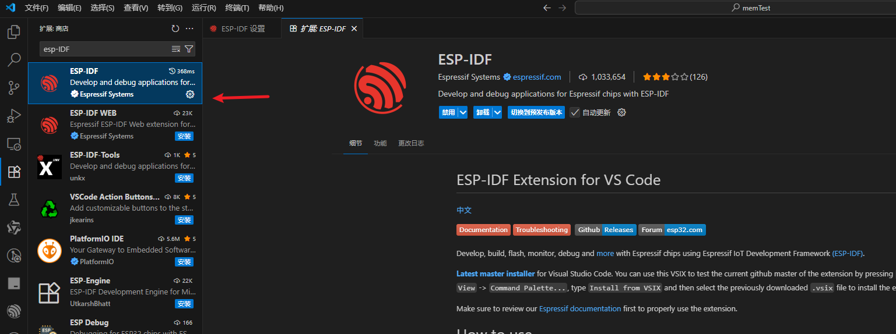

# 简介

参考官方的流程使用vscode开发esp32，先搭建vscode的esp32开发环境。

这里直接参考官网的流程搭建就可以了。先贴上官方的说明（直接复制过来的）。但是在最后一步创建python虚拟环境时报错了，后面会介绍如何解决。（也是为什么要写一下这篇文章的原因）

我的操作都是在windows下操作的。

# vscode安装ESP-IDF插件

直接在vscode插件中搜索ESP-IDF 安装即可

我这里已经安装过了

安装 ESP-IDF 扩展。

- 前往菜单栏 `查看` > `命令面板`。或者使用快捷键 ctrl+shift+p 打开命令面板。
- 输入 `ESP-IDF: 配置 ESP-IDF 扩展`，选中该命令以启动设置向导。用户界面将显示加载通知，随后出现设置向导。

备注

ESP-IDF 5.0 以下的版本不支持在配置路径中添加空格。

点击 `Express` 并选择下载服务器：

- `Espressif`：推荐中国用户使用乐鑫下载服务器，下载速度更快。
- `Github`：使用 GitHub 上的下载链接。

选择要下载的 ESP-IDF 版本，或使用 `Find ESP-IDF in your system` 选项搜索现有的 ESP-IDF 目录。

选择保存 ESP-IDF 工具的位置 (`IDF_TOOLS_PATH`)，默认情况下在 Windows 系统中为 `%USERPROFILE%\.espressif`，在macOS/Linux 系统中为 `$HOME\.espressif`。

备注

确保 `IDF_TOOLS_PATH` 中没有空格，避免出现构建问题。此外，要注意 `IDF_TOOLS_PATH` 与 `IDF_PATH` 不能在相同目录下。

备注

macOS/Linux 用户需要选择用于创建 ESP-IDF Python 虚拟环境的 Python 可执行文件。

点击 `Install` 开始下载和安装 ESP-IDF 和 ESP-IDF 工具。

用户界面中将显示设置的进度：

- ESP-IDF 下载进度
- ESP-IDF 工具下载和安装进度
- Python 虚拟环境创建进度及 ESP-IDF Python 依赖包安装进度

若一切安装正确，页面将显示所有设置已完成配置的消息。

备注

扩展会提示 Linux 用户使用 sudo 权限，在 `/etc/udev/rules.d` 中添加 OpenOCD 规则。

# python虚拟环境报错解决

我这里并没有一次安装成功，在最后的python虚拟环境中报错了，查看应该是pip源的问题导致下载对应的库失败，这里需要将pip的源修改为国内的源。

* 打开上面配置的ESP-IDF Tools的安装目录（我这里配置的是D:\esp-tools），因此进入目录 D:\esp-tools\python_env\idf5.4_py3.11_env\Scripts   可以看到python.exe文件。

* 使用终端进入上面python.exe所在的目录输入指令

  `python.exe -m pip config set global.index-url https://pypi.tuna.tsinghua.edu.cn/simple`

* 完成后关闭vscode 重新打开。继续安装即可。

# 附录：

* 官方文档 https://docs.espressif.com/projects/vscode-esp-idf-extension/zh_CN/latest/installation.html
* 官方代码：https://github.com/espressif/esp-idf/tree/master/examples

这是一篇优秀的博客，必须推荐。

