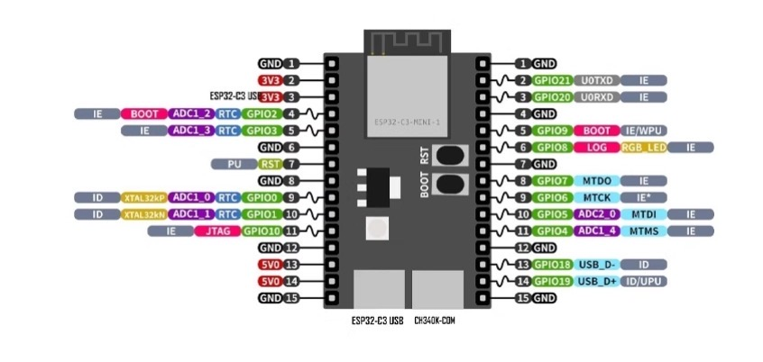
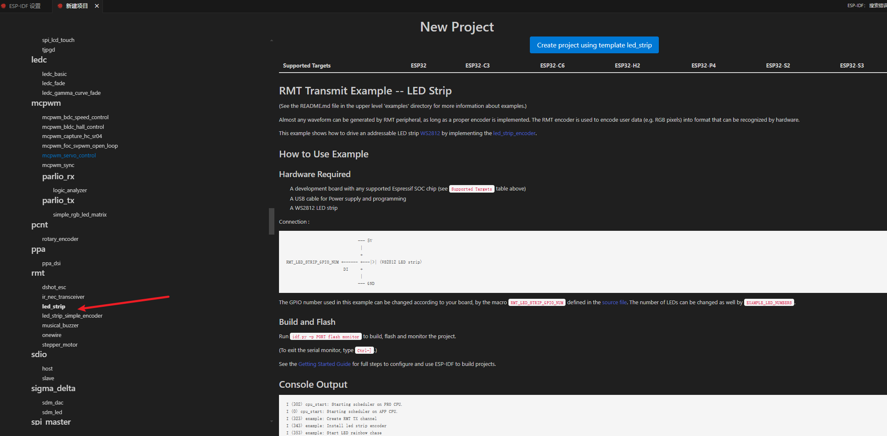
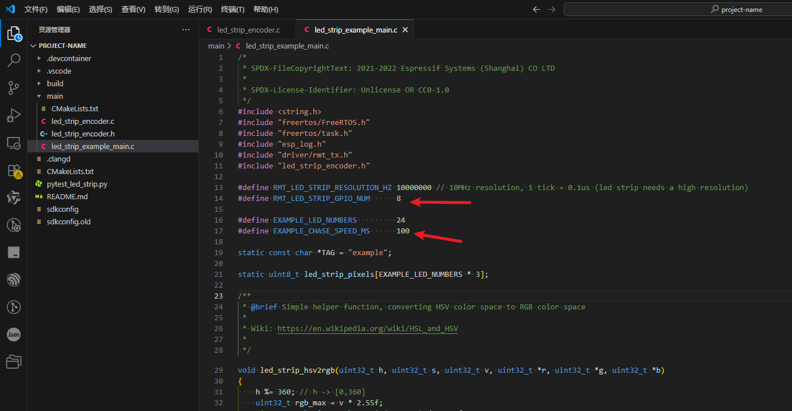
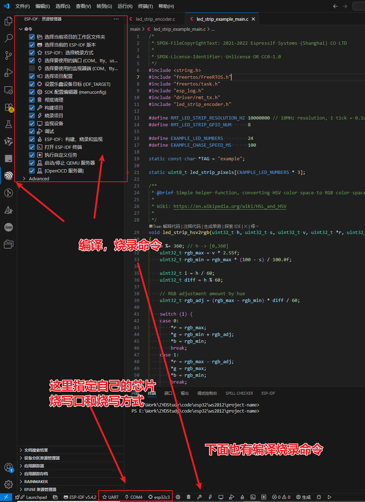
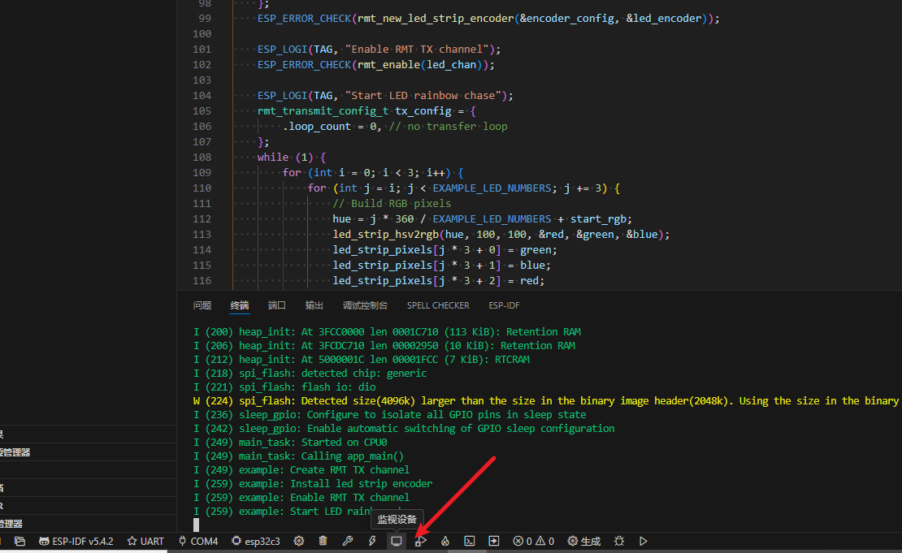

# 简介

买的开发板没有带什么板载的资源，只有一个RGB灯，使用的是WS2812控制的，因此就先拿他上手吧。

我的开发板接口如下

从上图可以看到GPIO8链接的RGB灯。

# 创建工程

具体WS2812的控制逻辑后面研究一下再补充，这里使用vscode的模板来创建对应的控制程序。官方已经给出了示例。我们只需要根据自己的硬件稍微修改一下就可以了。

选择rmt中的led_strip来创建工程

创建后打开工程目录，根据我们自己的硬件修改代码

`#define RMT_LED_STRIP_GPIO_NUM    8` 因为我的硬件连接的是GPIO8

`#define EXAMPLE_CHASE_SPEED_MS    100` 修改延时，否则闪烁太快了。。。亮瞎双眼。

# 编译与下载

修改代码后就可以编译下载了，

首先看看左下角的设置的器件和串口是不是和自己一致（不一致的点击对应的可以选择）。

选完后如下图。可以再插件的命令中点击`构建项目`和`烧录项目`。

同时下面图标也有对应的图标点击也可以。

# 监视设备

我理解就是串口打印输出调试信息。后面再深入研究吧。

# 附录

* 官方文档 https://github.com/espressif/esp-idf/blob/master/examples/peripherals/rmt/led_strip/README.md
* 官方代码：https://github.com/espressif/esp-idf/tree/master/examples

这是一篇优秀的博客，必须推荐。