# 简介

经过前两个博客的介绍现在我的开发板算是可以烧写和运行了，但是我们编写代码不可能是一次就成功的，因此就需要在线的debug，但是之前调试例如stm32都是使用kill和JATG来调试的，如何使用vscode来调试esp32呢？这里使用一个串口的例子来学习一下。

# 创建串口工程

我们这里使用模板中的 `UART Echo Example`来测试

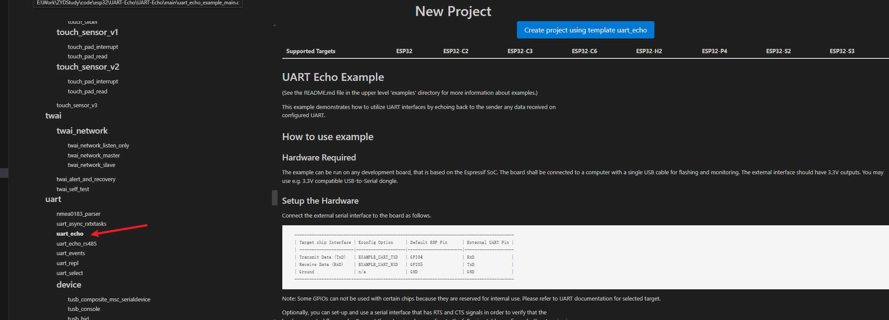

# esp32 uart0 设置为正常的uart

这个部分看着有点莫名其妙，为什么要设置为正常的uart呢？往下看

可以看到程序默认端口为

* uart1
* RXD ：GPIO5
* TXD：GPIO4

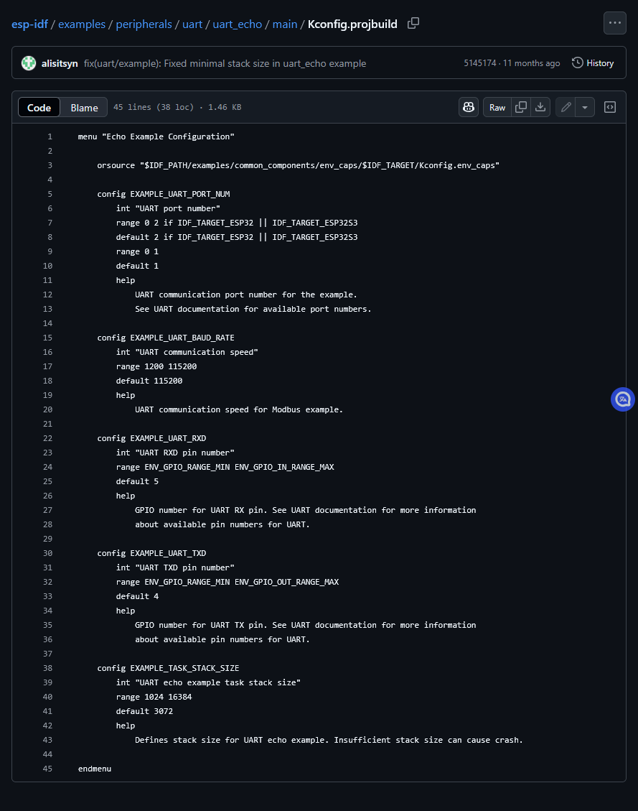

这个配置可以使用 menuconfig来配置。

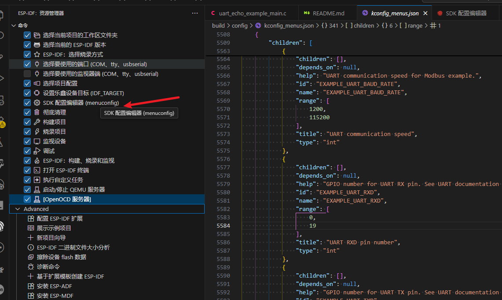

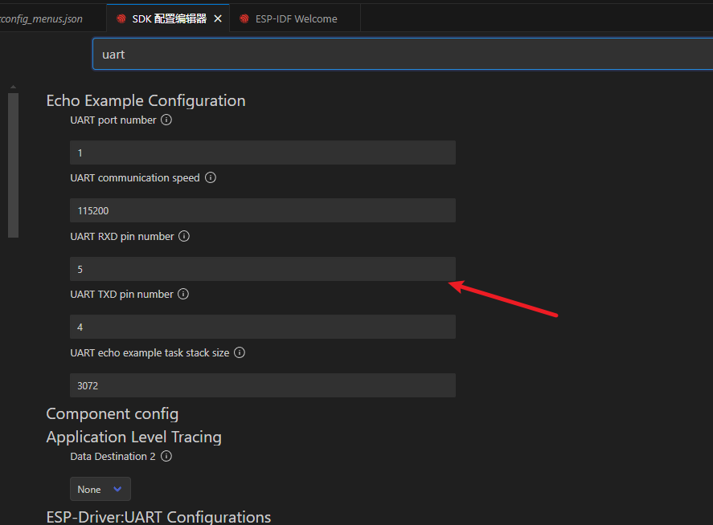

我的开发板只有一个串口使用的是uart0 对应的 GPIO为20  21。我发现修改menuconfig的pin num时不生效。

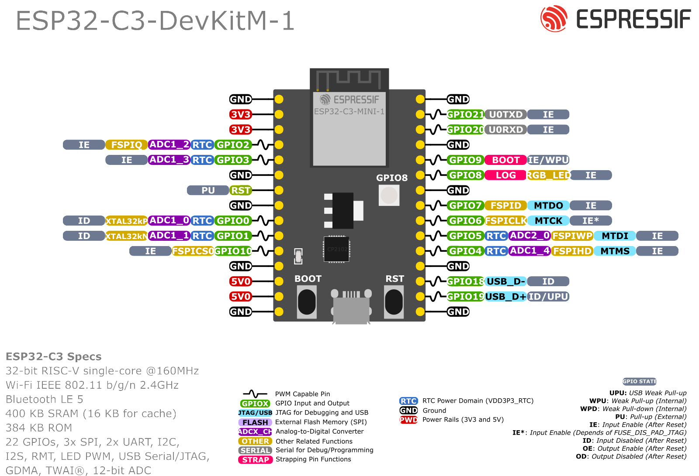

终端报错如下

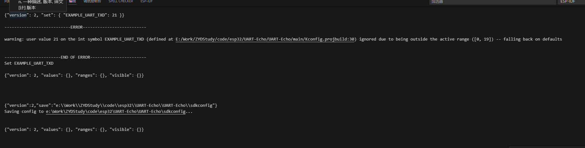

```bash
---------------------------ERROR--------------------------

warning: user value 21 on the int symbol EXAMPLE_UART_TXD (defined at E:/Work/ZYDStudy/code/esp32/UART-Echo/UART-Echo/main/Kconfig.projbuild:30) ignored due to being outside the active range ([0, 19]) -- falling back on defaults
```

也就是提示可设置的GPIO范围超了。

原来 在ESP32中，串口0（UART0）默认被用作与电脑的通信接口来进行固件下载和调试输出。也就是默认状态下我不能正常的使用这个uart0.因为需要下载和调试输出，否则会和调试日志混和输出。

参考[ESP32-C3 Series](https://docs.espressif.com/projects/esp-at/en/latest/esp32c3/Get_Started/Hardware_connection.html#esp32-c3-series)

| Function of Connection | ESP32-C3 Board or Module Pins                       | Other Device Pins                     |
| ---------------------- | --------------------------------------------------- | ------------------------------------- |
| Download/Log output 1  | UART0 GPIO20 (RX) GPIO21 (TX)                       | PC TX RX                              |
| AT command/response 2  | UART1 GPIO6 (RX) GPIO7 (TX) GPIO5 (CTS) GPIO4 (RTS) | USB to serial converter TX RX RTS CTS |

因为我的板子有一个板载的usb/jtag口。，同时这个jtag也可以作为调试输出口。[通过 JTAG 将日志记录到主机](https://docs.espressif.com/projects/esp-idf/zh_CN/v5.4.2/esp32c3/api-reference/system/log.html#jtag)

**因此我考虑将下载和日志输出都使用jtag口，将uart0 释放出来自己使用。**

既然menuconfig有限制，我还不熟悉不敢随便修改，就直接修改代码吧。直接在代码中修改对应的uart0 和 tx rx的GPIO如下。

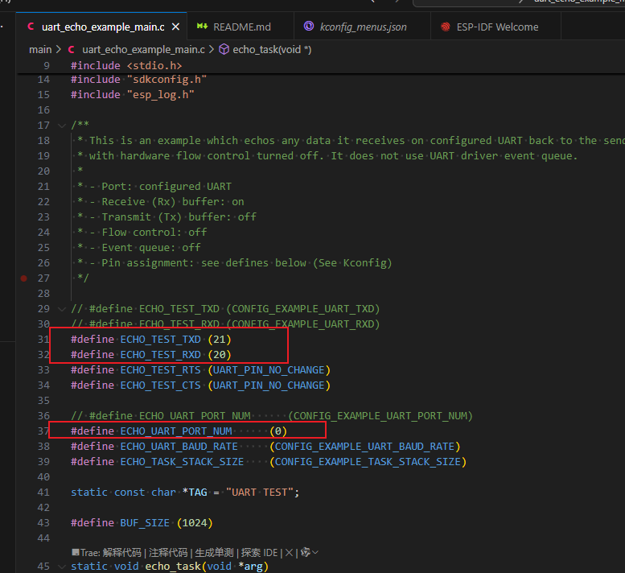

# 设置JTAG为调试输出

menuconfig中搜索 `console` 设置如下。保存，重新编译程序。

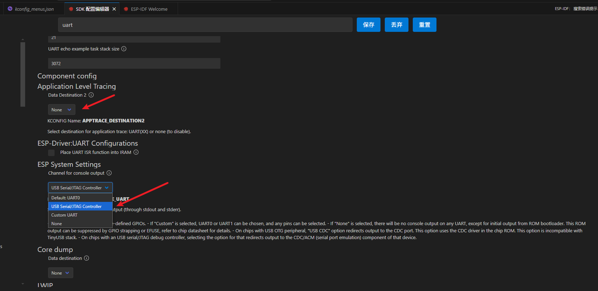

板子的两个usb连接电脑后，一个是uart 一个是  jtag，如下图

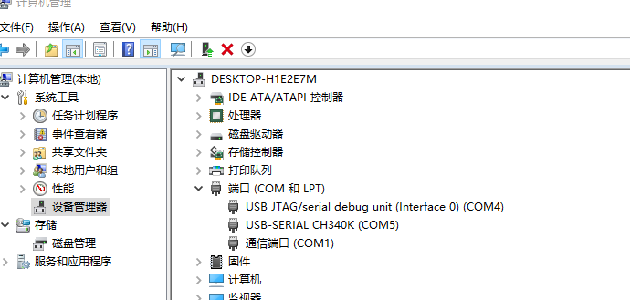

烧录程序后，使用`监视设备`显示如下，注意这里设置的是com4，也就是我的JTAG口。

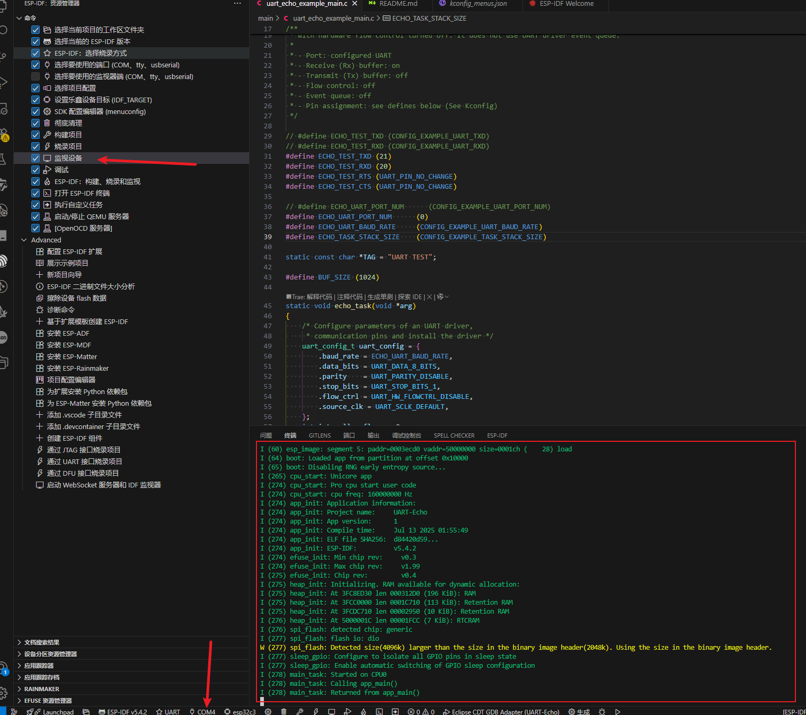

# esp32 debug时JTAG驱动问题

下面就是使用vscode 来 debug 调试 esp32了。没想到还有坑。。。。

ESP32-C3 内置了 JTAG 电路，无需额外的芯片即可进行调试。只需将 USB 线连接到 D+/D- 引脚即可。对于没有外露 USB 串行 JTAG 连接器的开发板，可以使用 USB 转接线。

## 配置硬件[](https://docs.espressif.com/projects/esp-idf/zh_CN/latest/esp32c3/api-guides/jtag-debugging/configure-builtin-jtag.html#id1)

| ESP32-C3 管脚 | USB 信号 |
| ------------- | -------- |
| GPIO18        | D-       |
| GPIO19        | D+       |
| 5V            | V_BUS    |
| GND           | 接地     |

请不要将用于 USB 通信的 ESP32-C3 管脚连接到可能会干扰 JTAG 操作的其他硬件上。


也就是我们使用板子的usb，我这里是typec接口就可以调试了。

## 启动OpenOCD

点击start OpenODC

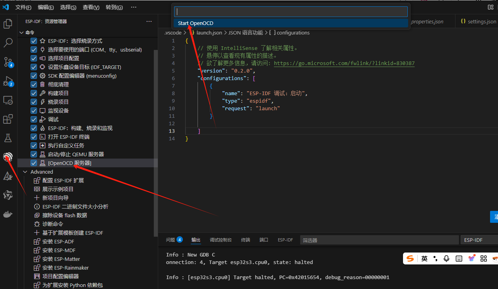

如下图就是启动成功了

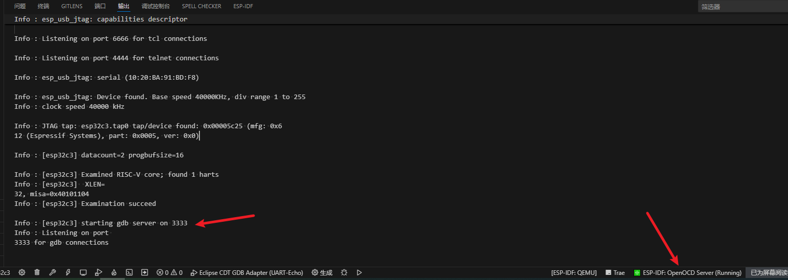

## 驱动问题

我第一次是失败的，报错

```bash
Error: libusb_open() failed with LIBUSB_ERROR_NOT_FOUND 
Error: esp_usb_jtag: could not find or open device! 
```

根本原因还是驱动有问题。

设备管理器-通用串行总线设备-USB JTAG/serial debug unit：
右键-属性-驱动属性
错误属性的数字签名者是微软，如下图所示：

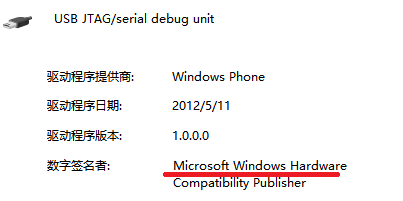

正确的驱动应该是如下，如果驱动供应商不对，则会导致启动OpenOCD失败。

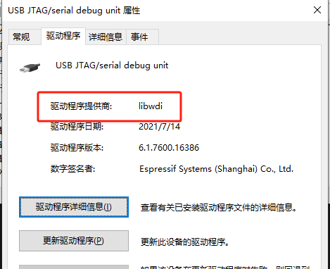

检查驱动供应商是否为libwdi, 如果不是则需要卸载驱动并重新安装。

[官网链接](https://docs.espressif.com/projects/esp-idf/zh_CN/latest/esp32s3/api-guides/jtag-debugging/configure-builtin-jtag.html)
 进入官网按照文档执行以下命令即可。

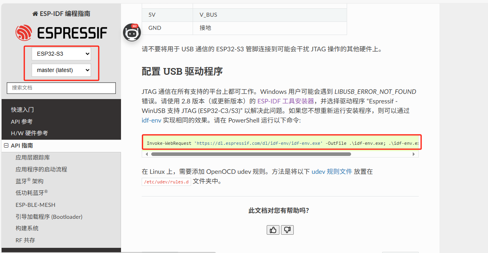

TAG 通信在所有支持的平台上都可工作。Windows 用户可能会遇到 LIBUSB_ERROR_NOT_FOUND 错误。请使用 2.8 版本（或更新版本）的 [ESP-IDF 工具安装器](https://docs.espressif.com/projects/esp-idf/zh_CN/latest/esp32c3/get-started/windows-setup.html#get-started-windows-tools-installer)，并选择驱动程序 “Espressif - WinUSB 支持 JTAG (ESP32-C3/S3)” 以解决此问题。如果您不想重新运行安装程序，则可以通过 [idf-env](https://github.com/espressif/idf-env) 实现相同的效果。请在 PowerShell 运行以下命令:

```bash
Invoke-WebRequest 'https://dl.espressif.com/dl/idf-env/idf-env.exe' -OutFile .\idf-env.exe; .\idf-env.exe driver install --espressif
```

再次检查检查驱动供应商是否为libwdi。如果是就是ok了。但是我的不知道为什么使用上面的命令驱动还是不对。。。。

**如果驱动还是不对，那么也可以使用下面的方法，我就是使用的这个方法成功的。**

**右键-卸载设备-更新驱动程序，选择了我的ESP-IDF框架的安装位置：**
**C:\Users\zyd\.espressif\tools\idf-driver\idf-driver-esp32-usb-jtag-2021-07-15**

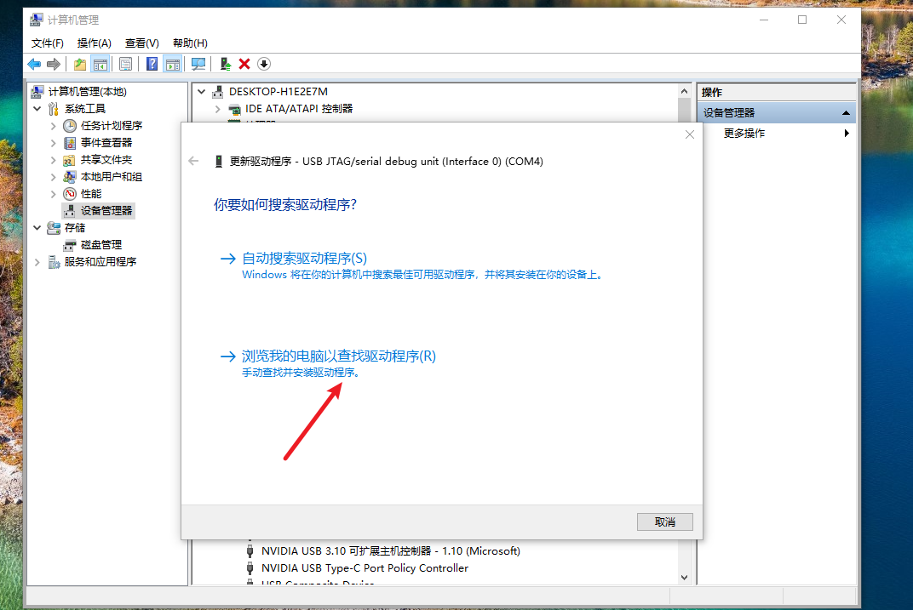

可以直接使用vscode 的 F5或者 命令面板的`调试`了。

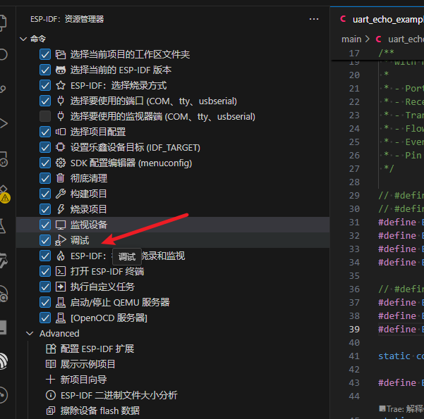


我使用串口调试助手，发送字符，断点可以进去了。终于算是调试完成。。。。不得不说坑是真的多。一个小小的调试功能浪费我一晚上的时间。

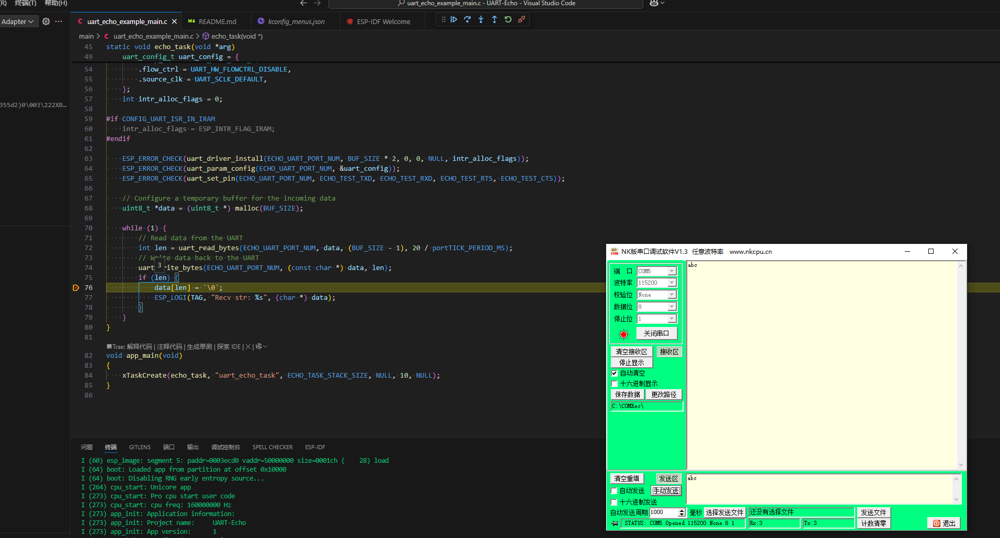

# 附件

* 官方：[配置 ESP32-C3 内置 JTAG 接口](https://docs.espressif.com/projects/esp-idf/zh_CN/latest/esp32c3/api-guides/jtag-debugging/configure-builtin-jtag.html#esp32-c3-jtag)
* 官方：[ESP32-C3 Series](https://docs.espressif.com/projects/esp-at/en/latest/esp32c3/Get_Started/Hardware_connection.html#esp32-c3-series)
* 官方：[通过 JTAG 将日志记录到主机](https://docs.espressif.com/projects/esp-idf/zh_CN/v5.4.2/esp32c3/api-reference/system/log.html#jtag)
* 官方代码：https://github.com/espressif/esp-idf/tree/master/examples


<font color="white">这是一篇优秀的博客，必须推荐。</font>