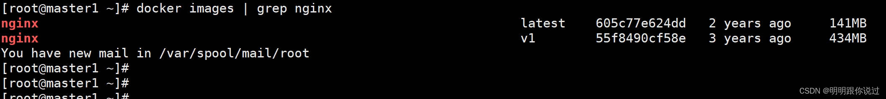
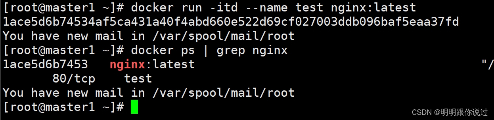
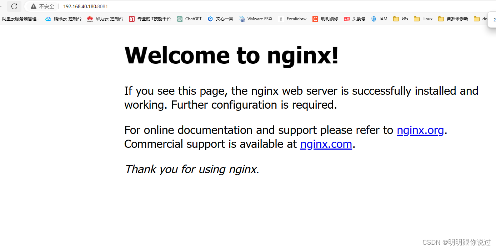
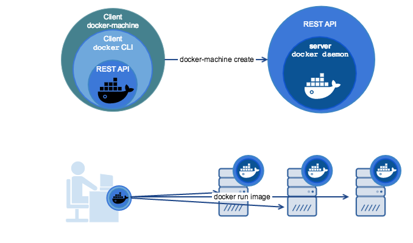
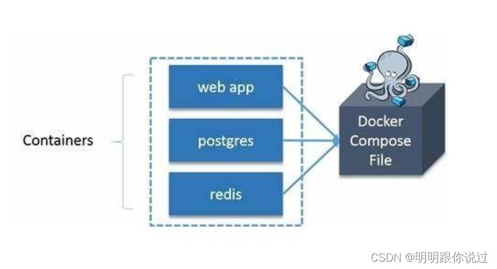

# 1 简介

Docker 容器是一种轻量级的、可移植的、自包含的软件打包方式，用于将应用程序及其所有依赖关系打包到一个统一的环境中，以确保应用程序在不同环境中的一致性运行

以下是 Docker 容器的一些关键特性和优点：

轻量级： Docker 容器与虚拟机相比更轻量级，因为它们共享主机的操作系统内核，避免了虚拟机启动时的额外开销。

可移植性： Docker 容器可以在任何支持 Docker 的环境中运行，无论是开发、测试还是生产环境。

快速部署： Docker 容器可以快速部署，因为它们可以在几秒钟内启动，而不是几分钟或几小时。

隔离性： Docker 容器提供了一定程度的隔离性，使得容器之间的应用程序可以相互独立运行，避免了互相干扰。

版本控制： Docker 容器可以基于镜像构建，这些镜像可以版本控制，方便管理和回滚。

弹性伸缩： Docker 容器可以根据负载需求进行水平扩展或收缩，以适应应用程序的需求。

# 2 Docker容器的启动 

首先，先搜索镜像，这里以`nginx`为例

```bash
[root@master1 ~]# docker search nginx
```

选择适合自己的版本，比如，拉取最新版

```bash
[root@master1 ~]# docker pull nginx:latest

#pull 拉取，:latest 代表最新版本
```

查看镜像是否成功拉取

    [root@master1 ~]# docker images | grep nginx



 使用docker run命令启动容器

```bash
[root@master1 ~]# docker run -itd --name test nginx:latest
#这条命令的含义如下：
# 'docker run'：运行一个容器
# '-itd'：-i 让容器的标准输入保持打开状态，-t 为容器分配一个伪终端，-d 在后台运行容器
#'--name'：为容器指定名称，这里指定的名称是test
#'nginx:latest'：指定要运行的镜像为nginx，并使用最新版本
```

 查看容器是否运行

```bash
[root@master1 ~]# docker ps | grep nginx
```



为容器添加端口映射

将容器端口与宿主机端口，使外部用户可以通过宿主机访问到容器服务

```bash
[root@master1 ~]# docker run --name test-port -itd -p 8081:80 nginx:latest
# '-p 8081:80'：将容器的端口 80 映射到主机的端口8081，如果需要映射多个端口，添加多个'-p port:port'即可
```

 此时通过宿主机IP+8081,就可访问到nginx服务



 为容器添加卷挂载

```bash
[root@master1 ~]# docker run --name test-v -itd -v /test:/test nginx:latest
 # '-v'：将宿主机的/test目录挂载到容器的/test目录上，在宿主机/test创建的文件，在容器中也可以使用
```

# 3 Docker容器的停止

使用docker stop 命令优雅的停止容器

```bash
[root@master1 ~]# docker stop test
# 停止test容器 
```

使用docker kill 命令强制停止容器

```bash
[root@master1 ~]# docker kill test-v
# 强制停止容器test-v
```

停止容器时处理运行中的进程

在 Docker 中停止容器时，Docker 会发送 SIGTERM 信号给容器中的主进程，然后等待一段时间（默认 10 秒），如果容器内的进程没有在规定的时间内停止，Docker 会发送 SIGKILL 信号来强制终止进程。

通常情况下，不需要手动处理容器内运行的进程，Docker 会负责处理。但如果需要在容器停止时执行一些特定的操作，可以使用 Docker 的停止钩子（stop hooks）。

```bash
[root@master1 ~]# docker run --name my-container --stop-signal SIGTERM --stop-timeout 30 -d my-image
# 上面的命令创建了一个名为 my-container 的容器，使用了 my-image 镜像。该命令设置了容器停止信号为 SIGTERM，停止超时时间为 30 秒，并以后台模式（-d 参数）运行容器。
```

# 4 Docker容器的重启

使用docker restart命令重启容器 

```bash
[root@master1 ~]# docker restart test
# 对名为test的容器执行重启操作
```

 自动重启的策略

```bash
[root@master1 ~]# docker run --name test2 -itd --restart always nginx:latest
# '--restart always'：容器退出时总是自动重启。适用于需要容器一直运行的服务。
# 其他重启重启策略，如：
# '--restart no'：默认策略，Docker 容器不会自动重启。
# '--restart unless-stopped'：除非明确停止容器，否则容器会自动重启。即使 Docker 守护进程启动时不启动容器，也会在守护进程重启时自动启动容器。
# '--restart on-failure[:max-retries]'：只在容器非正常退出时（退出代码不等于0）才自动重启。可选的 max-retries 参数指定容器重启的最大次数。如果未指定 max-retries，则默认重试次数为无限次。
```

# 5 其他常用Docker命令



**查看容器状态：`docker ps`**

docker ps 是 Docker 命令行工具中的一个命令，用于列出正在运行的容器。它显示容器的一些基本信息，如容器 ID、名称、镜像、创建时间、状态等。

运行 docker ps 命令时，将显示正在运行的容器的列表。如果没有运行中的容器，该命令不会输出任何内容。

```bash
[root@master1 ~]# docker ps 
CONTAINER ID   IMAGE                                               COMMAND                  CREATED             STATUS             PORTS                                   NAMES
9ba874b8a125   nginx:latest                                        "/docker-entrypoint.…"   6 minutes ago       Up 6 minutes       80/tcp                                  test2
a2cc1b2d2b87   nginx:latest                                        "/docker-entrypoint.…"   38 minutes ago      Up 38 minutes      0.0.0.0:8081->80/tcp, :::8081->80/tcp   test-port
1ace5d6b7453   nginx:latest                                        "/docker-entrypoint.…"   59 minutes ago      Up 9 minutes       80/tcp                                  test

# CONTAINER ID：容器的唯一标识符。
# IMAGE：容器所使用的镜像。
# COMMAND：容器启动时执行的命令。
# CREATED：容器创建的时间。
# STATUS：容器的状态。
# PORTS：容器映射的端口。
# NAMES：容器的名称。
# docker ps 命令有一些常用的选项，例如：

# -a：显示所有容器，包括停止的容器。
# -q：仅显示容器的 ID。
# 要查看所有容器（包括已停止的），可以运行 docker ps -a。
```

**查看容器日志：`docker logs`**

docker logs 是 Docker 命令行工具中的一个命令，用于查看容器的日志输出。通过该命令，可以检查容器内部的标准输出和标准错误输出。

```bash
[root@master1 ~]# docker logs test

# 查看名为test的容器的日志

# 基本语法为：docker logs [OPTIONS] CONTAINER

# 其中 OPTIONS 是可选的参数，用于控制日志的输出格式和其他选项，CONTAINER 是要查看日志的容器的名称或容器 ID

# 常用的 docker logs 命令选项包括：

# -f：跟踪容器的日志输出，类似于 tail -f 命令，持续输出日志内容。
# --tail：仅显示日志的最后几行。
# --since：仅显示指定时间之后的日志。
# --until：仅显示指定时间之前的日志。
```

 **进入容器内部：`docker exec`**

docker exec 是 Docker 命令行工具中的一个命令，用于在运行的容器内部执行命令。

```bash
例如，要以交互式模式（即保持标准输入打开）和为执行的命令分配一个伪终端，进入容器 test 的 Bash shell，可以运行以下命令：

[root@master1 ~]# docker exec -it test bash

# 这将进入容器 test 内部的 Bash shell，并允许用户与容器交互执行命令。

# 常用的 docker exec 命令选项包括：

# -i：保持标准输入打开，即使没有附加到容器中。
# -t：为执行的命令分配一个伪终端。
# --user：指定要执行命令的用户名或 UID。
# --workdir：指定要执行命令的工作目录。
# --env：设置环境变量。
```

**删除容器：`docker rm`**

docker rm 命令用于删除一个或多个容器

```bash
[root@master1 ~]# docker rm -f -v test

# 这里删除了一个名为 test的容器， -f 强制删除，-v 同时删除与容器关联的卷
```

**查看容器详细信息：`docker inspect`**

docker inspect 命令用于获取 Docker 容器、镜像或网络等对象的详细信息

```bash
[root@master1 ~]# docker inspect test2

# docker inspect 命令会以 JSON 格式输出容器的详细信息，包括容器的配置、网络设置、挂载的卷、容器状态等。通过这些信息，可以了解容器的各种属性和配置信息。
```

# 6 高级话题

容器的数据备份与恢复

备份容器数据
1、容器内部备份：

* 进入容器内部，并使用常规的备份工具（如 tar）将数据备份到容器内的卷或文件系统中。
* 将备份文件复制到主机上或者其他地方。    

 2、数据卷

* 如果容器使用了数据卷（Volume），那么容器中的数据已经被持久化了。
* 使用 docker cp 命令将数据从容器复制到主机上。

恢复容器数据
1、数据卷：

* 如果容器使用了数据卷，你只需要重新启动相应的容器，数据会自动恢复。    

2、容器内部恢复：

* 如果你备份了容器内部的数据，可以使用 docker cp 命令将备份文件复制到容器内部。
* 然后，在容器内部使用恢复工具（如 tar）将备份文件解压缩或恢复到相应的位置。  

3、镜像重新构建： 

* 如果数据可以通过重新构建镜像和重新部署容器来恢复，你可以通过重新构建包含数据的镜像并重新部署容器来实现。

# 7 容器编排工具：Docker Compose与Kubernetes

Docker Compose 和 Kubernetes 都是容器编排工具，它们都可以用于部署、管理和扩展容器化应用程序，但在不同的场景下有不同的特点和优势。

Docker Compose

简单易用：Docker Compose 是一个基于 YAML 文件的工具，允许你定义和运行多个 Docker 容器的应用程序。它适用于简单的开发和测试环境。
单机环境：Docker Compose 通常用于在单个主机上定义和管理多个容器，可以协调它们的启动顺序和通信。
快速启动：通过简单的命令就可以启动、停止和重启整个应用程序。
适合小型项目：适用于小型项目和开发环境，对于简单的容器化应用场景非常方便。



 Kubernetes

分布式系统：Kubernetes 是一个开源的容器编排平台，用于自动部署、扩展和管理容器化应用程序。它设计用于大规模的生产环境和复杂的应用场景。
自动化和自愈：Kubernetes 提供了高度的自动化和自愈能力，可以自动调度容器、自动扩展应用程序、自动恢复故障等。
容器编排：Kubernetes 可以在集群中调度和管理大量的容器，并提供了许多功能，如服务发现、负载均衡、存储管理等。
云原生应用：Kubernetes 是构建云原生应用的首选平台，提供了丰富的功能和可扩展性，适用于复杂的微服务架构和分布式系统。

 选择建议：

* 如果你正在开发一个小型项目或者只是想在单个主机上运行一些容器，那么 Docker Compose 是一个简单而方便的选择
* 如果你需要在生产环境中部署复杂的应用程序，管理大规模的容器集群，并希望自动化管理和高可用性，那么 Kubernetes 是更好的选择。

# 附录

[Docker容器命令大全：启动、停止、重启，你需要的都在这里](https://blog.csdn.net/weixin_53269650/article/details/136321868)