在学习数据结构和算法的时候，经常会碰到 O(1),O(n)等等用来表示时间和空间复杂度，那这到底是什么意思。我们对于同一个问题经常有不同的解决方式，比如排序算法就有十种经典排序（快排，归并排序等），虽然对于排序的结果相同，但是在排序过程中消耗时间和资源却是不同。

对于不同排序算法之间的衡量方式就是通过程序执行所占用的**时间**和**空间**两个维度去考量。

# 1 数学基础

## 1.1 幂函数

$y=x^k$

## 1.2 指数函数

函数$y=a^x(a>0且a\ne 1)$叫做指数函数，自变量叫做指数，a叫做底数。

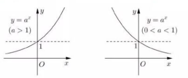

## 1.3 对数函数

如果$a(a>0,a\ne1)$的b次幂等于N，即$a^b=N$，那么b叫做以a为底的N的对数，记做$\log_aN=b$，其中a叫做对数的底数，N叫做真数。

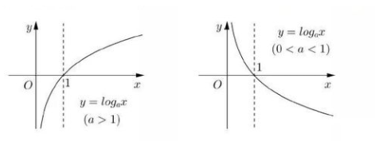

# 2 时间复杂度

若存在函数 $f(n)$，使得当 n 趋近于无穷大时，$T(n)/ f(n)）$的极限值为不等于零的常数，则称$ f(n)$是 $T(n)$的同数量级函数。记作 $T(n)= O(f(n))$，称 $O(f(n))$为算法的渐进时间复杂度，简称时间复杂度。

**简单理解就是一个算法或是一个程序在运行时，所消耗的时间（或者代码被执行的总次数）。**

```C
int sum(int n) {
①   int value = 0;
②   int i = 1;
③   while (i <= n) {
④       value = value + i;
⑤       i++;
    }
⑥   return value;
}

假设n=100，该方法的执行次数为①(1次)、②（1次）、③（100次）、④（100次）、⑤（100次）、⑥（1次）
合计1+1+100+100+100+1 = 303次

```

上面的结果如果用函数来表示为：$f(n) = 3n+3$，那么在计算机算法中的表示方法如下。

## 2.1 表示方法

大 O 表示法：算法的时间复杂度通常用大 O 来表示，定义为 $T(n) = O(f(n))$，其中 T 表示时间。

即：$T(n) = O(3n+3)$

这里有个重要的点就是时间复杂度关心的是**数量级**，其原则是：

1. 省略常数，如果运行时间是常数量级，用常数 1 表示
2. 保留最高阶的项
3. 变最高阶项的系数为 1

如$2n^3+3n^2+7$ ，省略常数变为 $O(2n^3+3n^2)$，保留最高阶的项为 $O(2n^3)$，变最高阶项的系数为 1 后变为 $O(n^3)$，即为 $O(n^3)$ 的$2n^3+3n^2+7$时间复杂度。

同理，在上面的程序中$ T(n) = O(3n+3)$，其时间复杂度为 $O(n)$。

注：只看最高复杂度的运算，也就是上面程序中的内层循环。

## 2.2 常见时间复杂度的阶

时间复杂度的阶主要分为以下几种

### 2.2.1 常数阶 $O(1)$

```C
int n = 100;
System.out.println("常数阶：" + n);
```

不管 n 等于多少，程序始终只会执行一次，即 $T(n) = O(1)$

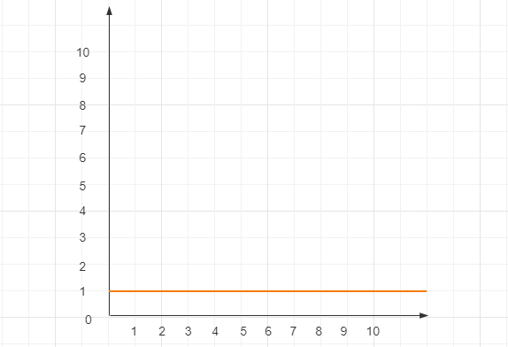

### 2.2.2 对数阶$O(logn)$

```C
public void logarithm(int n) {
    int count = 1; // 执行一次
    while (count <= n) { // 执行logn次
        count = count*2; // 执行logn次
    }
}
```

该段代码什么时候会停止执行呢？是当count大于n时。也就是说多少个2相乘后其结果值会大于n，即$2^x=n$。由$2^x=n$可以得到$x=logn$，所以这段代码时间复杂度是$O(logn)$。

则对数底数大于 1 的象限通用表示为：

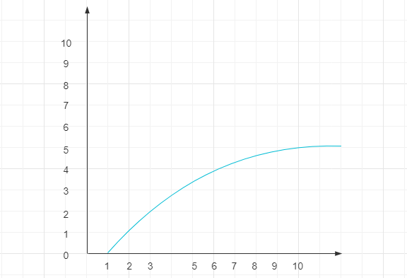

### 2.2.3 线性阶 $O(n)$

线性阶表示代码要执行n次，如下for循环中的代码，第二行和第三行代码都执行n次，即f(n)=2n。根据前面的分析，与最高次项相乘的常数2是可以忽略的，因此这段代码的时间复杂度是O(n)。

```C
public void circle(int n) {
    for(int i = 0; i < n; i++) { // 执行n次
        System.out.println(i); // 执行n次
    }
}
```

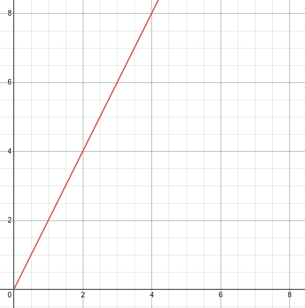

### 2.3.4 线性对数阶$ O(nlogn)$

线性对数阶$O(nlogn)$就是将一段时间复杂度为$O(logn)$的代码执行n次，如下代码所示。

```C
public void logarithm(int n) {
    int count = 1;
    for(int i = 0; i < n; i++) { // 执行n次
        while (count <= n) { // 执行logn次
            count = count*2; // 执行nlogn次
        }
    }
}
```

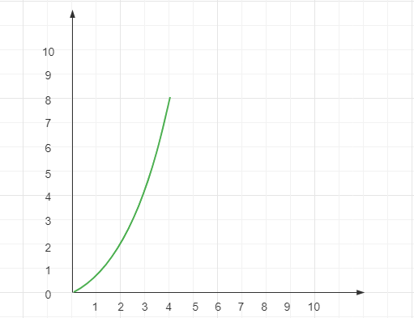

### 2.3.5 平方阶$ O(n^2)$

如下代码是个双重for循环，其内循环的时间复杂度是线性阶$O(n)$。对于外循环来说，是将内循环这个时间复杂度为$O(n)$代码在执行n次，所以整个这段代码的时间复杂度为$O(n^2)$。

```C
public void square(int n) {
    for(int i = 0; i < n; i++){ // 执行n次
        for(int j = 0; j <n; j++) { // 执行n次
            System.out.println(i+j); // 执行n方次
        }
    }
}
```

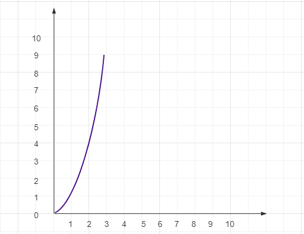

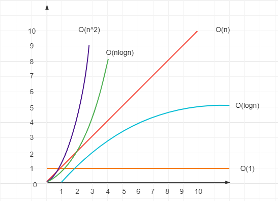

## 2.3 常见时间复杂度计算举例

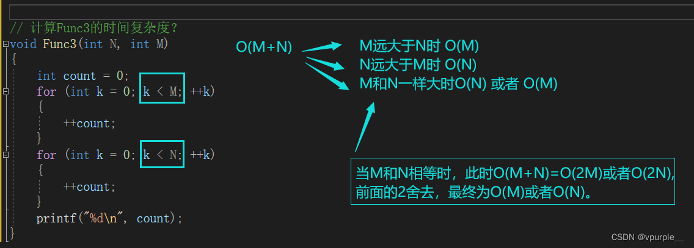

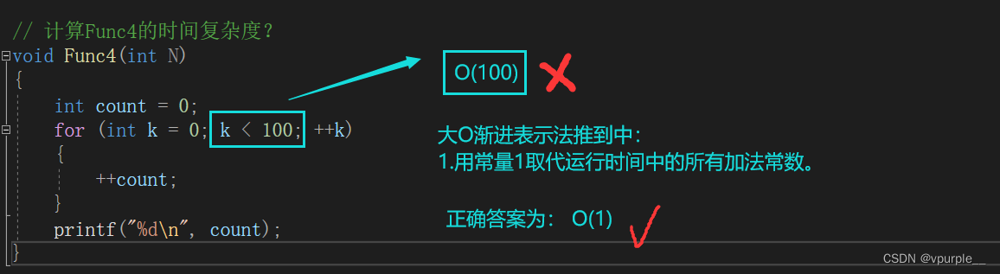

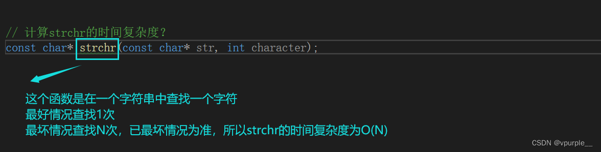

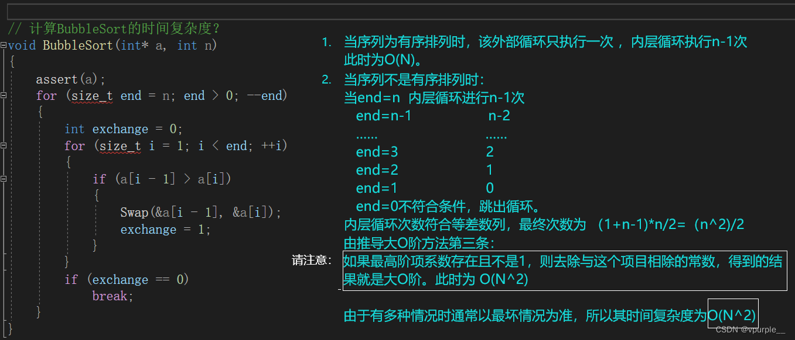

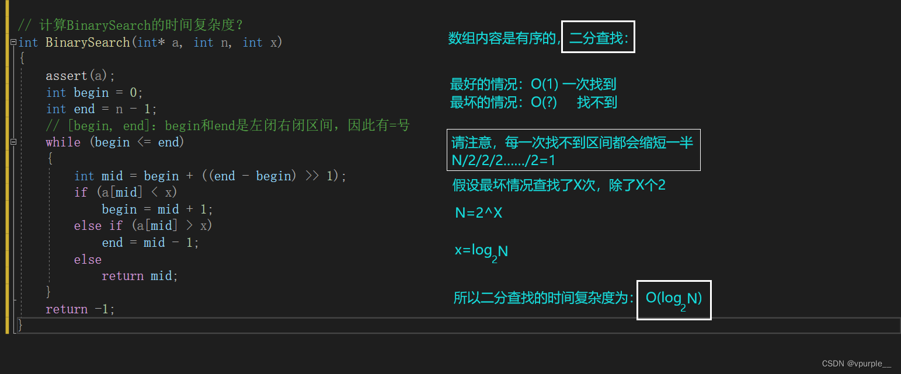

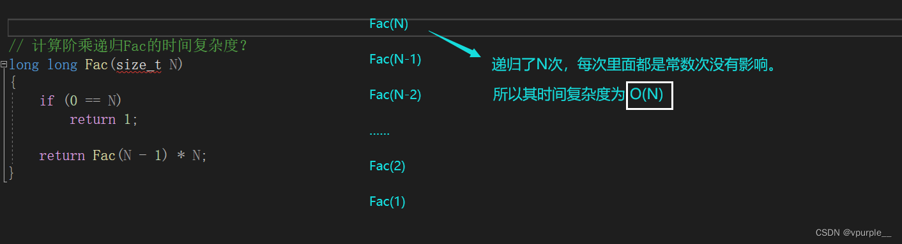

# 附录：

* [懂了！时间复杂度 O(1)，O(logn) ，O(n)，O(nlogn)...](https://xie.infoq.cn/article/4f20bb83e3693afc9746d35de)
* [算法复杂度分析，这次真懂了](https://zhuanlan.zhihu.com/p/361636579)