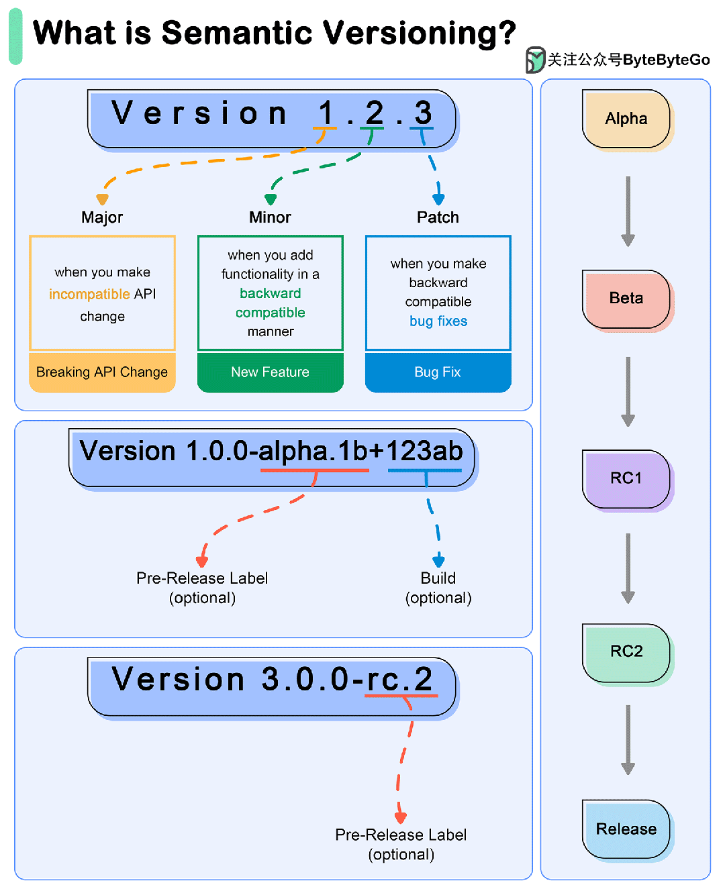

# 1 简介

软件版本号是用于标识和区分软件不同版本的字符串。它帮助开发者和用户了解特定版本的软件特性、更新和修复情况。软件版本号通常遵循一定的规则和约定，以确保版本号具有一致性和可读性。

# 2 常见的软件版本号方式

## 2.1 语义化版本号

语义版本管理（SemVer）是一种软件版本管理方案，旨在传达版本中基本变更的含义。

SemVer 使用由三部分组成的版本号： **major.minor.patch**.

- 主版本：当出现不兼容的 API 变动时，版本号会递增。
- 小版本：在以向后兼容的方式添加功能时递增。
- PATCH 版本：在进行向后兼容的错误修复时递增。

### **2.1.1 初始开发阶段**

从版本 0.1.0 开始。

发布一些增量更改和错误修复：0.1.1, 0.2.0, 0.2.1, 0.3.0.

### **2.1.2 第一个稳定版本**

发布稳定版本：1.0.0.

### **2.1.3 3后续变更**

- 补丁发布

需要对 1.0.0 进行错误修复，更新至 **1.0.1**。

更多错误修复：**1.0.2, 1.0.3**.

- 次要版本

1.0.3 中添加了一个向后兼容的新功能，更新至 **1.1.0**。

新增另一项功能：**1.2.0**。

新小版本中的错误修复：**1.2.1, 1.2.2**.

- 重大版本

1.2.2 中引入了不向后兼容的重大变更，更新至 **2.0.0**。

以后的小版本和补丁更新遵循相同模式。

### **2.1.4 特殊版本和预发布版本**

- 预发布版本

用连字符和一系列以点分隔的标识符表示。

例如 alpha 版、beta 版和候选发布版：**1.0.0-alpha、1.0.0-beta、1.0.0-rc.1**。

- 构建元数据

用加号和一系列以点分隔的标识符表示。

示例：**1.0.0+20130313144700**。

语义版本管理提供了一种清晰、结构化的软件版本管理方法，让开发人员更容易了解变更的影响并管理依赖关系。

通过遵循 SemVer 规则，开发人员可以确保其软件以可预测的方式稳定发展。

语义化版本号的一个典型示例如下：

- `1.0.0`：初始版本。
- `1.1.0`：增加了新功能，向下兼容。
- `1.1.1`：修复了错误，向下兼容。
- `2.0.0`：进行了不兼容的修改。

## 2.2 日期版本号 (Date-Based Versioning)

形式：`YYYY.MM.DD` 或者 `YYYYMMDD`

示例：`2023.07.21` 或 `20230721`

解释：版本号直接使用软件发布的日期。这种方式简单直观，但不一定能准确反映软件的更新内容和性质。

## 2.3 **增量版本号 (Incremental Versioning)**

- 形式：简单的整数递增
- 示例：`42`
- 解释：每次发布新版本时，版本号简单递增。这种方式简单易行，但不能明确表示版本之间的关系。

## **2.4 字母版本号 (Alphabetic Versioning)**

- 形式：使用字母或字母和数字的组合
- 示例：`1.0a`, `1.0b`, `1.0rc1`
- 解释：通常用于表示开发阶段，如`a` (alpha)，`b` (beta)，`rc` (release candidate)，用于表示软件的开发和测试阶段。

# 附录：

* [软件版本号为什么那么奇怪？](https://mp.weixin.qq.com/s/6FSRFnvqFPtmvsIxowXPCQ)        