# git常用命令速查表

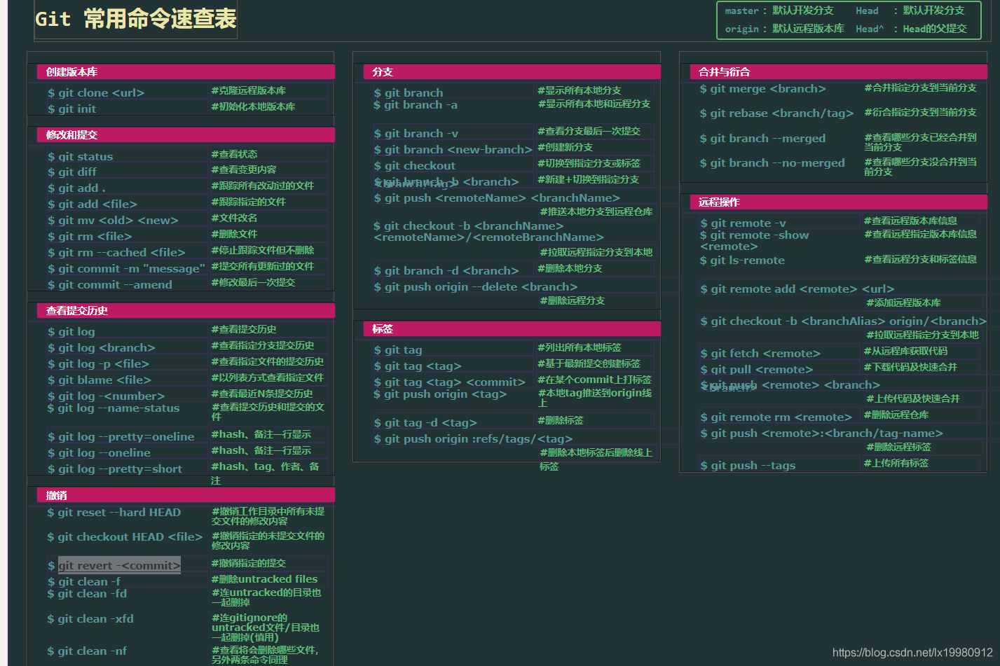

# Git配置

Git 自带一个 git config 的工具来帮助设置控制 Git 外观和行为的配置变量。  这些变量存储在三个不同的位
置：

1. /etc/gitconfig 文件: 包含系统上每一个用户及他们仓库的通用配置。 如果在执行 git config 时带上--system 选项，那么它就会读写该文件中的配置变量。 （由于它是系统配置文件，因此你需要管理员或超级用户权限来修改它。）
2. ~/.gitconfig 或 ~/.config/git基础/config 文件：只针对当前用户。 你可以传递 --global 选项让 Git读写此文件，这会对你系统上 所有 的仓库生效。
3. 当前使用仓库的 Git 目录中的 config 文件（即 .git基础/config）：针对该仓库。 你可以传递 --local 选项让 Git 强制读写此文件，虽然默认情况下用的就是它。。 （当然，你需要进入某个 Git 仓库中才能让该选项生效。）每一个级别会覆盖上一级别的配置，所以.git基础/config 的配置变量会覆盖 /etc/gitconfig 中的配置变量。

## 用户信息

安装完 Git 之后，要做的第一件事就是设置你的用户名和邮件地址。 这一点很重要，因为每一个 Git 提交都会使用这些信息，它们会写入到你的每一次提交中，不可更改：

```shell
$ git config --global user.name "John Doe"
$ git config --global user.email johndoe@example.com
```

## 检查配置信息

```shell
$ git config --list
user.name=John Doe
user.email=johndoe@example.com
color.status=auto
color.branch=auto
color.interactive=auto
color.diff=auto
...
```

# 基础

## 初始化仓库

通常有两种获取 Git 项目仓库的方式：

1. 将尚未进行版本控制的本地目录转换为 Git 仓库；
2. 从其它服务器 克隆 一个已存在的 Git 仓库。

### 在已存在目录中初始化仓库

如果你有一个尚未进行版本控制的项目目录，想要用 Git 来控制它，那么首先需要进入该项目目录中

```shell
$ cd /home/user/my_project
$ git init
```

该命令将创建一个名为 .git 的子目录，这个子目录含有你初始化的 Git 仓库中所有的必须文件，这些文件是Git 仓库的骨干。 但是，在这个时候，我们仅仅是做了一个初始化的操作，你的项目里的文件还没有被跟踪。

可以通过 git add 命令来指定所需的文件来进行追踪，然后执行 git commit ：

```shell
$ git add *.c
$ git add LICENSE
$ git commit -m 'initial project version'
```

### 克隆现有的仓库

如果你想获得一份已经存在了的 Git 仓库的拷贝，比如说，你想为某个开源项目贡献自己的一份力，这时就要用到 git clone 命令

```shell
$ git clone https://github.com/libgit2/libgit2
```

这会在当前目录下创建一个名为 “libgit2” 的目录，并在这个目录下初始化一个 .git 文件夹， 从远程仓库拉取下所有数据放入 .git 文件夹，然后从中读取最新版本的文件的拷贝。 

如果你想在克隆远程仓库的时候，自定义本地仓库的名字，你可以通过额外的参数指定新的目录名：

```shell
$ git clone https://github.com/libgit2/libgit2 mylibgit
```

这会执行与上一条命令相同的操作，但目标目录名变为了 mylibgit。

Git 支持多种数据传输协议。 上面的例子使用的是 https:// 协议，不过你也可以使用 git:// 协议或者使用SSH 传输协议

## 记录每次更新到仓库

请记住，你工作目录下的每一个文件都不外乎这两种状态：已跟踪 或 未跟踪。 已跟踪的文件是指那些被纳入了版本控制的文件，在上一次快照中有它们的记录，在工作一段时间后， 它们的状态可能是未修改，已修改或已放入暂存区。简而言之，已跟踪的文件就是 Git 已经知道的文件。
工作目录中除已跟踪文件外的其它所有文件都属于未跟踪文件，它们既不存在于上次快照的记录中，也没有被放入暂存区。 初次克隆某个仓库的时候，工作目录中的所有文件都属于已跟踪文件，并处于未修改状态，因为 Git刚刚检出了它们， 而你尚未编辑过它们。

### 检查当前文件状态

可以用 git status 命令查看哪些文件处于什么状态。  如果在克隆仓库后立即使用此命令，会看到类似这样的输出：

```shell
$ git status
On branch master
Your branch is up-to-date with 'origin/master'.
nothing to commit, working directory clean
```

这说明你现在的工作目录相当干净。换句话说，所有已跟踪文件在上次提交后都未被更改过。 此外，上面的信息还表明，当前目录下没有出现任何处于未跟踪状态的新文件，否则 Git 会在这里列出来。 最后，该命令还显示了当前所在分支，并告诉你这个分支同远程服务器上对应的分支没有偏离。 现在，分支名是“master”,这是默认的分支名。

现在，让我们在项目下创建一个新的 README 文件。 如果之前并不存在这个文件，使用 git status 命令，你将看到一个新的未跟踪文件：

```shell
$ echo 'My Project' > README
$ git status
On branch master
Your branch is up-to-date with 'origin/master'.
Untracked files:
  (use "git add <file>..." to include in what will be committed)
    README
nothing added to commit but untracked files present (use "git add" to
track)
```

在状态报告中可以看到新建的 README 文件出现在 Untracked files 下面。 未跟踪的文件意味着 Git 在之前的快照（提交）中没有这些文件；Git 不会自动将之纳入跟踪范围，除非你明明白白地告诉它“我需要跟踪该文件”

### 跟踪新文件

使用命令 git add 开始跟踪一个文件。  所以，要跟踪 README 文件，运行：

```shell
$ git add README
```

此时再运行 git status 命令，会看到 README 文件已被跟踪，并处于暂存状态：

```shell
$ git status
On branch master
Your branch is up-to-date with 'origin/master'.
Changes to be committed:
  (use "git restore --staged <file>..." to unstage)
    new file:   README
```

只要在 Changes to be committed 这行下面的，就说明是已暂存状态。 

### 暂存已修改的文件

现在我们来修改一个已被跟踪的文件。 如果你修改了一个名为 CONTRIBUTING.md 的已被跟踪的文件，然后运行 git status 命令，会看到下面内容：

```shell
$ git status
On branch master
Your branch is up-to-date with 'origin/master'.
Changes to be committed:
  (use "git reset HEAD <file>..." to unstage)
    new file:   README
Changes not staged for commit:
  (use "git add <file>..." to update what will be committed)
  (use "git checkout -- <file>..." to discard changes in working
directory)
    modified:   CONTRIBUTING.md
```

文件 CONTRIBUTING.md 出现在 Changes not staged for commit 这行下面，说明已跟踪文件的内容发生了变化，但还没有放到暂存区。

我们运行 git add 将“CONTRIBUTING.md”放到暂存区，然后再看看 git status 的输出：

```shell
$ git add CONTRIBUTING.md
$ git status
On branch master
Your branch is up-to-date with 'origin/master'.
Changes to be committed:
  (use "git reset HEAD <file>..." to unstage)
    new file:   README
    modified:   CONTRIBUTING.md
```

现在两个文件都已暂存，下次提交时就会一并记录到仓库。 假设此时，你想要在 CONTRIBUTING.md 里再加条注释。 重新编辑存盘后，准备好提交。 不过且慢，再运行 git status 看看：

```shell
$ vim CONTRIBUTING.md
$ git status
On branch master
Your branch is up-to-date with 'origin/master'.
Changes to be committed:
  (use "git reset HEAD <file>..." to unstage)
    new file:   README
    modified:   CONTRIBUTING.md
Changes not staged for commit:
  (use "git add <file>..." to update what will be committed)
  (use "git checkout -- <file>..." to discard changes in working
directory)
    modified:   CONTRIBUTING.md
```

怎么回事？ 现在 CONTRIBUTING.md 文件同时出现在暂存区和非暂存区。  所以，运行了 gitadd 之后又作了修订的文件，需要重新运行 git add 把最新版本重新暂存起来：

```shell
$ git add CONTRIBUTING.md
$ git status
On branch master
Your branch is up-to-date with 'origin/master'.
Changes to be committed:
  (use "git reset HEAD <file>..." to unstage)
    new file:   README
    modified:   CONTRIBUTING.md
```

### 忽略文件

一般我们总会有些文件无需纳入 Git 的管理，也不希望它们总出现在未跟踪文件列表。 通常都是些自动生成的文件，比如日志文件，或者编译过程中创建的临时文件等。 在这种情况下，我们可以创建一个名为 .gitignore的文件，列出要忽略的文件的模式。 来看一个实际的 .gitignore 例子：

```shell
$ cat .gitignore
*.[oa]
*~
```

第一行告诉 Git 忽略所有以 .o 或 .a 结尾的文件。

文件 .gitignore 的格式规范如下：
• 所有空行或者以 # 开头的行都会被 Git 忽略。
• 可以使用标准的 glob 模式匹配，它会递归地应用在整个工作区中。
• 匹配模式可以以（/）开头防止递归。
• 匹配模式可以以（/）结尾指定目录。
• 要忽略指定模式以外的文件或目录，可以在模式前加上叹号（!）取反。

我们再看一个 .gitignore 文件的例子：

```shell
# 忽略所有的 .a 文件
*.a
# 但跟踪所有的 lib.a，即便你在前面忽略了 .a 文件
!lib.a
# 只忽略当前目录下的 TODO 文件，而不忽略 subdir/TODO
/TODO
# 忽略任何目录下名为 build 的文件夹
build/
# 忽略 doc/notes.txt，但不忽略 doc/server/arch.txt
doc/*.txt
# 忽略 doc/ 目录及其所有子目录下的 .pdf 文件
doc/**/*.pdf
```

### 查看已暂存和未暂存的修改

如果 git status 命令的输出对于你来说过于简略，而你想知道具体修改了什么地方，可以用 git diff 命令。

假如再次修改 README 文件后暂存，然后编辑 CONTRIBUTING.md 文件后先不暂存， 运行 status 命令将会看到：

```shell
$ git status
On branch master
Your branch is up-to-date with 'origin/master'.
Changes to be committed:
  (use "git reset HEAD <file>..." to unstage)
    modified:   README
Changes not staged for commit:
  (use "git add <file>..." to update what will be committed)
  (use "git checkout -- <file>..." to discard changes in working
directory)
    modified:   CONTRIBUTING.md
```

要查看尚未暂存的文件更新了哪些部分，不加参数直接输入 git diff：

```shell
$ git diff
diff --git a/CONTRIBUTING.md b/CONTRIBUTING.md
index 8ebb991..643e24f 100644

```

此命令比较的是工作目录中当前文件和暂存区域快照之间的差异。 **也就是修改之后还没有暂存起来的变化内容**。
**若要查看已暂存的将要添加到下次提交里的内容，可以用 git diff --staged 命令**。 这条命令将比对已暂存文件与最后一次提交的文件差异：

```shell
$ git diff --staged
diff --git a/README b/README
new file mode 100644
index 0000000..03902a1

```

请注意，git diff 本身只显示尚未暂存的改动，而不是自上次提交以来所做的所有改动。 **所以有时候你一下子暂存了所有更新过的文件，运行 git diff 后却什么也没有，就是这个原因**。

像之前说的，**暂存 CONTRIBUTING.md 后再编辑**，可以使用 git status 查看已被暂存的修改或未被暂存的修改。 如果我们的环境（终端输出）看起来如下：

```shell
$ git add CONTRIBUTING.md
$ echo '# test line' >> CONTRIBUTING.md
$ git status
On branch master
Your branch is up-to-date with 'origin/master'.
Changes to be committed:
  (use "git reset HEAD <file>..." to unstage)
    modified:   CONTRIBUTING.md
Changes not staged for commit:
  (use "git add <file>..." to update what will be committed)
  (use "git checkout -- <file>..." to discard changes in working
directory)
    modified:   CONTRIBUTING.md
```

现在运行 git diff 看暂存前后的变化：

```shell
$ git diff
diff --git a/CONTRIBUTING.md b/CONTRIBUTING.md
index 643e24f..87f08c8 100644

```

然后用 git diff --cached 查看已经暂存起来的变化（ --staged 和 --cached 是同义词）：

```shell
$ git diff --cached
diff --git a/CONTRIBUTING.md b/CONTRIBUTING.md
index 8ebb991..643e24f 100644

```

### 提交更新

现在的暂存区已经准备就绪，可以提交了。 在此之前，**请务必确认还有什么已修改或新建的文件还没有 git add 过**， 否则提交的时候不会记录这些尚未暂存的变化。 这些已修改但未暂存的文件只会保留在本地磁盘。 所以，**每次准备提交前，先用 git status 看下，你所需要的文件是不是都已暂存起来了，  然后再运行提交命令git commit：**

```shell
$ git add *
$ git status
$ git commit
```

这样会启动你选择的文本编辑器来输入提交说明。

编辑器会显示类似下面的文本信息（本例选用 Vim 的屏显方式展示）：

```shell
# Please enter the commit message for your changes. Lines starting
# with '#' will be ignored, and an empty message aborts the commit.
# On branch master
# Your branch is up-to-date with 'origin/master'.
#
# Changes to be committed:
#   new file:   README
#   modified:   CONTRIBUTING.md
#
~
~
~
".git基础/COMMIT_EDITMSG" 9L, 283C
```

可以看到，默认的提交消息包含最后一次运行 git status 的输出，放在注释行里，另外开头还有一个空行，供你输入提交说明。 你完全可以去掉这些注释行，不过留着也没关系，

**退出编辑器时，Git 会丢弃注释行，用你输入的提交说明生成一次提交。**

另外，你也可以在 commit 命令后添加 -m 选项，将提交信息与命令放在同一行，如下所示：

```shell
$ git commit -m "Story 182: Fix benchmarks for speed"
[master 463dc4f] Story 182: Fix benchmarks for speed
 2 files changed, 2 insertions(+)
 create mode 100644 README
```

### 移除文件

可以用 git rm 命令完成此项工作，并**连带从工作目录中删除**指定的文件，这样以后就不会出现在未跟踪文件清单中了。

```shell
$ rm PROJECTS.md
$ git status
On branch master
Your branch is up-to-date with 'origin/master'.
Changes not staged for commit:
  (use "git add/rm <file>..." to update what will be committed)
  (use "git checkout -- <file>..." to discard changes in working
directory)
        deleted:    PROJECTS.md
no changes added to commit (use "git add" and/or "git commit -a")
```

然后再运行 git rm 记录此次移除文件的操作：

```shell
$ git rm PROJECTS.md
rm 'PROJECTS.md'
$ git status
On branch master
Your branch is up-to-date with 'origin/master'.
Changes to be committed:
  (use "git reset HEAD <file>..." to unstage)
    deleted:    PROJECTS.md
```

另外一种情况是，我们想把文件从 Git 仓库中删除（亦即从暂存区域移除），但仍然希望保留在当前工作目录中。 换句话说，**你想让文件保留在磁盘，但是并不想让 Git 继续跟踪。** 使用 --cached 选项：

```shell
$ git rm --cached README
```

### 移动文件

```shell
$ git mv README.md README
$ git status
On branch master
Your branch is up-to-date with 'origin/master'.
Changes to be committed:
  (use "git reset HEAD <file>..." to unstage)
    renamed:    README.md -> README
```

其实，运行 git mv 就相当于运行了下面三条命令：

```shell
$ mv README.md README
$ git rm README.md
$ git add README
```

## 查看提交历史

```shell
$ git log 
```

其中一个比较有用的选项是 -p 或 --patch ，它会显示每次提交所引入的差异（按 补丁 的格式输出）。 你也可以限制显示的日志条目数量，例如使用 -2 选项来只显示最近的两次提交：

```shell
$ git log -p -2
commit ca82a6dff817ec66f44342007202690a93763949
Author: Scott Chacon <schacon@gee-mail.com>
Date:   Mon Mar 17 21:52:11 2008 -0700
    changed the version number
diff --git a/Rakefile b/Rakefile
index a874b73..8f94139 100644

```

选项 说明
-p 按补丁格式显示每个提交引入的差异。
--stat 显示每次提交的文件修改统计信息。
--shortstat 只显示 --stat 中最后的行数修改添加移除统计。
--name-only 仅在提交信息后显示已修改的文件清单。
--name-status 显示新增、修改、删除的文件清单。
--abbrev-commit 仅显示 SHA-1 校验和所有 40 个字符中的前几个字符。
--relative-date 使用较短的相对时间而不是完整格式显示日期（比如“2 weeks ago”）。
--graph 在日志旁以 ASCII 图形显示分支与合并历史。
--pretty 使用其他格式显示历史提交信息。可用的选项包括 oneline、short、full、fuller 和format（用来定义自己的格式）。
--oneline --pretty=oneline --abbrev-commit 合用的简写。

## 撤消提交操作

有时候我们提交完了才发现漏掉了几个文件没有添加，或者提交信息写错了。 此时，可以运行带有 **--amend 选项的提交命令来重新提交：**

例如，你提交后发现忘记了暂存某些需要的修改，可以像下面这样操作：

```shell
$ git commit -m 'initial commit'
$ git add forgotten_file
$ git commit --amend
```

最终你只会有一个提交——第二次提交将代替第一次提交的结果。

### 取消暂存的文件

 例如，你已经修改了两个文件并且想要将它们作为两次独立的修改提交， 但是却意外地输入git add * 暂存了它们两个。如何只取消暂存两个中的一个呢？ git status 命令提示了你

```shell
$ git add *
$ git status
On branch master
Changes to be committed:
  (use "git reset HEAD <file>..." to unstage)
    renamed:    README.md -> README
    modified:   CONTRIBUTING.md
```

在 “Changes to be committed” 文字正下方**，提示使用 git reset HEAD <file>... 来取消暂存**。 所以，我们可以这样来取消暂存 CONTRIBUTING.md 文件：

```shell
$ git reset HEAD CONTRIBUTING.md
Unstaged changes after reset:
M   CONTRIBUTING.md
$ git status
On branch master
Changes to be committed:
  (use "git reset HEAD <file>..." to unstage)
    renamed:    README.md -> README
Changes not staged for commit:
  (use "git add <file>..." to update what will be committed)
  (use "git checkout -- <file>..." to discard changes in working
directory)
    modified:   CONTRIBUTING.md
```

 CONTRIBUTING.md 文件已经是**修改未暂存**的状态了。

### 撤消对文件的修改

如果你并不想保留对 CONTRIBUTING.md 文件的修改怎么办？ 你该如何方便地撤消修改——将它还原成上次提交时的样子.git status 命令提示了你它非常清楚地告诉了你如何撤消之前所做的修改。 **git checkout**

```shell
$ git checkout -- CONTRIBUTING.md
$ git status
On branch master
Changes to be committed:
  (use "git reset HEAD <file>..." to unstage)
    renamed:    README.md -> README
```

可以看到那些修改已经被撤消了。

## 远程仓库的使用

### 查看远程仓库

如果想查看你已经配置的远程仓库服务器，可以运行 git remote 命令。  它会列出你指定的每一个远程服务器的简写。 如果你已经克隆了自己的仓库，那么至少应该能看到 origin ——这是 Git 给你克隆的仓库服务器的默认名字：

```shell
$ git clone https://github.com/schacon/ticgit
Cloning into 'ticgit'...
remote: Reusing existing pack: 1857, done.
remote: Total 1857 (delta 0), reused 0 (delta 0)
Receiving objects: 100% (1857/1857), 374.35 KiB | 268.00 KiB/s, done.
Resolving deltas: 100% (772/772), done.
Checking connectivity... done.
$ cd ticgit
$ git remote
origin
```

你也可以指定选项 -v，会显示需要读写远程仓库使用的 Git 保存的简写与其对应的 URL。

```shell
$ git remote -v
origin  https://github.com/schacon/ticgit (fetch)
origin  https://github.com/schacon/ticgit (push)
```

### 添加远程仓库

我们在之前的章节中已经提到并展示了 **`git clone`** 命令是如何自行添加远程仓库的， 不过这里将告诉你如何自己来添加它。  运行 `**git remote add <shortname> <url>**` 添加一个新的远程 Git 仓库，同时指定一个方便使用的简写：

```shell
$ git remote
origin
$ git remote add pb https://github.com/paulboone/ticgit
$ git remote -v
origin  https://github.com/schacon/ticgit (fetch)
origin  https://github.com/schacon/ticgit (push)
pb  https://github.com/paulboone/ticgit (fetch)
pb  https://github.com/paulboone/ticgit (push)
```

现在你可以在命令行中使用字符串 **pb 来代替整个 URL**。 例如，如果你想拉取 Paul 的仓库中有但你没有的信息，可以运行 git fetch pb：

```shell
$ git fetch pb
remote: Counting objects: 43, done.
remote: Compressing objects: 100% (36/36), done.
remote: Total 43 (delta 10), reused 31 (delta 5)
Unpacking objects: 100% (43/43), done.
From https://github.com/paulboone/ticgit
 * [new branch]      master     -> pb/master
 * [new branch]      ticgit     -> pb/ticgit
```

现在 Paul 的 master 分支可以在本地通过 pb/master 访问到——你可以将它合并到自己的某个分支中， 或者如果你想要查看它的话，可以检出一个指向该点的本地分支。

### 从远程仓库中抓取与拉取

```shell
$ git fetch <remote>
```

这个命令会访问远程仓库，从中拉取所有你还没有的数据。 执行完成后，你将会拥有那个远程仓库中所有分支的引用，**可以随时合并或查看。**

如果你使用 clone 命令克隆了一个仓库，命令会自动将其添加为远程仓库并默认以 “origin” 为简写。 所以，git fetch origin 会抓取克隆（或上一次抓取）后新推送的所有工作。 **必须注意 git fetch 命令只会将数据下载到你的本地仓库——它并不会自动合并或修改你当前的工作。 当准备好时你必须手动将其合并入你的工作**。
如果你的当前分支设置了**跟踪远程分支**（阅读下一节和 Git 分支 了解更多信息）， 那么可以用 **git pull 命令来自动抓取后合并该远程分支到当前分支**。  这或许是个更加简单舒服的工作流程。默认情况下，git clone 命令会自动设置本地 master 分支跟踪克隆的远程仓库的 master 分支（或其它名字的默认分支）。 运行 git pull 通常会从最初克隆的服务器上抓取数据并自动尝试合并到当前所在的分支。

### 推送到远程仓库

`git push <remote> <branch>。`

  当你想要将 master 分支推送到 origin 服务器时（再次说明，克隆时通常会自动帮你设置好那两个名字）

```shell
$ git push origin master
```

### 查看某个远程仓库

如果想要查看某一个远程仓库的更多信息，可以使用 `git remote show <remote>` 命令。

```shell
$ git remote show origin
* remote origin
  Fetch URL: https://github.com/schacon/ticgit
  Push  URL: https://github.com/schacon/ticgit
  HEAD branch: master
  Remote branches:
    master                               tracked
    dev-branch                           tracked
  Local branch configured for 'git pull':
    master merges with remote master
  Local ref configured for 'git push':
    master pushes to master (up to date)
```

### 远程仓库的重命名与移除

你可以运行 git remote rename 来修改一个远程仓库的简写名。  例如，想要将 pb 重命名为 paul，可以用git remote rename 这样做：

```shell
$ git remote rename pb paul
$ git remote
origin
paul
```

值得注意的是这同样也会修改你所有远程跟踪的分支名字。 那些过去引用 pb/master 的现在会引用paul/master。

如果因为一些原因想要移除一个远程仓库可以使用 git remote remove 或 git remote rm ：

```shell
$ git remote remove paul
$ git remote
origin
```

## 打标签

TODO 

# Git 分支

## 分支的新建与合并

### 分支创建

 比如，创建一个 testing 分支， 你需要使用 git branch 命令：

```shell
$ git branch testing
```

这会在当前所在的提交对象上创建一个指针。

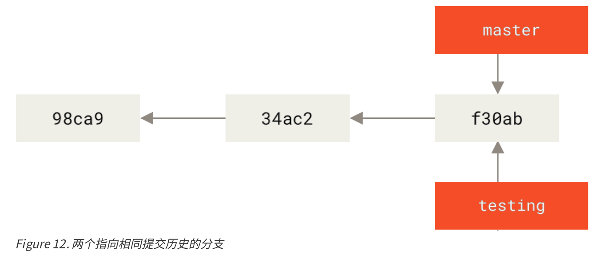

 git branch 命令仅仅 创建 一个新分支，**并不会自动切换到新分支中去。**

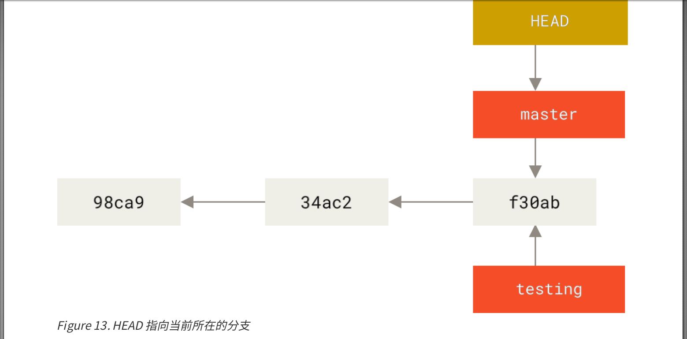

你可以简单地使用 git log 命令查看各个分支当前所指的对象。 提供这一功能的参数是 --decorate。

```shell
$ git log --oneline --decorate
f30ab (HEAD -> master, testing) add feature #32 - ability to add new
formats to the central interface
34ac2 Fixed bug #1328 - stack overflow under certain conditions
98ca9 The initial commit of my project
```

正如你所见，当前 master 和 testing 分支均指向校验和以 f30ab 开头的提交对象。

### 分支切换

 要切换到一个已存在的分支，你需要使用 git checkout 命令。  我们现在切换到新创建的 testing 分支去：

```shell
$ git checkout testing
```

这样 HEAD 就指向 testing 分支了。

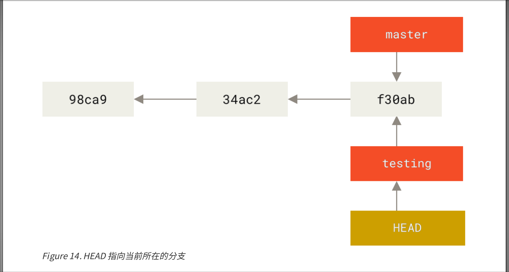

```shell
$ vim test.rb
$ git commit -a -m 'made a change'
```

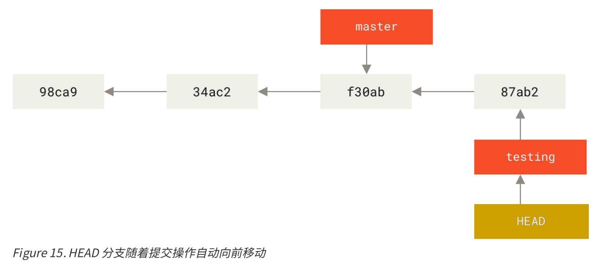

如图所示，你的 testing 分支向前移动了，但是 master 分支却没有，它仍然指向运行 git checkout 时所指的对象。

```shell
#切换回 master 分支看看：
$ git checkout master
```

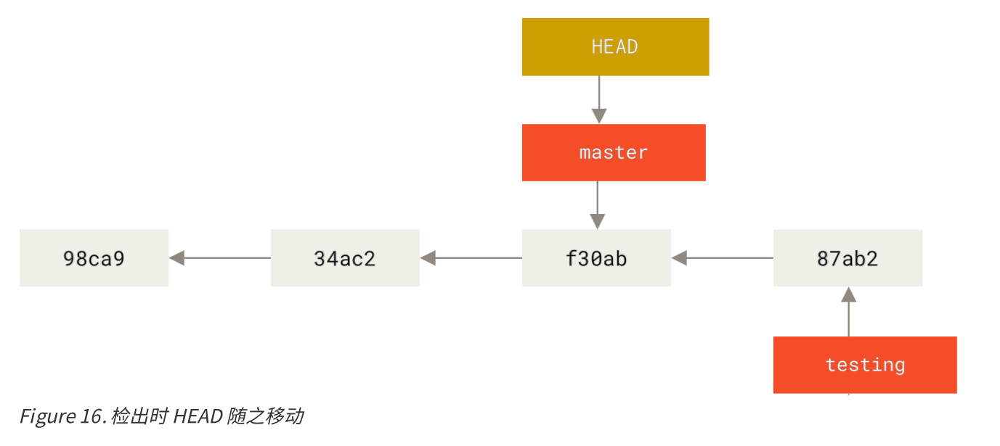

```shell
#在master分支上修改再提交
$ vim test.rb
$ git commit -a -m 'made other changes'
#现在，这个项目的提交历史已经产生了分叉
```

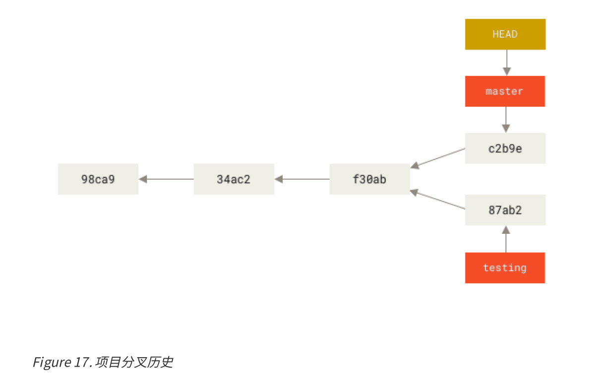

你可以简单地使用 git log 命令查看分叉历史。 运行 git log --oneline --decorate --graph --all ，它会输出你的提交历史、各个分支的指向以及项目的分支分叉情况。

```shell
$ git log --oneline --decorate --graph --all
* c2b9e (HEAD, master) made other changes
| * 87ab2 (testing) made a change
|/
* f30ab add feature #32 - ability to add new formats to the
* 34ac2 fixed bug #1328 - stack overflow under certain conditions
* 98ca9 initial commit of my project
```

### 举例说明

#### 新建分支

 首先，我们假设你正在你的项目上工作，并且在 master 分支上已经有了一些提交。

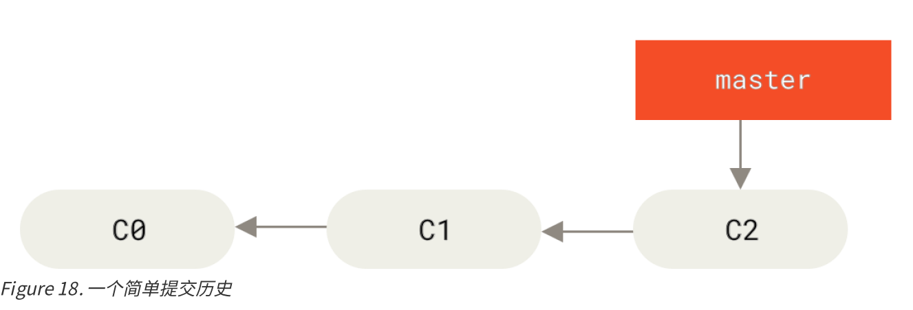

现在，你已经决定要解决你的公司使用的问题追踪系统中的 #53 问题。 想要**新建一个分支并同时切换到那个分支上，你可以运行一个带有 -b 参数的 git checkout 命令**：

```shell
$ git checkout -b iss53
Switched to a new branch "iss53"
```

它是下面两条命令的简写：

```shell
$ git branch iss53
$ git checkout iss53
```

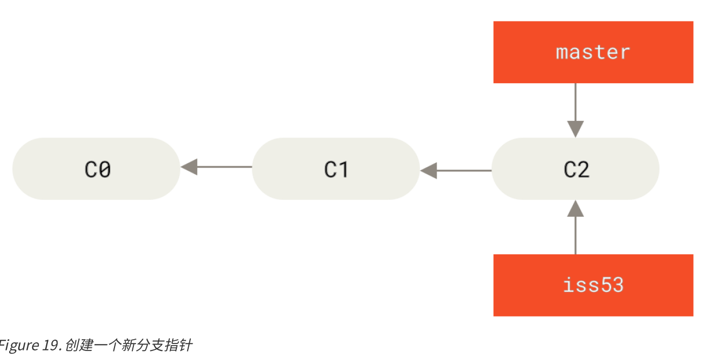

你继续在 #53 问题上工作，并且做了一些提交。 在此过程中，iss53 分支在不断的向前推进，因为你已经检出到该分支 （也就是说，你的 HEAD 指针指向了 iss53 分支）

```shell
$ vim index.html
$ git commit -a -m 'added a new footer [issue 53]'
```

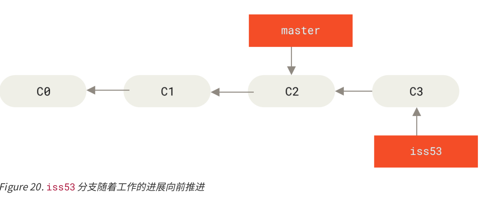

**此时又需要切换到master分支上进行其他任务开发。**你所要做的仅仅是切换回 master 分支。但是，在你这么做之前，要留意你的工作目录和暂存区里那些还没有被提交的修改， 它可能会和你即将检出的分支产生冲突从而阻止 Git 切换到该分支。 最好的方法是，在你切换分支之前，保持好一个干净的状态。 有一些方法可以绕过这个问题（即，暂存（stashing） 和 修补提交（commit amending））， 我们会在 贮藏与清理 中看到关于这两个命令的介绍。 现在，**我们假设你已经把你的修改全部提交了，这时你可以切换回 master**分支了：

```shell
$ git checkout master
Switched to branch 'master'
```

接下来，你要修复这个紧急问题。 我们来建立一个 hotfix 分支，在该分支上工作直到问题解决：

```shell
#创建一个新的分支hotfix来修复bug，完成后合并到master分支
$ git checkout -b hotfix
Switched to a new branch 'hotfix'
$ vim index.html
$ git commit -a -m 'fixed the broken email address'
[hotfix 1fb7853] fixed the broken email address
 1 file changed, 2 insertions(+)
```

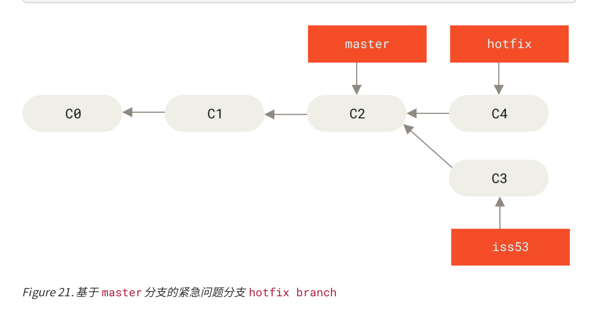

你可以运行你的测试，确保你的修改是正确的，**然后将 hotfix 分支合并回你的 master 分支来部署到线上。你可以使用 git merge** 命令来达到上述目的：

```shell
#
$ git checkout master
$ git merge hotfix
Updating f42c576..3a0874c
Fast-forward
 index.html | 2 ++
 1 file changed, 2 insertions(+)
```

在合并的时候**，你应该注意到了“快进（fast-forward）”这个词**。 由于你想要合并的分支 hotfix 所指向的提交 C4 是你所在的提交 C2 的直接后继， 因此 Git 会直接将指针向前移动。换句话说，当你试图合并两个分支时， 如果顺着一个分支走下去能够到达另一个分支，那么 Git 在合并两者的时候， 只会简单的将指针向前推进（指针右移），因为这种情况下**的合并操作没有需要解决的分歧——这就叫做 “快进（fast-forward）**”。

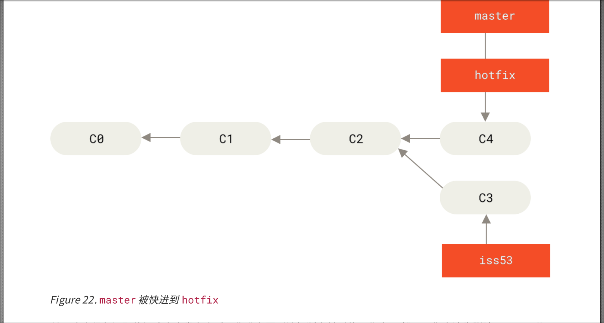

你准备**回到被打断之前时的工作中也就是iss53分支**。 然而，你应该先删除 hotfix 分支，因为你已经不再需要它了 —— master 分支已经指向了同一个位置。 你可以使用带 -d 选项的 git
branch 命令来删除分支：

```shell
#hotfix分支合并到master分支后没用了删除
$ git branch -d hotfix
Deleted branch hotfix (3a0874c).
```

```shell
#切换回iss53分支继续开发
$ git checkout iss53
Switched to branch "iss53"
$ vim index.html
$ git commit -a -m 'finished the new footer [issue 53]'
[iss53 ad82d7a] finished the new footer [issue 53]
1 file changed, 1 insertion(+)
```

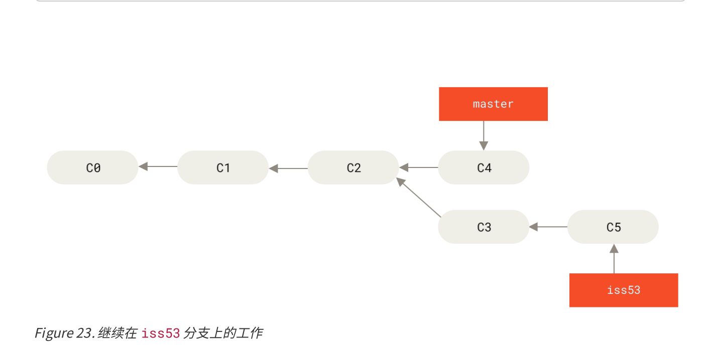

**你在 hotfix 分支上所做的工作并没有包含到 iss53 分支中**。 如果你需要拉取 hotfix 所做的修改，**你可以使用 git merge master 命令将 master 分支合并入 iss53 分支，或者你也可以等到 iss53 分支完成其使命，再将其合并回 master 分支**。

#### 分支的合并

 假设你已经修正了 #53 问题，并且打算将你的工作合并入 master 分支。 为此，你需要合并 iss53 分支到master 分支，这和之前你合并 hotfix 分支所做的工作差不多。 你只需要检出到你想合并入的分支，然后运行git merge 命令：

```shell
$ git checkout master
Switched to branch 'master'
$ git merge iss53
Merge made by the 'recursive' strategy.
index.html |    1 +
1 file changed, 1 insertion(+)
```

这和你之前合并 hotfix 分支的时候看起来有一点不一样。 在这种情况下，你的开发历史从一个更早的地方开始分叉开（diverged）。 因为，**master 分支所在提交并不是 iss53 分支所在提交的直接祖先，做一些额外的工作**。 出现这种情况的时候，Git 会使用两个分支的末端所指的快照（C4 和 C5）以及这两个分支的公共祖先（C2），**做一个简单的三方合并**。

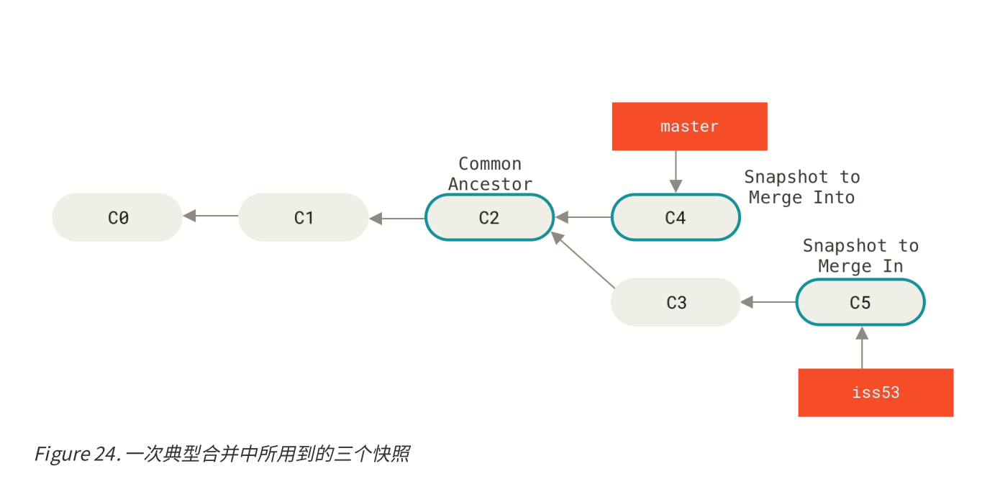

**和之前将分支指针向前推进所不同的是，Git 将此次三方合并的结果做了一个新的快照并且自动创建一个新的提交指向它。 这个被称作一次合并提交，**它的特别之处在于他有不止一个父提交。

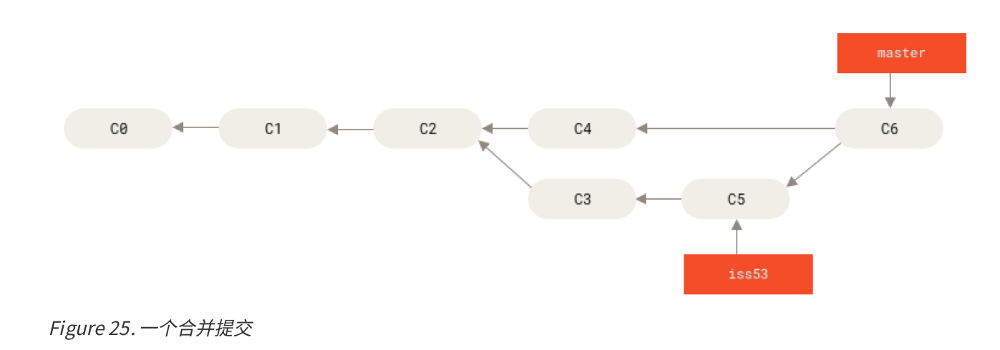

```shell
#合并完成后删除iss53分支
$ git branch -d iss53
```

#### 遇到冲突时的分支合并

 有时候合并操作不会如此顺利。 **如果你在两个不同的分支中，对同一个文件的同一个部分进行了不同的修改**，Git 就没法干净的合并它们。 如果你对 #53 问题的修改和有关 hotfix 分支的修改都涉及到同一个文件的同一处，**在合并它们的时候就会产生合并冲突**：

```shell
$ git merge iss53
Auto-merging index.html
CONFLICT (content): Merge conflict in index.html
Automatic merge failed; fix conflicts and then commit the result.
```

此时 Git 做了合并，但是没有自动地创建一个新的合并提交。 Git 会暂停下来，等待你去解决合并产生的冲突。你可以在合并冲突后的任意时刻使用 **git status 命令来查看那些因包含合并冲突而处于未合并**（unmerged）状态的文件：

```shell
$ git status
On branch master
You have unmerged paths.
  (fix conflicts and run "git commit")
Unmerged paths:
  (use "git add <file>..." to mark resolution)
    both modified:      index.html
no changes added to commit (use "git add" and/or "git commit -a")
```

 Git 会在有冲突的文件中加入标准的冲突解决标记，这样你可以打开这些包含冲突的文件然后手动解决冲突。 **出现冲突的文件会包含一些特殊区段，**看起来像下面这个样子：

```shell
<<<<<<< HEAD:index.html
<div id="footer">contact : email.support@github.com</div>
=======
<div id="footer">
 please contact us at support@github.com
</div>
>>>>>>> iss53:index.html
```

这表示 HEAD 所指示的版本（也就是你的 master 分支所在的位置，因为你在运行 merge 命令的时候已经检出到了这个分支）在这个区段的上半部分（======= 的上半部分），而 iss53 分支所指示的版本在 ======= 的下半部分。 为了解决冲突，你必须选择使用由 ======= 分割的两部分中的一个，或者你也可以自行合并这些内
容。 例如，你可以通过把这段内容换成下面的样子来解决冲突：

```shell
<div id="footer">
please contact us at email.support@github.com
</div>
```

上述的冲突解决方案仅保留了其中一个分支的修改，并且 <<<<<<< , ======= , 和 >>>>>>> 这些行被完全删除了。 在你解决了所有文件里的冲突之后，**对每个文件使用 git add 命令来将其标记为冲突已解决。 一旦暂存这****些原本有冲突的文件，Git 就会将它们标记为冲突已解决。**

可以再次运行 git status 来确认所有的合并冲突都已被解决：

```shell
#手动解决冲突后 add，表明冲突已经解决。
$ git add index.html
$ git status
On branch master
All conflicts fixed but you are still merging.
  (use "git commit" to conclude merge)
Changes to be committed:
    modified:   index.html
```

如果你对结果感到满意，并且确定之前有冲突的的文件都已经暂存了，**这时你可以输入 git commit 来完成合并提交**。 默认情况下提交信息看起来像下面这个样子：

```shell
$ git commit

Merge branch 'iss53'
Conflicts:
    index.html
#
# It looks like you may be committing a merge.
# If this is not correct, please remove the file
#   .git基础/MERGE_HEAD
# and try again.
# Please enter the commit message for your changes. Lines starting
# with '#' will be ignored, and an empty message aborts the commit.
# On branch master
# All conflicts fixed but you are still merging.
#
# Changes to be committed:
#   modified:   index.html
#
```

## 分支管理

git branch 命令不只是可以创建与删除分支。  如果不加任何参数运行它，会得到当前所有分支的一个列表：

```shell
$ git branch
  iss53
* master
  testing
```

注意 master 分支前的 * 字符：它代表现在检出的那一个分支（也就是说，当前 HEAD 指针所指向的分支）。这意味着如果在这时候提交，master 分支将会随着新的工作向前移动。 如果需要查看每一个分支的最后一次提交，可以运行 git branch -v 命令：

```shell
$ git branch -v
  iss53   93b412c fix javascript issue
* master  7a98805 Merge branch 'iss53'
  testing 782fd34 add scott to the author list in the readmes
```

--merged 与 --no-merged 这两个有用的选项可以过滤这个列表中已经合并或尚未合并到当前分支的分支。。 在这个列表中分支名字前没有 * 号的分支通常可以使用 git branch -d 删除掉；你已经将它们的工作整合到了另一个分支，所以并不会失去任何东西。

```shell
#如果要查看哪些分支已经合并到当前分支，可以运行 git branch --merged：
$ git branch --merged
  iss53
* master
```

```shell
#查看所有包含未合并工作的分支，可以运行 git branch --no-merged：
$ git branch --no-merged
  testing
```

这里显示了其他分支。 **因为它包含了还未合并的工作，尝试使用 git branch -d 命令删除它时会失败**：

```shell
$ git branch -d testing
error: The branch 'testing' is not fully merged.
If you are sure you want to delete it, run 'git branch -D testing'.
```

如果真的想要删除分支并丢掉那些工作，如同帮助信息里所指出的，**可以使用 -D 选项强制删除它**。

## 生成SSH key

查看本地是否存在SSH-Key

```shell
ls -al ~/.ssh
```

如果没有文件则表示本地没有身成的SSH key

生成新的SSH key  `your_email`这里填写你在[GitLab](https://so.csdn.net/so/search?q=GitLab&spm=1001.2101.3001.7020)或者GitHub注册时的邮箱。

```shell
ssh-keygen -t rsa -C"you_email"
```

Ubuntu平台会生成到目录：~/.ssh/
可以将windows下生成的id_rsa拷贝到ubuntu的~/.ssh中
生成的id_rsa是私钥，不能泄露出去，id_rsa.pub是公钥（需要注册到GitLab平台上）。

## 云端配置SSH key

打开gitlab,找到Profile Settings-->SSH Keys--->Add SSH Key,并把上一步中复制的内容粘贴到Key所对应的文本框，在Title对应的文本框中给这个sshkey设置一个名字，点击Add key按钮

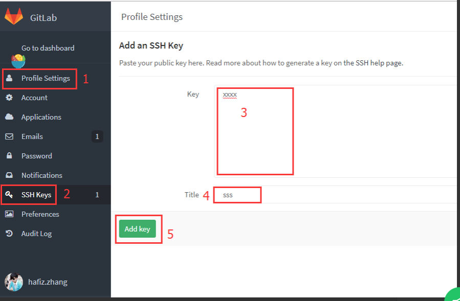

到此就完成了gitlab配置ssh key的所有步骤，我们就可以愉快的使用ssh协议进行代码的拉取以及提交等操作了


## 本地配置多个ssh key

大多数时候，我们的机器上会有很多的git host,比如公司gitlab、github、oschina等，那我们就需要在本地配置多个ssh key，使得不同的host能使用不同的ssh key ,做法如下（以公司gitlab和github为例）：

为公司生成一对秘钥ssh key

```shell
ssh-keygen -t rsa -C 'yourEmail@xx.com' -f ~/.ssh/gitlab-rsa
```

为github生成一对秘钥ssh key

```shell
ssh-keygen -t rsa -C 'yourEmail2@xx.com' -f ~/.ssh/github-rsa
```

在~/.ssh目录下新建名称为config的文件（无后缀名）。用于配置多个不同的host使用不同的ssh key，内容如下：

```shell
# gitlab
Host gitlab.com
    HostName gitlab.com
    PreferredAuthentications publickey
    IdentityFile ~/.ssh/gitlab_id-rsa
# github
Host github.com
    HostName github.com
    PreferredAuthentications publickey
    IdentityFile ~/.ssh/github_id-rsa
    
# 配置文件参数
# Host : 就是一个简称
# HostName : 要登录主机的主机名，就是网址
# User : 用户
# IdentityFile : 指明上面User对应的identityFile路径
```

下面是一个具体的例子实现一台机器上管理多个 GitHub 账户

### **1.** 生成 SSH 密钥

在生成 SSH 密钥之前，我们可以检查一下我们是否有任何现有的 SSH 密钥：`ls -al ~/.ssh` 这将列出所有现有的公钥和私钥对，如果存在的话。

如果 `~/.ssh/id_rsa` 是可用的，我们可以重新使用它，否则我们可以先通过运行以下代码来生成一个默认 `~/.ssh/id_rsa` 的密钥：

```
ssh-keygen -t rsa
```

对于保存密钥的位置，按回车键接受默认位置。一个私钥和公钥 `~/.ssh/id_rsa.pub` 将在默认的 SSH 位置 `~/.ssh/` 创建。

让我们为我们的**个人账户使用这个默认的密钥对**。

对于**工作账户**，我们将创建不同的 SSH 密钥。下面的代码将生成 SSH 密钥，并将标签为 “email@work_mail.com” 的公钥保存到 `~/.ssh/id_rsa_work_user1.pub` 中。

```bash
$ ssh-keygen -t rsa -C "email@work_mail.com" -f "id_rsa_work_user1"
```

到目前，我们创建了两个不同的密钥：id_rsa是默认的个人账户密钥，id_rsa_work_user1是工作账户密钥

```bash
~/.ssh/id_rsa
~/.ssh/id_rsa_work_user1
```

### **2.** 将新的 SSH 密钥添加到相应的 GitHub 账户中

我们已经准备好了 SSH 公钥，我们将要求 GitHub 账户信任我们创建的密钥。这是为了避免每次进行 Git 推送时都要输入用户名和密码的麻烦。

**个人账户**

复制公钥 `pbcopy < ~/.ssh/id_rsa.pub`，然后登录你的个人 GitHub 账户：

- 转到 `Settings`
- 在左边的菜单中选择 `SSH and GPG keys`
- 点击 `New SSH key`，提供一个合适的标题，并将密钥粘贴在下面的方框中
- 点击 `Add key` - 就完成了！

对于**工作账户**，使用相应的公钥（`pbcopy < ~/.ssh/id_rsa_work_user1.pub`），在 GitHub 工作账户中重复上述步骤。

### **3 .** 在 ssh-agent 上注册新的 SSH 密钥

为了使用这些密钥，我们必须在我们机器上的 **ssh-agent** 上注册它们。使用 `eval "$(ssh-agent -s)"` 命令确保 ssh-agent 运行。像这样把密钥添加到 ssh-agent 中：

```bash
ssh-add ~/.ssh/id_rsa   # 个人账户
ssh-add ~/.ssh/id_rsa_work_user1 # 工作账户
```

查看当前的密钥列表，查看是否添加成功        

```bash
ssh-add -l
```

让 ssh-agent 为不同的 SSH 主机使用各自的 SSH 密钥。

这是最关键的部分，我们有两种不同的方法：

使用 SSH 配置文件（第 4 步），以及在 ssh-agent 中每次只有一个有效的 SSH 密钥（第 5 步）。

### 4. 创建 SSH 配置文件

在这里，我们实际上是为不同的主机添加 SSH 配置规则，说明在哪个域名使用哪个身份文件。

SSH 配置文件将在 **~/.ssh/config** 中。如果有的话，请编辑它，否则我们可以直接创建它。

```bash
$ cd ~/.ssh/
$ touch config           // Creates the file if not exists
$ code config            // Opens the file in VS code, use any editor
```

在 `~/.ssh/config` 文件中为相关的 GitHub 账号做类似于下面的配置项：

```bash
# Personal account, - the default config
Host github.com
   HostName github.com
   User git
   IdentityFile ~/.ssh/id_rsa
   
# Work account-1
Host github.com-work_user1    
   HostName github.com
   User git
   IdentityFile ~/.ssh/id_rsa_work_user1
# 配置文件参数
# Host : 是用来定义主机别名的关键字
# HostName : 指定连接的远程主机的域名或IP地址。在这种情况下，连接的是GitHub的服务器。
# User : 指定了用于SSH连接的用户名。在GitHub上，通常使用 git 用户名。
# IdentityFile : 指定了用于身份验证的私钥文件的路径。
```

“work_user1” 是工作账户的 GitHub 用户 ID。

“github.com-work_user1” 是用来区分多个 Git 账户的记号。你也可以使用 “work_user1.github.com”  记号。确保与你使用的主机名记号一致。当你克隆一个仓库或为本地仓库设置 remote origin 时，这一点很重要。

上面的配置要求 ssh-agent：

- 使用 **id_rsa** 作为任何使用 **@github.com** 的 Git URL 的密钥
- 对任何使用 **@github.com-work_user1** 的 Git URL 使用 **id_rsa_work_user1** 密钥

测试以确保Github识别密钥：

```shell
$ ssh -T github.com
Hi work! You've successfully authenticated, but GitHub does not provide shell access.

$ ssh -T github.com-work_user1
Hi person! You've successfully authenticated, but GitHub does not provide shell access.
```

### **5.** 在 ssh-agent 中每次有一个活跃的 SSH 密钥

这种方法不需要 SSH 配置规则。相反，我们手动确保在进行任何 Git 操作时，ssh-agent 中只有相关的密钥。

`ssh-add -l` 会列出所有连接到 ssh-agent 的 SSH 密钥。把它们全部删除，然后添加你要用的那个密钥。

如果是要推送到个人的 Git 账号：

```bash
$ ssh-add -D            //removes all ssh entries from the ssh-agent
$ ssh-add ~/.ssh/id_rsa                 // Adds the relevant ssh key
```

现在 ssh-agent 已经有了映射到个人 GitHub 账户的密钥，我们可以向个人仓库进行 Git 推送。

要推送到工作的 GitHub account-1，需要改变 SSH 密钥与 ssh-agent 的映射关系，删除现有的密钥，并添加与 GitHub 工作账号映射的 SSH 密钥。

```bash
$ ssh-add -D
$ ssh-add ~/.ssh/id_rsa_work_user1
```

目前，ssh-agent 已经将密钥映射到了工作的 GitHub 账户，你可以将 Git 推送到工作仓库。不过这需要一点手动操作。

### 为本地仓库设置 git remote url

一旦我们克隆/创建了本地的 Git 仓库，确保 Git 配置的用户名和电子邮件正是你想要的。GitHub 会根据提交（commit）描述所附的电子邮件 ID 来识别任何提交的作者。

要列出本地 Git 目录中的配置名称和电子邮件，请执行 `git config user.name` 和 `git config user.email`。如果没有找到，可以进行更新。

```bash
git config user.name "User 1"   // Updates git config user name
git config user.email "user1@workMail.com"
```

### **6.** 克隆仓库

注意：如果我们在本地已经有了仓库，那么请查看第 7 步。

现在配置已经好了，我们可以继续克隆相应的仓库了。在克隆时，注意我们要使用在 SSH 配置中使用的主机名。

仓库可以使用 Git 提供的 clone 命令来克隆：

```
git clone git@github.com:personal_account_name/repo_name.git
```

- 这个命令是克隆一个仓库，地址为 `git@github.com:personal_account_name/repo_name.git`。
- `git@github.com` 是SSH协议下GitHub的标准主机别名。
- `personal_account_name` 是你的GitHub个人账户的用户名。
- `repo_name` 是你想要克隆的仓库的名称。
- 这个命令会使用默认的SSH密钥文件（通常是 `~/.ssh/id_rsa`）来进行身份验证，因为在配置文件中没有指定与个人账户关联的特定密钥文件。

工作仓库将需要用这个命令来进行修改：

```bash
git clone git@github.com-work_user1:work_user1/repo_name.git
```

- 这个命令是克隆一个仓库，地址为 `git@github.com-work_user1:work_user1/repo_name.git`。
- `github.com-work_user1` 是在SSH配置文件中定义的自定义主机别名，用于与工作账户关联。
- `work_user1` 是工作账户的用户名。
- `repo_name` 是你想要克隆的仓库的名称。
- 这个命令会使用配置文件中与 `github.com-work_user1` 主机别名关联的特定SSH密钥文件（`~/.ssh/id_rsa_work_user1`）来进行身份验证。因为在配置文件中明确指定了使用工作账户的身份验证信息。

这个变化取决于 SSH 配置中定义的主机名。@ 和 : 之间的字符串应该与我们在 SSH 配置文件中给出的内容相匹配。

### **7.** 对于本地存在的版本库

**如果我们有已经克隆的仓库：**

列出该仓库的 Git remote，`git remote -v`

检查该 URL 是否与我们要使用的 GitHub 主机相匹配，否则就更新 remote origin URL。

```bash
git remote set-url origin git@github.com-work_user1:worker_user1/repo_name.git
```

确保 @ 和 : 之间的字符串与我们在 SSH 配置中给出的主机一致。

- `git remote set-url origin`：这部分告诉Git，我们要修改名为 `origin` 的远程仓库的URL。在Git中，`origin` 是默认用来指代你最初克隆或添加的远程仓库的别名。它是一个常用的标识符，但你也可以使用其他名字。
- `git@github.com-work_user1:worker_user1/repo_name.git`：这是新的远程仓库的URL。
  - `git@github.com-work_user1` 是在SSH配置文件中定义的自定义主机别名，用于与工作账户关联。这与上一个例子中的自定义主机别名 
  - `worker_user1` 是工作账户的用户名。
  - `repo_name` 是你想要连接的仓库的名称。

**如果你要在本地创建一个新的仓库：**

在项目文件夹中初始化 Git `git init`。

在 GitHub 账户中创建新的仓库，然后将其作为 Git remote 添加给本地仓库。

```bash
git remote add origin git@github.com-work_user1:work_user1/repo_name.git 
```

确保 @ 和 : 之间的字符串与我们在 SSH 配置中给出的主机相匹配。

推送初始提交到 GitHub 仓库：

```bash
git add .
git commit -m "Initial commit"
git push -u origin master
```

我们完成了！

依据正确的主机，添加或更新的本地 Git 目录的 Git remote，选择正确的 SSH 密钥来验证我们的身份。有了以上这些，我们的 `git` 操作应该可以无缝运行了。

# 远程分支

 git ls-remote <remote> 来显式地获得远程引用的完整列表， 或者通过 git remote show <remote> 获得远程分支的更多信息。

它们以 <remote>/<branch> 的形式命名。

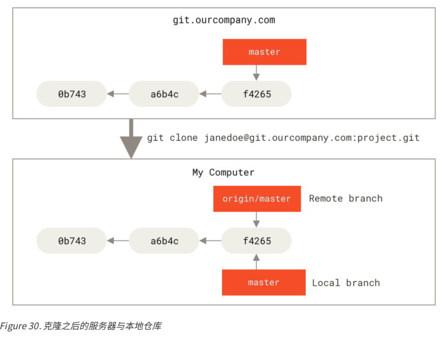

**如果你在本地的 master 分支做了一些工作，在同一段时间内有其他人推送提交到 git.ourcompany.com**
**并且更新了它的 master 分支**，这就是说你们的提交历史已走向不同的方向。

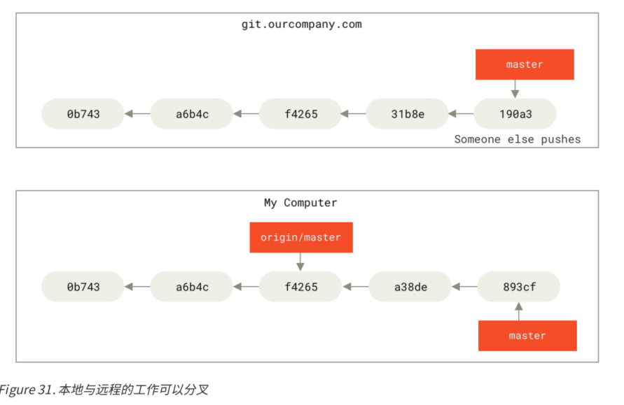

如果要与给定的**远程仓库同步数据，运行 git fetch <remote> 命令**（在本例中为 git fetch origin）移动 origin/master 指针到更新之后的位置。

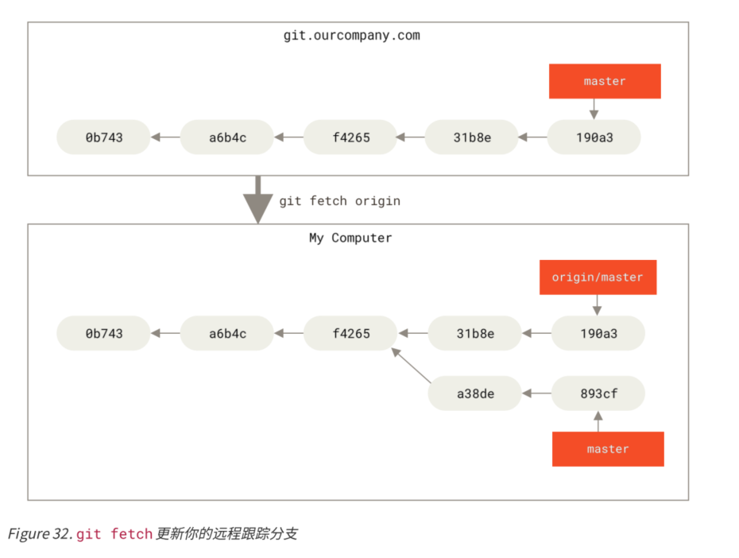

## 推送

 当你想要公开分享一个分支时，需要将其推送到有写入权限的远程仓库上

如果希望和别人一起在名为 serverfix 的分支上工作，你可以像推送第一个分支那样推送它。 运行 git push
<remote> <branch>:

```shell
$ git push origin serverfix
Counting objects: 24, done.
Delta compression using up to 8 threads.
Compressing objects: 100% (15/15), done.
Writing objects: 100% (24/24), 1.91 KiB | 0 bytes/s, done.
Total 24 (delta 2), reused 0 (delta 0)
To https://github.com/schacon/simplegit
 * [new branch]      serverfix -> serverfix
```

下一次其他协作者从服务器上抓取数据时，**他们会在本地生成一个远程分支 origin/serverfix**，指向服务器的 serverfix 分支的引用：

```shell
$ git fetch origin
remote: Counting objects: 7, done.
remote: Compressing objects: 100% (2/2), done.
remote: Total 3 (delta 0), reused 3 (delta 0)
Unpacking objects: 100% (3/3), done.
From https://github.com/schacon/simplegit
 * [new branch]      serverfix    -> origin/serverfix
```

可以运行 git merge origin/serverfix 将这些工作合并到当前所在的分支。 如果想要在自己的serverfix 分支上工作，可以将其建立在远程跟踪分支之上：

```shell
#这会给你一个用于工作的本地分支，并且起点位于 origin/serverfix。
$ git checkout -b serverfix origin/serverfix
Branch serverfix set up to track remote branch serverfix from origin.
Switched to a new branch 'serverfix'
```

## 跟踪分支

 从一个远程跟踪分支检出一个本地分支会自动创建所谓的“跟踪分支.跟踪分支是与远程分支有直接关系的本地分支。 如果在一个跟踪分支上输入 git pull，Git 能自动地识别去哪个服务器上抓取、合并到哪个分支。

**当克隆一个仓库时，它通常会自动地创建一个跟踪 origin/master 的 master 分支**。 然而，如果你愿意的话
可以设置其他的跟踪分支，或是一个在其他远程仓库上的跟踪分支，**又或者不跟踪 master 分支。 最简单的实**
**例就是像之前看到的那样，运行 git checkout -b <branch> <remote>/<branch>**。 这是一个十分常用
的操作所以 Git 提供了 --track 快捷方式：

```shell
$ git checkout --track origin/serverfix
Branch serverfix set up to track remote branch serverfix from origin.
Switched to a new branch 'serverfix'
```

该捷径本身还有一个捷径。

 如果你尝试检出的分支

 (a) 不存在且 (b) 刚好只有一个名字与之匹配的远程分支，

那么 Git 就会为你创建一个跟踪分支：

```shell
$ git checkout serverfix
Branch serverfix set up to track remote branch serverfix from origin.
Switched to a new branch 'serverfix'
```

如果想要将本地分支与远程分支设置为不同的名字，你可以轻松地使用上一个命令增加一个不同名字的本地分
支：

```shell
$ git checkout -b sf origin/serverfix
Branch sf set up to track remote branch serverfix from origin.
Switched to a new branch 'sf'
```

现在，本地分支 sf 会自动从 origin/serverfix 拉取。

如果想要查看设置的所有跟踪分支，可以使用 git branch 的 -vv 选项。 这会将所有的本地分支列出来并且包
含更多的信息，如每一个分支正在跟踪哪个远程分支与本地分支是否是领先、落后或是都有。

```shell
$ git branch -vv
  iss53     7e424c3 [origin/iss53: ahead 2] forgot the brackets
  master    1ae2a45 [origin/master] deploying index fix
* serverfix f8674d9 [teamone/server-fix-good: ahead 3, behind 1] this
should do it
  testing   5ea463a trying something new
```

### 拉取

 当 git fetch 命令从服务器上抓取本地没有的数据时，它并不会修改工作目录中的内容。 它只会获取数据然后让你自己合并。 然而，有一个命令叫作 git pull 在大多数情况下它的含义是一个 git fetch 紧接着一个git merge 命令。 如果有一个像之前章节中演示的设置好的跟踪分支，不管它是显式地设置还是通过 clone或 checkout 命令为你创建的，git pull 都会查找当前分支所跟踪的服务器与分支， 从服务器上抓取数据然后尝试合并入那个远程分支。
**由于 git pull 的魔法经常令人困惑所以通常单独显式地使用 fetch 与 merge 命令会更好一些。**

### 删除远程分支

可以运行带有 --delete 选项的 git push 命令来删除一个远程分支。 如果想要从服务器上删除 serverfix 分支，运行下面的命令：

```shell
$ git push origin --delete serverfix
To https://github.com/schacon/simplegit
 - [deleted]         serverfix
```

# 分布式工作流程

## 私有小型团队

让我们看看当两个开发者在一个共享仓库中一起工作时会是什么样子。

 第一个开发者，John，克隆了仓库，做了改动，然后本地提交。

```shell
# John's Machine
$ git clone john@githost:simplegit.git
Cloning into 'simplegit'...
...
$ cd simplegit基础/
$ vim lib/simplegit.rb
$ git commit -am 'remove invalid default value'
[master 738ee87] remove invalid default value
 1 files changed, 1 insertions(+), 1 deletions(-)
```

第二个开发者，Jessica，做了同样的事情——克隆仓库并提交了一个改动：

```shell
# Jessica's Machine
$ git clone jessica@githost:simplegit.git
Cloning into 'simplegit'...
...
$ cd simplegit基础/
$ vim TODO
$ git commit -am 'add reset task'
[master fbff5bc] add reset task
 1 files changed, 1 insertions(+), 0 deletions(-)
```

现在，Jessica 把她的工作推送到服务器上，一切正常：

```shell
# Jessica's Machine
$ git push origin master
...
To jessica@githost:simplegit.git
   1edee6b..fbff5bc  master -> master
```

John 稍候也做了些改动，将它们提交到了本地仓库中，然后试着将它们推送到同一个服务器：

```shell
# John's Machine
$ git push origin master
To john@githost:simplegit.git
 ! [rejected]        master -> master (non-fast forward)
error: failed to push some refs to 'john@githost:simplegit.git'
```

**这时 John 会推送失败**，因为之前 Jessica 已经推送了她的更改。 如果之前习惯于用 Subversion 那么理解这点
特别重要，**因为你会注意到两个开发者并没有编辑同一个文件**。 尽管 Subversion 会对编辑的不同文件在服务器上自动进行一次合并，**但 Git 要求你先在本地合并提交。 换言之，John 必须先抓取 Jessica 的上游改动并将它**
**们合并到自己的本地仓库中，才能被允许推送**。

第一步，John 抓取 Jessica 的工作（这只会 抓取 Jessica 的上游工作，并不会将它合并到 John 的工作中）：

```shell
$ git fetch origin
...
From john@githost:simplegit
 + 049d078...fbff5bc master     -> origin/master
```

在这个时候，John 的本地仓库看起来像这样：


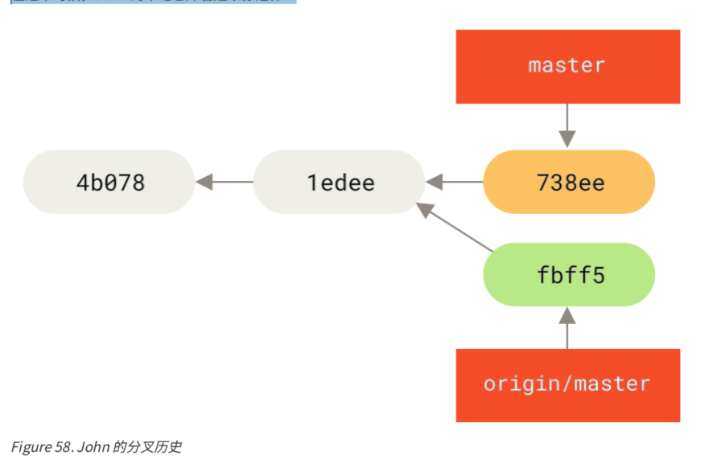

第二步：现在 John 可以将抓取下来的 Jessica 的工作合并到他自己的本地工作中了：

```shell
$ git merge origin/master
Merge made by the 'recursive' strategy.
 TODO |    1 +
 1 files changed, 1 insertions(+), 0 deletions(-)
```

合并进行得很顺利——John 更新后的历史现在看起来像这样：

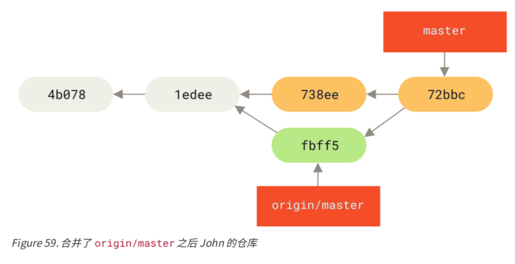

第三步：此时，John 能将新合并的工作推送到服务器了：

```shell
$ git push origin master
...
To john@githost:simplegit.git
   fbff5bc..72bbc59  master -> master
```

最终，John 的提交历史看起来像这样：

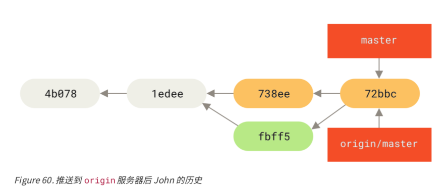

在此期间，Jessica 新建了一个名为 issue54 的主题分支，然后在该分支上提交了三次。 她还没有抓取 John的改动，所以她的提交历史看起来像这样：

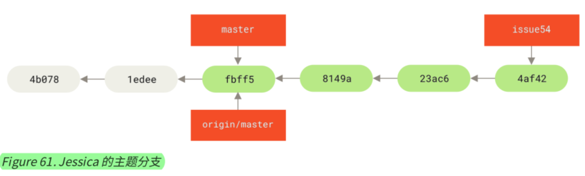

Jessica 发现 John 向服务器推送了一些新的工作，她想要看一下， 于是就抓取了所有服务器上的新内

```shell
# Jessica's Machine
$ git fetch origin
...
From jessica@githost:simplegit
   fbff5bc..72bbc59  master     -> origin/master
```

那会同时拉取 John 推送的工作。 Jessica 的历史现在看起来像这样：

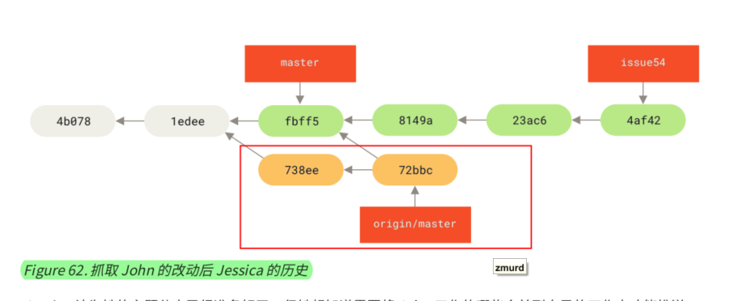

Jessica 认为她的主题分支已经准备好了，但她想知道需要将 John 工作的哪些合并到自己的工作中才能推送。
她运行 git log 找了出来

```shell
$ git log --no-merges issue54..origin/master
commit 738ee872852dfaa9d6634e0dea7a324040193016
Author: John Smith <jsmith@example.com>
Date:   Fri May 29 16:01:27 2009 -0700
   remove invalid default value
```

目前，我们可以从输出中看到有一个 John 生成的但是 Jessica 还没有合并的提交。 如果她合并origin/master，那个未合并的提交将会修改她的本地工作。
现在，Jessica 可以合并她的特性工作到她的 master 分支， 合并 John 的工作（origin/master）进入她的master 分支，然后再次推送回服务器。
首先（在已经提交了所有 issue54 主题分支上的工作后），为了整合所有这些工作， 她切换回她的 master 分
支。

```shell
$ git checkout master
Switched to branch 'master'
Your branch is behind 'origin/master' by 2 commits, and can be fast-
forwarded.
```

Jessica 既可以先合并 origin/master 也可以先合并 issue54 ——它们都是上游，所以顺序并没有关系。

先合并 issue54：

```shell
$ git merge issue54
Updating fbff5bc..4af4298
Fast forward
 README           |    1 +
 lib/simplegit.rb |    6 +++++-
 2 files changed, 6 insertions(+), 1 deletions(-)
```

 现在 Jessica 在本地合并了之前抓取的 origin/master分支上 John 的工作：

```shell
$ git merge origin/master
Auto-merging lib/simplegit.rb
Merge made by the 'recursive' strategy.
 lib/simplegit.rb |    2 +-
 1 files changed, 1 insertions(+), 1 deletions(-)
```

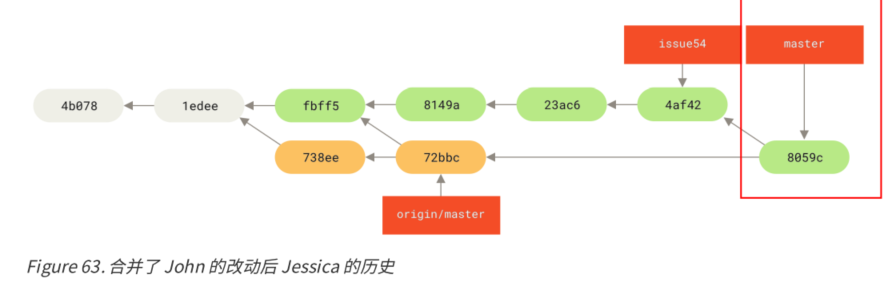

她应该可以成功地推送（假设同一时间John 并没有更多推送）：

```shell
$ git push origin master
...
To jessica@githost:simplegit.git
   72bbc59..8059c15  master -> master
```

每一个开发者都提交了几次并成功地合并了其他人的工作。

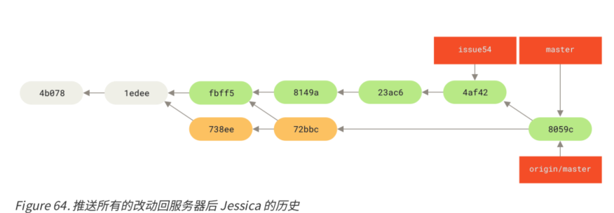

这是一个最简单的工作流程。 你通常会在一个主题分支上工作一会儿，当它准备好整合时就合并到你的 master分支。 当想要共享工作时，如果有改动的话就抓取它然后合并到你自己的 master 分支， 之后推送到服务器上的 master 分支。


# tag标签

Git 支持两种标签：轻量标签（lightweight）与附注标签（annotated）。

**常用的是附注标签**

轻量标签很像一个不会改变的分支——它只是某个特定提交的引用。
而附注标签是存储在 Git 数据库中的一个完整对象， 它们是可以被校验的，其中包含打标签者的名字、电子邮件地址、日期时间， 此外还有一个标签信息，并可以使用 GNU Privacy Guard （GPG）签名并验证。 通常会建议创建附注标签，这样你可以拥有以上所有信息。但是如果你只是想用一个临时的标签， 或者因为某些原因不想要保存这些信息，那么也可以用轻量标签。

## 附注标签

在 Git 中创建附注标签十分简单。**常用**。 最简单的方式是当你在运行 tag 命令时指定 -a 选项：

```shell
$ git tag -a v1.4 -m "my version 1.4"
$ git tag
v0.1
v1.3
v1.4
```

-m 选项指定了一条将会存储在标签中的信息。 如果没有为附注标签指定一条信息，Git 会启动编辑器要求你输入信息。
通过使用 git show 命令可以看到标签信息和与之对应的提交信息：

```shell
$ git show v1.4
tag v1.4
Tagger: Ben Straub <ben@straub.cc>
Date: Sat May 3 20:19:12 2014 -0700
my version 1.4
commit ca82a6dff817ec66f44342007202690a93763949
Author: Scott Chacon <schacon@gee-mail.com>
Date: Mon Mar 17 21:52:11 2008 -0700
changed the version number
```

输出显示了打标签者的信息、打标签的日期时间、附注信息，然后显示具体的提交信息。

## 轻量标签

轻量标签本质上是将提交校验和存储到一个文件中——没有保存任何其他信息。 创建轻量标签，不需要使用 -a、-s 或 -m 选项，只需要提供标签名字：

```shell
$ git tag v1.4-lw
$ git tag
v0.1
v1.3
v1.4
v1.4-lw
v1.5
```

这时，如果在标签上运行 git show，你不会看到额外的标签信息。 命令只会显示出提交信息：

```shell
$ git show v1.4-lw
commit ca82a6dff817ec66f44342007202690a93763949
Author: Scott Chacon <schacon@gee-mail.com>
Date: Mon Mar 17 21:52:11 2008 -0700
changed the version number
```

## 后期打标签

你也可以对过去的提交打标签。 假设提交历史是这样的：

```shell
$ git log --pretty=oneline
15027957951b64cf874c3557a0f3547bd83b3ff6 Merge branch 'experiment'
a6b4c97498bd301d84096da251c98a07c7723e65 beginning write support
0d52aaab4479697da7686c15f77a3d64d9165190 one more thing
6d52a271eda8725415634dd79daabbc4d9b6008e Merge branch 'experiment'
0b7434d86859cc7b8c3d5e1dddfed66ff742fcbc added a commit function
4682c3261057305bdd616e23b64b0857d832627b added a todo file
166ae0c4d3f420721acbb115cc33848dfcc2121a started write support
9fceb02d0ae598e95dc970b74767f19372d61af8 updated rakefile
964f16d36dfccde844893cac5b347e7b3d44abbc commit the todo
8a5cbc430f1a9c3d00faaeffd07798508422908a updated readme
```

现在，假设在 v1.2 时你忘记给项目打标签，也就是在 “updated rakefile” 提交。 你可以在之后补上标签。 要在那个提交上打标签，你需要在命令的末尾指定提交的校验和（或部分校验和）：

```shell
$ git tag -a v1.2 9fceb02
```

可以看到你已经在那次提交上打上标签了：

```shell
$ git tag
v0.1
v1.2
v1.3
v1.4
v1.4-lw
v1.5
$ git show v1.2
tag v1.2
Tagger: Scott Chacon <schacon@gee-mail.com>
Date: Mon Feb 9 15:32:16 2009 -0800
version 1.2
commit 9fceb02d0ae598e95dc970b74767f19372d61af8
Author: Magnus Chacon <mchacon@gee-mail.com>
Date: Sun Apr 27 20:43:35 2008 -0700
updated rakefile
...
```

## 共享标签（推送远端）

默认情况下，git push 命令并不会传送标签到远程仓库服务器上。 在创建完标签后你必须显式地推送标签到共享服务器上。 这个过程就像共享远程分支一样——你可以运行 `git push origin <tagname>`。

```shell
$ git push origin v1.5
Counting objects: 14, done.
Delta compression using up to 8 threads.
Compressing objects: 100% (12/12), done.
Writing objects: 100% (14/14), 2.05 KiB | 0 bytes/s, done.
Total 14 (delta 3), reused 0 (delta 0)
To git@github.com:schacon/simplegit.git
* [new tag] v1.5 -> v1.5
```

如果想要一次性推送很多标签，也可以使用带有 --tags 选项的 git push 命令。 这将会把所有不在远程仓库服务器上的标签全部传送到那里。**常用**

```shell
$ git push origin --tags
Counting objects: 1, done.
Writing objects: 100% (1/1), 160 bytes | 0 bytes/s, done.
Total 1 (delta 0), reused 0 (delta 0)
To git@github.com:schacon/simplegit.git
* [new tag] v1.4 -> v1.4
* [new tag] v1.4-lw -> v1.4-lw
```

使用 git push <remote> --tags 推送标签并不会区分轻量标签和附注标签  

## 删除标签

要删除掉你**本地仓库**上的标签，可以使用命令 git tag -d <tagname>

```shell
$ git tag -d v1.4-lw
Deleted tag 'v1.4-lw' (was e7d5add)
```

注意上述命令并不会从任何远程仓库中移除这个标签，你必须用 git push <remote>:refs/tags/<tagname> 来更新你的**远程仓库**：

```shell
$ git push origin :refs/tags/v1.4-lw
To /git@github.com:schacon/simplegit.git
- [deleted] v1.4-lw
```

**常用下面方式删除远程仓库标签**

```shell
$ git push origin --delete <tagname>
```

# 远程

## 删除远程库文件,但本地保留该文件

```shell
git rm --cached xxx #-r参数可以删除文件夹
git commit -m "remove file from remote"
git push -u origin master
#git rm 是删除暂存区或分支上的文件, 同时也删除工作区中这个文件。
#git rm --cached是删除暂存区或分支上的文件,但本地还保留这个文件， 是不希望这个文件被版本控制
```

# 移除文件

Git 本地数据管理，大概可以分为三个区：

    工作区（Working Directory）：是可以直接编辑的地方。
    暂存区（Stage/Index）：数据暂时存放的区域。
    版本库（commit History）：存放已经提交的数据。

工作区的文件 git add 后到暂存区，暂存区的文件 git commit 后到版本库。

## 1.1 rm 命令

**1. 作用：** 删除工作区的文件。

执行删除命令：

```shell
$ rm test.txt
```

查看状态（成功删除工作区文件）：

```shell
$ git status
On branch master
Changes not staged for commit:
  (use "git add/rm <file>..." to update what will be committed)
  (use "git checkout -- <file>..." to discard changes in working directory)

        deleted:    test.txt

no changes added to commit (use "git add" and/or "git commit -a")
```

rm 命令只是删除工作区的文件，并没有删除版本库的文件，想要删除版本库文件还要执行下面的命令：

```shell
$ git add test.txt
$ git commit -m "delete test"
```


**2. 结果：** 删除了工作区和版本库的文件。

## 1.2 git rm 命令

**1. 作用：** 删除工作区文件，并且将这次删除放入暂存区。

**2. 注意：** 要删除的文件是没有修改过的，就是说和当前版本库文件的内容相同。

执行删除命令：

```shell
$ git rm test.txt
rm 'test.txt'
```

查看状态（成功删除了工作区文件，并且将这次删除放入暂存区。）：

```shell
$ git status
On branch master
Changes to be committed:
  (use "git reset HEAD <file>..." to unstage)

        deleted:    test.txt
```

然后提交：

```shell
$ git commit -m "delete test"
[master f05b05b] delete test
 1 file changed, 3 deletions(-)
 delete mode 100644 test.txt
```

成功删除了版本库文件。

**3. 结果：** 删除了工作区和版本库的文件，因为暂存区不可能有该文件（如果有意味着该文件修改后 git add 到暂存区，那样 git rm 命令会报错，如下面的情况）。

## 1.3 git rm -f 命令

**1. 作用：** 删除工作区和暂存区文件，并且将这次删除放入暂存区。
 **2. 注意：** 要删除的文件已经修改过，就是说和当前版本库文件的内容不同。

- test文件修改过还没 git add 到暂存区

```shell
$ git rm test.txt
error: the following file has local modifications:
    test.txt
(use --cached to keep the file, or -f to force removal)
```

* test文件修改过已经 git add 到暂存区

```shell
$ git add test.txt
$ git rm test.txt
error: the following file has changes staged in the index:
    test.txt
(use --cached to keep the file, or -f to force removal)
```

可见文件修改后不管有没有 git add 到暂存区，使用 git rm 命令删除都会报错。

- 解决方法

执行删除命令：

```shell
$ git rm -f test.txt
rm 'test.txt'
```

查看状态（成功删除工作区和暂存区文件，并且将这次删除放入暂存区。）：

```shell
$ git status
On branch master
Changes to be committed:
  (use "git reset HEAD <file>..." to unstage)

        deleted:    test.txt
```

然后提交

```shell
$ git commit -m "delete test"
[master 9d5d2d2] delete test
 1 file changed, 3 deletions(-)
 delete mode 100644 test.txt
```

成功删除了版本库文件。

**3. 结果：** 删除了工作区、暂存区和版本库的文件。


## 1.4 git rm --cached 命令

**1. 作用：** 删除暂存区文件，但保留工作区的文件，并且将这次删除放入暂存区。

执行删除命令：

```shell
$ git rm --cached test.txt
rm 'test.txt'
```

查看状态（成功删除暂存区文件，保留工作区文件，并且将这次删除放入暂存区，注意这里文件取消了跟踪）：

```shell
$ git status
On branch master
Changes to be committed:
  (use "git reset HEAD <file>..." to unstage)

        deleted:    test.txt

Untracked files:
  (use "git add <file>..." to include in what will be committed)

        test.txt
```

然后提交：

```shell
$ git commit -m "delete test"
[master 223d609] delete test
 1 file changed, 3 deletions(-)
 delete mode 100644 test.txt
```

成功删除了版本库文件。

**2. 结果：** 删除了暂存区和版本库的文件，但保留了工作区的文件。如果文件有修改并 git add 到暂存区，再执行 git rm --cached 和 git commit，那么保留的工作区文件是修改后的文件，同时暂存区的修改文件和版本库的文件也被删了。

# 分支

## 1、查看远程仓库及本地的所有分支

命令：`git branch -a`

```shell
qinjiaxi:~$ git branch -a
* master
 ``remotes/origin/HEAD -> origin/master
 ``remotes/origin/Release_20190311
 ``remotes/origin/Release_20190811
 ``remotes/origin/develop
 ``remotes/origin/feature/TLS_1363
 ``remotes/origin/feature/download
 ``remotes/origin/master
```

**可看到我们现在master分支**

## 查看本地分支

命令：git branch 

```shell
qinjiaxi:~$ git branch
* master
```

## 创建本地分支

```shell
 git checkout -b branch-name
```

## 推送到远程仓库

当你想分享你的项目时，必须将其推送到上游。 这个命令很简单：`git push <remote> <branch>`。 当你想要将 `master` 分支推送到 `origin` 服务器时（再次说明，克隆时通常会自动帮你设置好那两个名字）， 那么运行这个命令就可以将你所做的备份到服务器：

```console
$ git push origin master
```

## 切换分支

命令：git checkout -b develop origin/develop

这个是切换为远程的develop分支

```shell
qinjiaxi:~$ git checkout -b develop origin/develop
正在检出文件: 100% (1687/1687), 完成.
分支 develop 设置为跟踪来自 origin 的远程分支 develop。
```

**此时切换的是远程的分支，记得一定要带远程的文件路径，不然无法切换，而是在本地创建develop**

```shell
# 切换到指定branch-name分支，并更新工作区
$ git checkout branch-name
```

## 删除本地分支

命令：git branch -d develop

```shell
qinjiaxi~:$ git branch -d develop
error: 无法删除您当前所在的分支 'develop'。
qinjiaxi~:$ git branch
* develop
  master
qinjiaxi~:$ git checkout master
切换到分支 'master'
您的分支与上游分支 'origin/master' 一致。
qinjiaxi~:$ git branch
  develop
* master
qinjiaxi~:$ git branch -d develop
已删除分支 develop（曾为 eab8cd1）。
qinjiaxi~:$ git checkout -b develop origin/develop
正在检出文件: 100% (1687/1687), 完成.
分支 develop 设置为跟踪来自 origin 的远程分支 develop。
切换到一个新分支 'develop'
qinjiaxi~:$ git branch
* develop
```

## 删除远程分支

```shell
#需要本地分支切换到不与远程分支关联
git push origin --delete xxx
```


## 合并

```shell
# 将dev分支合并到当前分支
git merge dev
```

## gitlab合并请求

1、打开gitlab新建合并请求

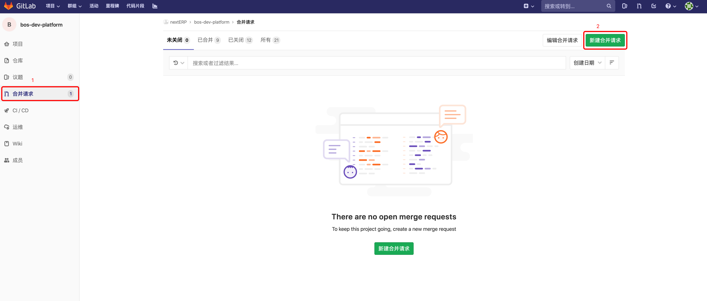

2、选择需要合并来源分支及目标分支（这里来源分支是newBranch，目标分支是baseline）

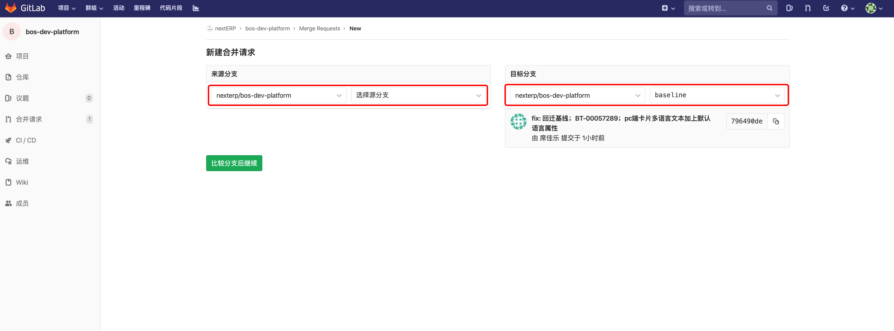

3、完成上述操作后，点击比较分支后继续并添加标题与描述

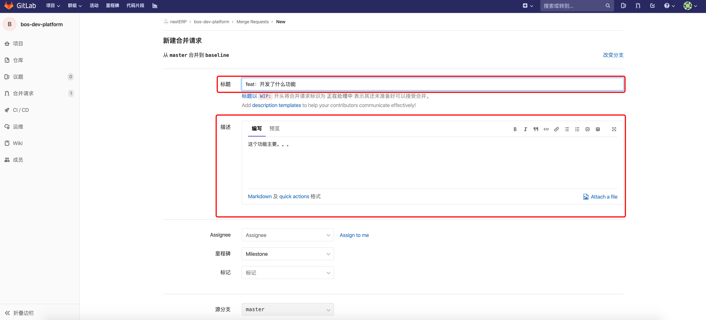


# 附录

参考：E:\zyd\共用\电子书\git\progit_v2.1.52重点参考.pdf

[如何用 SSH 密钥在一台机器上管理多个 GitHub 账户](https://www.freecodecamp.org/chinese/news/manage-multiple-github-accounts-the-ssh-way/)

[如何在一台电脑上管理/切换多个github账户](https://segmentfault.com/a/1190000015055133)
