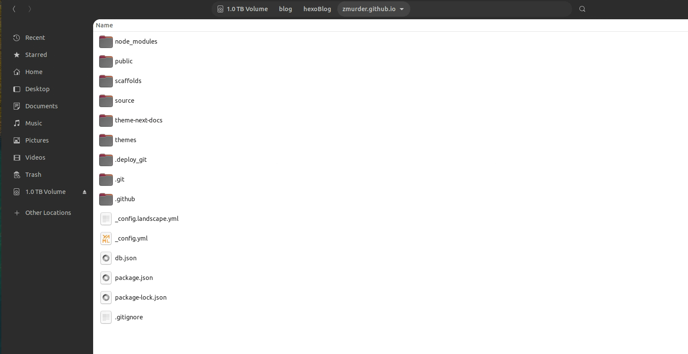
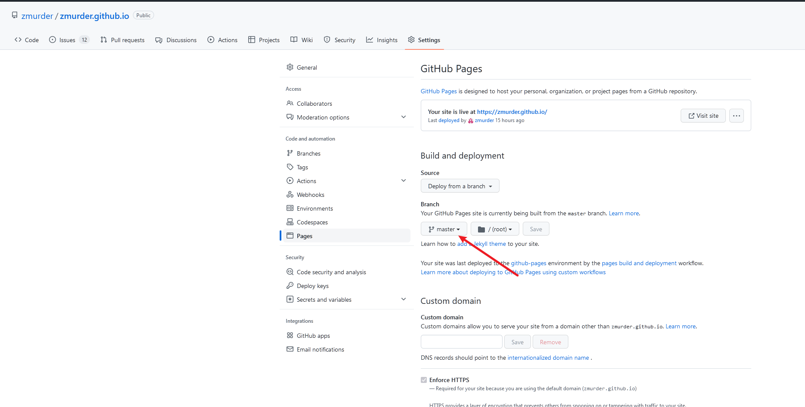
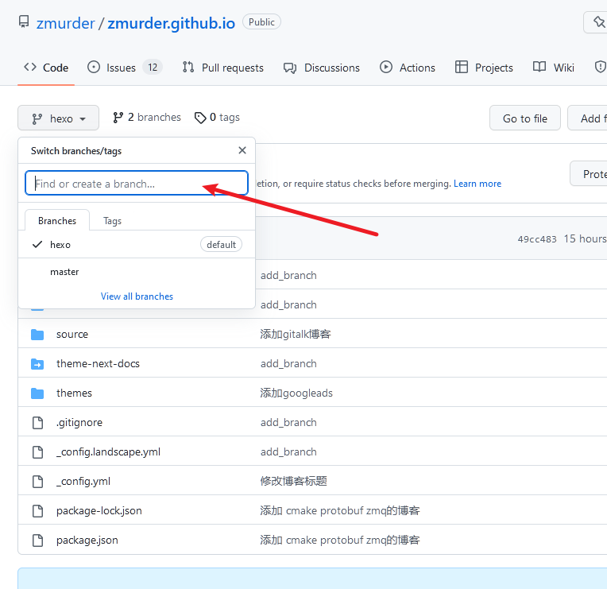
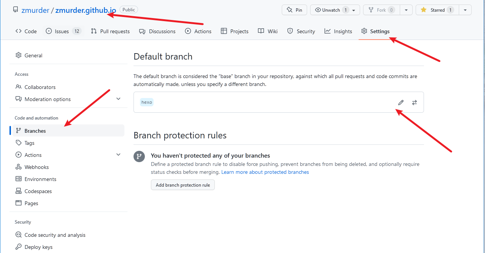
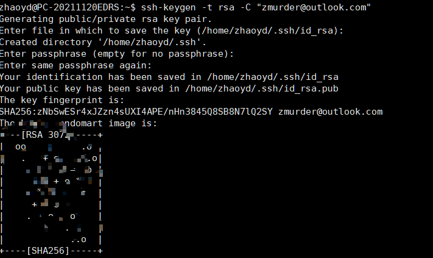
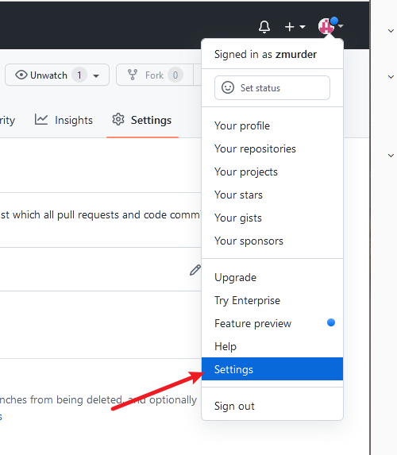
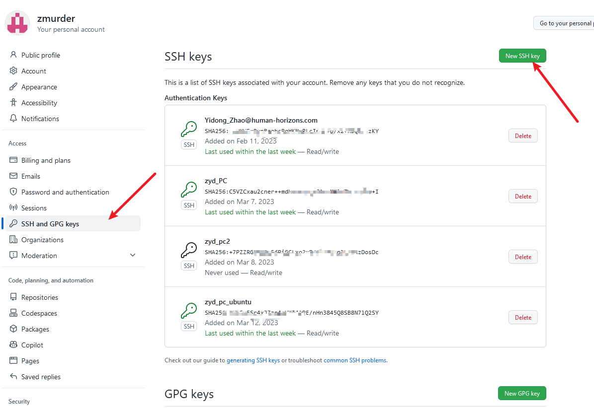
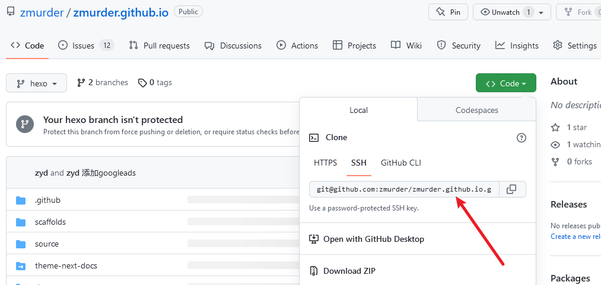
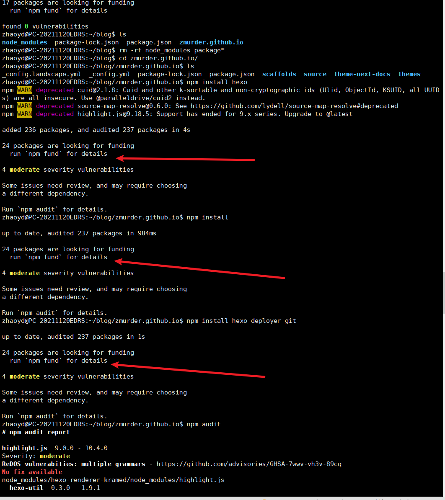

# 背景

由于使用不止一台电脑，而且是一台ubuntu一台windows。希望在两台电脑上都可以随时的更新自己的博客，因此有了以下内容。

参考：https://blog.csdn.net/K1052176873/article/details/122879462

# 1 hexo同步原理

## 1.1 Hexo博客目录结构

老电脑的博客目录如下



| 文件夹        | 说明                                                         | 是否需要上传github |
| ------------- | ------------------------------------------------------------ | ------------------ |
| node_modules  | hexo需要的模块，就是一些基础的npm安装模块，比如一些美化插件，在执行`npm install`的时候会重新生成 | 不需要             |
| themes        | 主题文件                                                     | 需要               |
| public        | hexo g命令执行后生成的静态页面文件                           | 不需要             |
| packages.json | 记录了hexo需要的包的信息，之后换电脑了npm根据这个信息来安装hexo环境 | 需要               |
| _config.yml   | 全局配置文件，这个不用多说了吧                               | 需要               |
| .gitignore    | hexo生成的默认的.gitignore模块                               | 需要               |
| scaffolds     | 文章的模板                                                   | 需要               |
| .deploy_git   | hexo g自动生成的                                             | 不需要             |

### 2. 同步原理

主要思路是利用[git分支](https://so.csdn.net/so/search?q=git分支&spm=1001.2101.3001.7020)来实现hexo的同步。

hexo生成的静态页面文件默认放在master分支上，这是由_config.yml配置文件所决定的

你可以在全局配置文件_config.yml中找到这么一段

```yaml
# Deployment
## Docs: https://hexo.io/docs/one-command-deployment
deploy:
  type: git
  repository: git@github.com:zmurder/zmurder.github.io.git
  branch: master

```

因此每当我们执行hexo d的时候，hexo都会帮我们把生成好的静态页面文件推到master分支上。

在我们第一次部署好博客的时候，github给我们创建的唯一一个分支就是master分支，同时也是默认分支。默认分支就意味着每次我们执行`git clone 仓库地址`或者`git pull 仓库地址`拉取的是默认分支的代码。

但是执行hexo d 对应的分支和默认分支是没有关系的，因为这是由配置文件决定的，配置文件写的哪个分支就是哪个分支。

因此，hexo生成的静态博客文件默认放在master分支上。hexo的源文件（部署环境文件）可以都放在hexo分支上（后面会新创建一个hexo分支）。然后把hexo分支设置成默认分支。有小伙伴可能会担心默认分支的改变会不会影响到原来的网页的正常显示，其实如果是用GitHub Pages对博客进行托管的话也很简单，默认使用master分支作为页面。在下图所示的设置里可以找到。如果不小心搞错了只要把分支设置成静态页面对应的分支就好了。



把hexo分支设置成默认分支，用来存放源文件，master分支依然存放静态文件。在**老电脑**上，我们需要把必要的源文件push到hexo分支。换**新电脑**时，直接`git clone 仓库地址`此时会从hexo分支下载源文件，剩下的就是安装hexo环境，在**新电脑**上就可以重新生成静态页面了，并且因为配置文件clone下来，deploy配置依旧是master分支，所以在**新电脑**上执行`hexo d`还是会把更新过后的静态文件推送到master分支上。

由于master分支和hexo分支实际上是相互独立的两个普通的分支，所以我们源文件和静态页面的更新也是相互独立的，故而需要手动分别执行`git add . git commit git push`来更新源文件,然后执行`hexo d`更新静态页面。

# 2 老电脑上的具体操作

## 2.1 github配置

新建一个hexo分支。在框框里面输入`hexo`，下图是已经创建好的。



设定hexo分支为默认分支



## 2.2 打包将要推送到GitHub上的原始文件

* clone该仓库到本地（clone的是hexo默认分支）

  下面的`git@github.com:username/username.github.io.git`替换成自己仓库的地址

  ```shell
  git clone git@github.com:username/username.github.io.git
  ```

* 下载的文件夹里仅留下.git 文件夹，其他的文件都删除

* 找见我们hexo原位置，将hexo文件夹内除.deploy_git 以外都复制到clone下来的文件夹中

  * 注意：1.现在clone下来的文件夹内应该有个`.gitignore文件`，用来忽略一些不需要的文件，表示这些类型文件不需要git。如果没有，右键新建，内容如下：

    ```c
    .DS_Store
    Thumbs.db
    db.json
    *.log
    node_modules/
    public/
    .deploy*/
    ```

  * 如果已经clone过主题文件，那么需要把theme主题文件夹里的 .git 也删除。因为git不能嵌套上传，最好是显示隐藏文件，检查一下有没有，否则上传的时候会出错，导致你的主题文件无法上传，这样你的配置在别的电脑上就用不了了。

* 将clone并修改以后的文件夹推送到远程库

  ```shell
  git add .
  git commit –m add_branch
  git push
  ```

  此时已经成功将整个网站推送到了远程库的默认分支hexo

* **后续写文章、修改配置后的保存推送操作**

  至此，网站部署至master分支，整个网站备份至hexo分支。当网站的配置或文章修改后都要将远程仓库更新。首先，依次执行

  ```shell
  git add .
  git commit -m ChangeFiles（更新信息内容可改)
  git push （或者git push origin hexo)
  ```

  保证hexo分支版本最新。然后执行

  ```shell
  hexo d -g
  ```

  （在此之前，有时可能需要执行`hexo clean`），完成后就会发现，最新改动已经更新到master分支了，两个分支互不干扰！

# 3 新电脑上的操作

## 3.1 将新电脑的生成的ssh key添加到GitHub账户上

* git安装

```shell
sudo apt-get install git-core
```

  检查是否安装成功！

```bash
git --version
```

* 配置git相关的环境变量

第一次使用Git，需要配置，方便管理，已经配置好的可以忽略这点。

```bash
sudo git config --global user.name "youname"
sudo git config --global user.email "your@email"
```

* 生成秘钥

  ```shell
  sudo ssh-keygen -t rsa -C "your@email"
  ```

  提示如下

  

  在`~/.ssh/`目录下会生成authorized_keys、id_rsa、id_rsa.pub，主要用 id_rsa.pub 绑定项目，邮箱也会收到相关的信息。 

  复制`id_rsa.pub`的内容，在github上进行操作

  

  


## 3.2 clone hexo分支到新电脑

在新电脑上克隆username.github.io仓库的source分支(就是存放源码的分支)到本地，此时本地git仓库处于source分支,可以执行`git branch -v`查看。

下面是我的git 仓库地址

```shell
git clone git@github.com:zmurder/zmurder.github.io.git
```



## 3.3 安装 Node.js和npm

```shell
sudo apt-get update
sudo apt-get install nodejs
sudo apt-get install npm
```

查看nodejs和npm版本号

```shell
nodejs -v
npm -v
```

## 3.4 安装依赖

在新电脑的username.github.io文件夹下执行

```shell
npm install hexo
npm install
npm install hexo-deployer-git
```

就可以安装对应的依赖包了

## 3.5 使用hexo

这时新电脑的环境就和旧电脑一致了，也可以进行各种`hexo`的指令了

```shell
hexo g
hexo s
hexo d
```


# 4 同步更新操作

今后无论是新电脑还是旧电脑，都可以进行博客的编写和推送了。为了保持同步可以在写博客之前进行同步

在username.github.io文件夹下执行

```shell
git pull
```

先拉取最新的改动，然后编写博文。

博文完成后执行

```shell
hexo g
hexo s
hexo d
git add .
git commit -m "博文的改动日志记录"
git push
```

这样就可以了。

# 5 遇到的问题

## 5.1 Run `npm audit` for details

参考 ：https://blog.csdn.net/qq_39816673/article/details/108869299

在新电脑上安装依赖的时候可能会有类似下面的错误

```shell
4 moderate severity vulnerabilities

Some issues need review, and may require choosing
a different dependency.

Run `npm audit` for details
```

应该是版本问题



`npm audit` 是看详细信息的，并不能解决问题，所以咱们需要运行`npm audit fix`，但是并不能解决

 这是因为npm的仓库地址问题，因为我之前用的淘宝镜像，地址指的是淘宝的，所以这时候更改下地址，在操作就行了，更改地址方式如下：

```shell
npm config set registry https://registry.npmjs.org/
```

在这里在给大家推荐一种方式，自我感觉比较好用，就是利用`nrm`，操作步骤如下：

```shell
npm install -g nrm
```

下载完之后，可以查看各个仓库地址，执行以下命令

```shell
nrm ls
```

ok，现在仓库地址已经变成npm的了，接下来，咱们再次执行`npm audit fix`，这时候就成功了.