博客已经有一个框架了，万一有人和我们交流，评论区必不可少。

Hexo的Next主题集成了几种评论插件，可以在themes/next/_config.yml中找到

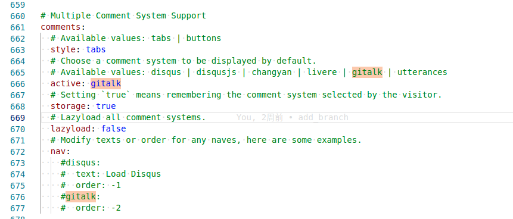

网上看到比较多的是使用的gitalk插件，这里也就使用他了。

# 1 什么是 Gitalk

Gitalk 利用了 [GithubAPI](https://links.jianshu.com/go?to=https%3A%2F%2Fdeveloper.github.com%2Fv3%2F) 基于 GitHub Issue 和 Preact 开发的评论插件，官方网址： [https://gitalk.github.io](https://links.jianshu.com/go?to=https%3A%2F%2Fgitalk.github.io%2F)

## 1.1 Gitalk 特性

- 使用 GitHub 登录
- 支持多语言 [en, zh-CN, zh-TW, es-ES, fr, ru]
- 支持个人或组织
- 无干扰模式（设置 distractionFreeMode 为 true 开启）
- 快捷键提交评论 （cmd|ctrl + enter）

# 2 配置Github的OAuth

这东西可以理解为，一个口令

1 登录Github，依次找到Settings/Developer settings/OAuth Apps，然后New OAuth App，进入申请。按以下格式填写就可以。

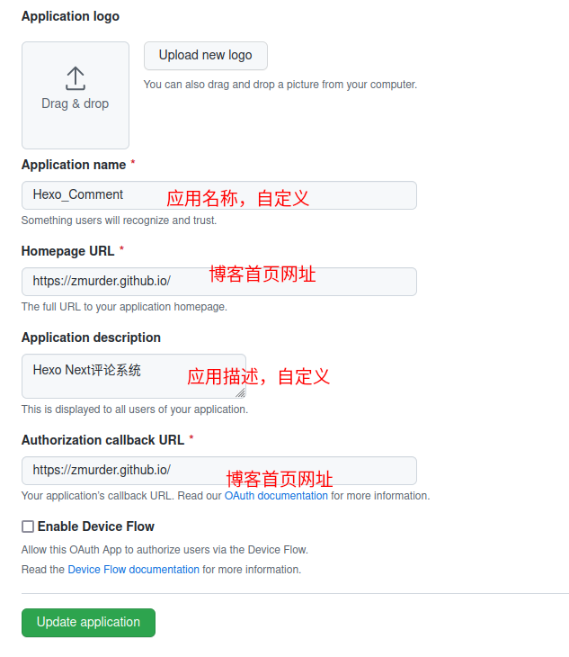

2 记下Clien ID 和Client secrets。Client secrets只显示一次。再次进入就会这样请添加图片描述
当然，要是忘记Client secrets，可以再申请一个新的，并将以前的作废。

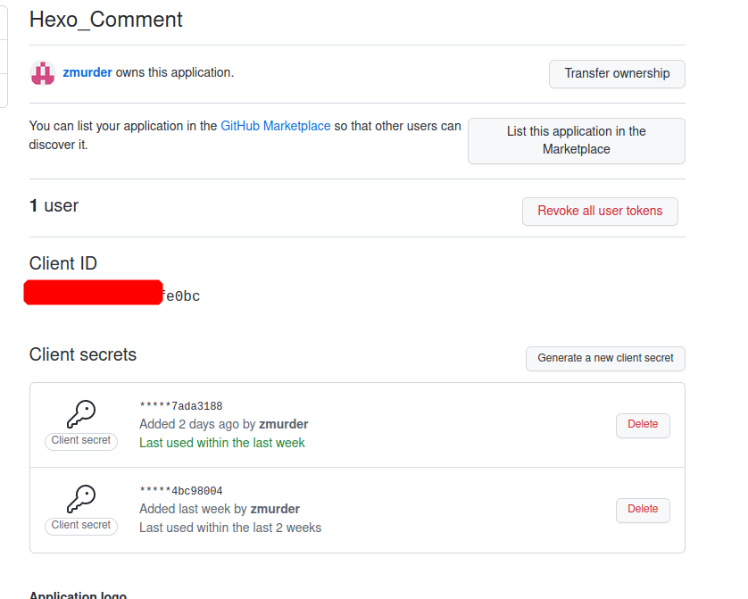

# 3 配置NexT

在themes/next/_config.yml中修改两个地方

**1 启用评论为gitalk**，搜索`comments:`关键字，修改如下

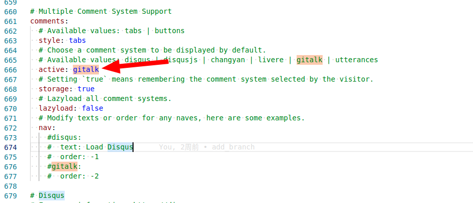

**2 配置gitalk**

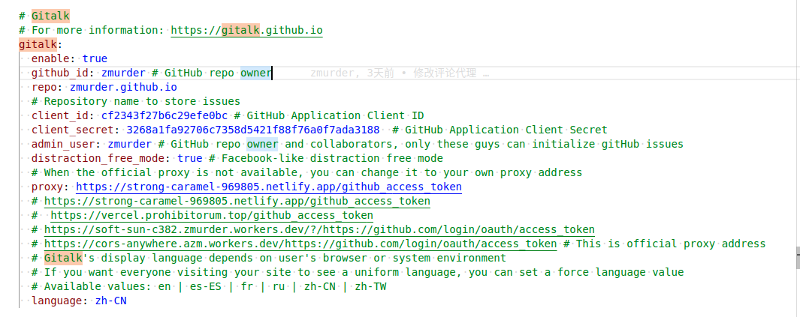

```shell
gitalk:
  enable: true
  github_id: zmurder # GitHub repo owner 
  repo: zmurder.github.io
  # Repository name to store issues
  client_id: cf2343f27b6c29efe0bc # GitHub Application Client ID
  client_secret: 3268a1fa92706c7358d5421f88f76a0f7ada3188  # GitHub Application Client Secret
  admin_user: zmurder # GitHub repo owner and collaborators, only these guys can initialize gitHub issues
  distraction_free_mode: true # Facebook-like distraction free mode
  # When the official proxy is not available, you can change it to your own proxy address
  proxy: https://strong-caramel-969805.netlify.app/github_access_token
  # https://strong-caramel-969805.netlify.app/github_access_token
  #  https://vercel.prohibitorum.top/github_access_token
  # https://soft-sun-c382.zmurder.workers.dev/?/https://github.com/login/oauth/access_token
  # https://cors-anywhere.azm.workers.dev/https://github.com/login/oauth/access_token # This is official proxy address
  # Gitalk's display language depends on user's browser or system environment
  # If you want everyone visiting your site to see a uniform language, you can set a force language value
  # Available values: en | es-ES | fr | ru | zh-CN | zh-TW
  language: zh-CN
  
  
```

* github_id:   填写自己的github用户名

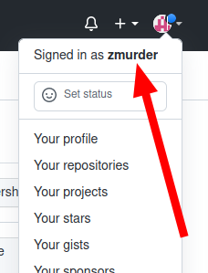

* repo 填写仓库名称，注意这里不是网址，是名称

  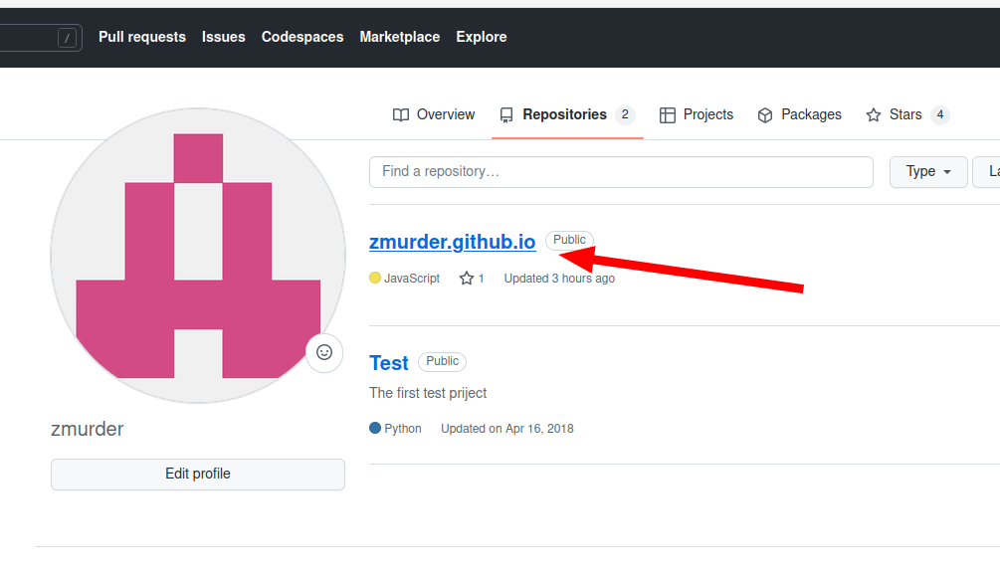

  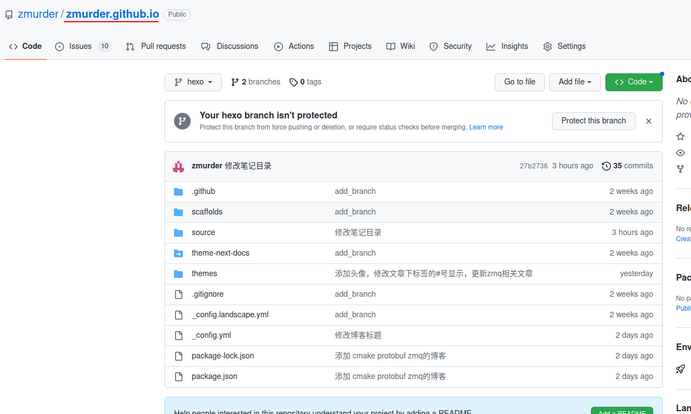

* client_id 和client_secret 就是刚才的OAuth申请的

* admin_user 填写自己的github用户名

* proxy ，使用默认的被墙了，因此用的网友提供的。

* language 设定为中文

设定完成后执行指令：

```bash
hexo clean  # 清除缓存
hexo g
hexo d
```

打开网页以后会看到

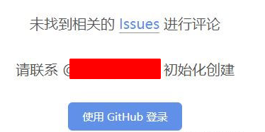

授权后即可在文章底部看到

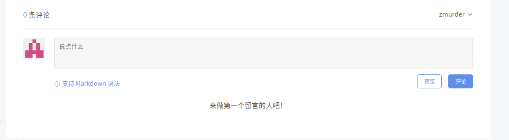

# 4 遇到的问题

## 4.1 Error: Not Found


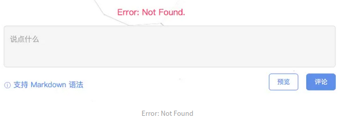

gitalk的Error: Not Found.问题一般都是gitalk的配置有问题，未能正确找到仓库 repo，检查一下你的仓库是否配置正确。

这里也可以使用网页调试看一下

出现问题时按F12，进入网页调试界面

看到如下的消息请求。复制右侧的GET指令，在新的标签页中打开

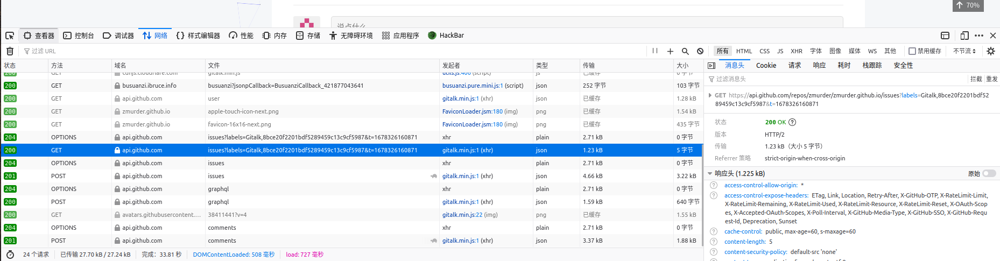

显示如下：提示就是`Not Found`我这里是repo多了一个空格，可以根据自己的进行修改测试。

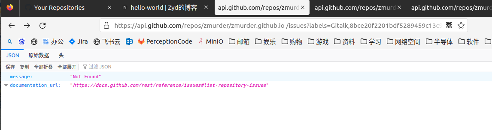

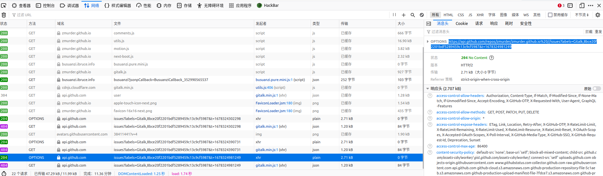

## 4.2 Error:Network Error

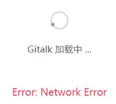

gitalk提示 Gitalk 加载中  Error:Network Error，都是网络被墙了。也就是gitalk配的的proxy有问题了。不能访问了。默认是 https://cors-anywhere.azm.workers.dev/https://github.com/login/oauth/access_token  不能访问，我用的网友提供的，（主要是不会自己建）