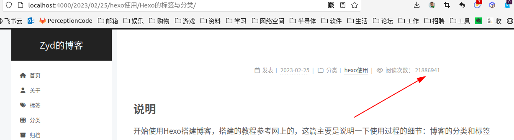
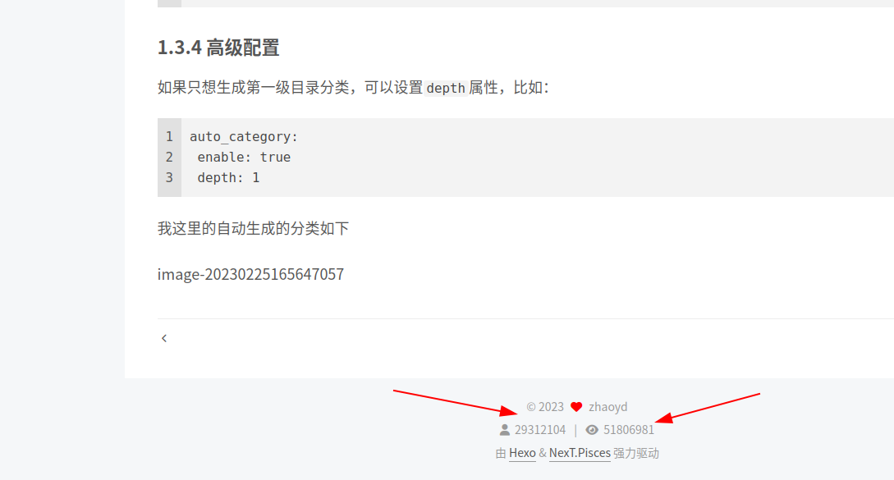
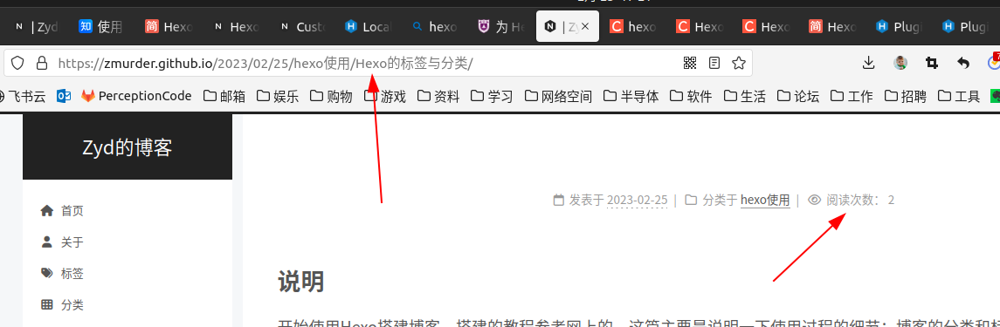

# 说明

使用Hexo 和Next主题，添加访客与阅读统计

**网络有很多博客的统计方法 最方便的就是不蒜子 next主题的较高级的版本内置不蒜子**

打开next主题配置文件\themes\next_config.yml，搜索找到**busuanzi_count**，把enable设置为true

```shell
# Show Views / Visitors of the website / page with busuanzi.
# For more information: http://ibruce.info/2015/04/04/busuanzi/
busuanzi_count:
  enable: true
  total_visitors: true
  total_visitors_icon: fa fa-user
  total_views: true
  total_views_icon: fa fa-eye
  post_views: true
  post_views_icon: far fa-eye
```

同样是在next主题配置文件\themes\next_config.yml下，搜索**footer**，在它底下添加counter，设值为true

```shell
  #统计
  counter: true
```

显示效果如下

文章阅读数



网站访问数



这里看到本地的数字很大，不要紧，部署的显示是正常的。

```shell
hexo d
```


