# 说明

开始使用Hexo搭建博客，搭建的教程参考网上的，这篇主要是说明一下使用过程的细节

# 1 博客分类  category

为什么要分类和标签？

我这里使用的是next主题，首页显示如下

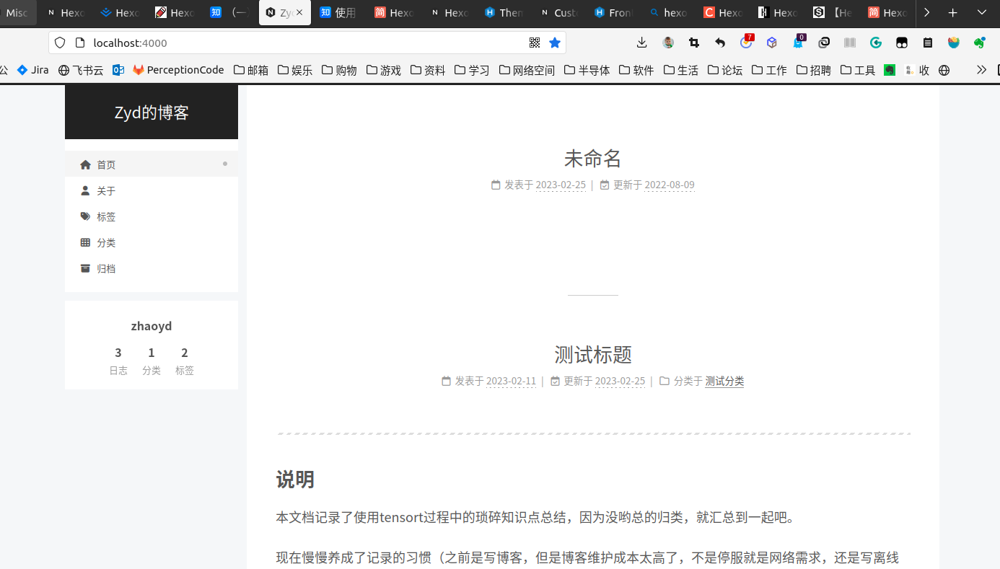

这里没有一个统一分类导航（不知道是不是可以在首页设置，后面学到了再补充吧）。这就导致博客文章毫无条理的放在这里，无法快速定位。因此我们需要依赖分类和标签的功能来组织我们的文章。

## 1.1 创建分类页面

初次使用发布网页后点击“分类”标签会出现类似下面的页面（这里使用点击标签的替代）。


里面是空的，因此需要生成一个分类的页面。

在主文件夹下使用命令

```shell
hexo new page categories
```

提示如下：也就是生成了对应的md文件

```shell
huolin@huolin:/media/zyd/blog/zydblog$ hexo new page categories
INFO  Validating config
INFO  Created: /media/zyd/blog/zydblog/source/categories/index.md
```

打开`source/categories/index.md`文件并编辑如下

```c
title: 文章分类
date: 2023-02-25 16:09:32
type: "categories"
```

使用下面指令生成并启动本地服务

```shell
hexo g
hexo s
```

打开浏览器`http://localhost:4000`点击分类显示如下，只有一个标题，还没有具体的分类。

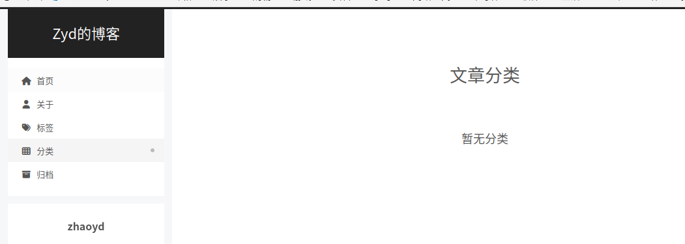

## 1.2 手动给博客添加分类

有了分类的页面，下一步就是给我们的文章进行分类了。

打开我们要发布的博文的md文件，在文件开始添加以下内容

```c
#title:  # 标题
#date: 2019/3/26 hh:mm:ss # 时间
categories: # 分类
- 测试分类
tags: # 测试标签
- GPU
- test
```

重新发布

```shell
hexo g
hexo s
```

可以看到我们的分类页面就会有内容了

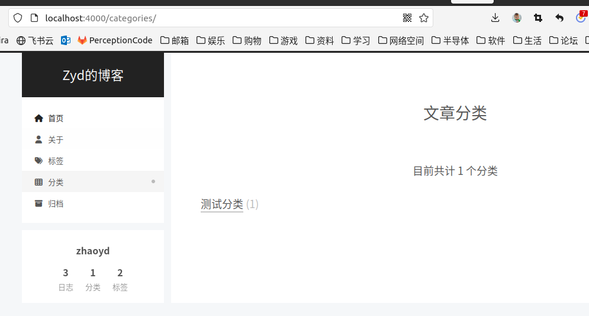

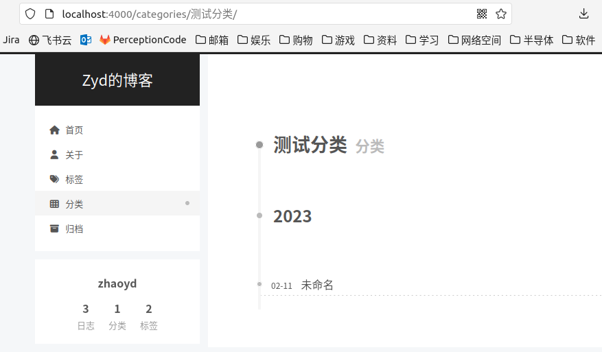

## 1.3 根据目录结构自动生成分类

上面可以编写博客的分类，但是容易出错也麻烦，找到两个插件，可以实现根据目录来自动分类。

[hexo-auto-category](https://github.com/xu-song/hexo-auto-category):Generates categories automatically by folder name

[hexo-enhancer](https://github.com/sisyphsu/hexo-enhancer):a feature enhancement plugin for Hexo, includes auto-title, auto-date, auto-categories, auto-tags, auto-abbrlink. 

推荐使用`hexo-enhancer`。

### 1.3.1 hexo-auto-category 插件

这个插件可以根据目录名称建立分类。

对于博客  `source/_post/web/framework/hexo.md`，该插件会自动生成以下`categories`

```shell
categories:
  - web
  - framework
```

#### 1.3.1.1 安装 hexo-auto-category

使用下面命令安装

```shell
npm install hexo-auto-category --save
```

#### 1.3.1.2 配置

在站点根目录下的`_config.yml`添加：

```shell
# Generate categories from directory-tree
# Dependencies: https://github.com/xu-song/hexo-auto-category
# depth: the depth of directory-tree you want to generate, should > 0
auto_category:
 enable: true
 depth:
```

#### 1.3.1.3 编译 & 部署

```
$ hexo clean && hexo g && hexo d
```

#### 1.3.1.4 高级配置

如果只想生成第一级目录分类，可以设置`depth`属性，比如：

```
auto_category:
 enable: true
 depth: 1
```

我这里的自动生成的分类如下

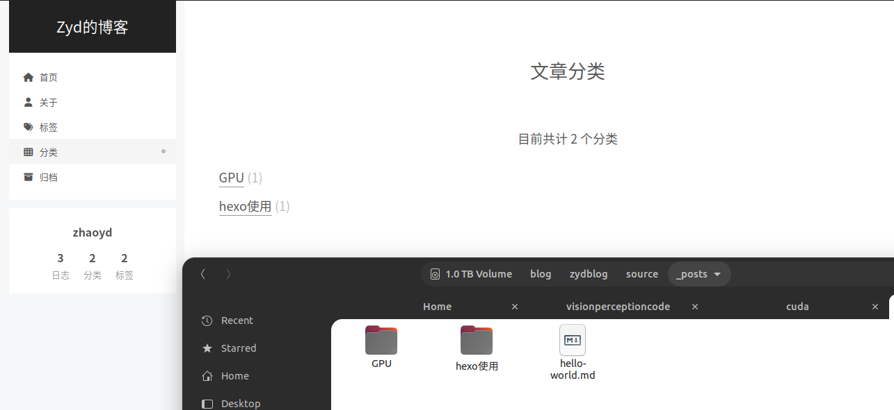

### 1.3.2 hexo-enhancer 插件

这个插件功能非常多，可以自动生成标签、文章title、tag等等。**我这里就是使用这个**。

`hexo-enhancer`是一个Hexo功能增强插件。

此插件支持的功能较多，并且未来会继续增加，可以理解为`插件包`。到目前为止，此插件支持的功能如下：

- 自动生成`title`：根据文件名自动生成标题。
- 自动生成`date`：根据文件名自动生成日期，具体策略类似`Jekyll`。
- 自动生成`abbrlink`：根据标题进行`base32`和`crc32`生成短链接。
- 自动生成`categories`：根据文件的路径解析文章所属分类。
- 自动生成`tags`：根据配置在`_config.yml`中的可用`tags`和`keywords`自动扫描文章中出现的标签。

1.3.2.1 安装

```shell
npm install hexo-enhancer –save
```

`_config.yml` 配置的标签可以是这样的:

```yaml
keywords: HTML, JavaScript, Hexo
tags: Java, Golang, React, Vue
```

`hexo-enhancer` 会扫描您的`.md` 文章，如果文章内出现以上关键词，则自动将其分配如文章的 `tags` 属性中。

需要特别指出的是，`keywords` 是标准配置，它最终会出现在网页 `meta` 中，而 `tags` 是自定义的属性，只会被本插件使用。

效果如下：有分类还有标题。

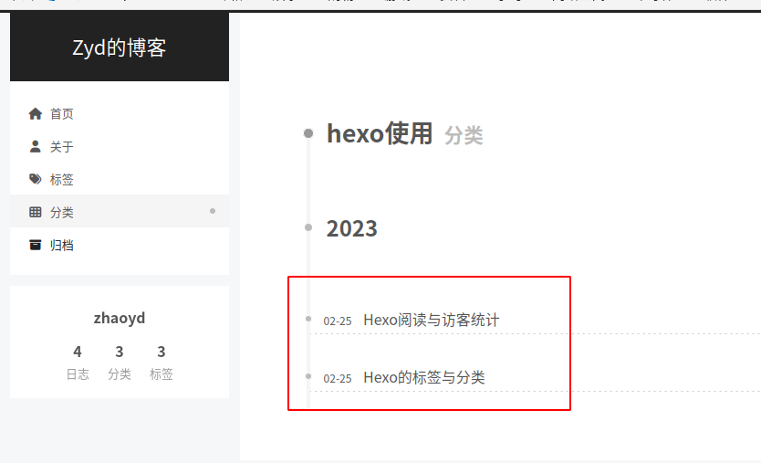


# 2 标签 Tag

标签和分类一样可以对文章进行快速的索引。

## 2.1 创建标签页面

和分类页面一样如果不添加，点击标签显示的是空，如下

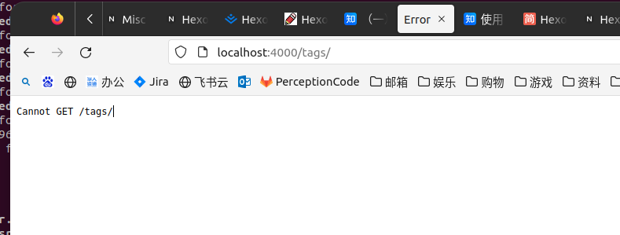

需要创建一个页面来显示。

在根目录（Hexo的`_config.yml`同级目录中）使用下面命令

```shell
hexo new page tags
```

提示如下

```shell
huolin@huolin:/media/zyd/blog/hexoBlog/zmurder.github.io$ hexo new page tags
INFO  Validating config
INFO  Created: /media/zyd/blog/hexoBlog/zmurder.github.io/source/tags/index.md
```

打开上面的`source/tags/index.md`文件，默认内容如下

```shell
title: tags
date: 2023-02-28 17:33:50
```

添加一行如下

```shell
title: tags
date: 2023-02-28 17:33:50
type: "tags"
```

## 2.2 手动给博客添加tag

打开我们要发布的博文的md文件，在文件开始添加以下内容

```c
#title:  # 标题
#date: 2019/3/26 hh:mm:ss # 时间
categories: # 分类
- 测试分类
tags: # 测试标签
- GPU
- test
```

上面的`GPU`和`test`就是这个博文的标签了。

## 2.3 自动添加标签

类似分类的套路，自己写标签太麻烦了，还是以来上面的插件`hexo-enhancer`来自动生成标签。

参考1.3安装完成后，在Hexo的`_config.yml`文件中添加一行如下，这样`hexo-enhancer`就会自动在文章中搜索，找到对应的关键字就会打上标签。

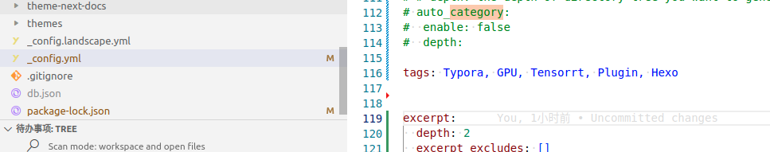

重新发布后显示如下

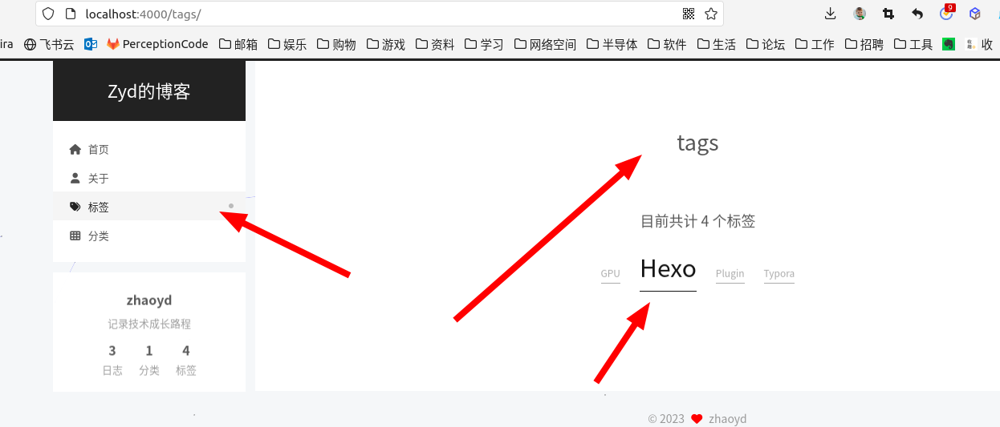

# 3 配合使用typora 图片显示

平时习惯使用typora进行markdown文档的编辑。但是配合Hexo和github的时候图片显示不出来。需要一定的配置，摸索了半天才搞定。

参考：https://cloud.tencent.com/developer/article/1970544

## 3.1  配置 Typora 图片路径

在typora的`文件->偏好设置`中设置图片的相对路经

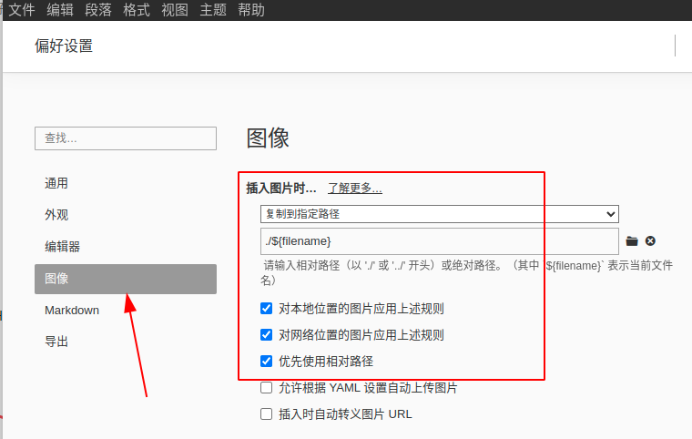

这样每次插入图片就会在同名文件夹下有对应的图片，如下图

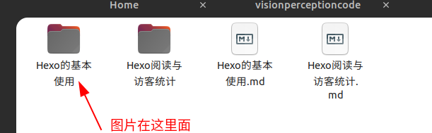

## 3.2 配置 Hexo 图片文件夹

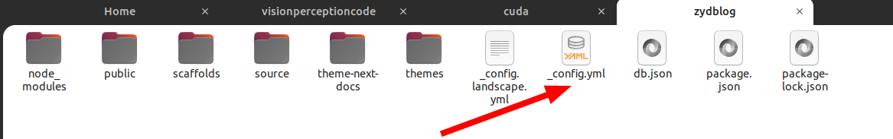

在 Hexo 根目录打开配置文件 `_config.yml`

搜索 `post_asset_folder`，`false` 改为 `true`

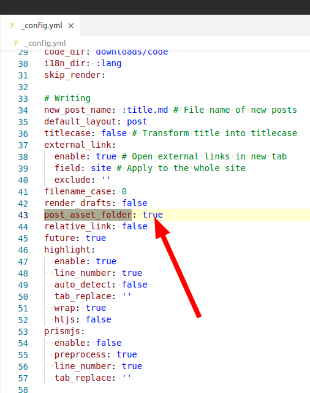

 这样修改后，每次 'hexo new page' 生成新文章，都会在文章文件同级目录创建一个与文章文件名同名的文件夹，我们就在这里存放此文章的图片。 

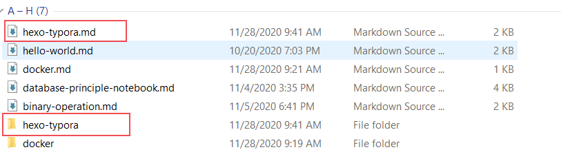

> PS: 这被称为`文章资源文件夹`, 参考官方文档： https://hexo.io/zh-cn/docs/asset-folders

## 3.3 安装插件

```shell
npm install hexo-asset-img --save
```

然后重新部署即可，github也可以看到图片了。

```shell
hexo clean
hexo g
hexo s # 本地预览
```

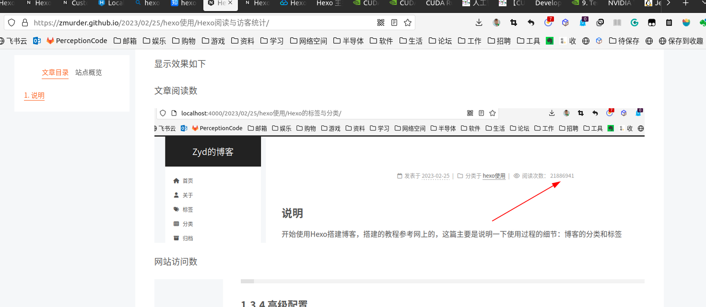

# 3 canvas_nest动画背景

网上的教程都是在next/_config.yml`中的`canvas_nest`改为`true。但是我的没有着一个选项，那时旧版本的方法。因此没办法设定。

为了使背景不那么单调，加入了一个几乎不影响性能的背景动画，配置细节参考[官方说明](https://github.com/theme-next/theme-next-canvas-nest)。 在 `source/_data` 目录 (若不存在则新建一个) 下新建文件 `footer.njk`，内容（默认来自 jsdelivr 但是最近似乎国内访问出现问题，故改成了来自一个国内的 cdnjs 镜像 baomitu）：

```C
<script color="0,0,255" opacity="0.5" zIndex="-1" count="99" src="https://lib.baomitu.com/canvas-nest.js/1.0.1/canvas-nest.js"></script>
```

然后在 NexT 的配置文件中找到 `custom_file_path` 一项将 footer 一行取消注释： 

```xml
custom_file_path:
  footer: source/_data/footer.njk
```

效果如下

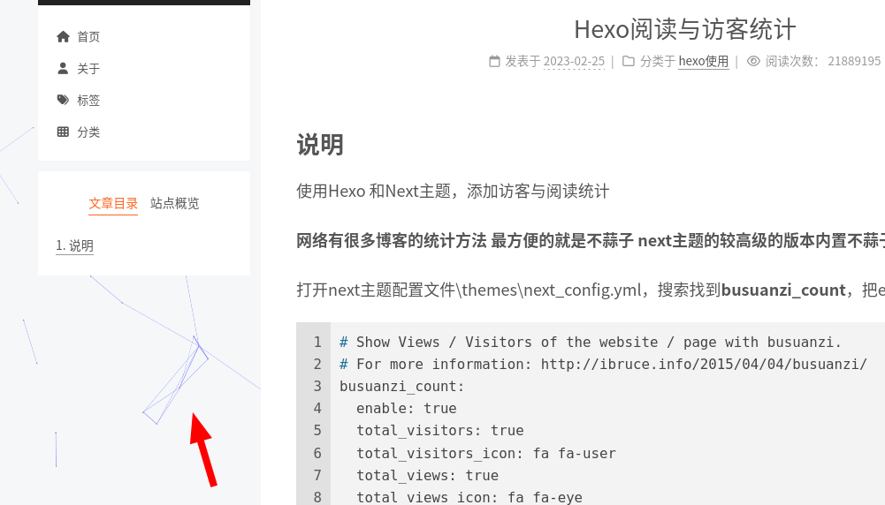
