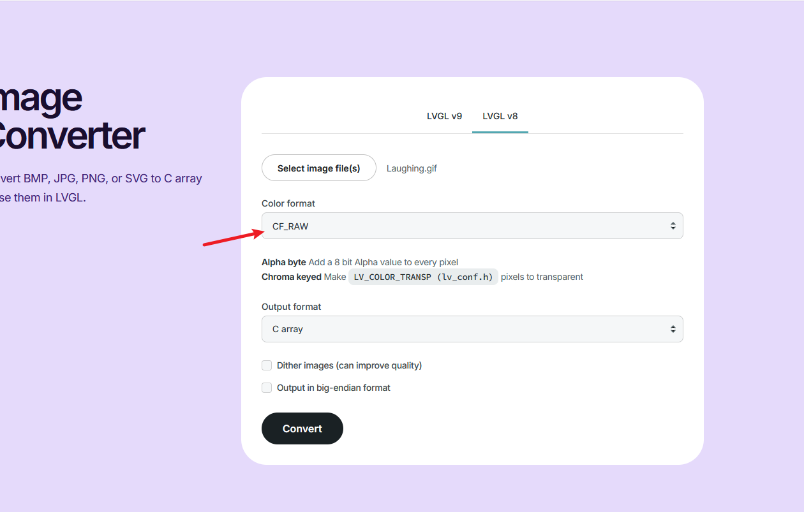
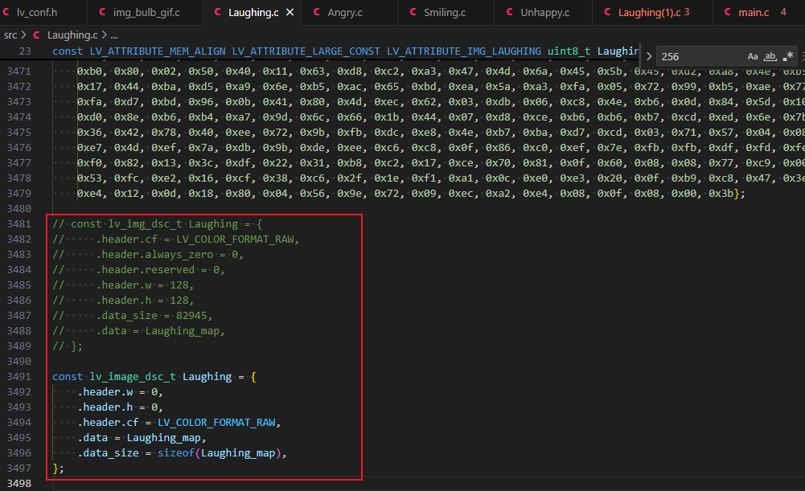
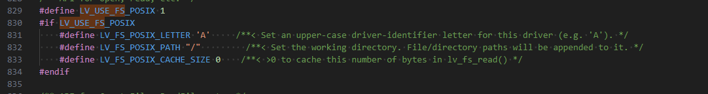

# 简介

我在使用VLGL的gif显示时遇到一点小问题，这里做个记录，LVLG的版本是9.3.0.

# LVLG的gif显示

GIF解码器让我们可以在 LVGL 中使用 GIF 图像。

如果在 `lv_conf.h` 中启用了 `LV_USE_GIF` ，那么可以使用 [lv_gif_create](https://lvgl.100ask.net/master/API/libs/gif/lv_gif.html#_CPPv413lv_gif_createP8lv_obj_t)(parent) 创建 gif 控件，这与 lv_img_create 非常相似。

[lv_gif_set_src](https://lvgl.100ask.net/master/API/libs/gif/lv_gif.html#_CPPv414lv_gif_set_srcP8lv_obj_tPKv)(widget, src) 的工作方式与 [`lv_image_set_src()`](https://lvgl.100ask.net/master/API/widgets/image/lv_image.html#_CPPv416lv_image_set_srcP8lv_obj_tPKv) 非常相似。作为源，它还接受图像作为变量 (`lv_image_dsc_t`) 或文件。

需要注意的是RAM的设置

- `LV_COLOR_DEPTH` `8`: 3 x 图像宽度 x 图像高度
- `LV_COLOR_DEPTH` `16`: 4 x 图像宽度 x 图像高度
- `LV_COLOR_DEPTH` `32`: 5 x 图像宽度 x 图像高度

我这里是16位的，128*128大小的gif图，也就是需要 `4*128*128=65,536=64KByte`的RAM，因此设置一下RAM如下，在lv_conf.h中设置

```c
#define LV_MEM_SIZE (256 * 1024U) 
```

## 使用变量lv_image_dsc_t来显示gif

将gif图片文件上传https://lvgl.io/tools/imageconverter

然后转换为一个.c文件。我测试必须要使用v8的版本来转换gif，否则不显示，选择Color format为 CF_RAW



将生成的.c文件修改一下,



```c
// const lv_img_dsc_t Laughing = {
//     .header.cf = LV_COLOR_FORMAT_RAW,
//     .header.always_zero = 0,
//     .header.reserved = 0,
//     .header.w = 128,
//     .header.h = 128,
//     .data_size = 82945,
//     .data = Laughing_map,
// };

const lv_image_dsc_t Laughing = {
    .header.w = 0,
    .header.h = 0,
    .header.cf = LV_COLOR_FORMAT_RAW,
    .data = Laughing_map,
    .data_size = sizeof(Laughing_map),
};
```

然后就可以使用了。需要先调用一下声明 `LV_IMAGE_DECLARE(Laughing);`

```c
void lv_example_gif_1(void)
{
    LV_IMAGE_DECLARE(Laughing);
    lv_obj_t* img;

    img = lv_gif_create(lv_screen_active());
    lv_gif_set_src(img, &Laughing);
    lv_obj_align(img, LV_ALIGN_LEFT_MID, 20, 0);

}
```

## 使用文件来显示gif

上面使用转换gif为c文件有点麻烦，这里使用文件来显示

In `lv_conf.h` enable `LV_USE_FS_...` and assign an upper cased letter to `LV_FS_..._LETTER` (e.g. `'S'`). After that you can access files using that driver letter. E.g. `"S:path/to/file.txt"`.

首先修改lv_conf.h中的配置

因为我是linux系统，因此使用的是`LV_USE_FS_POSIX`,修改后的如下



，注意这里有一个设置 LV_FS_POSIX_LETTER，我设置的是`A`，因此后面使用的文件路径都写为` "path/to/file.txt" ` 应该是写为` "A:path/to/file.txt".`

同样编写测试代码如下

```c
void lv_example_gif_1(void)
{
    LV_IMAGE_DECLARE(Angry);
    lv_obj_t* img;

    img = lv_gif_create(lv_screen_active());
    /* Assuming a File system is attached to letter 'A'
     * E.g. set LV_USE_FS_STDIO 'A' in lv_conf.h */
    lv_gif_set_src(img, "A:/home/zyd/lvgl_code/resource/Laughing.gif");
    lv_obj_align(img, LV_ALIGN_RIGHT_MID, -20, 0);
}
```


# 附录

* https://lvgl.100ask.net/master/details/libs/gif.html
* https://lvgl.100ask.net/master/details/libs/fs.html