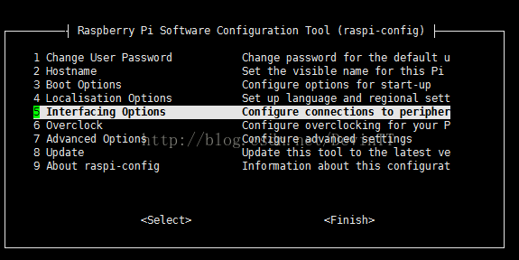
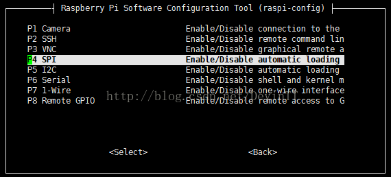
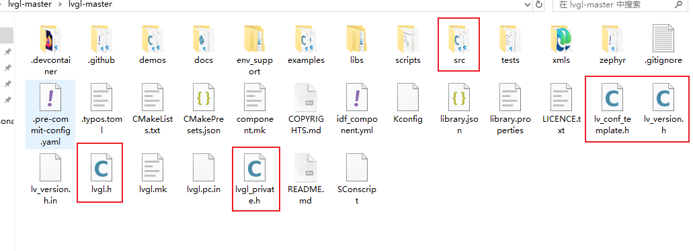

# 简介

我有一个需求是在树莓派3B+上使用SPI屏幕（ili9341），因为我的树莓派系统是不带桌面的系统，我想编写一个程序显示GUI，因此使用下面的硬件组合

* 树莓派3B+
* SPI屏幕（ili9341）

软件层面

* UI显示使用LVGL
* 屏幕的驱动使用fbtft 

# 树莓派的fbtft驱动

## 打开SPI

因为我的屏幕是SPI接口的，最新系统的SPI默认还是关闭的，需要在raspi-config中打开，在终端输入 ：

```bash
sudo raspi-config
```



将spi接口enable就好了。

## 加载 FBTFT 驱动

设置设备树覆盖

我的系统已经默认安装了,内核模块已经存在系统上，因此可以直接加载

```bash

zyd@raspberrypi:~/ccode $ ls /lib/modules/$(uname -r)/kernel/drivers/staging/fbtft/
fb_agm1264k-fl.ko.xz  fb_hx8353d.ko.xz  fb_ili9325.ko.xz  fb_ili9486.ko.xz  fb_s6d1121.ko.xz  fb_ssd1331.ko.xz  fbtft.ko.xz       fb_uc1701.ko.xz
fb_bd663474.ko.xz     fb_hx8357d.ko.xz  fb_ili9340.ko.xz  fb_pcd8544.ko.xz  fb_sh1106.ko.xz   fb_ssd1351.ko.xz  fb_tinylcd.ko.xz  fb_upd161704.ko.xz
fb_hx8340bn.ko.xz     fb_ili9163.ko.xz  fb_ili9341.ko.xz  fb_ra8875.ko.xz   fb_ssd1289.ko.xz  fb_st7735r.ko.xz  fb_tls8204.ko.xz
fb_hx8347d.ko.xz      fb_ili9320.ko.xz  fb_ili9481.ko.xz  fb_s6d02a1.ko.xz  fb_ssd1306.ko.xz  fb_st7789v.ko.xz  fb_uc1611.ko.xz


```

```bash
sudo nano /boot/firmware/config.txt
```

添加的内容如下，就可以在自启动时加载驱动了

```txt

dtparam=spi=on
dtoverlay=spi1-2cs
# 添加 FBTFT 设备树覆盖
dtoverlay=fbtft,spi0-0,ili9341,reset_pin=24,dc_pin=23,led_pin=12,rotate=90,speed=16000000,fps=60,bgr=1

```

- `dtoverlay=fbtft,...`: 这个部分表明我们正在应用一个名为`fbtft`的设备树叠加层，它是一系列用于支持各种小型TFT LCD显示器的驱动程序。
- `spi0-0`: 指定了使用的SPI总线和设备编号。这里的`spi0-0`意味着连接到第一个SPI总线（`spi0`）的第一个设备（`-0`），表示你的显示器是连接在这个特定的SPI通道上的。
- `ili9341`: 显示屏所使用的控制器芯片型号。ILI9341是一种广泛应用于小型TFT LCD显示器的控制器。
- `reset_pin=24`: 定义了与显示器RESET引脚相连的GPIO编号，在这个例子中是GPIO 24。这个引脚用于重置显示模块。
- `dc_pin=23`: 定义了数据/命令(Data/Command)控制引脚对应的GPIO编号，在这里为GPIO 23。此引脚告诉显示器接下来传输的数据是指令还是显示数据。
- `led_pin=12`: 表示背光LED控制引脚对应的GPIO编号，在这里为GPIO 12。你可以通过这个引脚控制LCD背光的开关或亮度。
- `rotate=90`: 设置屏幕的方向，值可以是0、90、180或270，单位是度。这使得你可以根据实际安装方向旋转显示内容。
- `speed=16000000`: 设置SPI通信速度，这里是16MHz。提高这个数值可以加快屏幕刷新速率，但可能不是所有显示器都支持这么高的速度。
- `fps=60`: 设置目标帧率（Frames Per Second），即每秒更新显示的次数。60FPS是一个常见的流畅视频播放帧率。
- `bgr=1`: 这个选项指示驱动程序在将颜色数据发送到显示器之前对其进行转换（从RGB格式转换为BGR格式）。这是因为一些显示器期望接收到的颜色数据顺序与原始数据相反。

设置完成后重启树莓派，**在/dev/目录下出现: /dev/fb1设备**

```bash
zyd@raspberrypi:~/ccode $ ls /dev/fb*
/dev/fb1
```

- **Framebuffers**：Framebuffer 是操作系统与显示硬件之间的接口。它提供了一种方法，让软件可以直接访问显示内存，而不需要了解底层硬件的具体细节。
- **设备文件**：在 Linux 系统中，硬件设备通常通过位于 `/dev` 目录下的特殊文件来访问。对于 framebuffer 设备，这些文件通常命名为 `fb0`, `fb1`, `fb2` 等等，分别对应第一个、第二个、第三个 framebuffer 设备。

- **`/dev/fb0`**：通常是默认的主 framebuffer 设备，连接到系统的主显示器（例如 HDMI 输出）。
- **`/dev/fb1`**：是第二个 framebuffer 设备。这可能用于连接额外的显示屏，如你的 TFT 显示屏或其他类型的显示设备。

我们后面移植LVLG用的显示驱动就是这里的Linux Framebuffer Driver

# 移植LVGL9.3.0

每个版本的LVGL移植还不是特别一致，这里就是版本9.3.0

## 文件拷贝

首先我们从github上下载对应版本的LVGL，下面几个文件是我们需要的。



* 在自己的工程中创建lvgl目录，将上图的src文件夹拷贝到lvgl目录下
* 拷贝lvgl.h 、lvgl_private.h、lv_version.h到lvgl中，与src同级目录
* 拷贝 lv_conf_template.h为 lv_conf.h到项目的根目录。

拷贝后的文件结构如下

```bash
├── CMakeLists.txt
├── lv_conf.h
├── lvgl
│   ├── CMakeLists.txt
│   ├── lvgl.h
│   ├── lvgl_private.h
│   ├── lv_version.h
│   └── src
└── src
    ├── main.c
```

我这里是使用的cmake来维护工程的，根据自己的需求编写即可。

## 初始化LVGL

根据官方文档的描述还需要下面的几个步骤

1. 在系统执行的早期调用 [`lv_init()`](https://lvgl.100ask.net/master/API/lv_init.html#_CPPv47lv_initv) 对 LVGL 进行一次初始化。在进行任何其他 LVGL 调用之前，都需要先完成此项操作。

   也就是在main函数中先调用这个函数，很简单。

2. 初始化您的驱动程序。

   这里需要根据自己的驱动程序类型来设置了，因为我使用了fbtft，因此直接完成，不需要设置。

3. 连接 tick_interface。下面介绍

4. 连接 [Display Interface（显示接口）](https://lvgl.100ask.net/master/intro/add-lvgl-to-your-project/connecting_lvgl.html#display-interface)。

   这里我使用的是Linux Framebuffer Driver,因此很简单

   请在lv_conf.h中启用framebuffer驱动程序支持。

   ```
   #define LV_USE_LINUX_FBDEV           1
   #define LV_LINUX_FBDEV_RENDER_MODE   LV_DISPLAY_RENDER_MODE_PARTIAL
   ```

   使用就

   ```bash
   lv_display_t *disp = lv_linux_fbdev_create();
   lv_linux_fbdev_set_file(disp, "/dev/fb1");
   ```

5. 连接 [Input-Device Interface](https://lvgl.100ask.net/master/intro/add-lvgl-to-your-project/connecting_lvgl.html#indev-interface)。我暂时没有使用

6. 每隔几毫秒调用一次 `lv_timer_handler`来驱动 LVGL 中与时间相关的任务，以管理 LVGL 定时器。有关不同的实现方式，请参考 :ref:`timer_handler()` 部分。下面介绍

7. 可选）使用 [`lv_display_set_theme()`](https://lvgl.100ask.net/master/API/display/lv_display.html#_CPPv420lv_display_set_themeP12lv_display_tP10lv_theme_t) 设置一个主题。

8. 此后，在任何需要使用 LVGL 函数的源文件中包含 “lvgl/lvgl.h” 头文件。 .. _tick_interface:

其中的lv_timer_handler和tick_interface我使用下面来实现,在main函数的while循环中调用

```c
#define LVGL_TICK 5    
while (true)
{
    // printf("while\n");
    delay(LVGL_TICK); /*Sleep for 5 millisecond*/
    lv_task_handler();
    lv_tick_inc(LVGL_TICK); /*Tell LVGL that 5 milliseconds were elapsed*/
}
```

## 测试程序

至此，就算是移植完成了，编写测试程序如下

```c


#include <stdio.h>
#include <stdlib.h>
#include <unistd.h>

#include "lvgl/lvgl.h"

#define LVGL_TICK 5


static void event_handler(lv_event_t* e)
{
    lv_event_code_t code = lv_event_get_code(e);

    if (code == LV_EVENT_CLICKED)
    {
        LV_LOG_USER("Clicked");
    }
    else if (code == LV_EVENT_VALUE_CHANGED)
    {
        LV_LOG_USER("Toggled");
    }
}

void lv_example_btn_1(void)
{
    lv_obj_t* label;

    lv_obj_t* btn1 = lv_btn_create(lv_scr_act());
    lv_obj_add_event_cb(btn1, event_handler, LV_EVENT_ALL, NULL);
    lv_obj_align(btn1, LV_ALIGN_CENTER, 0, -40);

    label = lv_label_create(btn1);
    lv_label_set_text(label, "Button");
    lv_obj_center(label);

    lv_obj_t* btn2 = lv_btn_create(lv_scr_act());
    lv_obj_add_event_cb(btn2, event_handler, LV_EVENT_ALL, NULL);
    lv_obj_align(btn2, LV_ALIGN_CENTER, 0, 40);
    lv_obj_add_flag(btn2, LV_OBJ_FLAG_CHECKABLE);
    lv_obj_set_height(btn2, LV_SIZE_CONTENT);

    label = lv_label_create(btn2);
    lv_label_set_text(label, "Toggle");
    lv_obj_center(label);
}


int main()
{
    // 初始化LVGL
    lv_init();
    lv_display_t* disp = lv_linux_fbdev_create();
    lv_linux_fbdev_set_file(disp, "/dev/fb1");

    lv_example_btn_1();

    while (true)
    {
        // printf("while\n");
        delay(LVGL_TICK); /*Sleep for 5 millisecond*/
        lv_task_handler();
        lv_tick_inc(LVGL_TICK); /*Tell LVGL that 5 milliseconds were elapsed*/
    }
}

```

就可以在屏幕上显示两个按键了。

# 附录

* https://lvgl.100ask.net/master/details/integration/driver/display/fbdev.html

