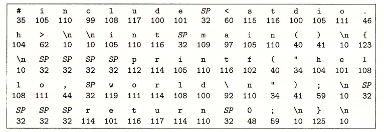

# 1-1 信息就是位+上下文

废话：

上学时期也没有系统的学习过操作系统，前一阵发现了一本经典的书籍《深入理解计算机系统》。一直

比较偷懒没有好好的学习一下。从现在开始吧，总会需要一个开始的。附录是网页版的电子书，自己有一份pdf版本的，但是不能进行复制和粘贴，因此找了网页版的，记笔记的时候最起码可以少打一些字。（自己的打字速度实在是不敢看啊）


通过跟踪hello程序的声明周期来开始对系统的学习。

```c
#include <stdio.h>
int main()
{
    printf("hello, world\n");
    return 0;
}
```

hello 程序的生命周期是从一个**源程序**（或者说源文件）开始的，即程序员通过编辑器创建并保存的文本文件，文件名是 hello.c。源程序实际上就是一个由值 0 和 1 组成的位（又称为比特）序列，8 个位被组织成一组，称为字节。每个字节表示程序中的某些文本字符。

大部分的现代计算机系统都使用 ASCII 标准来表示文本字符，这种方式实际上就是用一个唯一的单字节大小的✦整数值✦来表示每个字符。比如，图 1-2 中给出了 hello.c 程序的 ASCII 码表示。

> ✦整数值✦：有其他编码方式用于表示非英语类语言文本。具体讨论参见 2.1.4 节的旁注。



hello.c 程序是以字节序列的方式储存在文件中的。每个字节都有一个整数值，对应于某些字符。例如，第一个字节的整数值是 35，它对应的就是字符 “#”。第二个字节的整数值为 105，它对应的字符是 ‘i’，依此类推。注意，每个文本行都是以一个看不见的换行符 ‘\n’ 来结束的，它所对应的整数值为 10。像 hello.c 这样只由 ASCII 字符构成的文件称为**文本文件**，所有其他文件都称为**二进制文件**。

hello.c 的表示方法说明了一个基本思想∶系统中所有的信息——包括磁盘文件、内存中的程序、内存中存放的用户数据以及网络上传送的数据，都是由一串比特表示的。**区分不同数据对象的唯一方法是我们读到这些数据对象时的上下文**。比如，在不同的上下文中，一个同样的字节序列可能表示一个整数、浮点数、字符串或者机器指令。 作为程序员，我们需要了解数字的机器表示方式，因为它们与实际的整数和实数是不同的。它们是对真值的有限近似值，有时候会有意想不到的行为表现。这方面的基本原理将在第 2 章中详细描述。

# 1.2 程序被其他程序翻译成不同的格式


# 附录：

[电子书](https://hansimov.gitbook.io/csapp/) 