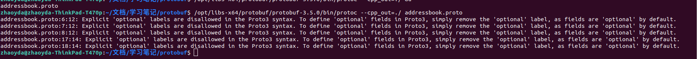

本教程基本上时官方教程的翻译

# 概述

## 是什么

Google Protocol Buffer(简称 Protobuf)是一种轻便高效的结构化数据存储格式，平台无关、语言无关、可扩展，可用于**通讯协议**和**数据存储**等领域。

## 为什么用

* 平台无关，语言无关，可扩展；
* 提供了友好的动态库，使用简单；
* 解析速度快，比对应的XML快约20-100倍；
* 序列化数据非常简洁、紧凑，与XML相比，其序列化之后的数据量约为1/3到1/10。

## 跨语言兼容性

可以使用一个jave程序序列化数据发送给python程序解析

## 向前向后兼容新

按照[规则](https://developers.google.cn/protocol-buffers/docs/proto3#updating)进行升级proto后（规则在后面proto3语言指南中由描述），旧的代码可以读取新的消息，忽略新添加的字段。对于旧代码，被删除的字段将具有其默认值，而被删除的重复字段将为空。

新代码也可以阅读旧消息。旧消息中不会出现新的字段;在这些情况下，protobuf会提供合理的默认值。

设置可选条件和字段类型后，您会分配字段编号。**字段编号不能重新估算或重复使用。如果删除字段，则应保留其字段编号，以防止某人意外地重用该数字**。

**实际测试proto2和proto3也可以兼容，例如一个主机使用proto2发送另一台主机使用proto3接收，相同的proto文件，分别使用proto2和proto3编译为cc和h，通信成功。**


## 编译安装

源码下载地址： https://github.com/google/protobuf 
安装依赖的库： autoconf automake libtool curl make g++ unzip 

```shell
$ ./autogen.sh
$ ./configure
$ make
$ make check
$ sudo make install
```


## 额外的数据类型支持

- [`Duration`](https://github.com/protocolbuffers/protobuf/blob/master/src/google/protobuf/duration.proto)  is a signed, fixed-length span of time, such as 42s. 
- [`Timestamp`](https://github.com/protocolbuffers/protobuf/blob/master/src/google/protobuf/timestamp.proto)  is a point in time independent of any time zone or calendar, such as 2017-01-15T01:30:15.01Z.
- [`Interval`](https://github.com/googleapis/googleapis/blob/master/google/type/interval.proto)  is a time interval independent of time zone or calendar, such as 2017-01-15T01:30:15.01Z - 2017-01-16T02:30:15.01Z. 
- [`Date`](https://github.com/googleapis/googleapis/blob/master/google/type/date.proto)  is a whole calendar date, such as 2025-09-19.
- [`DayOfWeek`](https://github.com/googleapis/googleapis/blob/master/google/type/dayofweek.proto)  is a day of the week, such as Monday.
- [`TimeOfDay`](https://github.com/googleapis/googleapis/blob/master/google/type/timeofday.proto)  is a time of day, such as 10:42:23.
- [`LatLng`](https://github.com/googleapis/googleapis/blob/master/google/type/latlng.proto)  is a latitude/longitude pair, such as 37.386051 latitude and -122.083855 longitude.
- [`Money`](https://github.com/googleapis/googleapis/blob/master/google/type/money.proto)  is an amount of money with its currency type, such as 42 USD.
- [`PostalAddress`](https://github.com/googleapis/googleapis/blob/master/google/type/postal_address.proto)  is a postal address, such as 1600 Amphitheatre Parkway Mountain View, CA 94043 USA.
- [`Color`](https://github.com/googleapis/googleapis/blob/master/google/type/color.proto)  is a color in the RGBA color space.
- [`Month`](https://github.com/googleapis/googleapis/blob/master/google/type/month.proto)  is a month of the year, such as April.

# proto3语言指南

## 导入定义（import）

Import 可选项用于包含其它 proto 文件中定义的 message或 enum等。标准格式如 下

```C
import "info.proto";
```

info.proto文件内容如下：

```C
syntax = "proto3";//指定版本信息，不指定会报错

package infopack; //package声明符

message info //message为关键字，作用为定义一种消息类型
{
    string addr = 1;    //地址
    string group = 2;   //分组
}
```

addressbook.proto文件内容如下，addressbook.proto文件需要导入info.proto文件的内容：

```C
syntax = "proto3";//指定版本信息，不指定会报错

import "info.proto"; //导入定义

package tutorial; //package声明符

message Person //message为关键字，作用为定义一种消息类型
{
    string name = 1;    //姓名
    int32 id = 2;       //id
    string email = 3; //邮件

    enum PhoneType //枚举消息类型
    {
        MOBILE = 0; //proto3版本中，首成员必须为0，成员不应有相同的值
        HOME = 1;
        WORK = 2;
    }

    message PhoneNumber
    {
        string number = 1;
        PhoneType type = 2;
    }

    repeated PhoneNumber phones = 4; //phones为数组

    //info定义在"info.proto"
    //类型格式：包名.信息名
    infopack.info tmp = 5;
}

message AddressBook
{
    repeated Person people = 1;
}
```

编译proto文件

````C
protoc -I=./ --cpp_out=./ *.proto
````

测试程序

```C
#include "addressbook.pb.h"
#include <iostream>
#include <fstream>
using namespace std;

void set_addressbook()
{
    tutorial::AddressBook obj;

    tutorial::Person *p1 = obj.add_people(); //新增加一个Person
    p1->set_name("mike");
    p1->set_id(1);
    p1->set_email("mike@qq.com");

    tutorial::Person::PhoneNumber *phone1 = p1->add_phones(); //增加一个phone
    phone1->set_number("110");
    phone1->set_type(tutorial::Person::MOBILE);

    tutorial::Person::PhoneNumber *phone2 = p1->add_phones(); //增加一个phone
    phone2->set_number("120");
    phone2->set_type(tutorial::Person::HOME);

    //info addr和group的使用
    infopack::info *p_info = p1->mutable_tmp(); //取出info的对象指针
    p_info->set_addr("China");  //地址
    p_info->set_group("A");     //组

    fstream output("pb.xxx", ios::out | ios::trunc | ios::binary);

    bool flag = obj.SerializeToOstream(&output);//序列化
    if (!flag)
    {
        cerr << "Failed to write file." << endl;
        return;
    }

    output.close();//关闭文件
}

void get_addressbook()
{
    tutorial::AddressBook obj;
    fstream input("./pb.xxx", ios::in | ios::binary);
    obj.ParseFromIstream(&input);  //反序列化
    input.close(); //关闭文件

    for (int i = 0; i < obj.people_size(); i++)
    {
        const tutorial::Person& person = obj.people(i);//取第i个people
        cout << "第" << i + 1 << "个信息\n";
        cout << "name = " << person.name() << endl;
        cout << "id = " << person.id() << endl;
        cout << "email = " << person.email() << endl;

        for (int j = 0; j < person.phones_size(); j++)
        {
            const tutorial::Person::PhoneNumber& phone_number = person.phones(j);

            switch (phone_number.type())
            {
            case tutorial::Person::MOBILE:
                cout << "  Mobile phone #: ";
                break;
            case tutorial::Person::HOME:
                cout << "  Home phone #: ";
                break;
            case tutorial::Person::WORK:
                cout << "  Work phone #: ";
                break;
            }

            cout << phone_number.number() << endl;
        }

        //info addr和group的使用
        infopack::info info = person.tmp(); //取出info的对象
        cout << "addr = " << info.addr() << endl;
        cout << "group = " << info.group() << endl;

        cout << endl;
    }
}

int main()
{
    // Verify that the version of the library that we linked against is
    // compatible with the version of the headers we compiled against.
    GOOGLE_PROTOBUF_VERIFY_VERSION;

    set_addressbook(); //序列化
    get_addressbook(); //反序列化

    // Optional:  Delete all global objects allocated by libprotobuf.
    google::protobuf::ShutdownProtobufLibrary();

    return 0;
}
```


# C++开发

## 为什么要用protobuf

我们将要使用的示例是一个非常简单的 “地址簿” 应用程序，可以在文件中读写联系人的详细信息。地址簿中的每个人都有姓名、ID、电子邮件地址和联系电话。

你该如何序列化和反序列化如上结构的数据呢？这里有几种解决方案：

- 可以以二进制形式发送/保存原始内存中数据结构。随着时间的推移，这是一种脆弱的方法，**因为接收/读取代码必须使用完全相同的内存布局、字节顺序等进行编译**。此外，由于文件以原始格式累积数据，并且解析该格式的软件副本四处传播，因此很难扩展格式。
- 你可以发明一种特殊的方法将数据项编码为单个字符串 - 例如将 4 个整数编码为 "12:3:-23:67"。这是一种简单而灵活的方法，虽然它确实需要编写一次性编码和解析的代码，并且解析会产生一些小的运行时成本。但这非常适合非常简单的数据的编码。
- 将数据序列化为 XML。这种方法非常有吸引力，因为 XML（差不多）是人类可读的，并且有许多语言的绑定库。如果你想与其他应用程序/项目共享数据，这可能是一个不错的选择。然而，XML 是众所周知需要更多的空间，并且编码/解码 XML 会对应用程序造成巨大的性能损失。此外，导航 XML DOM 树比通常在类中导航简单字段要复杂得多。

而 Protocol buffers 是灵活，高效，自动化的解决方案。采用 protocol buffers，你可以写一个 `.proto` 文件描述你想要读取的数据的结构。由此， protocol buffer 编译器将创建一个类，该类使用有效的二进制格式实现 protocol buffer 数据的自动编码和解析。生成的类为构成 protocol buffer 的字段提供 getter 和 setter，并负责读写 protocol buffer 单元的细节。重要的是，protocol buffer 的格式支持随着时间的推移扩展格式的想法，使得代码仍然可以读取用旧格式编码的数据。

## 示例代码

示例代码包含在源代码包中的 "examples" 目录下，[Download it here.](https://developers.google.cn/protocol-buffers/docs/downloads)

## 定义proto格式

要创建地址簿应用程序，你需要从 .proto 文件开始。.proto 文件中的定义很简单：为要序列化的每个数据结构添加 message 定义，然后为 message 中的每个字段指定名称和类型。下面就是定义相关 message 的 .proto 文件，addressbook.proto。

```C
syntax = "proto2";

package tutorial;

message Person {
  optional string name = 1;
  optional int32 id = 2;
  optional string email = 3;

  enum PhoneType {
    MOBILE = 0;
    HOME = 1;
    WORK = 2;
  }

  message PhoneNumber {
    optional string number = 1;
    optional PhoneType type = 2 [default = HOME];
  }

  repeated PhoneNumber phones = 4;
}

message AddressBook {
  repeated Person people = 1;
}
```

* 第一行指定正在使用`proto2`语法：如果不这样做，协议缓冲区编译器将假定正在使用proto2。**这也必须是文件的第一个非空的非注释行**。**如果使用proto3必须修改为`proto3`**

  注意：如果上面的proto使用proto3来编译的话会报错，因为proto3删除了required修饰符，需要删除修饰符再编译,另外默认值也删除[参考](https://developers.google.cn/protocol-buffers/docs/proto3#default)

  ```shell
  addressbook.proto:6:12: Explicit 'optional' labels are disallowed in the Proto3 syntax. To define 'optional' fields in Proto3, simply remove the 'optional' label, as fields are 'optional' by default.
  
  ```

  

* package 声明：这有助于防止不同项目之间的命名冲突。在 C++ 中，生成的类将放在与包名匹配的 namespace （命名空间）中。例如定一个类

  ```C++
  tutorial::AddressBook address_book;
  ```

*  message 定义：message 只是包含一组类型字段的集合。许多标准的简单数据类型都可用作字段类型，包括 bool、int32、float、double 和 string。你还可以使用其他 message 类型作为字段类型在消息中添加更多结构 - 在上面的示例中，Person 包含 PhoneNumber message ，而 AddressBook 包含 Person message。你甚至可以定义嵌套在其他 message 中的 message 类型 - 如你所见，PhoneNumber 类型在 Person 中定义。如果你希望其中一个字段具有预定义的值列表中的值，你还可以定义枚举类型 - 此处你指定（枚举）电话号码，它的值可以是 MOBILE，HOME 或 WORK 之一。

* 唯一的编号标签：代表每个字段的一个唯一的编号标签，在同一个消息里不可以重复。这些编号标签用与在消息二进制格式中标识你的字段，并且消息一旦定义就不能更改。需要说明的是标签在1到15范围的采用一个字节进行编码，所以通常将标签1到15用于频繁发生的消息字段。编号标签大小的范围是1到2的29次。19000-19999是官方预留的值，不能使用。

* 注释格式：向.proto文件添加注释，可以使用C/C++/java/Go风格的双斜杠（//） 语法格式或者/*.....*/

* 必须使用以下修饰符之一注释每个字段：

  - **required**: 必须提供该字段的值，否则该消息将被视为“未初始化”。如果是在调试模式下编译 libprotobuf，则序列化一个未初始化的 message 将将导致断言失败。在优化的构建中，将跳过检查并始终写入消息。但是，解析未初始化的消息将始终失败（通过从解析方法返回 false）。除此之外，required 字段的行为与 optional 字段完全相同。**在proto3中字段规则移除了 “required”**不建议使用。
  - **optional**: 可以设置也可以不设置该字段。如果未设置可选字段值，则使用默认值。对于简单类型，你可以指定自己的默认值，就像我们在示例中为电话号码类型所做的那样。否则，使用系统默认值：数字类型为 0，字符串为空字符串，bools 为 false。对于嵌入 message，默认值始终是消息的 “默认实例” 或 “原型”，其中没有设置任何字段。调用访问器以获取尚未显式设置的 optional（或 required）字段的值始终返回该字段的默认值。
  - **repeated**: 该字段可以重复任意次数（包括零次）。重复值的顺序将保留在 protocol buffer 中。可以将 repeated 字段视为动态大小的数组。

## 编译proto文件

已经有了一个 `.proto` 文件，可以生成需要读写`AddressBook`（以及 `Person` 和 `PhoneNumber` ） message 所需的类。为此，你需要在 `.proto` 上运行 protocol buffer 编译器 `protoc`：

1. 如果尚未安装编译器，请 [下载软件包](https://links.jianshu.com/go?to=https%3A%2F%2Fdevelopers.google.com%2Fprotocol-buffers%2Fdocs%2Fdownloads.html) 并按照 README 文件中的说明进行操作。

2. 运行编译器，**指定源目录**（应用程序的源代码所在的位置 - 如果不提供值，则使用当前目录），**目标目录**（你希望生成代码的目标目录;通常与源目录 `$SRC_DIR` 相同），以及 `.proto` 的路径。执行如下命令：

   ```shell
   protoc --proto_path=src --cpp_out=build/gen src/foo.proto src/bar/baz.proto
   # -I 指定proto文件所在的路径 ，是--proto_path的缩写 上面就是在src目录下
   # --cpp_out指定生成的cc和h文件路径
   # 最后是proto文件名 如果有多个ptoto可以空格追加
   ```

   因为你需要 C ++ 类，所以使用 `--cpp_out` 选项 - 当然，为其他支持的语言也提供了类似的选项。

   这将在指定的目标目录中生成以下文件：

   - `addressbook.pb.h`： 类声明的头文件
   - `addressbook.pb.cc`：类实现

3. 可以从生成的.h文件开始部分中看出对应的proto版本，例如下面的表示使用3.5.5版本生成的

   ```C++
   #ifndef PROTOBUF_sim0322_2eproto__INCLUDED
   #define PROTOBUF_sim0322_2eproto__INCLUDED
   
   #include <string>
   
   #include <google/protobuf/stubs/common.h>
   
   #if GOOGLE_PROTOBUF_VERSION < 3005000
   #error This file was generated by a newer version of protoc which is
   #error incompatible with your Protocol Buffer headers.  Please update
   #error your headers.
   #endif
   #if 3005000 < GOOGLE_PROTOBUF_MIN_PROTOC_VERSION
   #error This file was generated by an older version of protoc which is
   #error incompatible with your Protocol Buffer headers.  Please
   #error regenerate this file with a newer version of protoc.
   #endif
   
   ```

   

## The Protocol Buffer API

让我们看看一些生成的代码，看看编译器为你创建了哪些类和函数。如果你查看　addressbook.pb.h，你会发现你在 addressbook.proto 中指定的每条 message 都有一个对应的类。仔细观察 Person 类，你可以看到编译器已为每个字段生成了访问器。例如，对于 name ，id，email 和 phone 字段，你可以使用以下方法（proto2生成的如下）：

```c++
  // name
  inline bool has_name() const;
  inline void clear_name();
  inline const ::std::string& name() const;
  inline void set_name(const ::std::string& value);
  inline void set_name(const char* value);
  inline ::std::string* mutable_name();

  // id
  inline bool has_id() const;
  inline void clear_id();
  inline int32_t id() const;
  inline void set_id(int32_t value);

  // email
  inline bool has_email() const;
  inline void clear_email();
  inline const ::std::string& email() const;
  inline void set_email(const ::std::string& value);
  inline void set_email(const char* value);
  inline ::std::string* mutable_email();

  // phones
  inline int phones_size() const;
  inline void clear_phones();
  inline const ::google::protobuf::RepeatedPtrField< ::tutorial::Person_PhoneNumber >& phones() const;
  inline ::google::protobuf::RepeatedPtrField< ::tutorial::Person_PhoneNumber >* mutable_phones();
  inline const ::tutorial::Person_PhoneNumber& phones(int index) const;
  inline ::tutorial::Person_PhoneNumber* mutable_phones(int index);
  inline ::tutorial::Person_PhoneNumber* add_phones();
```

proto3生成的如下

```C
  // repeated .tutorial.Person.PhoneNumber phones = 4;
  int phones_size() const;
  void clear_phones();
  static const int kPhonesFieldNumber = 4;
  const ::tutorial::Person_PhoneNumber& phones(int index) const;
  ::tutorial::Person_PhoneNumber* mutable_phones(int index);
  ::tutorial::Person_PhoneNumber* add_phones();
  ::google::protobuf::RepeatedPtrField< ::tutorial::Person_PhoneNumber >*
      mutable_phones();
  const ::google::protobuf::RepeatedPtrField< ::tutorial::Person_PhoneNumber >&
      phones() const;

  // string name = 1;
  void clear_name();
  static const int kNameFieldNumber = 1;
  const ::std::string& name() const;
  void set_name(const ::std::string& value);
  #if LANG_CXX11
  void set_name(::std::string&& value);
  #endif
  void set_name(const char* value);
  void set_name(const char* value, size_t size);
  ::std::string* mutable_name();
  ::std::string* release_name();
  void set_allocated_name(::std::string* name);

  // string email = 3;
  void clear_email();
  static const int kEmailFieldNumber = 3;
  const ::std::string& email() const;
  void set_email(const ::std::string& value);
  #if LANG_CXX11
  void set_email(::std::string&& value);
  #endif
  void set_email(const char* value);
  void set_email(const char* value, size_t size);
  ::std::string* mutable_email();
  ::std::string* release_email();
  void set_allocated_email(::std::string* email);

  // int32 id = 2;
  void clear_id();
  static const int kIdFieldNumber = 2;
  ::google::protobuf::int32 id() const;
  void set_id(::google::protobuf::int32 value);
```


### 基本的API

针对proto3生成的分析，下面的都是基于proto3来说明

例如数字id字段

* get的名称与字段完全相同的**小写**，例如email()

* set方法以`set_`开头

* 对于required和optional字段，有`has_`方法，如果有值就会返回true(**proto3没有**)

* 每个字段都有一个 clear_ 方法，可以将字段重新设置回 empty 状态

### 其他API

针对string类型有几个额外的方法（上面的方法也有），例如name和email字段

* 赋值方法除了set_name还有mutable_name和set_allocated_email方法
  * set_name方法和set_allocated_email都是传入的指针，**赋值时需要注意如果是传入的是临时变量的地址，需要注意临时变量的生命周期，如果序列化之前被释放了就会出错**。
  * mutable_name方法，**赋值时候，可以使用局部变量，因为在调用的时，内部做了new操作。**

repeated 字段也有一些特殊的方法，例如phone字段

* 返回数组中成员数 _size（关联的电话号码数），例如 phones_size()

* 返回数组中指定下标所包含元素的引用，如 使用索引获取电话号码，例如phones(int index)

* 返回数组中指定下标所包含元素的指针，如mutable_phones(int index)，可以修改里面的内容

* 向数组中添加一个新的元素，add_方法，返回一个新添加元素的指针，例如add_phones()，add后可以调用set，例如下面，具体使用的整体例子看下面的程序

  ```C++
  tutorial::Person::PhoneNumber* phone_number = person->add_phones();
      phone_number->set_number(number);
  
  ```

## 枚举和嵌套类

生成的代码包含与你的 .proto 枚举对应的 PhoneType 枚举。你可以将此类型称为 Person::PhoneType，其值为 Person::MOBILE，Person::HOME 和 Person::WORK（实现细节稍微复杂一些，但你如果仅仅只是使用不需要理解里面的实现原理）。

编译器还为你生成了一个名为 Person::PhoneNumber 的嵌套类。如果查看代码，可以看到 “真实” 类实际上称为 Person_PhoneNumber，但在 Person 中定义的 typedef 允许你将其视为嵌套类。唯一会造成一点差异的情况是，如果你想在另一个文件中前向声明该类 - 你不能在 C ++ 中前向声明嵌套类型，但你可以前向声明 Person_PhoneNumber。

## 标准Message方法

每个 message 类还包含许多其他方法，可用于检查或操作整个 message，包括：

- `bool IsInitialized() const;`: 检查是否已设置所有必填 required 字段
- `string DebugString() const;`: 返回 message 的人类可读表达，对调试特别有用

- `void CopyFrom(const Person& from);`: 用给定的 message 的值覆盖 message
- `void Clear();`: 将所有元素清除回 empty 状态

这些和下一节中描述的 I/O 方法实现了所有 C++ protocol buffer 类共享的 `Message` 接口。更多的更详细的有关信息，请参阅 [Message 的完整 API 文档](https://links.jianshu.com/go?to=https%3A%2F%2Fdevelopers.google.com%2Fprotocol-buffers%2Fdocs%2Freference%2Fcpp%2Fgoogle.protobuf.message.html%23Message)。

## 序列化和反序列化（解析）

- 每个 message类都提供了写入和读取 message数据的方法，包括

  - bool SerializeToString(string* output) const; 把 message编码进 output 。
  - bool ParseFromString(const string& data); 从 string 解码到 message
  - bool SerializeToArray(char* buf,int size) const; 把 message编码进数组 buf.
  - bool ParseFromArray(const char* buf,int size); 把 buf 解码到 message。解 码方法效率较 ParseFromString高很多，所以一般用这种方法解码。
  - bool SerializeToOstream(ostream* output) const; 把 message编码进 ostream
  - bool ParseFromIstream(istream* input); 从 istream 解码到 message

  备注：发送接收端所使用的加码解码方法不一定非得配对，即发送端用 SerializeToString 接收端不一定非得用 ParseFromString ，可以使用其他解码方法。

这些只是解析和序列化提供的几个选项。请参阅 [Message API 参考](https://links.jianshu.com/go?to=https%3A%2F%2Fdevelopers.google.com%2Fprotocol-buffers%2Fdocs%2Freference%2Fcpp%2Fgoogle.protobuf.message.html%23Message) 以获取完整列表。

下面是编译的protobuf头文件中关于序列化和反序列化的声明在/opt/libs-x64/protobuf/protobuf-3.5.0/include/google/protobuf/message_lite.h中

```C
  // Parsing ---------------------------------------------------------
  // Methods for parsing in protocol buffer format.  Most of these are
  // just simple wrappers around MergeFromCodedStream().  Clear() will be
  // called before merging the input.

  // Fill the message with a protocol buffer parsed from the given input
  // stream. Returns false on a read error or if the input is in the wrong
  // format.  A successful return does not indicate the entire input is
  // consumed, ensure you call ConsumedEntireMessage() to check that if
  // applicable.
  bool ParseFromCodedStream(io::CodedInputStream* input);
  // Like ParseFromCodedStream(), but accepts messages that are missing
  // required fields.
  bool ParsePartialFromCodedStream(io::CodedInputStream* input);
  // Read a protocol buffer from the given zero-copy input stream.  If
  // successful, the entire input will be consumed.
  bool ParseFromZeroCopyStream(io::ZeroCopyInputStream* input);
  // Like ParseFromZeroCopyStream(), but accepts messages that are missing
  // required fields.
  bool ParsePartialFromZeroCopyStream(io::ZeroCopyInputStream* input);
  // Read a protocol buffer from the given zero-copy input stream, expecting
  // the message to be exactly "size" bytes long.  If successful, exactly
  // this many bytes will have been consumed from the input.
  bool ParseFromBoundedZeroCopyStream(io::ZeroCopyInputStream* input, int size);
  // Like ParseFromBoundedZeroCopyStream(), but accepts messages that are
  // missing required fields.
  bool ParsePartialFromBoundedZeroCopyStream(io::ZeroCopyInputStream* input,
                                             int size);
  // Parses a protocol buffer contained in a string. Returns true on success.
  // This function takes a string in the (non-human-readable) binary wire
  // format, matching the encoding output by MessageLite::SerializeToString().
  // If you'd like to convert a human-readable string into a protocol buffer
  // object, see google::protobuf::TextFormat::ParseFromString().
  bool ParseFromString(const string& data);
  // Like ParseFromString(), but accepts messages that are missing
  // required fields.
  bool ParsePartialFromString(const string& data);
  // Parse a protocol buffer contained in an array of bytes.
  bool ParseFromArray(const void* data, int size);
  // Like ParseFromArray(), but accepts messages that are missing
  // required fields.
  bool ParsePartialFromArray(const void* data, int size);


  // Reads a protocol buffer from the stream and merges it into this
  // Message.  Singular fields read from the input overwrite what is
  // already in the Message and repeated fields are appended to those
  // already present.
  //
  // It is the responsibility of the caller to call input->LastTagWas()
  // (for groups) or input->ConsumedEntireMessage() (for non-groups) after
  // this returns to verify that the message's end was delimited correctly.
  //
  // ParsefromCodedStream() is implemented as Clear() followed by
  // MergeFromCodedStream().
  bool MergeFromCodedStream(io::CodedInputStream* input);

  // Like MergeFromCodedStream(), but succeeds even if required fields are
  // missing in the input.
  //
  // MergeFromCodedStream() is just implemented as MergePartialFromCodedStream()
  // followed by IsInitialized().
  virtual bool MergePartialFromCodedStream(io::CodedInputStream* input) = 0;


  // Serialization ---------------------------------------------------
  // Methods for serializing in protocol buffer format.  Most of these
  // are just simple wrappers around ByteSize() and SerializeWithCachedSizes().

  // Write a protocol buffer of this message to the given output.  Returns
  // false on a write error.  If the message is missing required fields,
  // this may GOOGLE_CHECK-fail.
  bool SerializeToCodedStream(io::CodedOutputStream* output) const;
  // Like SerializeToCodedStream(), but allows missing required fields.
  bool SerializePartialToCodedStream(io::CodedOutputStream* output) const;
  // Write the message to the given zero-copy output stream.  All required
  // fields must be set.
  bool SerializeToZeroCopyStream(io::ZeroCopyOutputStream* output) const;
  // Like SerializeToZeroCopyStream(), but allows missing required fields.
  bool SerializePartialToZeroCopyStream(io::ZeroCopyOutputStream* output) const;
  // Serialize the message and store it in the given string.  All required
  // fields must be set.
  bool SerializeToString(string* output) const;
  // Like SerializeToString(), but allows missing required fields.
  bool SerializePartialToString(string* output) const;
  // Serialize the message and store it in the given byte array.  All required
  // fields must be set.
  bool SerializeToArray(void* data, int size) const;
  // Like SerializeToArray(), but allows missing required fields.
  bool SerializePartialToArray(void* data, int size) const;
```


## 写Message

下面地址簿应用程序能够做的第一件事是将个人详细信息写入地址簿文件。为此，您需要创建并填充协议缓冲区类的实例，然后将它们写入输出流。下面是一个程序，它从一个文件中读取一个AddressBook，根据用户输入添加一个新的Person到它，并再次将新的AddressBook写回文件。

```c++
#include <iostream>
#include <fstream>
#include <string>
#include "addressbook.pb.h"
using namespace std;

// This function fills in a Person message based on user input.
void PromptForAddress(tutorial::Person* person) {
  cout << "Enter person ID number: ";
  int id;
  cin >> id;
  person->set_id(id);//直接调用set方法设置id
  cin.ignore(256, '\n');

  cout << "Enter name: ";
  getline(cin, *person->mutable_name());//注意这里字符串的赋值方式不是set方法

  cout << "Enter email address (blank for none): ";
  string email;
  getline(cin, email);
  if (!email.empty()) {
    person->set_email(email);//这里也是字符串的赋值，但是用的set方法，email临时变量，不懂string类型。还是不要用了
  }

  while (true) {
    cout << "Enter a phone number (or leave blank to finish): ";
    string number;
    getline(cin, number);
    if (number.empty()) {
      break;
    }
	//person里面的repeated修饰的phone_number 需要先add 然后set
    //需要定义一个tutorial::Person::PhoneNumber指针类型 因为person的add函数返回的是该类型的指针，在这个指针上set就改变了person里面的number
    tutorial::Person::PhoneNumber* phone_number = person->add_phones();
    phone_number->set_number(number);

    cout << "Is this a mobile, home, or work phone? ";
    string type;
    getline(cin, type);
    if (type == "mobile") {
      phone_number->set_type(tutorial::Person::MOBILE);//枚举类型使用
    } else if (type == "home") {
      phone_number->set_type(tutorial::Person::HOME);
    } else if (type == "work") {
      phone_number->set_type(tutorial::Person::WORK);
    } else {
      cout << "Unknown phone type.  Using default." << endl;
    }
  }
}

// Main function:  Reads the entire address book from a file,
//   adds one person based on user input, then writes it back out to the same
//   file.
int main(int argc, char* argv[]) {
  // Verify that the version of the library that we linked against is
  // compatible with the version of the headers we compiled against.
  GOOGLE_PROTOBUF_VERIFY_VERSION;

  if (argc != 2) {
    cerr << "Usage:  " << argv[0] << " ADDRESS_BOOK_FILE" << endl;
    return -1;
  }

  tutorial::AddressBook address_book;

  {
    // Read the existing address book.
    fstream input(argv[1], ios::in | ios::binary);
    if (!input) {
      cout << argv[1] << ": File not found.  Creating a new file." << endl;
    } else if (!address_book.ParseFromIstream(&input)) {
      cerr << "Failed to parse address book." << endl;
      return -1;
    }
  }

  // Add an address. 调用add函数添加一个people
  PromptForAddress(address_book.add_people());

  {
    // Write the new address book back to disk.
    fstream output(argv[1], ios::out | ios::trunc | ios::binary);
   	//序列化
      if (!address_book.SerializeToOstream(&output)) {
      cerr << "Failed to write address book." << endl;
      return -1;
    }
  }

  // Optional:  Delete all global objects allocated by libprotobuf.
  google::protobuf::ShutdownProtobufLibrary();

  return 0;
}

```

在程序结束时调用 ShutdownProtobufLibrary()。所有这一切都是删除 Protocol Buffer 库分配的所有全局对象。对于大多数程序来说这是不必要的，因为该过程无论如何都要退出，并且操作系统将负责回收其所有内存。但是，如果你使用了内存泄漏检查程序，该程序需要释放每个最后对象，或者你正在编写可以由单个进程多次加载和卸载的库，那么你可能希望强制使用 Protocol Buffers 来清理所有内容。

把proto文件放在这里方便查阅

```c++
syntax = "proto2";

package tutorial;

message Person {
  optional string name = 1;
  optional int32 id = 2;
  optional string email = 3;

  enum PhoneType {
    MOBILE = 0;
    HOME = 1;
    WORK = 2;
  }

  message PhoneNumber {
    optional string number = 1;
    optional PhoneType type = 2 [default = HOME];
  }

  repeated PhoneNumber phones = 4;
}

message AddressBook {
  repeated Person people = 1;
}
```


## 读Message

```c++
#include <iostream>
#include <fstream>
#include <string>
#include "addressbook.pb.h"
using namespace std;

// Iterates though all people in the AddressBook and prints info about them.
void ListPeople(const tutorial::AddressBook& address_book) {
   //获取people元素的数量 
  for (int i = 0; i < address_book.people_size(); i++) {
      //因为是repeated修饰符 因此定义一个tutorial::Person& person类型，获取元素个数
      //&是一个引用，也就是变量的别名。参考 https://blog.csdn.net/qq_25814297/article/details/103829775
    const tutorial::Person& person = address_book.people(i);
	//获取id
    cout << "Person ID: " << person.id() << endl;
    //获取字符类型的name 和获取id一样
    cout << "  Name: " << person.name() << endl;
    if (person.has_email()) {
      cout << "  E-mail address: " << person.email() << endl;
    }
	//同样PhoneNumber是 repeated修饰符
    for (int j = 0; j < person.phones_size(); j++) {
      const tutorial::Person::PhoneNumber& phone_number = person.phones(j);

      switch (phone_number.type()) {
        case tutorial::Person::MOBILE:
          cout << "  Mobile phone #: ";
          break;
        case tutorial::Person::HOME:
          cout << "  Home phone #: ";
          break;
        case tutorial::Person::WORK:
          cout << "  Work phone #: ";
          break;
      }
      cout << phone_number.number() << endl;
    }
  }
}

// Main function:  Reads the entire address book from a file and prints all
//   the information inside.
int main(int argc, char* argv[]) {
  // Verify that the version of the library that we linked against is
  // compatible with the version of the headers we compiled against.
  GOOGLE_PROTOBUF_VERIFY_VERSION;

  if (argc != 2) {
    cerr << "Usage:  " << argv[0] << " ADDRESS_BOOK_FILE" << endl;
    return -1;
  }

  tutorial::AddressBook address_book;

  {
    // Read the existing address book.
    fstream input(argv[1], ios::in | ios::binary);
    //反序列化
    if (!address_book.ParseFromIstream(&input)) {
      cerr << "Failed to parse address book." << endl;
      return -1;
    }
  }

  ListPeople(address_book);

  // Optional:  Delete all global objects allocated by libprotobuf.
  google::protobuf::ShutdownProtobufLibrary();

  return 0;
}

```

## 另一个读写Message的例子

```c++
#include <iostream>
#include "addressbook.pb.h"

int main(int argc, const char* argv[])
{
    addressbook::AddressBook person;
    addressbook::Person* pi = person.add_person_info();

    pi->set_name("aut");
    pi->set_id(1219);
    std::cout << "before clear(), id = " << pi->id() << std::endl;
    pi->clear_id();
    std::cout << "after  clear(), id = " << pi->id() << std::endl;
    pi->set_id(1087);
    if (!pi->has_email())
        pi->set_email("autyinjing@126.com");

    addressbook::Person::PhoneNumber* pn = pi->add_phone();
    pn->set_number("021-8888-8888");
    pn = pi->add_phone();
    pn->set_number("138-8888-8888");
    pn->set_type(addressbook::Person::MOBILE);

    uint32_t size = person.ByteSize();
    unsigned char byteArray[size];
    person.SerializeToArray(byteArray, size);

    addressbook::AddressBook help_person;
    help_person.ParseFromArray(byteArray, size);
    addressbook::Person help_pi = help_person.person_info(0);

    std::cout << "*****************************" << std::endl;
    std::cout << "id:    " << help_pi.id() << std::endl;
    std::cout << "name:  " << help_pi.name() << std::endl;
    std::cout << "email: " << help_pi.email() << std::endl;

    for (int i = 0; i < help_pi.phone_size(); ++i)
    {
        auto help_pn = help_pi.mutable_phone(i);
        std::cout << "phone_type: " << help_pn->type() << std::endl;
        std::cout << "phone_number: " << help_pn->number() << std::endl;
    }
    std::cout << "*****************************" << std::endl;

    return 0;
}
```


## 扩展一个 Protocol Buffer

在发布使用 protocol buffer 的代码之后，无疑早晚有一天你将会想要 “改进” protocol buffer 的定义。如果你希望你的新 buffer 向后兼容，并且你的旧 buffer 是向前兼容的（实际上你一定想要这种兼容性） - 那么你需要遵循一些规则。在新版本的 protocol buffer 中：

- **你不得更改任何现有字段的字段编号**
- **你不得添加或删除任何 required 字段**
- **你可以删除 optional 或 repeated 的字段**
- **你可以添加新的 optional 或 repeated 字段，但必须使用新的标记号（即从未在此协议缓冲区中使用的编号，甚至包括那些已删除的字段的编号）**

（这些规则有一些 [例外](https://links.jianshu.com/go?to=https%3A%2F%2Fdevelopers.google.com%2Fprotocol-buffers%2Fdocs%2Fproto%23updating)，但它们很少使用）。

如果你遵循这些规则，旧代码将很乐意阅读新消息并简单地忽略任何新字段。对于旧代码，已删除的可选字段将只具有其默认值，删除的重复字段将为空。新代码也将透明地读取旧消息。但是，请记住旧的 message 中不会出现新的可选字段，因此你需要明确通过调用  has_ 方法来检查它们是否被设置，或者在字段编号后面使用 [default = value] 在 .proto 文件中提供合理的默认值。如果未为 optional 元素指定默认值，则使用特定于类型的默认值：对于字符串，默认值为空字符串。对于布尔值，默认值为 false。对于数字类型，默认值为零。另请注意，如果添加了新的 repeated 字段，则新代码将无法判断它是否为空（通过新代码）或从未设置（通过旧代码），因为它没有 has_ 标志。


# 附录

protobuf 官网：https://developers.google.cn/protocol-buffers

官方教程：https://developers.google.cn/protocol-buffers/docs/overview

博客参考：[ProtoBuf 官方文档（一）- 开发者指南]( https://www.jianshu.com/p/bdd94a32fbd1) [Protobuf学习 - 入门](https://www.cnblogs.com/autyinjing/p/6495103.html) [protobuf 使用](https://www.cnblogs.com/bwbfight/p/14994494.html)