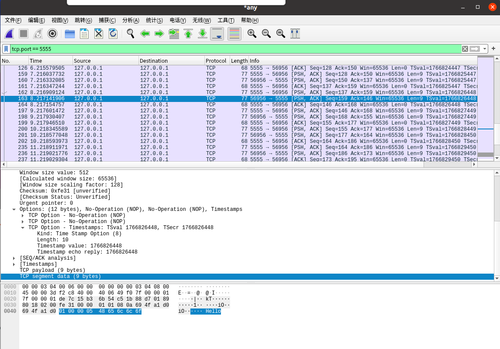
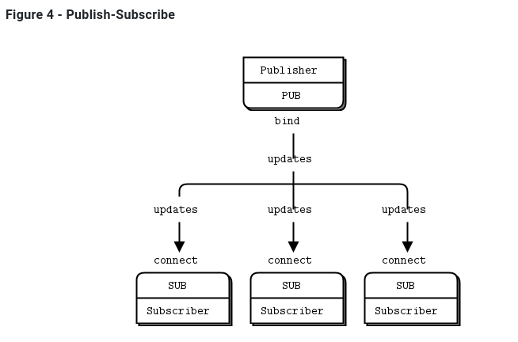
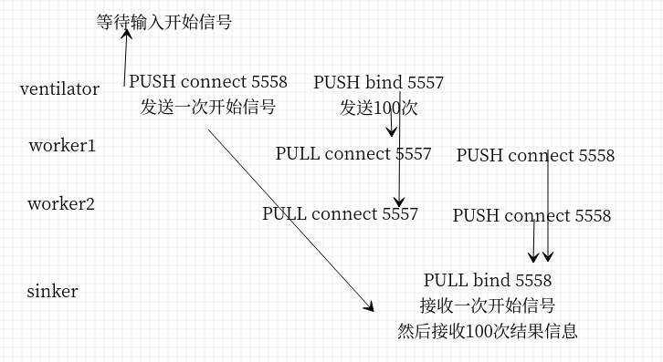
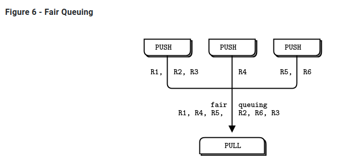

# 1 ZMQ基础

## 1.1 获取例子

这些例子存在于一个公共的GitHub库中。获取所有示例的最简单方法是克隆这个存储库

```shell
git clone --depth=1 https://github.com/imatix/zguide.git
```

浏览examples子目录。你会通过语言找到例子。

## 1.2 请求应答 Request-Reply

从Hello  World的例子开始。我们将创建一个客户机和一个服务器。客户端向服务器发送“Hello”，服务器以“World”作为响应。这是C语言的服务器，它在端口5555上打开一个ZeroMQ scoket，读取请求，然后用“World”对每个请求进行响应:


REQ-REP套接字对是**同步的**。客户机在循环中发出zmq_send()然后zmq_recv()，在循环中(或者只需要执行一次)。执行任何其他序列(例如，在一行中发送两条消息)都会导致send或recv调用返回的代码为-1。类似地，服务按这个顺序发出zmq_recv()然后zmq_send()。

```C
//  Hello World server
//hwserver.c

#include <zmq.h>
#include <stdio.h>
#include <unistd.h>
#include <string.h>
#include <assert.h>

int main (void)
{
    //  Socket to talk to clients
    void *context = zmq_ctx_new ();
    void *responder = zmq_socket (context, ZMQ_REP);
    int rc = zmq_bind (responder, "tcp://*:5555");
    assert (rc == 0);

    while (1) {
        char buffer [10];
        zmq_recv (responder, buffer, 10, 0);
        printf ("Received Hello\n");
        sleep (1);          //  Do some 'work'
        zmq_send (responder, "World", 5, 0);
    }
    return 0;
}


```

```C
//  Hello World client
//hwclient.c
#include <zmq.h>
#include <string.h>
#include <stdio.h>
#include <unistd.h>

int main (void)
{
    printf ("Connecting to hello world server...\n");
    void *context = zmq_ctx_new ();
    void *requester = zmq_socket (context, ZMQ_REQ);
    zmq_connect (requester, "tcp://localhost:5555");

    int request_nbr;
    for (request_nbr = 0; request_nbr != 10; request_nbr++) {
        char buffer [10];
        printf ("Sending Hello %d...\n", request_nbr);
        zmq_send (requester, "Hello", 5, 0);
        zmq_recv (requester, buffer, 10, 0);
        printf ("Received World %d\n", request_nbr);
    }
    zmq_close (requester);
    zmq_ctx_destroy (context);
    return 0;
}

```

**上面的代码如果杀死服务器(Ctrl-C)并重新启动它，客户端将无法正常恢复（杀死客户端重启客户端可以恢复）。**创建一个可靠的请求应答参考后面。

* 分析：
  * server和client的启动顺序无关，都可以运行。
  * client 先调用send，后调用recv。server先调用recv，后调用send。
  * 杀掉client，再启动。server无影响
  * 杀掉server，再启动。client不能通信。原因不详

## 1.3 字符串

除了以字节为单位的大小外，ZeroMQ对您发送的数据一无所知。这意味着您要负责安全地格式化它，以便应用程序能够读取它。为对象和复杂数据类型执行此操作是专门库(如 Protocol Buffers.)的工作。但即使是字符串，你也要小心。

在C语言和其他一些语言中，字符串以空字节结束。我们可以发送一个字符串，如“HELLO”与额外的空字节:

```C
zmq_send (requester, "Hello", 6, 0);//需要包含5个字符和一个结束符
```

但是，如果您从另一种语言发送一个字符串，它可能不会包含那个空字节。例如，当我们用Python发送相同的字符串时，我们这样做:

```python
socket.send ("Hello")
```

会发送一个长度和对应的字符如下图


实际的抓包如下图




如果您从C程序中读取这段代码，您将得到一个看起来像字符串的东西，并且可能意外地表现得像字符串(如果幸运的话，这5个字节后面跟着一个无辜的潜伏的null)，但是它不是一个正确的字符串。当您的客户机和服务器不同意字符串格式时，您将得到奇怪的结果。

当您在C语言中从ZeroMQ接收字符串数据时，您不能简单地相信它已经安全终止。每次读取字符串时，都应该为额外的字节分配一个带空间的新缓冲区，复制字符串，并使用null正确地终止它。

因此，让我们建立一个规则，即ZeroMQ字符串是指定长度的，并且在传输时不带null。在最简单的情况下(在我们的示例中我们将这样做)，ZeroMQ字符串整洁地映射到ZeroMQ消息框架，它看起来像上面的图—长度和一些字节。

在C语言中，我们需要做的是接收一个ZeroMQ字符串并将其作为一个有效的C字符串发送给应用程序:

```C
//  Receive ZeroMQ string from socket and convert into C string
//  Chops string at 255 chars, if it's longer
static char *
s_recv (void *socket) {
    char buffer [256];
    int size = zmq_recv (socket, buffer, 255, 0);
    if (size == -1)
        return NULL;
    if (size > 255)
        size = 255;
    buffer [size] = \0;
    /* use strndup(buffer, sizeof(buffer)-1) in *nix */
    return strdup (buffer);
}
```

让我们编写一个类似的s send函数，以正确的ZeroMQ格式发送字符串，并将其打包成一个我们可以重用的头文件。就是zhelers .h，它让我们可以用C语言编写更漂亮、更短的ZeroMQ应用程序。

## 1.4 消息分发pub-sub

第二个经典模式是单向数据分发，在这种模式中，服务器将更新推送到一组客户机。让我们看一个示例，它推出了包含邮政编码、温度和相对湿度的天气更新。

这种更新流没有开始也没有结束，就像一个永远不会结束的广播。



```C
//  Weather update server
//  Binds PUB socket to tcp://*:5556
//  Publishes random weather updates

#include "zhelpers.h"

int main (void)
{
    //  Prepare our context and publisher
    void *context = zmq_ctx_new ();
    void *publisher = zmq_socket (context, ZMQ_PUB);
    int rc = zmq_bind (publisher, "tcp://*:5556");
    assert (rc == 0);

    //  Initialize random number generator
    srandom ((unsigned) time (NULL));
    while (1) {
        //  Get values that will fool the boss
        int zipcode, temperature, relhumidity;
        zipcode     = randof (100000);
        temperature = randof (215) - 80;
        relhumidity = randof (50) + 10;

        //  Send message to all subscribers
        char update [20];
        sprintf (update, "%05d %d %d", zipcode, temperature, relhumidity);
        s_send (publisher, update);
    }
    zmq_close (publisher);
    zmq_ctx_destroy (context);
    return 0;
}

```

```C
//  Weather update client
//  Connects SUB socket to tcp://localhost:5556
//  Collects weather updates and finds avg temp in zipcode

#include "zhelpers.h"

int main (int argc, char *argv [])
{
    //  Socket to talk to server
    printf ("Collecting updates from weather server...\n");
    void *context = zmq_ctx_new ();
    void *subscriber = zmq_socket (context, ZMQ_SUB);
    int rc = zmq_connect (subscriber, "tcp://localhost:5556");
    assert (rc == 0);

    //  Subscribe to zipcode, default is NYC, 10001
    const char *filter = (argc > 1)? argv [1]: "10001 ";
    rc = zmq_setsockopt (subscriber, ZMQ_SUBSCRIBE,
                         filter, strlen (filter));
    assert (rc == 0);

    //  Process 100 updates
    int update_nbr;
    long total_temp = 0;
    for (update_nbr = 0; update_nbr < 100; update_nbr++) {
        char *string = s_recv (subscriber);

        int zipcode, temperature, relhumidity;
        sscanf (string, "%d %d %d",
            &zipcode, &temperature, &relhumidity);
        total_temp += temperature;
        free (string);
    }
    printf ("Average temperature for zipcode '%s' was %dF\n",
        filter, (int) (total_temp / update_nbr));

    zmq_close (subscriber);
    zmq_ctx_destroy (context);
    return 0;
}

```

```shell
$ time wuclient
Collecting updates from weather server...
Average temperature for zipcode '10001 ' was 28F

real    0m4.470s
user    0m0.000s
sys     0m0.008s
```


注意，当您使用 SUB socket 时，必须使用zmq_setsockopt()和SUBSCRIBE设置订阅，如下面的代码所示。如果不设置任何订阅，就不会收到任何消息。这是初学者常犯的错误。**订阅者可以设置许多订阅，这些订阅被添加到一起。**也就是说，如果更新匹配任何订阅，订阅方将接收更新。**订阅者还可以取消特定的订阅**。订阅通常是，但不一定是可打印的字符串。请参阅zmq_setsockopt()了解其工作原理。

**PUB-SUB socket （双方的意思）是异步的**。客户机在循环中执行zmq_recv()(或者它只需要一次)。试图向 SUB socket发送消息将导致错误（**单向的只能收不能发**）。类似地，服务在需要的时候执行zmq_send()，但是不能在PUB scoket上执行zmq_recv()（**单向的只能发不能收**）。

**在理论上，对于ZeroMQ套接字，哪端调用connect哪端bind并不重要。但是，在实践中存在一些没有说明的差异，稍后我将介绍这些差异。现在，PUB调用bind，SUB调用connect。**

关于PUB-SUB套接字，还有一件更重要的事情需要了解:您不能准确地知道订阅者何时开始获取消息。即使启动订阅者、等待一段时间后再启动发布服务器，订阅者也将始终错**过发布服务器发送的第一个消息**。这是因为当订阅者连接到发布者时(这个过程花费的时间很少，但不为零)，发布者可能已经在发送消息了。

这种“慢速加入者”症状经常出现在很多人身上，我们将对此进行详细解释。记住ZeroMQ执行异步I/O，即，在后台。假设有两个节点按如下顺序执行此操作:

- 订阅者连接到端点并接收和计数消息。
- 发布者绑定到端点并立即发送1,000条消息。

那么订阅者很可能不会收到任何东西。假设建立一个连接需要5毫秒，并且相同的链接每秒可以处理1M条消息。在订阅者连接到发布者的5毫秒期间，发布者只需要1毫秒就可以发送那些1000条消息

关于发布-订阅(pub-sub)模式的一些要点

* **订阅服务器可以连接到多个发布服务器，每次使用一个connect调用。**然后，数据将到达并交错(“公平排队”)，这样就不会有一个发布者淹没其他发布者。
* 如果发布者没有连接的订阅者，那么它将删除所有消息。
* **如果您正在使用TCP，而订阅服务器很慢，则消息将在发布服务器上排队**。稍后，我们将研究如何使用“高水位标记(high-water mark)”来保护publishers 不受此影响。
* 从ZeroMQ v3.x，当使用连接的协议(tcp://或ipc://)时，**过滤发生在发布端**。 使用epgm://协议，过滤发生在订阅方。在ZeroMQ v2.x，所有过滤都发生在订阅端。

## 1.5 分而治之 push-pull


典型的并行处理模型。我们有:

- ventilator用于产生许多可并行完成的任务

- workers处理其中一个任务

- sink从worker进程收集结果

  

在现实中，workers 在超级快的机器上运行，可能使用gpu(图形处理单元)来做艰难的计算。ventilator 会生成100个任务，每个任务都有一条消息告诉worker睡眠几毫秒。

代码分别如下

```C
//taskvent.c
//  Task ventilator
//  Binds PUSH socket to tcp://localhost:5557
//  Sends batch of tasks to workers via that socket

#include "zhelpers.h"

int main (void) 
{
    void *context = zmq_ctx_new ();

    //  Socket to send messages on
    void *sender = zmq_socket (context, ZMQ_PUSH);
    zmq_bind (sender, "tcp://*:5557");

    //  Socket to send start of batch message on
    void *sink = zmq_socket (context, ZMQ_PUSH);
    zmq_connect (sink, "tcp://localhost:5558");

    printf ("Press Enter when the workers are ready: ");
    getchar ();
    printf ("Sending tasks to workers...\n");

    //  The first message is "0" and signals start of batch
    s_send (sink, "0");

    //  Initialize random number generator
    srandom ((unsigned) time (NULL));

    //  Send 100 tasks
    int task_nbr;
    int total_msec = 0;     //  Total expected cost in msecs
    for (task_nbr = 0; task_nbr < 100; task_nbr++) {
        int workload;
        //  Random workload from 1 to 100msecs
        workload = randof (100) + 1;
        total_msec += workload;
        char string [10];
        sprintf (string, "%d", workload);
        s_send (sender, string);
    }
    printf ("Total expected cost: %d msec\n", total_msec);

    zmq_close (sink);
    zmq_close (sender);
    zmq_ctx_destroy (context);
    return 0;
}

```

```C
//taskwork.c
//  Task worker
//  Connects PULL socket to tcp://localhost:5557
//  Collects workloads from ventilator via that socket
//  Connects PUSH socket to tcp://localhost:5558
//  Sends results to sink via that socket

#include "zhelpers.h"

int main (void) 
{
    //  Socket to receive messages on
    void *context = zmq_ctx_new ();
    void *receiver = zmq_socket (context, ZMQ_PULL);
    zmq_connect (receiver, "tcp://localhost:5557");

    //  Socket to send messages to
    void *sender = zmq_socket (context, ZMQ_PUSH);
    zmq_connect (sender, "tcp://localhost:5558");

    //  Process tasks forever
    while (1) {
        char *string = s_recv (receiver);
        printf ("%s.", string);     //  Show progress
        fflush (stdout);
        s_sleep (atoi (string));    //  Do the work
        free (string);
        s_send (sender, "");        //  Send results to sink
    }
    zmq_close (receiver);
    zmq_close (sender);
    zmq_ctx_destroy (context);
    return 0;
}

```

```C
//tasksink.c
//  Task sink
//  Binds PULL socket to tcp://localhost:5558
//  Collects results from workers via that socket

#include "zhelpers.h"

int main(void)
{
  //  Prepare our context and socket
  void* context  = zmq_ctx_new();
  void* receiver = zmq_socket(context, ZMQ_PULL);
  zmq_bind(receiver, "tcp://*:5558");

  //  Wait for start of batch
  char* string = s_recv(receiver);
  free(string);

  //  Start our clock now
  int64_t start_time = s_clock();

  //  Process 100 confirmations
  int task_nbr;
  for (task_nbr = 0; task_nbr < 100; task_nbr++)
  {
    char* string = s_recv(receiver);
    free(string);
    if (task_nbr % 10 == 0)
      printf(":");
    else
      printf(".");
    fflush(stdout);
  }
  //  Calculate and report duration of batch
  printf("Total elapsed time: %d msec\n", (int)(s_clock() - start_time));

  zmq_close(receiver);
  zmq_ctx_destroy(context);
  return 0;
}

```

不同数量worker时，100个任务的运行时间如下

- 1 worker: total elapsed time: 5034 msecs.
- 2 workers: total elapsed time: 2421 msecs.
- 4 workers: total elapsed time: 1018 msecs.



分析：

* worker可以任意添加
* **PUSH和PULL没有要求谁是bind谁是connect（其他类似PUB-SUB也没要求，根据需要，稳定的一端就是bind，动态接入的一端调用connect）**
* **worker的处理需要同步**，例如启动5个worker之后再进行启动100个任务的分配，如果没有同步当一组worker连接到ventilator 时，第一个成功连接的worker将在短时间内获得大量信息，而其他worker也在连接。所以在ventilator中等待用户输入，表示worker准备就绪，开始分配任务
* ventilator 的PUSH socket 将任务分配给worker(假设他们在批处理开始输出之前都连接好了)。这就是所谓的“**负载平衡**”
* sink的PULL均匀地收集worker的结果。这叫做“**公平排队”**。



如果您正在使用 PUSH 和 PULL，而您的一个worker获得的消息比其他worker多得多，这是因为这个PULL socket连接得比其他worker更快，并且在其他worker设法连接之前捕获了大量消息。如果您想要适当的负载平衡，您可能需要查看Advanced Request-Reply Patterns中的负载平衡模式。


## 1.6 ZeroMQ编程

### 1.6.1 正确理解Contex

应该在程序中创建和使用一个contex。contex（上下文）是单个进程中所有套接字的容器，并作为inproc套接字的传输，inproc是连接一个进程中线程的最快方式。

如果在运行时，一个程序有两个上下文，它们就像独立的ZeroMQ实例。需要注意在进程开始时调用zmq ctx new()，在进程结束时调用zmq ctx destroy()。

### 1.6.2 退出前清理

当您在Python之类的语言中使用ZeroMQ时，会自动释放一些内容。但是在使用C语言时，必须小心地释放对象，否则会导致内存泄漏、应用程序不稳定。

内存泄漏是一回事，但是ZeroMQ对如何退出应用程序非常挑剔。原因是技术性的和痛苦的，但是结果是，**如果您打开任何sockets ，zmq_ctx_destroy()函数将永远挂起。即使关闭所有sockets ，默认情况下，如果有挂起连接或发送，zmq_ctx_destroy()将永远等待**，除非在关闭这些sockets 之前将这些sockets 的逗留时间设置为零。

我们需要注意的ZeroMQ对象是 messages, sockets, 和 contexts。

* 在可以的情况下使用zmq send()和zmq recv()，因为它避免了使用zmq msg t对象。
* 如果你打开和关闭了很多套接字，这可能意味着你需要重新设计你的应用程序。在某些情况下，除非销毁上下文，否则套接字句柄不会被释放。
* 退出程序时，关闭套接字，然后调用zmq ctx destroy()。销毁上下文。

这至少是C开发的情况。在具有自动对象销毁的语言中，离开作用域时将销毁套接字和上下文。
 如果使用异常，则必须在类似“final”块的地方进行清理，这与任何资源都是一样的。

如果你在做多线程的工作，它会变得比这更复杂。我们将在下一章中讨论多线程，但是由于有些人会不顾警告，在安全地行走前先尝试运行，下面是在多线程ZeroMQ应用程序中实现干净退出的多线程的ZeroMQ指南。

* 首先，**不要尝试从多个线程使用同一个socket**，（估计是线程不不安全，会竞争出错）。
* 接下来，您需要关闭具有正在进行的请求的每个socket。正确的方法是设置一个较低的逗留值(1秒)，然后关闭socket。如果您的语言绑定在销毁context时没有自动为您完成此任务，我建议发送一个补丁。
* 最后，销毁context。这将导致任何阻塞接收或轮询或发送附加线程(即,共享context)返回一个错误。捕获该错误，然后设置逗留，关闭该线程中的socket，然后退出。**不要销毁相同的Context两次**。**主线程中的zmq_ctx_destroy将阻塞，直到它所知道的所有socket都安全关闭为止**。

## 1.7 为什么我们需要ZeroMQ

让我们看看在开始使用原始TCP连接各个部分时所面临的典型问题。任何可重用的消息层都需要解决所有或大部分问题:

* 我们如何处理I/O?我们的应用程序是阻塞还是在后台处理I/O ?这是一个关键的设计决策。阻塞I/O会创建伸缩性不好的体系结构。但是后台I/O很难正确地执行。
* 我们如何处理动态组件，即，暂时消失的碎片?我们是否将组件正式划分为“客户端”和“服务器”，并要求服务器不能消失?如果我们想把服务器连接到服务器呢?我们是否每隔几秒钟就尝试重新连接?
* 我们如何在网络上表示消息?我们如何设置数据的框架，使其易于读写，不受缓冲区溢出的影响，对小消息有效，但对于那些戴着派对帽子跳舞的猫的大型视频来说，这已经足够了吗?
* 我们如何处理无法立即交付的消息?特别是，如果我们正在等待一个组件重新联机?我们是丢弃消息，将它们放入数据库，还是放入内存队列?
* 我们在哪里存储消息队列?如果从队列读取的组件非常慢，导致我们的队列增加，会发生什么?那么我们的策略是什么呢?
* 我们如何处理丢失的消息?我们是等待新数据、请求重发，还是构建某种确保消息不会丢失的可靠性层?如果这个层本身崩溃了呢?
* 如果我们需要使用不同的网络传输怎么办?比如说，多播而不是TCP单播?还是IPv6 ?我们是否需要重写应用程序，还是在某个层中抽象传输?
* 我们如何路由消息?我们可以向多个对等点发送相同的消息吗?我们可以将回复发送回原始请求者吗?
* 我们如何为另一种语言编写API ?我们是重新实现一个线级协议，还是重新打包一个库?如果是前者，如何保证栈的高效稳定?如果是后者，我们如何保证互操作性?
* 我们如何表示数据，以便在不同的体系结构之间读取数据?我们是否对数据类型强制执行特定的编码?这是消息传递系统的工作，而不是更高一层的工作。
* 我们如何处理网络错误?我们是等待并重试，默不作声地忽略它们，还是中止?

这就是ZeroMQ:一个高效的、可嵌入的库，它解决了应用程序需要在不花费太多成本的情况下在网络上保持良好弹性的大部分问题。

* 它在后台线程中异步处理I/O。这些线程使用无锁数据结构与应用程序线程通信，因此并发ZeroMQ应用程序不需要锁、信号量或其他等待状态。
* 组件可以动态进出，**ZeroMQ将自动重新连接**。这意味着您可以以任何顺序启动组件。您可以创建“面向服务的体系结构”(service-oriented architecture, soa)，其中服务可以随时加入和离开网络。
* 它在需要时自动对消息进行排队。它很聪明地做到了这一点，在对消息进行排队之前，尽可能地将消息推送到接收端。
* **它有办法处理过满的队列(称为“高水位”)。当队列已满时，ZeroMQ会根据您正在执行的消息类型(所谓的“模式”)自动阻塞发送者或丢弃消息**。
* 它允许您的应用程序**通过任意传输相互通信:TCP、多播、进程内、进程间**。您不需要更改代码来使用不同的传输。
* 它使用依赖于消息传递模式的不同策略安全地处理慢速/阻塞的readers 。
* 它**允许您使用各种模式路由消息**，比如请求-应答和发布-订阅。这些模式是取决于你如何创建拓扑结构的，即网络的结构。
* 它允许您创建代理来通过一个调用对消息进行排队、转发或捕获。代理可以降低网络的互连复杂性。
* 它通过在网络上使用一个简单的框架，完全按照发送的方式传递整个消息。如果您写了一条10k的消息，您将收到一条10k的消息。
* 它不将任何格式强加于消息。它们的大小从0到G。当您想要表示数据时，您可以在顶部选择一些其他产品，例如msgpack、谷歌的protobuf等。
* 它通过在有意义的情况下自动重试来智能地处理网络错误。