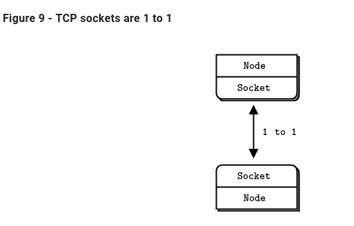
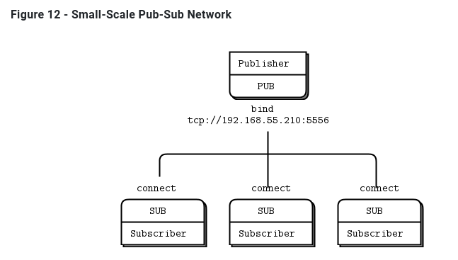
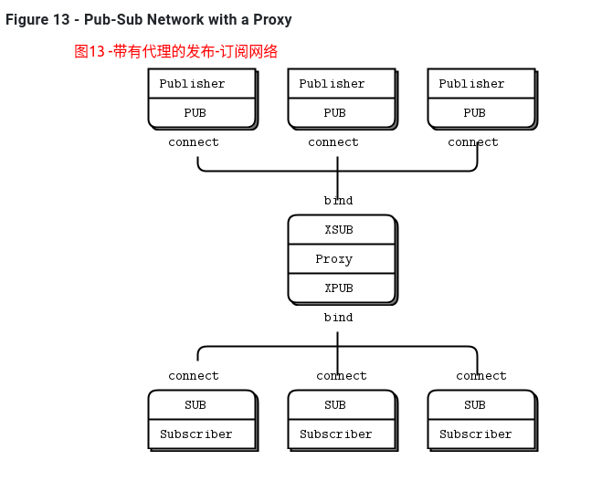
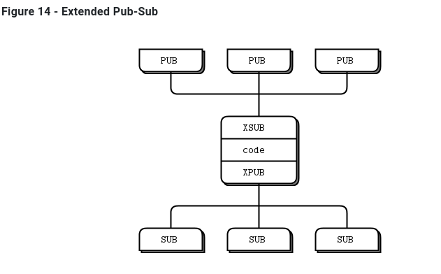
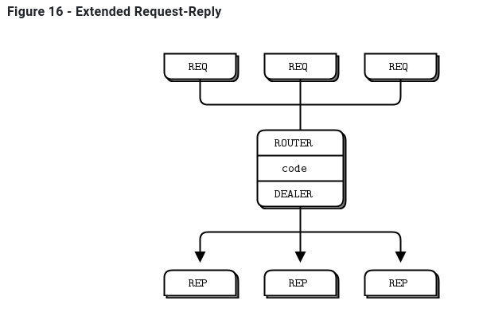
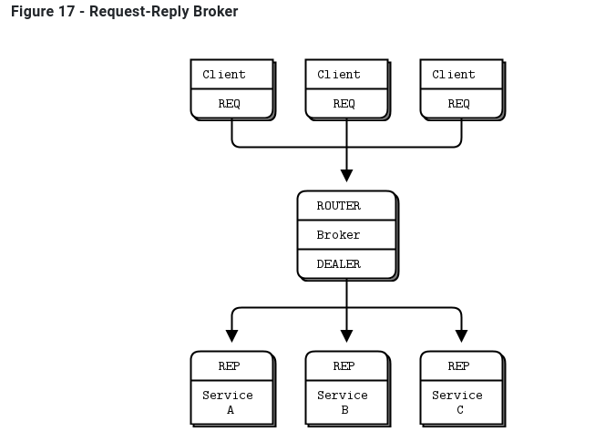

# 2 ZMQ套接字和模式 Sockets and Patterns

## 2.1 The Socket API

* 创建和销毁套接字，它们一起形成套接字生命的循环(参见zmq socket()， zmq close())。
* 通过设置选项来配置套接字，并在必要时检查它们(参见zmq setsockopt()， zmq getsockopt()))。
* 通过创建和网络拓扑之间的ZeroMQ连接(参见zmq bind()， zmq connect())，将套接字插入网络拓扑。
* 通过在套接字上写入和接收消息来传输数据(参见zmq msg send()， zmq msg recv())。

### 2.1.1 将套接字插入到拓扑

要在两个节点之间创建连接，可以在一个节点中使用zmq_bind()，在另一个节点中使用zmq_connect()。**一般来说，执行zmq_bind()的节点是一个“服务器”，位于一个已知的网络地址上，执行zmq_connect()的节点是一个“客户机”，具有未知或任意的网络地址**。因此，我们说“将socket 绑定到端点”和“将socket 连接到端点”，端点就是那个已知的网络地址。

ZeroMQ连接与传统的TCP连接有些不同。主要的显著差异是：

* 它们通过任意传输(inproc、ipc、tcp、pgm或epgm)。请参见zmq inproc()、zmq ipc()、zmq tcp()、zmq pgm()、zmq epgm()。
* 一个将socket可能有许多传出和传入连接。.
* 没有’ zmq_accept '()方法。当socket绑定到端点时，它将自动开始接受连接
* 网络连接本身发生在后台，如果网络连接中断，ZeroMQ将自动重新连接(例如，如果peer 消失，然后返回)。
* 您的应用程序代码不能直接使用这些连接;它们被封装在socket下面。

许多架构遵循某种客户/服务器模型，服务器是最静态的组件，客户端是最动态的组件(来来去去)。有时寻址问题：服务器对客户端可见，但不一定反之亦然。因此，很明显，这是哪个节点应该正在进行zmq_bind（）（服务器），哪个节点应该执行zmq_connect（）（客户端）。它还取决于您使用的套接字种类，具有异常网络架构的一些例外。

现在，假设在启动服务器之前先启动客户机。在传统的网络中，我们会看到一个大大的红色失败标志。但是ZeroMQ让我们任意地开始和停止。**只要客户机节点执行zmq_connect()，连接就存在，该节点就可以开始向socket写入消息。在某个阶段(希望是在消息排队太多而开始被丢弃或客户机阻塞之前)，服务器会启动，执行zmq_bind()，然后ZeroMQ开始传递消息**。
**一个服务器节点可以绑定到许多端点(即协议和地址的组合)，并且它可以使用一个socket来实现这一点。这意味着它将接受跨不同传输的连接**：

```C
zmq_bind (socket, "tcp://*:5555");
zmq_bind (socket, "tcp://*:9999");
zmq_bind (socket, "inproc://somename");
```

虽然ZeroMQ试图对哪边bind和哪边connect保持中立，但还是有区别的。稍后我们将更详细地看到这些。其结果是，您通常应该将“服务器”视为拓扑的静态部分，它绑定到或多或少固定的端点，而将“客户机”视为动态部分，它们来来去去并连接到这些端点。然后，围绕这个模型设计应用程序。它“正常工作”的可能性要大得多。

### 2.1.2 发送和接收消息

要发送和接收消息，可以使用zmq_msg_send()和zmq_msg_recv()方法。这些名称都是传统的，但是ZeroMQ的I/O模型与传统的TCP模型有很大的不同，您需要时间来理解它。



让我们来看看TCP sockets和ZeroMQ sockets在处理数据方面的主要区别:

* **ZeroMQ套接字像UDP一样携带消息，而不像TCP那样携带字节流**。**ZeroMQ消息是长度指定的二进制数据。**我们很快就会讲到信息;它们的设计是针对性能进行优化的，因此有点棘手。
* ZeroMQ套接字在后台线程中执行I/O。这意味着消息到达本地输入队列并从本地输出队列发送，无论您的应用程序在忙什么。
* 根据socket类型，**ZeroMQ sockets具有内置的1对n路由行为**。
* zmq_send()方法实际上并不将消息发送到socket connection(s)。它对消息进行排队，以便I/O线程可以异步发送消息。它不会阻塞，除非在某些异常情况下。因此，**当zmq_send()返回到应用程序时，不一定要发送消息**。

### 2.1.3 单播传输

ZeroMQ提供了**一组单播传输(inproc、ipc、tcp)和组播传输(epgm、pgm)**。多播是一种先进的技术，我们将在后面介绍。不要甚至开始使用它，除非你知道你的扇出比例将使1对n单播不可能。

* tcp：**对于大多数常见的情况，使用tcp**，这是一个断开连接的tcp传输。它有弹性，便于携带，对于大多数情况都足够快。我们称此为断开连接，因为ZeroMQ的tcp传输在连接之前不需要端点的存在。客户端和服务器可以在任何时候连接和绑定，可以切换和返回，并且对应用程序保持透明。
* ipc：进程间ipc传输也是断开连接式（disconnected ）的，就像tcp一样。它有一个限制:它还不能在Windows上运行。按照惯例，我们使用带有“.ipc”扩展名，以避免与其他文件名的潜在冲突。**在UNIX系统上，如果使用ipc端点，则需要使用适当的权限创建这些端点，否则在不同用户id下运行的进程之间可能无法共享这些端点。**您还必须确保所有进程都可以访问这些文件，例如，在相同的工作目录中运行。
* inproc：**线程间传输(inproc)是一种连接（connected ）的信号传输。它比tcp或ipc快得多。与tcp和ipc相比，这种传输有一个特定的限制:服务器必须在任何客户机发出连接之前发出绑定**。这是在Zeromq v4.0和更高版本中修复的

### 2.1.4 ZeroMQ 不是中立的载体

Zeromq不是中性载体：它对其使用的传输协议施加了框架。这种框架与现有协议不兼容，。例如，比较HTTP请求和Zeromq请求,都是依赖TCP/IP。不能使用zmq实现一个HTTP服务。


HTTP请求使用CR-LF作为最简单的帧分隔符，而ZeroMQ使用长度指定的帧。因此，您可以使用ZeroMQ编写类似http的协议，例如使用请求-应答套接字模式。但它不是HTTP。


###   2.1.5 I/O Threads  

我们说过ZeroMQ在后台线程中执行I/O。一个I/O线程(适用于所有类型socket)对于除最极端的应用程序之外的所有应用程序都是足够的。当您创建一个新的context时，它从一个I/O线程开始。一般的经验法则是，每秒允许1千兆字节（gigabyte ，1GB?）的数据进出一个I/O线程。要增加I/O线程的数量，请在创建任何socket之前使zmq_ctx_set()调用:

```C
int io_threads = 4;
void *context = zmq_ctx_new ();
zmq_ctx_set (context, ZMQ_IO_THREADS, io_threads);
assert (zmq_ctx_get (context, ZMQ_IO_THREADS) == io_threads);
```

我们已经看到一个套接字可以同时处理几十个，甚至数千个连接。这对如何编写应用程序有根本性的影响。传统的网络应用程序在每个远程连接上有一个进程或一个线程，该进程或线程处理一个套接字。ZeroMQ允许您将整个结构分解为单个进程，然后根据伸缩性的需要将其分解。

如果您仅将Zeromq用于线程间通信（即，没有外部套接字I/O的多线程应用程序），则可以将I/O线程设置为零。但是，这并不是一个重大的优化，也没什么卵用。

## 2.2 消息传递模式 Messaging Patterns

**内置的核心Zeromq模式是：**

* Request-reply： 它将一组客户机连接到一组服务。这是一个远程过程调用和任务分发模式。
* Pub-sub：它将一组发布者连接到一组订阅者。这是一个数据发布模式。
* Pipeline：它以扇出/扇入模式连接节点，该模式可以有多个步骤和循环。这是一个并行的任务分发和收集模式
* Exclusive pair：只连接两个sockets 。这是一个用于连接进程中的两个线程的模式，不要与“普通”sockets 对混淆。

有效的绑定如下（您还将看到对XPUB和XSUB套接字的引用，(它们类似于PUB和SUB的原始版本)。）

- PUB and SUB
- REQ and REP
- REQ and ROUTER (take care, REQ inserts an extra null frame)
- DEALER and REP (take care, REP assumes a null frame)
- DEALER and ROUTER
- DEALER and DEALER
- ROUTER and ROUTER
- PUSH and PULL
- PAIR and PAIR

### 2.2.1 使用消息（Working with Messages）

实际上，libzmq核心库有两个api来发送和接收消息。zmq send()和zmq  recv()方法是简单的一行程序。但zmq  recv()不擅长处理任意消息大小:**它会将消息截断为您提供的任何缓冲区大小（也就是和缓冲区大小有关）**。因此有了第二个与zmq msg  t结构一起工作的API，它具有更丰富但更困难的API

- 初始化消息: `  zmq_msg_init()`, `  zmq_msg_init_size()`, `  zmq_msg_init_data()`.
- 发送和接收消息: `  zmq_msg_send()`, `  zmq_msg_recv()`.
- 释放消息: `  zmq_msg_close()`.
- 访问消息内容: `  zmq_msg_data()`, `  zmq_msg_size()`, `  zmq_msg_more()`.
- 使用消息属性: `  zmq_msg_get()`, `  zmq_msg_set()`.
- 操作消息: `  zmq_msg_copy()`, `  zmq_msg_move()`.

在网络上，ZeroMQ消息是适合内存的从0开始的任何大小的二进制。可以使用protobuf、msgpack、JSON或自定义实现自己的序列化。

在内存中，ZeroMQ消息是zmq_msg_t结构(或类，取决于您的语言)。下面是在C语言中使用ZeroMQ消息的基本规则:

* 创建并传递zmq_msg_t对象，而不是数据块。
* 要读取消息，可以使用zmq_msg_init()创建一个空消息，然后将其传递给zmq_msg_recv()。
* 要从新数据中编写一条消息，可以使用zmq_msg_init_size()创建一条消息，同时分配某个大小的数据块。然后使用memcpy填充数据，并将消息传递给zmq_msg_send()。
* 要释放(而不是销毁)消息，可以调用zmq_msg_close()。这将删除引用，最终ZeroMQ将销毁消息。
* 要访问消息内容，可以使用zmq_msg_data()。要知道消息包含多少数据，可以使用zmq_msg_size()。
* 不要使用zmq_msg_move()、zmq_msg_copy()或zmq_msg_init_data()，除非您阅读了手册页并确切地知道为什么需要这些。
* 您传递一个消息后zmq_msg_send(),ØMQ将clear 这个消息。同时将大小设置为零。您不能两次发送相同的消息，并且不能在发送消息后访问消息数据。
* 如果您使用zmq_send()和zmq_recv()，而不是消息结构，这些规则将不适用。

如果您希望多次发送相同的消息，并且消息大小相当，那么创建第二个消息，使用zmq_msg_init()初始化它，然后使用zmq_msg_copy()创建第一个消息的副本。这不是复制数据，而是复制引用。然后可以发送消息两次(如果创建了更多副本，则可以发送两次或多次)，并且只有在发送或关闭最后一个副本时才最终销毁消息。

ZeroMQ还支持多部分消息，它允许您作为单个在线消息发送或接收帧列表。这在实际应用中被广泛使用，我们将在本章后面的第三章—高级请求-应答模式中看到它。

帧（Frames）在ZeroMQ参考手册页面中也称为消息部件)是ZeroMQ消息的基本线格式。帧是指定长度的数据块。长度向上可以为零。

最初，ZeroMQ消息是一个帧，就像UDP一样。稍后，我们使用多部分消息对此进行了扩展，这些消息非常简单，就是一系列帧，其中“more”位设置为1，然后是一个位设置为0的帧。然后ZeroMQ API允许您编写带有“more”标志的消息，当您读取消息时，它允许您检查是否有“more”

- 消息可以是一个或多个部分。
- 这些部分也被称为“帧”。
- 每个部分都是zmq_msg_t对象。
- 可以在底层API中分别发送和接收每个部分。
- 高级api提供包装器来发送整个多部分消息。
- 您可以发送零长度的消息
- ZeroMQ保证交付消息的所有部分(一个或多个)，或者一个也不交付。
- ZeroMQ不会立即发送消息(单个或多个部分)，而是在稍后某个不确定的时间。
- 消息(单个或多个部分)必须装入内存。如果您想发送任意大小的文件，应该将它们分成几部分，并将每一部分作为单独的单部分消息发送。使用多部分数据不会减少内存消耗。
- 当接收到消息结束时，必须调用zmq msg close()，当作用域关闭时不会自动销毁对象。发送消息后不能调用此方法。

### 2.2.2 处理多个Sockets(Handling Multiple Sockets)

在到目前为止的所有例子中，大多数例子的主循环是:

- 1.等待套接字上的消息。
- 2.过程信息。
- 3.重复。

如果我们想同时读取多个端点呢?最简单的方法是将一个socket连接到所有端点，并让ZeroMQ为我们执行扇入。

要同时读取多个sockets，可以使用zmq_poll()。

下面是一个使用非阻塞读取从两个sockets读取的简单示例，这种方法的代价是第一个消息上的一些额外延迟。在亚毫秒延迟至关重要的应用程序中。

```C
//msreader: Multiple socket reader in C

//  Reading from multiple sockets
//  This version uses a simple recv loop

#include "zhelpers.h"

int main (void) 
{
    //  Connect to task ventilator
    void *context = zmq_ctx_new ();
    void *receiver = zmq_socket (context, ZMQ_PULL);
    zmq_connect (receiver, "tcp://localhost:5557");

    //  Connect to weather server
    void *subscriber = zmq_socket (context, ZMQ_SUB);
    zmq_connect (subscriber, "tcp://localhost:5556");
    zmq_setsockopt (subscriber, ZMQ_SUBSCRIBE, "10001 ", 6);

    //  Process messages from both sockets
    //  We prioritize traffic from the task ventilator
    while (1) {
        char msg [256];
        while (1) {
            int size = zmq_recv (receiver, msg, 255, ZMQ_DONTWAIT);
            if (size != -1) {
                //  Process task
            }
            else
                break;
        }
        while (1) {
            int size = zmq_recv (subscriber, msg, 255, ZMQ_DONTWAIT);
            if (size != -1) {
                //  Process weather update
            }
            else
                break;
        }
        //  No activity, so sleep for 1 msec
        s_sleep (1);
    }
    zmq_close (receiver);
    zmq_close (subscriber);
    zmq_ctx_destroy (context);
    return 0;
}


```

您可以通过先读取一个套接字，然后读取第二个套接字来公平地对待套接字，而不是像上面中所做的那样对它们进行优先级排序。使用zmq_poll():

```C
mspoller: Multiple socket poller in C

//  Reading from multiple sockets
//  This version uses zmq_poll()

#include "zhelpers.h"

int main (void) 
{
    //  Connect to task ventilator
    void *context = zmq_ctx_new ();
    void *receiver = zmq_socket (context, ZMQ_PULL);
    zmq_connect (receiver, "tcp://localhost:5557");

    //  Connect to weather server
    void *subscriber = zmq_socket (context, ZMQ_SUB);
    zmq_connect (subscriber, "tcp://localhost:5556");
    zmq_setsockopt (subscriber, ZMQ_SUBSCRIBE, "10001 ", 6);

    zmq_pollitem_t items [] = {
        { receiver,   0, ZMQ_POLLIN, 0 },
        { subscriber, 0, ZMQ_POLLIN, 0 }
    };
    //  Process messages from both sockets
    while (1) {
        char msg [256];

        zmq_poll (items, 2, -1);
        if (items [0].revents & ZMQ_POLLIN) {
            int size = zmq_recv (receiver, msg, 255, 0);
            if (size != -1) {
                //  Process task
            }
        }
        if (items [1].revents & ZMQ_POLLIN) {
            int size = zmq_recv (subscriber, msg, 255, 0);
            if (size != -1) {
                //  Process weather update
            }
        }
    }
    zmq_close (subscriber);
    zmq_ctx_destroy (context);
    return 0;
}


```

### 2.2.3 多部分消息(Multipart Messages)

ZeroMQ允许我们用几个帧（frame）组成一个消息（message）

当您处理多部分消息时，每个部分都是一个zmq msg项。例如，如果你发送一个包含五个部分的消息，你必须构造、发送和销毁五个zmq msg项。

下面是我们如何在多部分消息中发送帧(我们将每一帧接收到一个消息对象)

```C
zmq_msg_send (&message, socket, ZMQ_SNDMORE);
...
zmq_msg_send (&message, socket, ZMQ_SNDMORE);
...
zmq_msg_send (&message, socket, 0);
```

下面是我们如何接收和处理消息中的所有部分，无论是单个部分还是多个部分

```C
while (1) {
    zmq_msg_t message;
    zmq_msg_init (&message);
    zmq_msg_recv (&message, socket, 0);
    //  Process the message frame
    ...
    zmq_msg_close (&message);
    if (!zmq_msg_more (&message))
        break;      //  Last message frame
}
```

* **当您发送一个多部分消息时，第一部分(以及所有后续部分)只有在您发送最后一部分时才实际通过网络发送**。
* 如果您正在使用zmq_poll()，当您接收到消息的第一部分时，其他部分也都已经到达。
* 您将接收到消息的所有部分，或者完全不接收。
* 消息的每个部分都是一个单独的zmq_msg项。
* 无论是否选中more属性，都将接收消息的所有部分。
* 发送时，ZeroMQ将消息帧在内存中排队，直到最后一个消息帧被接收，然后将它们全部发送出去。
* 除了关闭套接字外，无法取消部分发送的消息。

### 2.2.4 中介和代理 Intermediaries and Proxies

在ZeroMQ中，我们根据上下文将这些代理、队列、转发器、设备或代理称为代理。

### 2.2.5 动态发现 The Dynamic Discovery Problem

动态发现有几种解决方案。最简单的方法是通过硬编码(或配置)网络体系结构来完全避免这种情况，以便手工完成发现。也就是说，当您添加一个新片段时，您将重新配置网络以了解它。例如下面图12-小规模的Pub-Sub网络



在实践中，这会导致越来越脆弱和笨拙的架构。假设你有一个出版商和100个订阅者。通过在每个订阅者中配置发布者端点，可以将每个订阅者连接到发布者。那也是件很轻松的事。用户是动态的;出版商是静态的。现在假设你添加了更多的出版商。突然，事情变得不那么容易了。如果你继续将每个订阅者与每个发布者联系起来，避免动态发现的成本就会越来越高。



对此有很多答案，但最简单的答案是添加中介;也就是说，网络中所有其他节点都连接到的一个静态点。在传统的消息传递中，这是消息代理的工作。ZeroMQ没有提供这样的消息代理，但是它让我们可以很容易地构建中介。

您可能想知道，如果所有网络最终都变得足够大，需要中介体，那么为什么不为所有应用程序设置一个message broker呢?对于初学者来说，这是一个公平的妥协。只要始终使用星型拓扑结构，忘记性能，事情就会正常工作。然而，消息代理是贪婪的;作为中央中介人，它们变得太复杂、太有状态，最终成为一个问题。

最好将中介看作简单的无状态消息交换机。一个很好的类比是HTTP代理;它在那里，但没有任何特殊的作用。在我们的示例中，添加一个 pub-sub代理解决了动态发现问题。我们在网络的“中间”设置代理。代理打开一个XSUB套接字、一个XPUB套接字，并将每个套接字绑定到已知的IP地址和端口。然后，所有其他进程都连接到代理，而不是彼此连接。添加更多订阅者或发布者变得很简单。



我们需要XPUB和XSUB套接字，因为ZeroMQ从订阅者到发布者执行订阅转发。XSUB和XPUB与SUB和PUB完全一样，只是它们将订阅公开为特殊消息。代理必须通过从XPUB套接字读取这些订阅消息并将其写入XSUB套接字，从而将这些订阅消息从订阅方转发到发布方。这是XSUB和XPUB的主要用例。

### 2.2.6 共享队列Shared Queue (DEALER and ROUTER sockets)

在Hello World客户机/服务器应用程序中，我们有一个客户机与一个服务通信。然而，在实际情况中，我们通常需要允许多个服务和多个客户机。这让我们可以扩展服务的功能(许多线程、进程或节点，而不是一个)。唯一的限制是服务必须是无状态的，所有状态都在请求中，或者在一些共享存储(如数据库)中。


有两种方法可以将多个客户机连接到多个服务器。蛮力方法是将每个客户端套接字连接到多个服务端点。**一个客户端套接字可以连接到多个服务套接字，然后REQ套接字将在这些服务之间分发请求**。如上图15，假设您将一个客户端套接字连接到三个服务端点;客户机请求R1、R2、R3、R4。**R1和R4进入服务A，R2转到B，R3转到服务C。并不是所有的服务都收到R1、R2、R3、R4。**详细可以参考测试代码1-reqrep/2文件夹。

这种设计可以让您更便宜地添加更多的客户端。您还可以添加更多的服务。每个客户端将其请求分发给服务。但是每个客户机都必须知道服务拓扑。如果您有100个客户机，然后决定再添加3个服务，那么您需要重新配置并重新启动100个客户机，以便客户机了解这3个新服务。

理想情况下，我们应该能够在任何时候添加和删除服务或客户机，而不需要触及拓扑的任何其他部分。

因此，我们将编写一个小消息队列代理来提供这种灵活性。代理绑定到两个端点，一个用于客户机的前端，一个用于服务的后端。然后，它使用zmq_poll()监视这两个sockets 的活动，当它有一些活动时，它在它的两个sockets 之间传递消息。它实际上并不明确地管理任何队列—zeromq在每个sockets 上自动管理队列。

当您使用REQ与REP对话时，您将得到一个严格同步的请求-应答对话框。客户端发送一个请求。服务读取请求并发送响应。然后客户端读取应答。如果客户机或服务尝试执行其他操作(例如，在不等待响应的情况下连续发送两个请求)，它们将得到一个错误。

但是我们的代理必须是非阻塞的。显然，我们可以使用zmq_poll()来等待两个socket上的活动，但是不能使用REP和REQ。



幸运的是，**有两个名为DEALER和ROUTER的socket允许您执行非阻塞的请求-响应**。在高级请求-应答模式中，您将看到DEALER和ROUTER套接字如何让您构建各种异步请求-应答流。现在，我们只需要看看DEALER 和ROUTER 如何让我们扩展REQ-REP跨一个中介，也就是我们的小broker。
在这个简单的扩展请求-应答模式中，REQ与ROUTER 对话，而DEALER 与REP对话。在DEALER 与ROUTER 之间，我们必须有代码(就像我们的broker一样)将消息从一个socket 中提取出来，并将它们推送到另一个socket 中。
request-reply broker绑定到两个端点，一个用于clients 连接(前端socket)，另一个用于workers 连接(后端)。要测试此broker，您需要更改workers ，以便他们连接到后端socket。这是一个client ，如图17

```C
//rrclient: Request-reply client in C

//  Hello World client
//  Connects REQ socket to tcp://localhost:5559
//  Sends "Hello" to server, expects "World" back

#include "zhelpers.h"

int main (void) 
{
    void *context = zmq_ctx_new ();

    //  Socket to talk to server
    void *requester = zmq_socket (context, ZMQ_REQ);
    zmq_connect (requester, "tcp://localhost:5559");

    int request_nbr;
    for (request_nbr = 0; request_nbr != 10; request_nbr++) {
        s_send (requester, "Hello");
        char *string = s_recv (requester);
        printf ("Received reply %d [%s]\n", request_nbr, string);
        free (string);
    }
    zmq_close (requester);
    zmq_ctx_destroy (context);
    return 0;
}

```

Here is the worker:

```C
//rrworker: Request-reply worker in C

//  Hello World worker
//  Connects REP socket to tcp://localhost:5560
//  Expects "Hello" from client, replies with "World"

#include "zhelpers.h"
#include <unistd.h>

int main (void) 
{
    void *context = zmq_ctx_new ();

    //  Socket to talk to clients
    void *responder = zmq_socket (context, ZMQ_REP);
    zmq_connect (responder, "tcp://localhost:5560");

    while (1) {
        //  Wait for next request from client
        char *string = s_recv (responder);
        printf ("Received request: [%s]\n", string);
        free (string);

        //  Do some 'work'
        sleep (1);

        //  Send reply back to client
        s_send (responder, "World");
    }
    //  We never get here, but clean up anyhow
    zmq_close (responder);
    zmq_ctx_destroy (context);
    return 0;
}


```

这是代理，它可以正确地处理多部分消息:

```C
//rrbroker: Request-reply broker in C

//  Simple request-reply broker

#include "zhelpers.h"

int main (void) 
{
    //  Prepare our context and sockets
    void *context = zmq_ctx_new ();
    void *frontend = zmq_socket (context, ZMQ_ROUTER);
    void *backend  = zmq_socket (context, ZMQ_DEALER);
    zmq_bind (frontend, "tcp://*:5559");
    zmq_bind (backend,  "tcp://*:5560");

    //  Initialize poll set
    zmq_pollitem_t items [] = {
        { frontend, 0, ZMQ_POLLIN, 0 },
        { backend,  0, ZMQ_POLLIN, 0 }
    };
    //  Switch messages between sockets
    while (1) {
        zmq_msg_t message;
        zmq_poll (items, 2, -1);
        if (items [0].revents & ZMQ_POLLIN) {
            while (1) {
                //  Process all parts of the message
                zmq_msg_init (&message);
                zmq_msg_recv (&message, frontend, 0);
                int more = zmq_msg_more (&message);
                zmq_msg_send (&message, backend, more? ZMQ_SNDMORE: 0);
                zmq_msg_close (&message);
                if (!more)
                    break;      //  Last message part
            }
        }
        if (items [1].revents & ZMQ_POLLIN) {
            while (1) {
                //  Process all parts of the message
                zmq_msg_init (&message);
                zmq_msg_recv (&message, backend, 0);
                int more = zmq_msg_more (&message);
                zmq_msg_send (&message, frontend, more? ZMQ_SNDMORE: 0);
                zmq_msg_close (&message);
                if (!more)
                    break;      //  Last message part
            }
        }
    }
    //  We never get here, but clean up anyhow
    zmq_close (frontend);
    zmq_close (backend);
    zmq_ctx_destroy (context);
    return 0;
}
```



使用请求-应答代理可以使客户机/服务器体系结构更容易伸缩，因为客户机看不到worker，而worker也看不到客户机。唯一的静态节点是中间的代理。

### 2.2.7 ZeroMQ的内置代理函数 ZeroMQ’s Built-In Proxy Function

原来，上一节的rrbroker中的核心循环非常有用，并且可以重用。它让我们可以毫不费力地构建pub-sub转发器和共享队列以及其他小型中介。ZeroMQ将其封装在一个方法中，`zmq_proxy()`:

```C
zmq_proxy (frontend, backend, capture);
```

必须正确地连接、绑定和配置这两个(或者三个sockets，如果我们想捕获数据的话)。当我们调用zmq_proxy方法时，就像启动rrbroker的主循环一样。让我们重写 request-reply broker来调用zmq_proxy，并将其重新标记为一个听起来很昂贵的“消息队列”(人们已经为执行更少的代码向house收费):

```C
msgqueue: Message queue broker in C

//  Simple message queuing broker
//  Same as request-reply broker but using shared queue proxy

#include "zhelpers.h"

int main (void) 
{
    void *context = zmq_ctx_new ();

    //  Socket facing clients
    void *frontend = zmq_socket (context, ZMQ_ROUTER);
    int rc = zmq_bind (frontend, "tcp://*:5559");
    assert (rc == 0);

    //  Socket facing services
    void *backend = zmq_socket (context, ZMQ_DEALER);
    rc = zmq_bind (backend, "tcp://*:5560");
    assert (rc == 0);

    //  Start the proxy
    zmq_proxy (frontend, backend, NULL);

    //  We never get here...
    zmq_close (frontend);
    zmq_close (backend);
    zmq_ctx_destroy (context);
    return 0;
}
```


### 2.2.8 传输桥接 Transport Bridging

ZeroMQ用户经常会问，“我如何将我的ZeroMQ网络与技术X连接起来?”其中X是其他网络或消息传递技术。


答案很简单，就是建一座桥。桥接是一个小应用程序，它在一个socket上讲一个协议，并在另一个套接字上转换成 to/from第二个协议。协议解释器，如果你喜欢的话。ZeroMQ中常见的桥接问题是桥接两个传输或网络。
例如，我们将编写一个小代理，它位于发布者和一组订阅者之间，连接两个网络。前端socket (SUB)面向气象服务器所在的内部网络，后端(PUB)面向外部网络上的订阅者。它订阅前端socket 上的天气服务，并在后端socket 上重新发布数据。

```C
//wuproxy: Weather update proxy in C

//  Weather proxy device

#include "zhelpers.h"

int main (void)
{
    void *context = zmq_ctx_new ();

    //  This is where the weather server sits
    void *frontend = zmq_socket (context, ZMQ_XSUB);
    zmq_connect (frontend, "tcp://192.168.55.210:5556");

    //  This is our public endpoint for subscribers
    void *backend = zmq_socket (context, ZMQ_XPUB);
    zmq_bind (backend, "tcp://10.1.1.0:8100");

    //  Run the proxy until the user interrupts us
    zmq_proxy (frontend, backend, NULL);
    
    zmq_close (frontend);
    zmq_close (backend);
    zmq_ctx_destroy (context);
    return 0;
}
```

**它看起来与前面的代理示例非常相似，但关键部分是前端和后端sockets 位于两个不同的网络上。例如，我们可以使用这个模型将组播网络(pgm传输)连接到tcp publisher。**

## 2.3 处理错误

上面的C示例中都没有错误处理。有一些简单的规则，从POSIX约定开始:

* 如果创建对象的方法失败，则返回NULL。
* 处理数据的方法可能返回已处理的字节数，或在出现错误或故障时返回-1。
* 其他方法在成功时返回0，在错误或失败时返回-1。
* 错误代码在errno或zmq_errno()中提供。
* zmq_strerror()提供了用于日志记录的描述性错误文本。

```C
void *context = zmq_ctx_new ();
assert (context);
void *socket = zmq_socket (context, ZMQ_REP);
assert (socket);
int rc = zmq_bind (socket, "tcp://*:5555");
if (rc == -1) {
    printf ("E: bind failed: %s\n", strerror (errno));
    return -1;
}
```

有两个主要的例外情况，你应该作为非致命的处理:

* 当您的代码接收到带有ZMQ_DONTWAIT选项的消息并且没有等待的数据时，ZeroMQ将返回-1并再次将errno设置为EAGAIN。
* 当一个线程调用zmq_ctx_destroy()，而其他线程仍在执行阻塞工作时，zmq_ctx_destroy()调用关闭上下文，所有阻塞调用都以-1退出，errno设置为ETERM。

# 