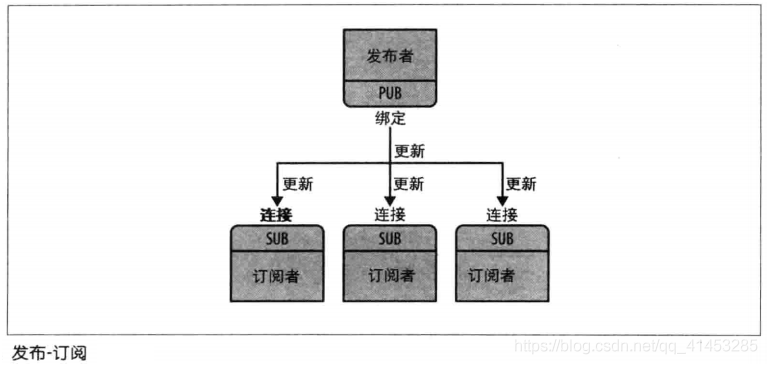
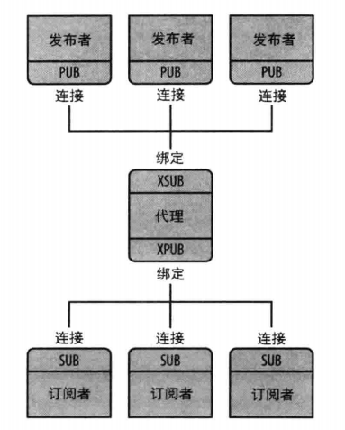
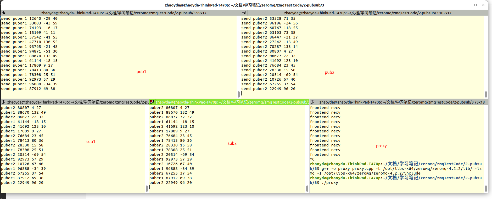

# 3 ZMQ发布订阅模式

参考 https://blog.csdn.net/qq_41453285/article/details/106877202

**在发布-订阅模式中，**有一个发布者用来发送消息，该模式中有很多订阅者会接收发布者发布的消息

**“发布-订阅”模型支持的套接字类型有4种：**

- **ZMQ_PUB**
- **ZMQ_SUB**
- **ZMQ_XPUB**
- **ZMQ_XSUB**

## 3.1 “PUB-SUB”套接字类型

PUB就是发布者，SUB就是订阅者



### 3.1.1 **ZMQ_PUB**

* 发布者使用类型为ZMQ_PUB的套接字来分发数据。发送的消息以扇出方式分发给所有连接的对等方
* 在ZMQ_PUB类型的套接字上不能执行zmq_msg_recv()等接收数据的函数
* 当ZMQ_PUB套接字由于已达到订阅者的高水位标记而进入静音状态时，将发送给有问题的订阅者的任何消息都将被丢弃，直到静音状态结束为止。关于“高水位标记”请参阅：
* 对于该套接字类型，zmq_msg_send()函数将永远不会阻塞 

| **ZMQ_PUB特性摘要** |                   |
| ------------------- | ----------------- |
| 兼容的对等套接字    | ZMQ_SUB、ZMQ_XSUB |
| 方向                | 单向              |
| 发送/接收模式       | 仅发送            |
| 入网路由策略        | 不适用（N/A）     |
| 外发路由策略        | 扇出（Fan out）   |
| 静音状态下的操作    | 丢弃              |

### 3.1.2 ZMQ_SUB

* 订阅者使用ZMQ_SUB类型的套接字来订阅发布者分发的数据
* ZMQ_SUB套接字创建完成之后，ZMQ_SUB套接字未订阅任何消息，请使用**zmq_setsockopt()的ZMQ_SUBSCRIBE选项指定要订阅的消息**
* 在ZMQ_PUB类型的套接字上不能执行zmq_msg_recv()等接收数据的函数

| **ZMQ_SUB特性摘要** |                   |
| ------------------- | ----------------- |
| 兼容的对等套接字    | ZMQ_PUB、ZMQ_XPUB |
| 方向                | 单向              |
| 发送/接收模式       | 仅接收            |
| 入网路由策略        | 公平排队          |
| 外发路由策略        | 不适用（N/A）     |

###  3.1.3 pub-sub示例

- **发布者：**类似于一个天气更新服务器，向订阅者发送天气更新，内容包括邮政编码、温度、湿度等信息

- **订阅者：**它监听发布者更新的数据流，过滤只接收与特定邮政编码是8的天气信息。

  **发布者代码**

  ```C
  /*
   * @Copyright:  Copyright(C) 2018-2028 YTCK All rights reserved.
   * @Description:
   * @Date: 2022-03-22 16:10:34
   * @Author: YingYongJiCheng
   * @LastEditors: YingYongJiCheng
   * @LastEditTime: 2022-05-17 11:06:55
   */
  // wuserver.c
  #include <stdio.h>
  #include <stdlib.h>
  #include <assert.h>
  #include <unistd.h>
  #include <string.h>
  #include <time.h>
  #include <zmq.h>
  
  // 随机生成0...num-1的随机数
  #define randof(num) (int)((float)(num)*random() / (RAND_MAX + 1.0))
  
  // 将string消息格式化为zmq_meg_t对象, 然后发往socket套接字上
  static int s_send(void* socket, char* string);
  
  int main()
  {
    // 1.初始化上下文
    void* context = zmq_ctx_new();
  
    // 2.创建、绑定套接字
    void* publisher = zmq_socket(context, ZMQ_PUB);
    assert(publisher != NULL);
  
    // 此处我们将发布者绑定到一个tcp节点上和一个ipc节点上, 但是本案例我们只使用tcp, ipc那个只是演示说明zmq的套接字可以绑定到多个节点上
    int rc = zmq_bind(publisher, "tcp://*:5555");
    assert(rc == 0);
    rc = zmq_bind(publisher, "ipc://weather.ipc");
    assert(rc == 0);
  
    // 3.初始化随机数发生器
    srandom((unsigned)time(NULL));
  
    // 4.循环发送数据
    while (1)
    {
      // 5.随机生成邮政编码、温度、适度
      int zipcode, temperature, relhumidity;
      zipcode     = randof(10);
      temperature = randof(215) - 80;
      relhumidity = randof(50) + 10;
  
      // 6.将消息发送给所有的订阅者
      char update[20];
      sprintf(update, "%d %d %d", zipcode, temperature, relhumidity);
      printf("send %s\n", update);
      rc = s_send(publisher, update);
      assert(rc);
  
      sleep(1);
    }
  
    // 7.关闭套接字、销毁上下文
    zmq_close(publisher);
    zmq_ctx_destroy(context);
  
    return 0;
  }
  
  static int s_send(void* socket, char* string)
  {
    // 初始化一个zmq_msg_t对象, 分配的大小为string的大小
    zmq_msg_t msg;
    zmq_msg_init_size(&msg, strlen(string));
    memcpy(zmq_msg_data(&msg), string, strlen(string));
  
    // 发送数据
    int rc = zmq_msg_send(&msg, socket, 0);
  
    // 关闭zmq_msg_t对象
    zmq_msg_close(&msg);
  
    return rc;
  }
  ```

  **订阅者代码**

  ```C
  /*
   * @Copyright:  Copyright(C) 2018-2028 YTCK All rights reserved.
   * @Description:
   * @Date: 2022-03-22 16:46:11
   * @Author: YingYongJiCheng
   * @LastEditors: YingYongJiCheng
   * @LastEditTime: 2022-05-17 16:36:28
   */
  // wuclient.c
  #include <stdio.h>
  #include <stdlib.h>
  #include <assert.h>
  #include <unistd.h>
  #include <string.h>
  #include <zmq.h>
  
  // 从socket接收数据, 并将数据返回
  char* s_recv(void* socket);
  
  int main(int argc, char* argv[])
  {
    // 1.初始化上下文
    void* context = zmq_ctx_new();
  
    // 2.创建套接字、连接发布者
    void* subscriber = zmq_socket(context, ZMQ_SUB);
    assert(subscriber != NULL);
    int rc = zmq_connect(subscriber, "tcp://localhost:5555");
    assert(rc == 0);
  
    // 3.因为自己是订阅者, 因此需要使用设置过滤器, 显式指定自己是否需要接收什么类型的消息
    //   程序运行时可以输入参数, 参数代表邮政编码, 如果参数为空, 那么就过滤10001的消息
    // char *filter = (argc > 1) ? argv[1] : "10001";
    char* filter = "8";
    rc           = zmq_setsockopt(subscriber, ZMQ_SUBSCRIBE, filter, strlen(filter));
    filter       = "5";
    rc           = zmq_setsockopt(subscriber, ZMQ_SUBSCRIBE, filter, strlen(filter));
  
    // rc = zmq_setsockopt(subscriber, ZMQ_SUBSCRIBE, "", 0);
  
    assert(rc == 0);
  
    // 4.从发布者那里接收消息, 接收10条自己想要的数据
    int  update_nbr;
    long total_temp = 0;
    // for (update_nbr = 0; update_nbr < 10; update_nbr++)
    while (1)
    {
      // 5.接收数据
      char* string = s_recv(subscriber);
      assert(string != NULL);
  
      // 6.将数据中的邮政编码、温度、适度分别存储变量中
      int zipcode, temperature, relhumidity;
      sscanf(string, "%d %d %d", &zipcode, &temperature, &relhumidity);
      printf("%s\n", string);
      total_temp += temperature;
      free(string);
    }
  
    // 7.接收完成之后, 打印一下平均温度
    // printf("Average tempature for zipcode '%s' was %dF\n", filter, (int)(total_temp / update_nbr));
  
    // 8.关闭套接字、销毁上下文
    zmq_close(subscriber);
    zmq_ctx_destroy(context);
  
    return 0;
  }
  
  char* s_recv(void* socket)
  {
    // 创建zmq_msg_t对象接收数据
    zmq_msg_t msg;
    zmq_msg_init(&msg);
    int size = zmq_msg_recv(&msg, socket, 0);
    if (size == -1)
    {
      return NULL;
    }
  
    // 将zmq_msg_t对象中的数据保存到字符串中
    char* string = (char*)malloc(size + 1);
    memcpy(string, zmq_msg_data(&msg), size);
  
    zmq_msg_close(&msg);
    string[size] = 0;
  
    return string;
  }
  ```

  **编译**

  ```shell
  g++ -o pub1 pub_1.cpp -L /opt/libs-x64/zeromq/zeromq-4.2.2/lib/ -lzmq -I /opt/libs-x64/zeromq/zeromq-4.2.2/include
  g++ -o sub1 sub_1.cpp -L /opt/libs-x64/zeromq/zeromq-4.2.2/lib/ -lzmq -I /opt/libs-x64/zeromq/zeromq-4.2.2/include
  ```

  **运行结果**

  发布者发送了大量数据，但是接收者只过滤接收邮政编码是8和5的数据

  

## 3.2 “XPUB-XSUB”套接字类型

- “XPUB-XSUB”套接字类型与“PUB-SUB”套接字类型相同，**也是属于发布-订阅**
- 在“PUB-SUB”中，订阅者通过zmq_connect()向发布者发起订阅；但是“XPUB-XSUB”套接字类型**允许订阅者通过发送一条订阅信息到发布者来完成订阅**

### 3.2.1 ZMQ_XPUB

- **用法与ZMQ_PUB大部分相同**
- **自己理解主要用于代理。也可以是用xpub发送xsub接收。但是没有必要。**
- **但是有一点与ZMQ_PUB不同：**ZMQ_XPUB(自己)的订阅方可以向自己发送一个订阅信息来进行订阅。订阅消息是字节1（用于订阅）或字节0（用于取消订阅），后跟订阅主体。也接收不带子/取消订阅前缀的消息，但对订阅状态没有影响

| **ZMQ_XPUB特性摘要** |                    |
| -------------------- | ------------------ |
| 兼容的对等套接字     | ZMQ_SUB、ZMQ_XSUB  |
| 方向                 | 单向               |
| 发送/接收模式        | 发送消息，接收订阅 |
| 入网路由策略         | 不适用（N/A）      |
| 外发路由策略         | 扇出（Fan out）    |
| 静音状态下的操作     | 丢弃               |

### 3.2.2 ZMQ_XSUB

- **用法与ZMQ_SUB大部分相同**
- **但是有一点与ZMQ_SUB不同：**自己可以向发布者发送一条订阅信息来进行订阅。订阅消息是字节1（用于订阅）或字节0（用于取消订阅），后跟订阅主体。也接收不带子/取消订阅前缀的消息，但对订阅状态没有影响（TODO 0和1不明白）可以参考 https://blog.csdn.net/lianshaohua/article/details/108776728和https://blog.csdn.net/lianshaohua/article/details/109511469

| **ZMQ_XSUB特性摘要** |                    |
| -------------------- | ------------------ |
| 兼容的对等套接字     | ZMQ_PUB、ZMQ_XPUB  |
| 方向                 | 单向               |
| 发送/接收模式        | 接收消息，发送订阅 |
| 入网路由策略         | 公平排队           |
| 外发路由策略         | 不适用（N/A）      |
| 静音状态下的操作     | 丢弃               |

## 3.3 XSUB、XPUB应用之“代理”

* 动态发现问题：在设计大型的分布式体系结构时，会遇到的问题之一是——“发现”。也就是说，部件如何认识对象，以及部件增减或减少时，如何更新这些消息，因此，我们称之为“动态发现”

* 动态发现解决方案①：

  简单的方式是通过硬编码（或配置）的网络架构来完全避免，一般通过手工操作。但是这种方案导致体系结构变得脆弱和笨重。例如一个系统有一个发布者和一百个订阅者，你需要对每一个订阅者配置发布者端点来让每个订阅者连接到发布者服务器。订阅者是动态的，发布者是静态的，如果你又新增了新的发布者，那么就需要再配置这一百个订阅者，工作量相当的大

* 动态发现解决方案②：通过中间层（代理）来实现，这种方法比较推荐

  * 在“发布-订阅”模型中，我们可以在中间增加一个新的代理节点，该节点绑定了XSUB套接字和XPUB套接字，发布者连接到XSUB中，订阅者连接到XPUB中。这样一来添加或者删除发布者或订阅者节点就变得微不足道了
  * 对于代理节点，其需要执行订阅转发：SUB套接字需要将自己的订阅信息作为特殊消息发送到代理的XPUB端点上，代理转发这些订阅消息到XSUB上，然后XSUB再将消息发送到PUB，从而最终完成SUB到PUB的订阅
  * 当完成订阅之后，PUB直接发送消息，SUB可以直接收到，不需要代理进行转发 （TODO 不明白，应该是还有转发吧）

  


### 3.3.1 代理示例1

下面代码不使用zmq提供的代理接口实现，就像上面的图

**发布者1**

```C
/*
 * @Copyright:  Copyright(C) 2018-2028 YTCK All rights reserved.
 * @Description:
 * @Date: 2022-03-22 16:10:34
 * @Author: YingYongJiCheng
 * @LastEditors: YingYongJiCheng
 * @LastEditTime: 2022-05-17 11:30:05
 */
// pub1.cpp
#include <stdio.h>
#include <stdlib.h>
#include <assert.h>
#include <unistd.h>
#include <string.h>
#include <time.h>
#include <zmq.h>

// 随机生成0...num-1的随机数
#define randof(num) (int)((float)(num)*random() / (RAND_MAX + 1.0))

// 将string消息格式化为zmq_meg_t对象, 然后发往socket套接字上
static int s_send(void* socket, char* string);

int main()
{
  // 1.初始化上下文
  void* context = zmq_ctx_new();

  // 2.创建、绑定套接字
  void* publisher = zmq_socket(context, ZMQ_PUB);
  assert(publisher != NULL);

  // 此处我们将发布者绑定到一个tcp节点上和一个ipc节点上, 但是本案例我们只使用tcp, ipc那个只是演示说明zmq的套接字可以绑定到多个节点上
  int rc = zmq_connect(publisher, "tcp://localhost:5555");
  assert(rc == 0);

  // 3.初始化随机数发生器
  srandom((unsigned)time(NULL));

  // 4.循环发送数据
  while (1)
  {
    // 5.随机生成邮政编码、温度、适度
    int zipcode, temperature, relhumidity;
    zipcode     = randof(100000);
    temperature = randof(215) - 80;
    relhumidity = randof(50) + 10;

    // 6.将消息发送给所有的订阅者
    char update[20];
    sprintf(update, "puber%d %05d %d %d", 1, zipcode, temperature, relhumidity);
    printf("send %s\n", update);
    rc = s_send(publisher, update);
    assert(rc);

    sleep(1);
  }

  // 7.关闭套接字、销毁上下文
  zmq_close(publisher);
  zmq_ctx_destroy(context);

  return 0;
}

static int s_send(void* socket, char* string)
{
  // 初始化一个zmq_msg_t对象, 分配的大小为string的大小
  zmq_msg_t msg;
  zmq_msg_init_size(&msg, strlen(string));
  memcpy(zmq_msg_data(&msg), string, strlen(string));

  // 发送数据
  int rc = zmq_msg_send(&msg, socket, 0);

  // 关闭zmq_msg_t对象
  zmq_msg_close(&msg);

  return rc;
}
```

发布者2和发布者1几乎一致，就是发送的数据不同

**发布者2**

```C
/*
 * @Copyright:  Copyright(C) 2018-2028 YTCK All rights reserved.
 * @Description:
 * @Date: 2022-03-22 16:10:34
 * @Author: YingYongJiCheng
 * @LastEditors: YingYongJiCheng
 * @LastEditTime: 2022-05-17 11:30:10
 */
// pub2.cpp
#include <stdio.h>
#include <stdlib.h>
#include <assert.h>
#include <unistd.h>
#include <string.h>
#include <time.h>
#include <zmq.h>

// 随机生成0...num-1的随机数
#define randof(num) (int)((float)(num)*random() / (RAND_MAX + 1.0))

// 将string消息格式化为zmq_meg_t对象, 然后发往socket套接字上
static int s_send(void* socket, char* string);

int main()
{
  // 1.初始化上下文
  void* context = zmq_ctx_new();

  // 2.创建、绑定套接字
  void* publisher = zmq_socket(context, ZMQ_PUB);
  assert(publisher != NULL);

  // 此处我们将发布者绑定到一个tcp节点上和一个ipc节点上, 但是本案例我们只使用tcp, ipc那个只是演示说明zmq的套接字可以绑定到多个节点上
  int rc = zmq_connect(publisher, "tcp://localhost:5555");
  assert(rc == 0);

  // 3.初始化随机数发生器
  srandom((unsigned)time(NULL));

  // 4.循环发送数据
  while (1)
  {
    // 5.随机生成邮政编码、温度、适度
    int zipcode, temperature, relhumidity;
    zipcode     = randof(100000);
    temperature = randof(215) - 80;
    relhumidity = randof(50) + 10;

    // 6.将消息发送给所有的订阅者
    char update[20];
    sprintf(update, "puber%d %05d %d %d", 2, zipcode, temperature, relhumidity);
    printf("send %s\n", update);
    rc = s_send(publisher, update);
    assert(rc);

    sleep(1);
  }

  // 7.关闭套接字、销毁上下文
  zmq_close(publisher);
  zmq_ctx_destroy(context);

  return 0;
}

static int s_send(void* socket, char* string)
{
  // 初始化一个zmq_msg_t对象, 分配的大小为string的大小
  zmq_msg_t msg;
  zmq_msg_init_size(&msg, strlen(string));
  memcpy(zmq_msg_data(&msg), string, strlen(string));

  // 发送数据
  int rc = zmq_msg_send(&msg, socket, 0);

  // 关闭zmq_msg_t对象
  zmq_msg_close(&msg);

  return rc;
}
```

订阅者1

```C
/*
 * @Copyright:  Copyright(C) 2018-2028 YTCK All rights reserved.
 * @Description:
 * @Date: 2022-03-22 16:46:11
 * @Author: YingYongJiCheng
 * @LastEditors: YingYongJiCheng
 * @LastEditTime: 2022-05-17 11:04:55
 */
// sub1.cpp
#include <stdio.h>
#include <stdlib.h>
#include <assert.h>
#include <unistd.h>
#include <string.h>
#include <zmq.h>

// 从socket接收数据, 并将数据返回
char* s_recv(void* socket);

int main(int argc, char* argv[])
{
  // 1.初始化上下文
  void* context = zmq_ctx_new();

  // 2.创建套接字、连接发布者
  void* subscriber = zmq_socket(context, ZMQ_SUB);
  assert(subscriber != NULL);
  int rc = zmq_connect(subscriber, "tcp://localhost:5556");
  assert(rc == 0);

  // 3.因为自己是订阅者, 因此需要使用设置过滤器, 显式指定自己是否需要接收什么类型的消息
  //   程序运行时可以输入参数, 参数代表邮政编码, 如果参数为空, 那么就过滤10001的消息
  // char *filter = (argc > 1) ? argv[1] : "10001";
  // char* filter = "10001";
  // rc           = zmq_setsockopt(subscriber, ZMQ_SUBSCRIBE, filter, strlen(filter));
  rc = zmq_setsockopt(subscriber, ZMQ_SUBSCRIBE, "", 0);

  assert(rc == 0);

  // 4.从发布者那里接收消息, 接收10条自己想要的数据
  int  update_nbr;
  long total_temp = 0;
  // for (update_nbr = 0; update_nbr < 10; update_nbr++)
  while (1)
  {
    // 5.接收数据
    char* string = s_recv(subscriber);
    assert(string != NULL);

    printf("%s\n", string);
    // total_temp += temperature;
    free(string);
  }

  // 7.接收完成之后, 打印一下平均温度
  // printf("Average tempature for zipcode '%s' was %dF\n", filter, (int)(total_temp / update_nbr));

  // 8.关闭套接字、销毁上下文
  zmq_close(subscriber);
  zmq_ctx_destroy(context);

  return 0;
}

char* s_recv(void* socket)
{
  // 创建zmq_msg_t对象接收数据
  zmq_msg_t msg;
  zmq_msg_init(&msg);
  int size = zmq_msg_recv(&msg, socket, 0);
  if (size == -1)
  {
    return NULL;
  }

  // 将zmq_msg_t对象中的数据保存到字符串中
  char* string = (char*)malloc(size + 1);
  memcpy(string, zmq_msg_data(&msg), size);

  zmq_msg_close(&msg);
  string[size] = 0;

  return string;
}
```

订阅者2和订阅者1一模一样。

**运行结果**

pub1和pub2 经过borker代理后将消息发给了sub1和sub2.从日志看sub1和sub2都收到了pub1和pub2的数据。


### 3.3.2 代理示例2

使用zmq提供的内置代理函数zmq_proxy实现代码1的功能

发布者和订阅者代码一致。只是修改代理的代码如下

```C
//proxy.cpp
#include <stdio.h>
#include <stdlib.h>
#include <assert.h>
#include <unistd.h>
#include <string.h>
#include <time.h>
#include <zmq.h>

int main(void)
{
  void* context = zmq_ctx_new();

  //  This is where the weather server sits
  void* frontend = zmq_socket(context, ZMQ_XSUB);
  zmq_bind(frontend, "tcp://*:5555");

  //  This is our public endpoint for subscribers
  void* backend = zmq_socket(context, ZMQ_XPUB);
  zmq_bind(backend, "tcp://*:5556");

  //  Run the proxy until the user interrupts us
  zmq_proxy(frontend, backend, NULL);

  zmq_close(frontend);
  zmq_close(backend);
  zmq_ctx_destroy(context);
  return 0;
}

```

**运行结果**

和示例1一样，pub1和pub2 经过proxy代理后将消息发给了sub1和sub2.从日志看sub1和sub2都收到了pub1和pub2的数据。



### 3.3.3 示例1和2的区别

* 示例1自己编写代理，示例2使用zmq内置代理
* 都可以实现代理功能，内置代理更加简单
* 自己编写代理可以在代理一层处理数据。内置代理不能（貌似没有必要）
* 就像2.2.8节里面说的，内置代理可以实现桥街传输（也就是两个不同的网络，没有测试过示例1可否连接两个网络。感觉可以）**内置代理与代理1示例非常相似，但关键部分是前端和后端sockets 位于两个不同的网络上。例如，我们可以使用这个模型将组播网络(pgm传输)连接到tcp publisher。**
* **总结：需要代理就用内置代理，简单可靠。**

## 3.4 三种代理

参考网址：https://blog.csdn.net/w_y_x_y/article/details/101106862

**场景一**

    一天，派大星来蟹堡王餐厅买蟹堡吃。
    派大星：嗨，章鱼哥，我想要跟海绵宝宝要一个巨无霸蟹黄堡。
    章鱼哥：好的，派大星。（扭头转向厨房）海绵宝宝，派大星想要一个巨无霸蟹黄堡！
    海绵宝宝：我准备好了！我准备好了！美味蟹黄堡马上就好～

在这个场景中，章鱼哥是broker。

**场景二**

    又一天，派大星来蟹堡王餐厅买蟹堡吃。
    派大星：嗨，章鱼哥，我想要跟你要一个巨无霸蟹黄堡。
    章鱼哥：好的，派大星。（扭头转向厨房）海绵宝宝，我想要一个巨无霸蟹黄堡！
    海绵宝宝：我准备好了！我准备好了！美味蟹黄堡马上就好～

在这个场景中，章鱼哥是proxy。

**场景三**

    这一天，派大星在蟹堡王餐厅吃蟹堡，突然它觉得不够辣。
    派大星：嗨，章鱼哥，能给我的蟹黄堡加点辣酱吗？
    章鱼哥：好的，派大星。（章鱼哥伸出它长长的手到厨房里拿辣酱，给派大星的蟹黄堡加了很多辣酱）好了，派大星，你的辣酱蟹黄堡。
    海绵宝宝：。。。 。。。
    过了一会，派大星觉得有点渴。
    派大星：嗨，章鱼哥，能给我的一杯海盐味的可乐吗？
    章鱼哥：好的，派大星。（章鱼哥从柜台旁边的可乐箱里拿了一瓶海盐味的可乐给派大星）好了，派大星，你的海盐味可乐。
    海绵宝宝：。。。 。。。
    又过了一会，派大星觉得还是有点饿。
    派大星：嗨，章鱼哥，我想再要一个美味蟹黄堡。
    章鱼哥：哦，派大星，下班时间到了，我拒绝为你服务。
    海绵宝宝：。。。我好闲啊。。。

在这个场景中，章鱼哥是agent。

| 三种代理 | 作用                                                         |
| -------- | ------------------------------------------------------------ |
| Broker   | Broker是一个独立主体，但没有自主决策能力，只负责订约过程。因此它也被称为中介性代理。 |
| Proxy    | Proxy对于客户端来说是服务端，对于服务端来说是客户端，它使客户端和服务端之间的交互是透明的，因此它也被称为透传性代理。 |
| Agent    | Agent是一个独立主体，负责完成任务但不负责执行任务，Agent具有一定的自主决策能力，如对服务请求的选择。因此它也被称为自主性代理／智能代理。 |

# 