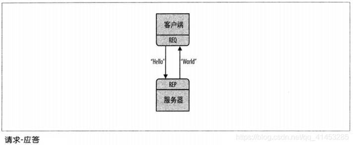
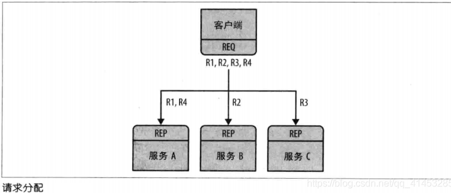
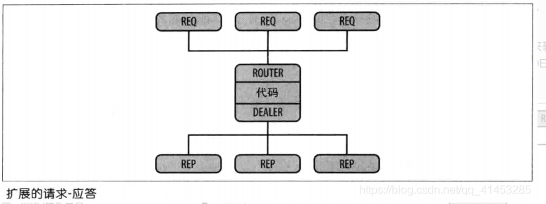
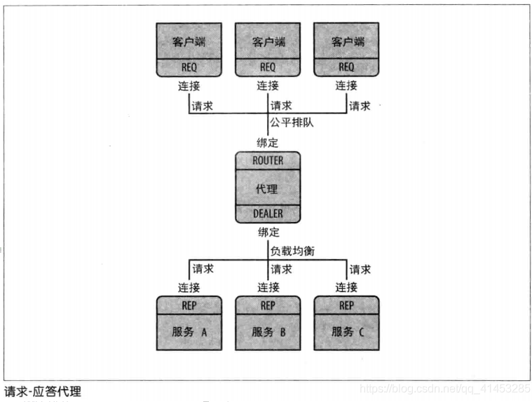
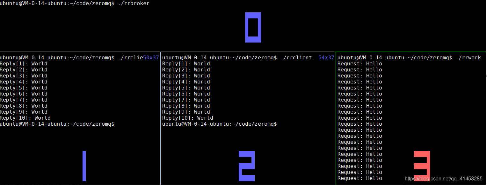

# 4 ZMQ请求-应答模式

原文链接：https://blog.csdn.net/qq_41453285/article/details/106878960

* 请求-响应模式由http://rfc.zeromq.org/spec:28正式定义

* 请求-应答模式应该是最常见的交互模式，如果连接之后，服务器终止，那么客户端也终止，从崩溃的过程中恢复不太容易

* 因此，做一个可靠的请求-应答模式很复杂，在很后面我们会有一部分系列文章介绍“可靠的请求-应答模式”

* “请求-响应模型”支持的套接字类型有4种：

  * ZMQ_REP

  * ZMQ_REQ

  * ZMQ_DEALER

  * ZMQ_ROUTER

## 4.1 REQ-REP套接字类型

- 请求-响应模式用于将请求**从ZMQ_REQ客户端发送到一个或多个ZMQ_REP服务**，并接收对每个发送的请求的后续答复
- **REQ-REP套接字对是步调一致的。**它们两者的次序必须有规则，不能同时发送或接收，否则无效果

### 4.1.1 ZMQ_REQ

* 客户端使用ZMQ_REQ类型的套接字向服务发送请求并从服务接收答复
* 此套接字类型仅允许zmq_send(request)和后续zmq_recv(reply)调用交替序列。发送的每个请求都在所有服务中轮流轮询，并且收到的每个答复都与最后发出的请求匹配
* 如果没有可用的服务，则套接字上的任何发送操作都应阻塞，直到至少有一项服务可用为止。REQ套接字不会丢弃消息

  **ZMQ_REQ特性摘要** 

| 兼容的对等套接字 | ZMQ_REP、ZMQ_ROUTER          |
| ---------------- | ---------------------------- |
| 方向             | 双向                         |
| 发送/接收模式    | 发送、接收、发送、接收...... |
| 入网路由策略     | 最后一位（Last peer）        |
| 外发路由策略     | 轮询                         |
| 静音状态下的操作 | 阻塞                         |

### 4.1.2 ZMQ_REP

* 服务使用ZMQ_REP类型的套接字来接收来自客户端的请求并向客户端发送回复

* 此套接字类型仅允许zmq_recv(request)和后续zmq_send(reply)调用的交替序列。接收到的每个请求都从

  有客户端中公平排队，并且发送的每个回复都路由到发出最后一个请求的客户端

* 如果原始请求者不再存在，则答复将被静默丢弃

  **ZMQ_REP特性摘要** 

| 兼容的对等套接字 | ZMQ_REQ、ZMQ_DEALER          |
| ---------------- | ---------------------------- |
| 方向             | 双向                         |
| 发送/接收模式    | 接收、发送、接收、发送...... |
| 入网路由策略     | 公平排队                     |
| 外发路由策略     | 最后一位（Last peer）        |
|                  |                              |

- **演示案例如下：**

  - 服务端创建REP套接字，阻塞等待客户端消息的到达，当客户端有消息达到时给客户端回送“World”字符串

  - 客户端创建REP套接字，向服务端发送字符串“Hello”，然后等待服务端回送消息

    

**服务端代码如下：**

```C
// https://github.com/dongyusheng/csdn-code/blob/master/ZeroMQ/hwserver.c
// hwserver.c
#include <stdio.h>
#include <string.h>
#include <assert.h>
#include <stdlib.h>
#include <unistd.h>
#include <zmq.h>
 
// 向socket发送数据, 数据为string
static int s_send(void *socket, char *string);
// 从socket接收数据, 并将数据以字符串的形式返回
static char *s_recv(void *socket);
 
int main()
{
    // 1.创建上下文
    void *context = zmq_ctx_new();
 
    // 2.创建、绑定套接字
    void *responder = zmq_socket(context, ZMQ_REP);
    zmq_bind(responder, "tcp://*:5555");
 
    int rc;
    // 3.循环接收数据、发送数据
    while(1)
    {
        // 4.接收数据
        char *request = s_recv(responder);
        assert(request != NULL);
        printf("Request: %s\n", request);
        free(request);
 
        // 休眠1秒再继续回复
        sleep(1);
 
        // 5.回送数据
        char *reply = "World";
        rc = s_send(responder, reply);
        assert(rc > 0);
    }
 
    // 6.关闭套接字、销毁上下文
    zmq_close(responder);
    zmq_ctx_destroy(context);
 
    return 0;
}
 
static int s_send(void *socket, char *string)
{
    int rc;
    
    zmq_msg_t msg;
    zmq_msg_init_size(&msg, 5);
    memcpy(zmq_msg_data(&msg), string, strlen(string));
    
    rc = zmq_msg_send(&msg, socket, 0);
    zmq_msg_close(&msg);
 
    return rc;
}
 
static char *s_recv(void *socket)
{
    int rc;
    zmq_msg_t msg;
    zmq_msg_init(&msg);
    
    rc = zmq_msg_recv(&msg, socket, 0);
    if(rc == -1)
        return NULL;
    
    char *string = (char*)malloc(rc + 1);
    memcpy(string, zmq_msg_data(&msg), rc);
    zmq_msg_close(&msg);
    
    string[rc] = 0;
    return string;
}
```

**客户端代码如下：**

```C
// https://github.com/dongyusheng/csdn-code/blob/master/ZeroMQ/hwclient.c
// hwclient.c
#include <stdio.h>
#include <stdlib.h>
#include <assert.h>
#include <string.h>
#include <zmq.h>
 
// 向socket发送数据, 数据为string
static int s_send(void *socket, char *string);
// 从socket接收数据, 并将数据以字符串的形式返回
static char *s_recv(void *socket);
 
int main()
{
    // 1.创建上下文
    void *context = zmq_ctx_new();
 
    // 2.创建套接字、连接服务器
    void *requester = zmq_socket(context, ZMQ_REQ);
    zmq_connect(requester, "tcp://localhost:5555");
 
    int rc;
    // 3.循环发送数据、接收数据
    while(1)
    {
        // 4.发送数据
        char *request = "Hello";
        rc = s_send(requester, request);
        assert(rc > 0);
 
        // 5.接收回复数据
        char *reply = s_recv(requester);
        assert(reply != NULL);
        printf("Reply: %s\n", reply);
        free(reply);
    }
 
    // 6.关闭套接字、销毁上下文
    zmq_close(requester);
    zmq_ctx_destroy(context);
 
    return 0;
}
 
static int s_send(void *socket, char *string)
{
    int rc;
    
    zmq_msg_t msg;
    zmq_msg_init_size(&msg, 5);
    memcpy(zmq_msg_data(&msg), string, strlen(string));
    
    rc = zmq_msg_send(&msg, socket, 0);
    zmq_msg_close(&msg);
 
    return rc;
}
 
static char *s_recv(void *socket)
{
    int rc;
    zmq_msg_t msg;
    zmq_msg_init(&msg);
    
    rc = zmq_msg_recv(&msg, socket, 0);
    if(rc == -1)
        return NULL;
    
    char *string = (char*)malloc(rc + 1);
    memcpy(string, zmq_msg_data(&msg), rc);
    zmq_msg_close(&msg);
    
    string[rc] = 0;
    return string;
}
```

**编译并运行如下，**左侧为服务端，右侧为客户端：


## 4.2 DEALER-ROUTER套接字类型

本文介绍“DEALER-ROUTER”的语法和代理演示案例，在后面的一个专题中我们将介绍如何使用“DEALER-ROUTER”来构建各种异步请求-应答流

### **4.2.1 ZMQ_DEALER**

* ZMQ_DEALER类型的套接字是用于扩展“请求/应答”套接字的高级模式
* 发送消息时：当ZMQ_DEALER套接字由于已达到所有对等点的最高水位而进入静音状态时，或者如果根本没有任何对等点，则套接字上的任何zmq_send()操作都应阻塞，直到静音状态结束或至少一个对等方变得可以发送；消息不会被丢弃
* 接收消息时：发送的每条消息都是在所有连接的对等方之间进行轮询，并且收到的每条消息都是从所有连接的对等方进行公平排队的
* 将ZMQ_DEALER套接字连接到ZMQ_REP套接字时，发送的每个消息都必须包含一个空的消息部分，定界符以及一个或多个主体部分

**ZMQ_DEALER特性摘要** 

| 兼容的对等套接字 | ZMQ_ROUTER、ZMQ_REP、ZMQ_DEALER |
| ---------------- | ------------------------------- |
| 方向             | 双向                            |
| 发送/接收模式    | 无限制                          |
| 入网路由策略     | 公平排队                        |
| 外发路由策略     | 轮询                            |
| 静音状态下的操作 | 阻塞                            |

### **4.2.2  ZMQ_ROUTER**

* ZMQ_ROUTER类型的套接字是用于扩展请求/答复套接字的高级套接字类型
* 当收到消息时：ZMQ_ROUTER套接字在将消息传递给应用程序之前，应在消息部分之前包含消息的始发对等方的路由ID。接收到的消息从所有连接的同级之间公平排队
* 发送消息时：
  * ZMQ_ROUTER套接字应删除消息的第一部分，并使用它来确定消息应路由到的对等方的_routing id _。如果该对等点不再存在或从未存在，则该消息将被静默丢弃
  * 但是，如果ZMQ_ROUTER_MANDATORY套接字选项设置为1，这两种情况下套接字都将失败并显示EHOSTUNREACH
* 高水位标记影响：
  * 当ZMQ_ROUTER套接字由于达到所有同位体的高水位线而进入静音状态时，发送到该套接字的任何消息都将被丢弃，直到静音状态结束为止。同样，任何路由到已达到单个高水位标记的对等方的消息也将被丢弃
  * 如果ZMQ_ROUTER_MANDATORY套接字选项设置为1，则在两种情况下套接字都应阻塞或返回EAGAIN
* ZMQ_ROUTER_MANDATORY套接字选项：
  * 当ZMQ_ROUTER套接字的ZMQ_ROUTER_MANDATORY标志设置为1时，套接字应在接收到来自一个或多个对等方的消息后生成ZMQ_POLLIN事件
  * 同样，当至少一个消息可以发送给一个或多个对等方时，套接字将生成ZMQ_POLLOUT事件
* 当ZMQ_REQ套接字连接到ZMQ_ROUTER套接字时，除了始发对等方的路由ID外，每个收到的消息都应包含一个空的定界符消息部分。因此，由应用程序看到的每个接收到的消息的整个结构变为：一个或多个路由ID部分，定界符部分，一个或多个主体部分。将回复发送到ZMQ_REQ套接字时，应用程序必须包括定界符部分

**ZMQ_ROUTER特性摘要** 

| 兼容的对等套接字 | ZMQ_DEALER、ZMQ_REQ、ZMQ_ROUTER |
| ---------------- | ------------------------------- |
| 方向             | 双向                            |
| 发送/接收模式    | 无限制                          |
| 入网路由策略     | 公平排队                        |
| 外发路由策略     | 看上面介绍                      |
| 静音状态下的操作 | 丢弃（见上面介绍）              |

### 4.2.3 共享队列/代理

在“REP-REQ”的演示案例中，我们只有一个客户端和一个服务端进行交流。但是实际中，我们通常允许多个客户端与多个服务端之间相互交流
将多个客户端连接到多个服务器的方法有两种：
    方法①：将每个客户端都连接到多个服务端点
    方法②：使用代理

方法①：

* 原理：一种是将每个客户端套接字连接到多个服务端点。REQ套接字随后会将请求发送到服务端上。比如说一个客户端连接了三个服务端点：A、B、C，之后发送请求R1、R4到服务A上，发送请求R2到服务B上、发送请求R3到服务C上（如下图所示）
* 对于这种设计来说，服务器属于静态部分，客户端属于动态部分，客户端的增减无所谓，但是服务器的增减确实致命的。假设现在有100个客户端都连接了服务器，如果此时新增了三台服务器，为了让客户端识别这新增的三台服务器，那么就需要将所有的客户端都停止重新配置然后再重新启动



方法②：

* 我们可以编写一个小型消息排队代理，使我们具备灵活性

* 原理：该代理绑定到了两个端点，一个用于客户端的前端（ZMQ_ROUTER），另一个用于服务的后端（ZMQ_DEALER）。然后带来使用zmq_poll()来轮询这两个套接字的活动，当有消息时，代理会将消息在两个套接字之间频繁地输送

* 该代理其实并不显式管理任何队列，其只负责消息的传送，ØMQ会自动将消息在每个套接字上进行排队

* 使用zmq_poll()配合DEALER-ROUTER：

  * 在上面我们使用REQ-REP套接字时，会有一个严格同步的请求-响应对话，就是必须客户端先发送一个请求，然后服务端读取请求并发送应答，最后客户端读取应答，如此反复。如果客户端或服务端尝试破坏这种约束（例如，连续发送两个请求，而没有等待响应），那么将返回一个错误
  * 我们的代理必须是非阻塞的，可以使用zmq_poll()来轮询任何一个套接字上的活动，但我们不能使用REQ-REQ。幸运地是，有两个称为DEALER和ROUTER的套接字，它们能我们可以执行无阻塞的请求-响应

  

- **代理演示案例如下所示：****我们扩展了上面的“REQ-REP”演示案例：**REQ和ROUTER交流，DEALER与REP交流。代理节点从一个套接字读取消息，并将消息转发到其他套接字



**客户端的代码如下：**将REQ套接字连接到代理的ROUTER节点上，向ROUTER节点发送“Hello”，接收到“World”的回复

```C
// rrclient.c
// https://github.com/dongyusheng/csdn-code/blob/master/ZeroMQ/rrclient.c
#include <stdio.h>
#include <stdlib.h>
#include <string.h>
#include <zmq.h>
 
// 向socket发送数据, 数据为string
static int s_send(void *socket, char *string);
// 从socket接收数据, 并将数据以字符串的形式返回
static char *s_recv(void *socket);
 
int main()
{
    int rc;
    // 1.初始化上下文
    void *context = zmq_ctx_new();
 
    // 2.创建套接字、连接代理的ROUTER端
    void *requester = zmq_socket(context, ZMQ_REQ);
    rc = zmq_connect(requester, "tcp://localhost:5559");
    if(rc == -1)
    {
        perror("zmq_connect");
        zmq_close(requester);
        zmq_ctx_destroy(context);
        return -1;
    }
 
    // 3.循环发送、接收数据(10次)
    int request_nbr;
    for(request_nbr = 0; request_nbr < 10; request_nbr++)
    {
        // 4.先发送数据
        rc = s_send(requester, "Hello");
        if(rc < 0)
        {
            perror("s_send");
            zmq_close(requester);
            zmq_ctx_destroy(context);
            return -1;
        }
        
        // 5.等待响应
        char *reply = s_recv(requester);
        if(reply == NULL)
        {
            perror("s_recv");
            free(reply);
            zmq_close(requester);
            zmq_ctx_destroy(context);
            return -1;
        }
        printf("Reply[%d]: %s\n", request_nbr + 1, reply);
        free(reply);
    }
 
    // 6.关闭套接字、销毁上下文
    zmq_close(requester);
    zmq_ctx_destroy(context);
 
    return 0;
}
 
static int s_send(void *socket, char *string)
{
    int rc;
    
    zmq_msg_t msg;
    zmq_msg_init_size(&msg, 5);
    memcpy(zmq_msg_data(&msg), string, strlen(string));
    
    rc = zmq_msg_send(&msg, socket, 0);
    zmq_msg_close(&msg);
 
    return rc;
}
 
static char *s_recv(void *socket)
{
    int rc;
    zmq_msg_t msg;
    zmq_msg_init(&msg);
    
    rc = zmq_msg_recv(&msg, socket, 0);
    if(rc == -1)
        return NULL;
    
    char *string = (char*)malloc(rc + 1);
    memcpy(string, zmq_msg_data(&msg), rc);
    zmq_msg_close(&msg);
    
    string[rc] = 0;
    return string;
}
```

- **服务端的代码如下：**将REP套接字连接到代理的DEALER节点上

```C
// rrworker.c
// https://github.com/dongyusheng/csdn-code/blob/master/ZeroMQ/rrworker.c
#include <stdio.h>
#include <stdlib.h>
#include <string.h>
#include <unistd.h>
#include <zmq.h>
 
// 向socket发送数据, 数据为string
static int s_send(void *socket, char *string);
// 从socket接收数据, 并将数据以字符串的形式返回
static char *s_recv(void *socket);
 
int main()
{
    int rc;
    // 1.初始化上下文
    void *context = zmq_ctx_new();
 
    // 2.创建套接字、连接代理的DEALER端
    void *responder = zmq_socket(context, ZMQ_REP);
    rc = zmq_connect(responder, "tcp://localhost:5560");
    if(rc == -1)
    {
        perror("zmq_connect");
        zmq_close(responder);
        zmq_ctx_destroy(context);
        return -1;
    }
 
    // 3.循环接收、响应
    while(1)
    {
        // 4.先等待接收数据
        char *request = s_recv(responder);
        if(request == NULL)
        {
            perror("s_recv");
            free(request);
            zmq_close(responder);
            zmq_ctx_destroy(context);
            return -1;
        }
        printf("Request: %s\n", request);
        free(request);
 
        // 休眠1秒再进行响应
        sleep(1);
        
        // 5.响应
        rc = s_send(responder, "World");
        if(rc < 0)
        {
            perror("s_send");
            zmq_close(responder);
            zmq_ctx_destroy(context);
            return -1;
        }
    }
 
    // 6.关闭套接字、销毁上下文
    zmq_close(responder);
    zmq_ctx_destroy(context);
 
    return 0;
}
 
static int s_send(void *socket, char *string)
{
    int rc;
    
    zmq_msg_t msg;
    zmq_msg_init_size(&msg, 5);
    memcpy(zmq_msg_data(&msg), string, strlen(string));
    
    rc = zmq_msg_send(&msg, socket, 0);
    zmq_msg_close(&msg);
 
    return rc;
}
 
static char *s_recv(void *socket)
{
    int rc;
    zmq_msg_t msg;
    zmq_msg_init(&msg);
    
    rc = zmq_msg_recv(&msg, socket, 0);
    if(rc == -1)
        return NULL;
    
    char *string = (char*)malloc(rc + 1);
    memcpy(string, zmq_msg_data(&msg), rc);
    zmq_msg_close(&msg);
    
    string[rc] = 0;
    return string;
}
```

- **代理端的代码如下：**
  - 创建一个ROUTER套接字与客户端相连接，创建一个DEALER套接字与服务端相连接
  - ROUTER套接字从客户端接收请求数据，并把请求数据发送给服务端
  - DEALER套接字从服务端接收响应数据，并把响应数据发送给客户端

```C
// rrbroker.c
// https://github.com/dongyusheng/csdn-code/blob/master/ZeroMQ/rrbroker.c
#include <stdio.h>
#include <stdio.h>
#include <stdlib.h>
#include <string.h>
#include <zmq.h>
 
int main()
{
    int rc;
    // 1.初始化上下文
    void *context = zmq_ctx_new();
 
    // 2.创建、绑定套接字
    void *frontend = zmq_socket(context, ZMQ_ROUTER);
    void *backend = zmq_socket(context, ZMQ_DEALER);
    // ZMQ_ROUTER绑定到5559, 接收客户端的请求
    rc = zmq_bind(frontend, "tcp://*:5559");
    if(rc == -1)
    {
        perror("zmq_bind");
        zmq_close(frontend);
        zmq_close(backend);
        zmq_ctx_destroy(context);
        return -1;
    }
    // ZMQ_DEALER绑定到5560, 接收服务端的回复
    rc = zmq_bind(backend, "tcp://*:5560");
    if(rc == -1)
    {
        perror("zmq_bind");
        zmq_close(frontend);
        zmq_close(backend);
        zmq_ctx_destroy(context);
        return -1;
    }
    // 3.初始化轮询集合
    zmq_pollitem_t items[] = {
        { frontend, 0, ZMQ_POLLIN, 0 },
        { backend, 0, ZMQ_POLLIN, 0 }
    };
 
    // 4.在套接字上切换消息
    while(1)
    {
        zmq_msg_t msg;
        //多部分消息检测
        int more;     
 
        // 5.调用zmq_poll轮询消息
        rc = zmq_poll(items, 2, -1);
        //zmq_poll出错
        if(rc == -1)     
        {
             perror("zmq_poll");
            zmq_close(frontend);
            zmq_close(backend);
            zmq_ctx_destroy(context);
            return -1;
        }
        //zmq_poll超时
        else if(rc == 0) 
            continue;
        else
        {
            // 6.如果ROUTER套接字有数据来
            if(items[0].revents & ZMQ_POLLIN)
            {
                while(1)
                {
                    // 从ROUTER上接收数据, 这么数据是客户端发送过来的"Hello"
                    zmq_msg_init(&msg);
                    zmq_msg_recv(&msg, frontend, 0);
 
                    // 查看是否是接收多部分消息, 如果后面还有数据要接收, 那么more会被置为1
                    size_t more_size = sizeof(more);
                    zmq_getsockopt(frontend, ZMQ_RCVMORE, &more, &more_size);
 
                    // 接收"Hello"之后, 将数据发送到DEALER上, DEALER会将"Hello"发送给服务端
                    zmq_msg_send(&msg, backend, more ? ZMQ_SNDMORE : 0);
                    zmq_msg_close(&msg);
 
                    // 如果没有多部分数据可以接收了, 那么退出循环
                    if(!more)
                        break;
                }
            }
            // 7.如果DEALER套接字有数据来
            if(items[1].revents & ZMQ_POLLIN)
            {
                
                while(1)
                {
                    // 接收服务端的响应"World"
                    zmq_msg_init(&msg);
                    zmq_msg_recv(&msg, backend, 0);
 
                    // 查看是否是接收多部分消息, 如果后面还有数据要接收, 那么more会被置为1
                    size_t more_size = sizeof(more);
                    zmq_getsockopt(backend, ZMQ_RCVMORE, &more, &more_size);
 
                    // 接收"World"之后, 将数据发送到ROUTER上, ROUTER会将"World"发送给客户端
                    zmq_msg_send(&msg, frontend, more ? ZMQ_SNDMORE : 0);
                    zmq_msg_close(&msg);
 
                    // 如果没有多部分数据可以接收了, 那么退出循环
                    if(!more)
                        break;
                }
            }
        }
    }
 
    // 8.关闭套接字、销毁上下文
    zmq_close(frontend);
    zmq_close(backend);
    zmq_ctx_destroy(context);
    
    return 0;
}
```

编译

```shell
gcc -o rrclient rrclient.c -lzmq
gcc -o rrworker rrworker.c -lzmq
gcc -o rrbroker rrbroker.c -lzmq
```

**一次运行如下，**左侧为客户端，中间为代理，右侧为服务端


**下面运行两个客户端，**0为代理，1、2为客户端，3位服务端。可以看到客户端的消息是有顺序到达客户端的，消息会自动进行排队



————————————————
版权声明：本文为CSDN博主「董哥的黑板报」的原创文章，遵循CC 4.0 BY-SA版权协议，转载请附上原文出处链接及本声明。
原文链接：https://blog.csdn.net/qq_41453285/article/details/106878960

————————————————
版权声明：本文为CSDN博主「董哥的黑板报」的原创文章，遵循CC 4.0 BY-SA版权协议，转载请附上原文出处链接及本声明。
原文链接：https://blog.csdn.net/qq_41453285/article/details/106878960


————————————————
版权声明：本文为CSDN博主「董哥的黑板报」的原创文章，遵循CC 4.0 BY-SA版权协议，转载请附上原文出处链接及本声明。
原文链接：https://blog.csdn.net/qq_41453285/article/details/106878960


————————————————
版权声明：本文为CSDN博主「董哥的黑板报」的原创文章，遵循CC 4.0 BY-SA版权协议，转载请附上原文出处链接及本声明。
原文链接：https://blog.csdn.net/qq_41453285/article/details/106878960

# tips

1. 关于bind和connect：例如pub和sub示例1，并不是pub必须调用bind，sub一定调用connect。实际是根据那一端是服务端（也就是单独的），那一端是客户端（多数的）来决定的。总是服务端调用bind，客户端调用connnect。

# 附录

比较新的中文参考

https://blog.csdn.net/weixin_34854320/article/details/112983028

https://www.cnblogs.com/neooelric/p/9020872.html

较旧的中文参考就是zmq中文目录下的内容

https://github.com/dongyusheng/csdn-code/

https://blog.csdn.net/qq_41453285/category_9981784.html

官方说明：https://zguide.zeromq.org/docs/chapter1/

官方API：http://api.zeromq.org/

博客 https://blog.csdn.net/qq_41453285/article/details/106865539