# 1 ZMQ基础

## 1.1 获取例子

这些例子存在于一个公共的GitHub库中。获取所有示例的最简单方法是克隆这个存储库

```shell
git clone --depth=1 https://github.com/imatix/zguide.git
```

浏览examples子目录。你会通过语言找到例子。

## 1.2 请求应答 Request-Reply

从Hello  World的例子开始。我们将创建一个客户机和一个服务器。客户端向服务器发送“Hello”，服务器以“World”作为响应。这是C语言的服务器，它在端口5555上打开一个ZeroMQ scoket，读取请求，然后用“World”对每个请求进行响应:

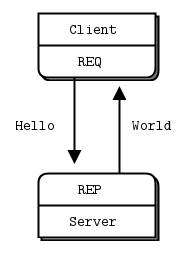

REQ-REP套接字对是**同步的**。客户机在循环中发出zmq_send()然后zmq_recv()，在循环中(或者只需要执行一次)。执行任何其他序列(例如，在一行中发送两条消息)都会导致send或recv调用返回的代码为-1。类似地，服务按这个顺序发出zmq_recv()然后zmq_send()。

```C
//  Hello World server
//hwserver.c

#include <zmq.h>
#include <stdio.h>
#include <unistd.h>
#include <string.h>
#include <assert.h>

int main (void)
{
    //  Socket to talk to clients
    void *context = zmq_ctx_new ();
    void *responder = zmq_socket (context, ZMQ_REP);
    int rc = zmq_bind (responder, "tcp://*:5555");
    assert (rc == 0);

    while (1) {
        char buffer [10];
        zmq_recv (responder, buffer, 10, 0);
        printf ("Received Hello\n");
        sleep (1);          //  Do some 'work'
        zmq_send (responder, "World", 5, 0);
    }
    return 0;
}


```

```C
//  Hello World client
//hwclient.c
#include <zmq.h>
#include <string.h>
#include <stdio.h>
#include <unistd.h>

int main (void)
{
    printf ("Connecting to hello world server...\n");
    void *context = zmq_ctx_new ();
    void *requester = zmq_socket (context, ZMQ_REQ);
    zmq_connect (requester, "tcp://localhost:5555");

    int request_nbr;
    for (request_nbr = 0; request_nbr != 10; request_nbr++) {
        char buffer [10];
        printf ("Sending Hello %d...\n", request_nbr);
        zmq_send (requester, "Hello", 5, 0);
        zmq_recv (requester, buffer, 10, 0);
        printf ("Received World %d\n", request_nbr);
    }
    zmq_close (requester);
    zmq_ctx_destroy (context);
    return 0;
}

```

**上面的代码如果杀死服务器(Ctrl-C)并重新启动它，客户端将无法正常恢复（杀死客户端重启客户端可以恢复）。**创建一个可靠的请求应答参考后面。

* 分析：
  * server和client的启动顺序无关，都可以运行。
  * client 先调用send，后调用recv。server先调用recv，后调用send。
  * 杀掉client，再启动。server无影响
  * 杀掉server，再启动。client不能通信。原因不详

## 1.3 字符串

除了以字节为单位的大小外，ZeroMQ对您发送的数据一无所知。这意味着您要负责安全地格式化它，以便应用程序能够读取它。为对象和复杂数据类型执行此操作是专门库(如 Protocol Buffers.)的工作。但即使是字符串，你也要小心。

在C语言和其他一些语言中，字符串以空字节结束。我们可以发送一个字符串，如“HELLO”与额外的空字节:

```C
zmq_send (requester, "Hello", 6, 0);//需要包含5个字符和一个结束符
```

但是，如果您从另一种语言发送一个字符串，它可能不会包含那个空字节。例如，当我们用Python发送相同的字符串时，我们这样做:

```python
socket.send ("Hello")
```

会发送一个长度和对应的字符如下图

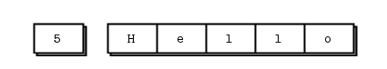

实际的抓包如下图

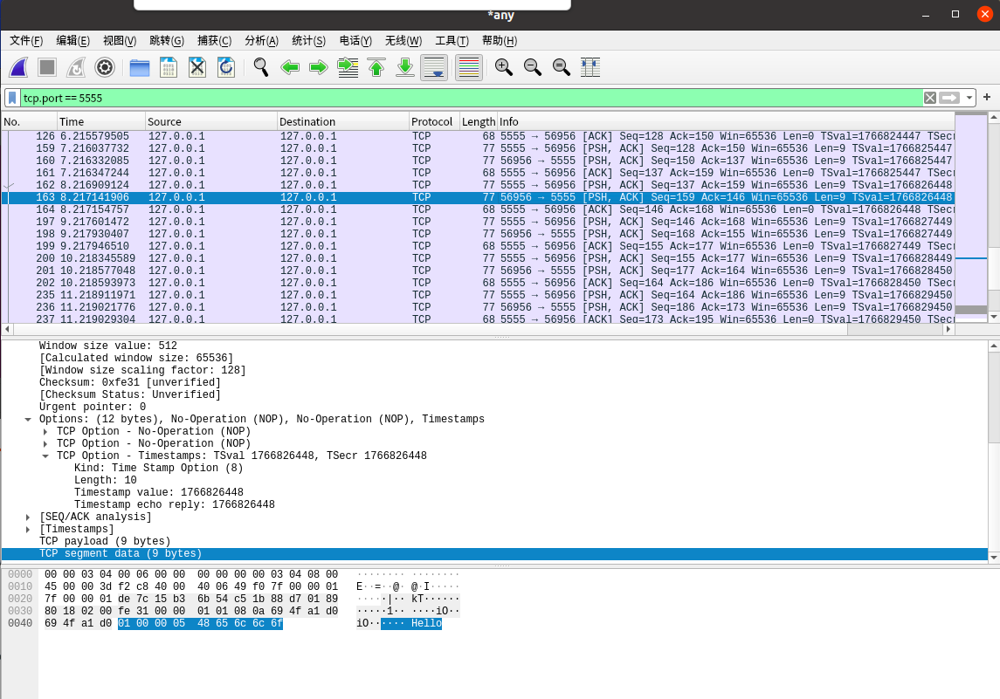


如果您从C程序中读取这段代码，您将得到一个看起来像字符串的东西，并且可能意外地表现得像字符串(如果幸运的话，这5个字节后面跟着一个无辜的潜伏的null)，但是它不是一个正确的字符串。当您的客户机和服务器不同意字符串格式时，您将得到奇怪的结果。

当您在C语言中从ZeroMQ接收字符串数据时，您不能简单地相信它已经安全终止。每次读取字符串时，都应该为额外的字节分配一个带空间的新缓冲区，复制字符串，并使用null正确地终止它。

因此，让我们建立一个规则，即ZeroMQ字符串是指定长度的，并且在传输时不带null。在最简单的情况下(在我们的示例中我们将这样做)，ZeroMQ字符串整洁地映射到ZeroMQ消息框架，它看起来像上面的图—长度和一些字节。

在C语言中，我们需要做的是接收一个ZeroMQ字符串并将其作为一个有效的C字符串发送给应用程序:

```C
//  Receive ZeroMQ string from socket and convert into C string
//  Chops string at 255 chars, if it's longer
static char *
s_recv (void *socket) {
    char buffer [256];
    int size = zmq_recv (socket, buffer, 255, 0);
    if (size == -1)
        return NULL;
    if (size > 255)
        size = 255;
    buffer [size] = \0;
    /* use strndup(buffer, sizeof(buffer)-1) in *nix */
    return strdup (buffer);
}
```

让我们编写一个类似的s send函数，以正确的ZeroMQ格式发送字符串，并将其打包成一个我们可以重用的头文件。就是zhelers .h，它让我们可以用C语言编写更漂亮、更短的ZeroMQ应用程序。

## 1.4 消息分发pub-sub

第二个经典模式是单向数据分发，在这种模式中，服务器将更新推送到一组客户机。让我们看一个示例，它推出了包含邮政编码、温度和相对湿度的天气更新。

这种更新流没有开始也没有结束，就像一个永远不会结束的广播。

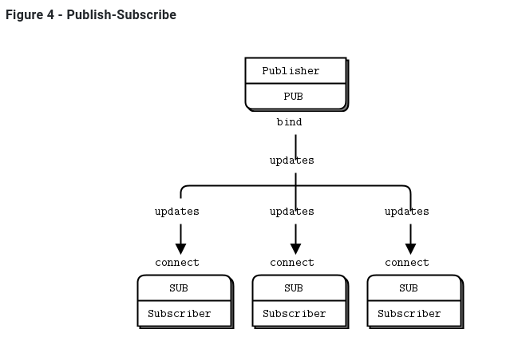

```C
//  Weather update server
//  Binds PUB socket to tcp://*:5556
//  Publishes random weather updates

#include "zhelpers.h"

int main (void)
{
    //  Prepare our context and publisher
    void *context = zmq_ctx_new ();
    void *publisher = zmq_socket (context, ZMQ_PUB);
    int rc = zmq_bind (publisher, "tcp://*:5556");
    assert (rc == 0);

    //  Initialize random number generator
    srandom ((unsigned) time (NULL));
    while (1) {
        //  Get values that will fool the boss
        int zipcode, temperature, relhumidity;
        zipcode     = randof (100000);
        temperature = randof (215) - 80;
        relhumidity = randof (50) + 10;

        //  Send message to all subscribers
        char update [20];
        sprintf (update, "%05d %d %d", zipcode, temperature, relhumidity);
        s_send (publisher, update);
    }
    zmq_close (publisher);
    zmq_ctx_destroy (context);
    return 0;
}

```

```C
//  Weather update client
//  Connects SUB socket to tcp://localhost:5556
//  Collects weather updates and finds avg temp in zipcode

#include "zhelpers.h"

int main (int argc, char *argv [])
{
    //  Socket to talk to server
    printf ("Collecting updates from weather server...\n");
    void *context = zmq_ctx_new ();
    void *subscriber = zmq_socket (context, ZMQ_SUB);
    int rc = zmq_connect (subscriber, "tcp://localhost:5556");
    assert (rc == 0);

    //  Subscribe to zipcode, default is NYC, 10001
    const char *filter = (argc > 1)? argv [1]: "10001 ";
    rc = zmq_setsockopt (subscriber, ZMQ_SUBSCRIBE,
                         filter, strlen (filter));
    assert (rc == 0);

    //  Process 100 updates
    int update_nbr;
    long total_temp = 0;
    for (update_nbr = 0; update_nbr < 100; update_nbr++) {
        char *string = s_recv (subscriber);

        int zipcode, temperature, relhumidity;
        sscanf (string, "%d %d %d",
            &zipcode, &temperature, &relhumidity);
        total_temp += temperature;
        free (string);
    }
    printf ("Average temperature for zipcode '%s' was %dF\n",
        filter, (int) (total_temp / update_nbr));

    zmq_close (subscriber);
    zmq_ctx_destroy (context);
    return 0;
}

```

```shell
$ time wuclient
Collecting updates from weather server...
Average temperature for zipcode '10001 ' was 28F

real    0m4.470s
user    0m0.000s
sys     0m0.008s
```


注意，当您使用 SUB socket 时，必须使用zmq_setsockopt()和SUBSCRIBE设置订阅，如下面的代码所示。如果不设置任何订阅，就不会收到任何消息。这是初学者常犯的错误。**订阅者可以设置许多订阅，这些订阅被添加到一起。**也就是说，如果更新匹配任何订阅，订阅方将接收更新。**订阅者还可以取消特定的订阅**。订阅通常是，但不一定是可打印的字符串。请参阅zmq_setsockopt()了解其工作原理。

**PUB-SUB socket （双方的意思）是异步的**。客户机在循环中执行zmq_recv()(或者它只需要一次)。试图向 SUB socket发送消息将导致错误（**单向的只能收不能发**）。类似地，服务在需要的时候执行zmq_send()，但是不能在PUB scoket上执行zmq_recv()（**单向的只能发不能收**）。

**在理论上，对于ZeroMQ套接字，哪端调用connect哪端bind并不重要。但是，在实践中存在一些没有说明的差异，稍后我将介绍这些差异。现在，PUB调用bind，SUB调用connect。**

关于PUB-SUB套接字，还有一件更重要的事情需要了解:您不能准确地知道订阅者何时开始获取消息。即使启动订阅者、等待一段时间后再启动发布服务器，订阅者也将始终错**过发布服务器发送的第一个消息**。这是因为当订阅者连接到发布者时(这个过程花费的时间很少，但不为零)，发布者可能已经在发送消息了。

这种“慢速加入者”症状经常出现在很多人身上，我们将对此进行详细解释。记住ZeroMQ执行异步I/O，即，在后台。假设有两个节点按如下顺序执行此操作:

- 订阅者连接到端点并接收和计数消息。
- 发布者绑定到端点并立即发送1,000条消息。

那么订阅者很可能不会收到任何东西。假设建立一个连接需要5毫秒，并且相同的链接每秒可以处理1M条消息。在订阅者连接到发布者的5毫秒期间，发布者只需要1毫秒就可以发送那些1000条消息

关于发布-订阅(pub-sub)模式的一些要点

* **订阅服务器可以连接到多个发布服务器，每次使用一个connect调用。**然后，数据将到达并交错(“公平排队”)，这样就不会有一个发布者淹没其他发布者。
* 如果发布者没有连接的订阅者，那么它将删除所有消息。
* **如果您正在使用TCP，而订阅服务器很慢，则消息将在发布服务器上排队**。稍后，我们将研究如何使用“高水位标记(high-water mark)”来保护publishers 不受此影响。
* 从ZeroMQ v3.x，当使用连接的协议(tcp://或ipc://)时，**过滤发生在发布端**。 使用epgm://协议，过滤发生在订阅方。在ZeroMQ v2.x，所有过滤都发生在订阅端。

## 1.5 分而治之 push-pull

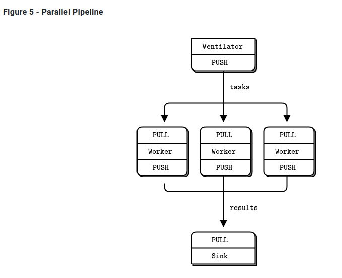

典型的并行处理模型。我们有:

- ventilator用于产生许多可并行完成的任务

- workers处理其中一个任务

- sink从worker进程收集结果

  

在现实中，workers 在超级快的机器上运行，可能使用gpu(图形处理单元)来做艰难的计算。ventilator 会生成100个任务，每个任务都有一条消息告诉worker睡眠几毫秒。

代码分别如下

```C
//taskvent.c
//  Task ventilator
//  Binds PUSH socket to tcp://localhost:5557
//  Sends batch of tasks to workers via that socket

#include "zhelpers.h"

int main (void) 
{
    void *context = zmq_ctx_new ();

    //  Socket to send messages on
    void *sender = zmq_socket (context, ZMQ_PUSH);
    zmq_bind (sender, "tcp://*:5557");

    //  Socket to send start of batch message on
    void *sink = zmq_socket (context, ZMQ_PUSH);
    zmq_connect (sink, "tcp://localhost:5558");

    printf ("Press Enter when the workers are ready: ");
    getchar ();
    printf ("Sending tasks to workers...\n");

    //  The first message is "0" and signals start of batch
    s_send (sink, "0");

    //  Initialize random number generator
    srandom ((unsigned) time (NULL));

    //  Send 100 tasks
    int task_nbr;
    int total_msec = 0;     //  Total expected cost in msecs
    for (task_nbr = 0; task_nbr < 100; task_nbr++) {
        int workload;
        //  Random workload from 1 to 100msecs
        workload = randof (100) + 1;
        total_msec += workload;
        char string [10];
        sprintf (string, "%d", workload);
        s_send (sender, string);
    }
    printf ("Total expected cost: %d msec\n", total_msec);

    zmq_close (sink);
    zmq_close (sender);
    zmq_ctx_destroy (context);
    return 0;
}

```

```C
//taskwork.c
//  Task worker
//  Connects PULL socket to tcp://localhost:5557
//  Collects workloads from ventilator via that socket
//  Connects PUSH socket to tcp://localhost:5558
//  Sends results to sink via that socket

#include "zhelpers.h"

int main (void) 
{
    //  Socket to receive messages on
    void *context = zmq_ctx_new ();
    void *receiver = zmq_socket (context, ZMQ_PULL);
    zmq_connect (receiver, "tcp://localhost:5557");

    //  Socket to send messages to
    void *sender = zmq_socket (context, ZMQ_PUSH);
    zmq_connect (sender, "tcp://localhost:5558");

    //  Process tasks forever
    while (1) {
        char *string = s_recv (receiver);
        printf ("%s.", string);     //  Show progress
        fflush (stdout);
        s_sleep (atoi (string));    //  Do the work
        free (string);
        s_send (sender, "");        //  Send results to sink
    }
    zmq_close (receiver);
    zmq_close (sender);
    zmq_ctx_destroy (context);
    return 0;
}

```

```C
//tasksink.c
//  Task sink
//  Binds PULL socket to tcp://localhost:5558
//  Collects results from workers via that socket

#include "zhelpers.h"

int main(void)
{
  //  Prepare our context and socket
  void* context  = zmq_ctx_new();
  void* receiver = zmq_socket(context, ZMQ_PULL);
  zmq_bind(receiver, "tcp://*:5558");

  //  Wait for start of batch
  char* string = s_recv(receiver);
  free(string);

  //  Start our clock now
  int64_t start_time = s_clock();

  //  Process 100 confirmations
  int task_nbr;
  for (task_nbr = 0; task_nbr < 100; task_nbr++)
  {
    char* string = s_recv(receiver);
    free(string);
    if (task_nbr % 10 == 0)
      printf(":");
    else
      printf(".");
    fflush(stdout);
  }
  //  Calculate and report duration of batch
  printf("Total elapsed time: %d msec\n", (int)(s_clock() - start_time));

  zmq_close(receiver);
  zmq_ctx_destroy(context);
  return 0;
}

```

不同数量worker时，100个任务的运行时间如下

- 1 worker: total elapsed time: 5034 msecs.
- 2 workers: total elapsed time: 2421 msecs.
- 4 workers: total elapsed time: 1018 msecs.

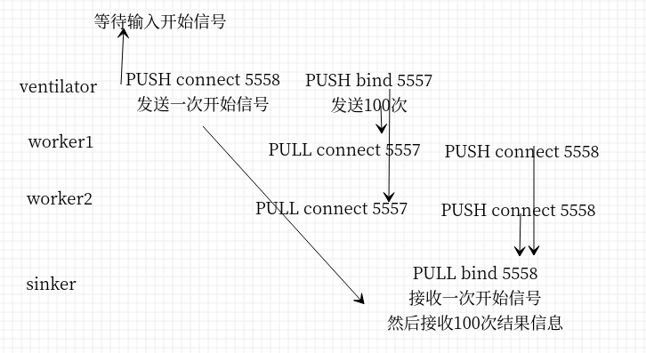

分析：

* worker可以任意添加
* **PUSH和PULL没有要求谁是bind谁是connect（其他类似PUB-SUB也没要求，根据需要，稳定的一端就是bind，动态接入的一端调用connect）**
* **worker的处理需要同步**，例如启动5个worker之后再进行启动100个任务的分配，如果没有同步当一组worker连接到ventilator 时，第一个成功连接的worker将在短时间内获得大量信息，而其他worker也在连接。所以在ventilator中等待用户输入，表示worker准备就绪，开始分配任务
* ventilator 的PUSH socket 将任务分配给worker(假设他们在批处理开始输出之前都连接好了)。这就是所谓的“**负载平衡**”
* sink的PULL均匀地收集worker的结果。这叫做“**公平排队”**。

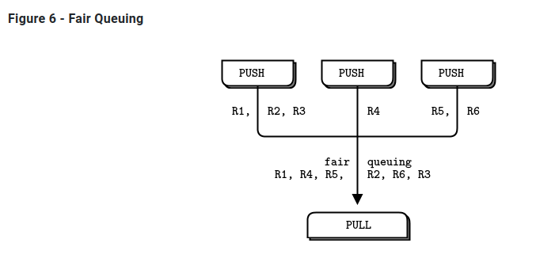

如果您正在使用 PUSH 和 PULL，而您的一个worker获得的消息比其他worker多得多，这是因为这个PULL socket连接得比其他worker更快，并且在其他worker设法连接之前捕获了大量消息。如果您想要适当的负载平衡，您可能需要查看Advanced Request-Reply Patterns中的负载平衡模式。


## 1.6 ZeroMQ编程

### 1.6.1 正确理解Contex

应该在程序中创建和使用一个contex。contex（上下文）是单个进程中所有套接字的容器，并作为inproc套接字的传输，inproc是连接一个进程中线程的最快方式。

如果在运行时，一个程序有两个上下文，它们就像独立的ZeroMQ实例。需要注意在进程开始时调用zmq ctx new()，在进程结束时调用zmq ctx destroy()。

### 1.6.2 退出前清理

当您在Python之类的语言中使用ZeroMQ时，会自动释放一些内容。但是在使用C语言时，必须小心地释放对象，否则会导致内存泄漏、应用程序不稳定。

内存泄漏是一回事，但是ZeroMQ对如何退出应用程序非常挑剔。原因是技术性的和痛苦的，但是结果是，**如果您打开任何sockets ，zmq_ctx_destroy()函数将永远挂起。即使关闭所有sockets ，默认情况下，如果有挂起连接或发送，zmq_ctx_destroy()将永远等待**，除非在关闭这些sockets 之前将这些sockets 的逗留时间设置为零。

我们需要注意的ZeroMQ对象是 messages, sockets, 和 contexts。

* 在可以的情况下使用zmq send()和zmq recv()，因为它避免了使用zmq msg t对象。
* 如果你打开和关闭了很多套接字，这可能意味着你需要重新设计你的应用程序。在某些情况下，除非销毁上下文，否则套接字句柄不会被释放。
* 退出程序时，关闭套接字，然后调用zmq ctx destroy()。销毁上下文。

这至少是C开发的情况。在具有自动对象销毁的语言中，离开作用域时将销毁套接字和上下文。
 如果使用异常，则必须在类似“final”块的地方进行清理，这与任何资源都是一样的。

如果你在做多线程的工作，它会变得比这更复杂。我们将在下一章中讨论多线程，但是由于有些人会不顾警告，在安全地行走前先尝试运行，下面是在多线程ZeroMQ应用程序中实现干净退出的多线程的ZeroMQ指南。

* 首先，**不要尝试从多个线程使用同一个socket**，（估计是线程不不安全，会竞争出错）。
* 接下来，您需要关闭具有正在进行的请求的每个socket。正确的方法是设置一个较低的逗留值(1秒)，然后关闭socket。如果您的语言绑定在销毁context时没有自动为您完成此任务，我建议发送一个补丁。
* 最后，销毁context。这将导致任何阻塞接收或轮询或发送附加线程(即,共享context)返回一个错误。捕获该错误，然后设置逗留，关闭该线程中的socket，然后退出。**不要销毁相同的Context两次**。**主线程中的zmq_ctx_destroy将阻塞，直到它所知道的所有socket都安全关闭为止**。

## 1.7 为什么我们需要ZeroMQ

让我们看看在开始使用原始TCP连接各个部分时所面临的典型问题。任何可重用的消息层都需要解决所有或大部分问题:

* 我们如何处理I/O?我们的应用程序是阻塞还是在后台处理I/O ?这是一个关键的设计决策。阻塞I/O会创建伸缩性不好的体系结构。但是后台I/O很难正确地执行。
* 我们如何处理动态组件，即，暂时消失的碎片?我们是否将组件正式划分为“客户端”和“服务器”，并要求服务器不能消失?如果我们想把服务器连接到服务器呢?我们是否每隔几秒钟就尝试重新连接?
* 我们如何在网络上表示消息?我们如何设置数据的框架，使其易于读写，不受缓冲区溢出的影响，对小消息有效，但对于那些戴着派对帽子跳舞的猫的大型视频来说，这已经足够了吗?
* 我们如何处理无法立即交付的消息?特别是，如果我们正在等待一个组件重新联机?我们是丢弃消息，将它们放入数据库，还是放入内存队列?
* 我们在哪里存储消息队列?如果从队列读取的组件非常慢，导致我们的队列增加，会发生什么?那么我们的策略是什么呢?
* 我们如何处理丢失的消息?我们是等待新数据、请求重发，还是构建某种确保消息不会丢失的可靠性层?如果这个层本身崩溃了呢?
* 如果我们需要使用不同的网络传输怎么办?比如说，多播而不是TCP单播?还是IPv6 ?我们是否需要重写应用程序，还是在某个层中抽象传输?
* 我们如何路由消息?我们可以向多个对等点发送相同的消息吗?我们可以将回复发送回原始请求者吗?
* 我们如何为另一种语言编写API ?我们是重新实现一个线级协议，还是重新打包一个库?如果是前者，如何保证栈的高效稳定?如果是后者，我们如何保证互操作性?
* 我们如何表示数据，以便在不同的体系结构之间读取数据?我们是否对数据类型强制执行特定的编码?这是消息传递系统的工作，而不是更高一层的工作。
* 我们如何处理网络错误?我们是等待并重试，默不作声地忽略它们，还是中止?

这就是ZeroMQ:一个高效的、可嵌入的库，它解决了应用程序需要在不花费太多成本的情况下在网络上保持良好弹性的大部分问题。

* 它在后台线程中异步处理I/O。这些线程使用无锁数据结构与应用程序线程通信，因此并发ZeroMQ应用程序不需要锁、信号量或其他等待状态。
* 组件可以动态进出，**ZeroMQ将自动重新连接**。这意味着您可以以任何顺序启动组件。您可以创建“面向服务的体系结构”(service-oriented architecture, soa)，其中服务可以随时加入和离开网络。
* 它在需要时自动对消息进行排队。它很聪明地做到了这一点，在对消息进行排队之前，尽可能地将消息推送到接收端。
* **它有办法处理过满的队列(称为“高水位”)。当队列已满时，ZeroMQ会根据您正在执行的消息类型(所谓的“模式”)自动阻塞发送者或丢弃消息**。
* 它允许您的应用程序**通过任意传输相互通信:TCP、多播、进程内、进程间**。您不需要更改代码来使用不同的传输。
* 它使用依赖于消息传递模式的不同策略安全地处理慢速/阻塞的readers 。
* 它**允许您使用各种模式路由消息**，比如请求-应答和发布-订阅。这些模式是取决于你如何创建拓扑结构的，即网络的结构。
* 它允许您创建代理来通过一个调用对消息进行排队、转发或捕获。代理可以降低网络的互连复杂性。
* 它通过在网络上使用一个简单的框架，完全按照发送的方式传递整个消息。如果您写了一条10k的消息，您将收到一条10k的消息。
* 它不将任何格式强加于消息。它们的大小从0到G。当您想要表示数据时，您可以在顶部选择一些其他产品，例如msgpack、谷歌的protobuf等。
* 它通过在有意义的情况下自动重试来智能地处理网络错误。

# 2 ZMQ套接字和模式 Sockets and Patterns

## 2.1 The Socket API

* 创建和销毁套接字，它们一起形成套接字生命的循环(参见zmq socket()， zmq close())。
* 通过设置选项来配置套接字，并在必要时检查它们(参见zmq setsockopt()， zmq getsockopt()))。
* 通过创建和网络拓扑之间的ZeroMQ连接(参见zmq bind()， zmq connect())，将套接字插入网络拓扑。
* 通过在套接字上写入和接收消息来传输数据(参见zmq msg send()， zmq msg recv())。

### 2.1.1 将套接字插入到拓扑

要在两个节点之间创建连接，可以在一个节点中使用zmq_bind()，在另一个节点中使用zmq_connect()。**一般来说，执行zmq_bind()的节点是一个“服务器”，位于一个已知的网络地址上，执行zmq_connect()的节点是一个“客户机”，具有未知或任意的网络地址**。因此，我们说“将socket 绑定到端点”和“将socket 连接到端点”，端点就是那个已知的网络地址。

ZeroMQ连接与传统的TCP连接有些不同。主要的显著差异是：

* 它们通过任意传输(inproc、ipc、tcp、pgm或epgm)。请参见zmq inproc()、zmq ipc()、zmq tcp()、zmq pgm()、zmq epgm()。
* 一个将socket可能有许多传出和传入连接。.
* 没有’ zmq_accept '()方法。当socket绑定到端点时，它将自动开始接受连接
* 网络连接本身发生在后台，如果网络连接中断，ZeroMQ将自动重新连接(例如，如果peer 消失，然后返回)。
* 您的应用程序代码不能直接使用这些连接;它们被封装在socket下面。

许多架构遵循某种客户/服务器模型，服务器是最静态的组件，客户端是最动态的组件(来来去去)。有时寻址问题：服务器对客户端可见，但不一定反之亦然。因此，很明显，这是哪个节点应该正在进行zmq_bind（）（服务器），哪个节点应该执行zmq_connect（）（客户端）。它还取决于您使用的套接字种类，具有异常网络架构的一些例外。

现在，假设在启动服务器之前先启动客户机。在传统的网络中，我们会看到一个大大的红色失败标志。但是ZeroMQ让我们任意地开始和停止。**只要客户机节点执行zmq_connect()，连接就存在，该节点就可以开始向socket写入消息。在某个阶段(希望是在消息排队太多而开始被丢弃或客户机阻塞之前)，服务器会启动，执行zmq_bind()，然后ZeroMQ开始传递消息**。
**一个服务器节点可以绑定到许多端点(即协议和地址的组合)，并且它可以使用一个socket来实现这一点。这意味着它将接受跨不同传输的连接**：

```C
zmq_bind (socket, "tcp://*:5555");
zmq_bind (socket, "tcp://*:9999");
zmq_bind (socket, "inproc://somename");
```

虽然ZeroMQ试图对哪边bind和哪边connect保持中立，但还是有区别的。稍后我们将更详细地看到这些。其结果是，您通常应该将“服务器”视为拓扑的静态部分，它绑定到或多或少固定的端点，而将“客户机”视为动态部分，它们来来去去并连接到这些端点。然后，围绕这个模型设计应用程序。它“正常工作”的可能性要大得多。

### 2.1.2 发送和接收消息

要发送和接收消息，可以使用zmq_msg_send()和zmq_msg_recv()方法。这些名称都是传统的，但是ZeroMQ的I/O模型与传统的TCP模型有很大的不同，您需要时间来理解它。

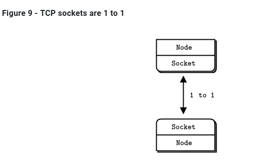

让我们来看看TCP sockets和ZeroMQ sockets在处理数据方面的主要区别:

* **ZeroMQ套接字像UDP一样携带消息，而不像TCP那样携带字节流**。**ZeroMQ消息是长度指定的二进制数据。**我们很快就会讲到信息;它们的设计是针对性能进行优化的，因此有点棘手。
* ZeroMQ套接字在后台线程中执行I/O。这意味着消息到达本地输入队列并从本地输出队列发送，无论您的应用程序在忙什么。
* 根据socket类型，**ZeroMQ sockets具有内置的1对n路由行为**。
* zmq_send()方法实际上并不将消息发送到socket connection(s)。它对消息进行排队，以便I/O线程可以异步发送消息。它不会阻塞，除非在某些异常情况下。因此，**当zmq_send()返回到应用程序时，不一定要发送消息**。

### 2.1.3 单播传输

ZeroMQ提供了**一组单播传输(inproc、ipc、tcp)和组播传输(epgm、pgm)**。多播是一种先进的技术，我们将在后面介绍。不要甚至开始使用它，除非你知道你的扇出比例将使1对n单播不可能。

* tcp：**对于大多数常见的情况，使用tcp**，这是一个断开连接的tcp传输。它有弹性，便于携带，对于大多数情况都足够快。我们称此为断开连接，因为ZeroMQ的tcp传输在连接之前不需要端点的存在。客户端和服务器可以在任何时候连接和绑定，可以切换和返回，并且对应用程序保持透明。
* ipc：进程间ipc传输也是断开连接式（disconnected ）的，就像tcp一样。它有一个限制:它还不能在Windows上运行。按照惯例，我们使用带有“.ipc”扩展名，以避免与其他文件名的潜在冲突。**在UNIX系统上，如果使用ipc端点，则需要使用适当的权限创建这些端点，否则在不同用户id下运行的进程之间可能无法共享这些端点。**您还必须确保所有进程都可以访问这些文件，例如，在相同的工作目录中运行。
* inproc：**线程间传输(inproc)是一种连接（connected ）的信号传输。它比tcp或ipc快得多。与tcp和ipc相比，这种传输有一个特定的限制:服务器必须在任何客户机发出连接之前发出绑定**。这是在Zeromq v4.0和更高版本中修复的

### 2.1.4 ZeroMQ 不是中立的载体

Zeromq不是中性载体：它对其使用的传输协议施加了框架。这种框架与现有协议不兼容，。例如，比较HTTP请求和Zeromq请求,都是依赖TCP/IP。不能使用zmq实现一个HTTP服务。

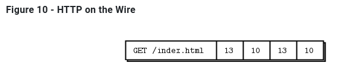

HTTP请求使用CR-LF作为最简单的帧分隔符，而ZeroMQ使用长度指定的帧。因此，您可以使用ZeroMQ编写类似http的协议，例如使用请求-应答套接字模式。但它不是HTTP。


###   2.1.5 I/O Threads  

我们说过ZeroMQ在后台线程中执行I/O。一个I/O线程(适用于所有类型socket)对于除最极端的应用程序之外的所有应用程序都是足够的。当您创建一个新的context时，它从一个I/O线程开始。一般的经验法则是，每秒允许1千兆字节（gigabyte ，1GB?）的数据进出一个I/O线程。要增加I/O线程的数量，请在创建任何socket之前使zmq_ctx_set()调用:

```C
int io_threads = 4;
void *context = zmq_ctx_new ();
zmq_ctx_set (context, ZMQ_IO_THREADS, io_threads);
assert (zmq_ctx_get (context, ZMQ_IO_THREADS) == io_threads);
```

我们已经看到一个套接字可以同时处理几十个，甚至数千个连接。这对如何编写应用程序有根本性的影响。传统的网络应用程序在每个远程连接上有一个进程或一个线程，该进程或线程处理一个套接字。ZeroMQ允许您将整个结构分解为单个进程，然后根据伸缩性的需要将其分解。

如果您仅将Zeromq用于线程间通信（即，没有外部套接字I/O的多线程应用程序），则可以将I/O线程设置为零。但是，这并不是一个重大的优化，也没什么卵用。

## 2.2 消息传递模式 Messaging Patterns

**内置的核心Zeromq模式是：**

* Request-reply： 它将一组客户机连接到一组服务。这是一个远程过程调用和任务分发模式。
* Pub-sub：它将一组发布者连接到一组订阅者。这是一个数据发布模式。
* Pipeline：它以扇出/扇入模式连接节点，该模式可以有多个步骤和循环。这是一个并行的任务分发和收集模式
* Exclusive pair：只连接两个sockets 。这是一个用于连接进程中的两个线程的模式，不要与“普通”sockets 对混淆。

有效的绑定如下（您还将看到对XPUB和XSUB套接字的引用，(它们类似于PUB和SUB的原始版本)。）

- PUB and SUB
- REQ and REP
- REQ and ROUTER (take care, REQ inserts an extra null frame)
- DEALER and REP (take care, REP assumes a null frame)
- DEALER and ROUTER
- DEALER and DEALER
- ROUTER and ROUTER
- PUSH and PULL
- PAIR and PAIR

### 2.2.1 使用消息（Working with Messages）

实际上，libzmq核心库有两个api来发送和接收消息。zmq send()和zmq  recv()方法是简单的一行程序。但zmq  recv()不擅长处理任意消息大小:**它会将消息截断为您提供的任何缓冲区大小（也就是和缓冲区大小有关）**。因此有了第二个与zmq msg  t结构一起工作的API，它具有更丰富但更困难的API

- 初始化消息: `  zmq_msg_init()`, `  zmq_msg_init_size()`, `  zmq_msg_init_data()`.
- 发送和接收消息: `  zmq_msg_send()`, `  zmq_msg_recv()`.
- 释放消息: `  zmq_msg_close()`.
- 访问消息内容: `  zmq_msg_data()`, `  zmq_msg_size()`, `  zmq_msg_more()`.
- 使用消息属性: `  zmq_msg_get()`, `  zmq_msg_set()`.
- 操作消息: `  zmq_msg_copy()`, `  zmq_msg_move()`.

在网络上，ZeroMQ消息是适合内存的从0开始的任何大小的二进制。可以使用protobuf、msgpack、JSON或自定义实现自己的序列化。

在内存中，ZeroMQ消息是zmq_msg_t结构(或类，取决于您的语言)。下面是在C语言中使用ZeroMQ消息的基本规则:

* 创建并传递zmq_msg_t对象，而不是数据块。
* 要读取消息，可以使用zmq_msg_init()创建一个空消息，然后将其传递给zmq_msg_recv()。
* 要从新数据中编写一条消息，可以使用zmq_msg_init_size()创建一条消息，同时分配某个大小的数据块。然后使用memcpy填充数据，并将消息传递给zmq_msg_send()。
* 要释放(而不是销毁)消息，可以调用zmq_msg_close()。这将删除引用，最终ZeroMQ将销毁消息。
* 要访问消息内容，可以使用zmq_msg_data()。要知道消息包含多少数据，可以使用zmq_msg_size()。
* 不要使用zmq_msg_move()、zmq_msg_copy()或zmq_msg_init_data()，除非您阅读了手册页并确切地知道为什么需要这些。
* 您传递一个消息后zmq_msg_send(),ØMQ将clear 这个消息。同时将大小设置为零。您不能两次发送相同的消息，并且不能在发送消息后访问消息数据。
* 如果您使用zmq_send()和zmq_recv()，而不是消息结构，这些规则将不适用。

如果您希望多次发送相同的消息，并且消息大小相当，那么创建第二个消息，使用zmq_msg_init()初始化它，然后使用zmq_msg_copy()创建第一个消息的副本。这不是复制数据，而是复制引用。然后可以发送消息两次(如果创建了更多副本，则可以发送两次或多次)，并且只有在发送或关闭最后一个副本时才最终销毁消息。

ZeroMQ还支持多部分消息，它允许您作为单个在线消息发送或接收帧列表。这在实际应用中被广泛使用，我们将在本章后面的第三章—高级请求-应答模式中看到它。

帧（Frames）在ZeroMQ参考手册页面中也称为消息部件)是ZeroMQ消息的基本线格式。帧是指定长度的数据块。长度向上可以为零。

最初，ZeroMQ消息是一个帧，就像UDP一样。稍后，我们使用多部分消息对此进行了扩展，这些消息非常简单，就是一系列帧，其中“more”位设置为1，然后是一个位设置为0的帧。然后ZeroMQ API允许您编写带有“more”标志的消息，当您读取消息时，它允许您检查是否有“more”

- 消息可以是一个或多个部分。
- 这些部分也被称为“帧”。
- 每个部分都是zmq_msg_t对象。
- 可以在底层API中分别发送和接收每个部分。
- 高级api提供包装器来发送整个多部分消息。
- 您可以发送零长度的消息
- ZeroMQ保证交付消息的所有部分(一个或多个)，或者一个也不交付。
- ZeroMQ不会立即发送消息(单个或多个部分)，而是在稍后某个不确定的时间。
- 消息(单个或多个部分)必须装入内存。如果您想发送任意大小的文件，应该将它们分成几部分，并将每一部分作为单独的单部分消息发送。使用多部分数据不会减少内存消耗。
- 当接收到消息结束时，必须调用zmq msg close()，当作用域关闭时不会自动销毁对象。发送消息后不能调用此方法。

### 2.2.2 处理多个Sockets(Handling Multiple Sockets)

在到目前为止的所有例子中，大多数例子的主循环是:

- 1.等待套接字上的消息。
- 2.过程信息。
- 3.重复。

如果我们想同时读取多个端点呢?最简单的方法是将一个socket连接到所有端点，并让ZeroMQ为我们执行扇入。

要同时读取多个sockets，可以使用zmq_poll()。

下面是一个使用非阻塞读取从两个sockets读取的简单示例，这种方法的代价是第一个消息上的一些额外延迟。在亚毫秒延迟至关重要的应用程序中。

```C
//msreader: Multiple socket reader in C

//  Reading from multiple sockets
//  This version uses a simple recv loop

#include "zhelpers.h"

int main (void) 
{
    //  Connect to task ventilator
    void *context = zmq_ctx_new ();
    void *receiver = zmq_socket (context, ZMQ_PULL);
    zmq_connect (receiver, "tcp://localhost:5557");

    //  Connect to weather server
    void *subscriber = zmq_socket (context, ZMQ_SUB);
    zmq_connect (subscriber, "tcp://localhost:5556");
    zmq_setsockopt (subscriber, ZMQ_SUBSCRIBE, "10001 ", 6);

    //  Process messages from both sockets
    //  We prioritize traffic from the task ventilator
    while (1) {
        char msg [256];
        while (1) {
            int size = zmq_recv (receiver, msg, 255, ZMQ_DONTWAIT);
            if (size != -1) {
                //  Process task
            }
            else
                break;
        }
        while (1) {
            int size = zmq_recv (subscriber, msg, 255, ZMQ_DONTWAIT);
            if (size != -1) {
                //  Process weather update
            }
            else
                break;
        }
        //  No activity, so sleep for 1 msec
        s_sleep (1);
    }
    zmq_close (receiver);
    zmq_close (subscriber);
    zmq_ctx_destroy (context);
    return 0;
}


```

您可以通过先读取一个套接字，然后读取第二个套接字来公平地对待套接字，而不是像上面中所做的那样对它们进行优先级排序。使用zmq_poll():

```C
mspoller: Multiple socket poller in C

//  Reading from multiple sockets
//  This version uses zmq_poll()

#include "zhelpers.h"

int main (void) 
{
    //  Connect to task ventilator
    void *context = zmq_ctx_new ();
    void *receiver = zmq_socket (context, ZMQ_PULL);
    zmq_connect (receiver, "tcp://localhost:5557");

    //  Connect to weather server
    void *subscriber = zmq_socket (context, ZMQ_SUB);
    zmq_connect (subscriber, "tcp://localhost:5556");
    zmq_setsockopt (subscriber, ZMQ_SUBSCRIBE, "10001 ", 6);

    zmq_pollitem_t items [] = {
        { receiver,   0, ZMQ_POLLIN, 0 },
        { subscriber, 0, ZMQ_POLLIN, 0 }
    };
    //  Process messages from both sockets
    while (1) {
        char msg [256];

        zmq_poll (items, 2, -1);
        if (items [0].revents & ZMQ_POLLIN) {
            int size = zmq_recv (receiver, msg, 255, 0);
            if (size != -1) {
                //  Process task
            }
        }
        if (items [1].revents & ZMQ_POLLIN) {
            int size = zmq_recv (subscriber, msg, 255, 0);
            if (size != -1) {
                //  Process weather update
            }
        }
    }
    zmq_close (subscriber);
    zmq_ctx_destroy (context);
    return 0;
}


```

### 2.2.3 多部分消息(Multipart Messages)

ZeroMQ允许我们用几个帧（frame）组成一个消息（message）

当您处理多部分消息时，每个部分都是一个zmq msg项。例如，如果你发送一个包含五个部分的消息，你必须构造、发送和销毁五个zmq msg项。

下面是我们如何在多部分消息中发送帧(我们将每一帧接收到一个消息对象)

```C
zmq_msg_send (&message, socket, ZMQ_SNDMORE);
...
zmq_msg_send (&message, socket, ZMQ_SNDMORE);
...
zmq_msg_send (&message, socket, 0);
```

下面是我们如何接收和处理消息中的所有部分，无论是单个部分还是多个部分

```C
while (1) {
    zmq_msg_t message;
    zmq_msg_init (&message);
    zmq_msg_recv (&message, socket, 0);
    //  Process the message frame
    ...
    zmq_msg_close (&message);
    if (!zmq_msg_more (&message))
        break;      //  Last message frame
}
```

* **当您发送一个多部分消息时，第一部分(以及所有后续部分)只有在您发送最后一部分时才实际通过网络发送**。
* 如果您正在使用zmq_poll()，当您接收到消息的第一部分时，其他部分也都已经到达。
* 您将接收到消息的所有部分，或者完全不接收。
* 消息的每个部分都是一个单独的zmq_msg项。
* 无论是否选中more属性，都将接收消息的所有部分。
* 发送时，ZeroMQ将消息帧在内存中排队，直到最后一个消息帧被接收，然后将它们全部发送出去。
* 除了关闭套接字外，无法取消部分发送的消息。

### 2.2.4 中介和代理 Intermediaries and Proxies

在ZeroMQ中，我们根据上下文将这些代理、队列、转发器、设备或代理称为代理。

### 2.2.5 动态发现 The Dynamic Discovery Problem

动态发现有几种解决方案。最简单的方法是通过硬编码(或配置)网络体系结构来完全避免这种情况，以便手工完成发现。也就是说，当您添加一个新片段时，您将重新配置网络以了解它。例如下面图12-小规模的Pub-Sub网络

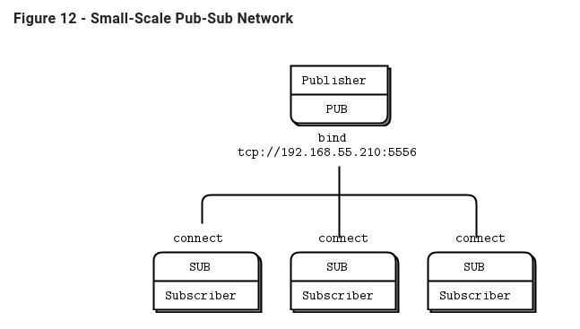

在实践中，这会导致越来越脆弱和笨拙的架构。假设你有一个出版商和100个订阅者。通过在每个订阅者中配置发布者端点，可以将每个订阅者连接到发布者。那也是件很轻松的事。用户是动态的;出版商是静态的。现在假设你添加了更多的出版商。突然，事情变得不那么容易了。如果你继续将每个订阅者与每个发布者联系起来，避免动态发现的成本就会越来越高。

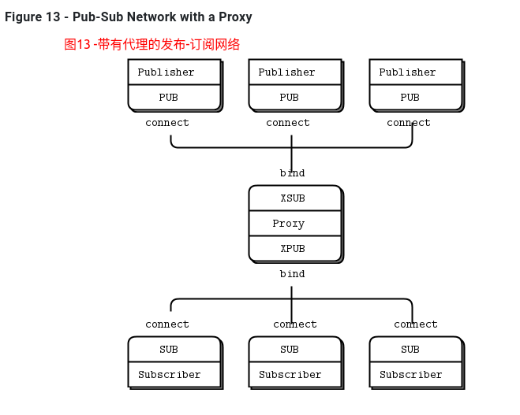

对此有很多答案，但最简单的答案是添加中介;也就是说，网络中所有其他节点都连接到的一个静态点。在传统的消息传递中，这是消息代理的工作。ZeroMQ没有提供这样的消息代理，但是它让我们可以很容易地构建中介。

您可能想知道，如果所有网络最终都变得足够大，需要中介体，那么为什么不为所有应用程序设置一个message broker呢?对于初学者来说，这是一个公平的妥协。只要始终使用星型拓扑结构，忘记性能，事情就会正常工作。然而，消息代理是贪婪的;作为中央中介人，它们变得太复杂、太有状态，最终成为一个问题。

最好将中介看作简单的无状态消息交换机。一个很好的类比是HTTP代理;它在那里，但没有任何特殊的作用。在我们的示例中，添加一个 pub-sub代理解决了动态发现问题。我们在网络的“中间”设置代理。代理打开一个XSUB套接字、一个XPUB套接字，并将每个套接字绑定到已知的IP地址和端口。然后，所有其他进程都连接到代理，而不是彼此连接。添加更多订阅者或发布者变得很简单。

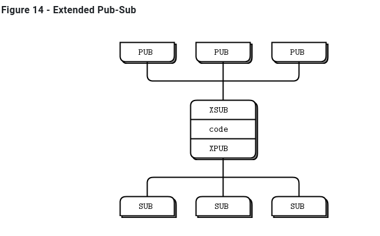

我们需要XPUB和XSUB套接字，因为ZeroMQ从订阅者到发布者执行订阅转发。XSUB和XPUB与SUB和PUB完全一样，只是它们将订阅公开为特殊消息。代理必须通过从XPUB套接字读取这些订阅消息并将其写入XSUB套接字，从而将这些订阅消息从订阅方转发到发布方。这是XSUB和XPUB的主要用例。

### 2.2.6 共享队列Shared Queue (DEALER and ROUTER sockets)

在Hello World客户机/服务器应用程序中，我们有一个客户机与一个服务通信。然而，在实际情况中，我们通常需要允许多个服务和多个客户机。这让我们可以扩展服务的功能(许多线程、进程或节点，而不是一个)。唯一的限制是服务必须是无状态的，所有状态都在请求中，或者在一些共享存储(如数据库)中。

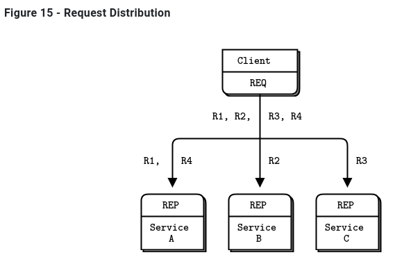

有两种方法可以将多个客户机连接到多个服务器。蛮力方法是将每个客户端套接字连接到多个服务端点。**一个客户端套接字可以连接到多个服务套接字，然后REQ套接字将在这些服务之间分发请求**。如上图15，假设您将一个客户端套接字连接到三个服务端点;客户机请求R1、R2、R3、R4。**R1和R4进入服务A，R2转到B，R3转到服务C。并不是所有的服务都收到R1、R2、R3、R4。**详细可以参考测试代码1-reqrep/2文件夹。

这种设计可以让您更便宜地添加更多的客户端。您还可以添加更多的服务。每个客户端将其请求分发给服务。但是每个客户机都必须知道服务拓扑。如果您有100个客户机，然后决定再添加3个服务，那么您需要重新配置并重新启动100个客户机，以便客户机了解这3个新服务。

理想情况下，我们应该能够在任何时候添加和删除服务或客户机，而不需要触及拓扑的任何其他部分。

因此，我们将编写一个小消息队列代理来提供这种灵活性。代理绑定到两个端点，一个用于客户机的前端，一个用于服务的后端。然后，它使用zmq_poll()监视这两个sockets 的活动，当它有一些活动时，它在它的两个sockets 之间传递消息。它实际上并不明确地管理任何队列—zeromq在每个sockets 上自动管理队列。

当您使用REQ与REP对话时，您将得到一个严格同步的请求-应答对话框。客户端发送一个请求。服务读取请求并发送响应。然后客户端读取应答。如果客户机或服务尝试执行其他操作(例如，在不等待响应的情况下连续发送两个请求)，它们将得到一个错误。

但是我们的代理必须是非阻塞的。显然，我们可以使用zmq_poll()来等待两个socket上的活动，但是不能使用REP和REQ。

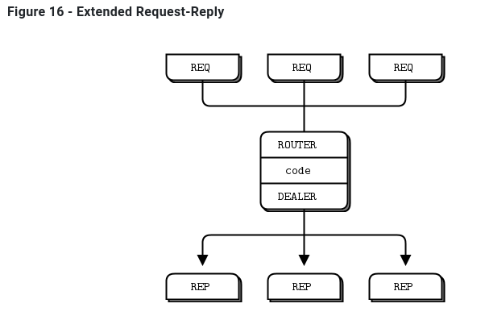

幸运的是，**有两个名为DEALER和ROUTER的socket允许您执行非阻塞的请求-响应**。在高级请求-应答模式中，您将看到DEALER和ROUTER套接字如何让您构建各种异步请求-应答流。现在，我们只需要看看DEALER 和ROUTER 如何让我们扩展REQ-REP跨一个中介，也就是我们的小broker。
在这个简单的扩展请求-应答模式中，REQ与ROUTER 对话，而DEALER 与REP对话。在DEALER 与ROUTER 之间，我们必须有代码(就像我们的broker一样)将消息从一个socket 中提取出来，并将它们推送到另一个socket 中。
request-reply broker绑定到两个端点，一个用于clients 连接(前端socket)，另一个用于workers 连接(后端)。要测试此broker，您需要更改workers ，以便他们连接到后端socket。这是一个client ，如图17

```C
//rrclient: Request-reply client in C

//  Hello World client
//  Connects REQ socket to tcp://localhost:5559
//  Sends "Hello" to server, expects "World" back

#include "zhelpers.h"

int main (void) 
{
    void *context = zmq_ctx_new ();

    //  Socket to talk to server
    void *requester = zmq_socket (context, ZMQ_REQ);
    zmq_connect (requester, "tcp://localhost:5559");

    int request_nbr;
    for (request_nbr = 0; request_nbr != 10; request_nbr++) {
        s_send (requester, "Hello");
        char *string = s_recv (requester);
        printf ("Received reply %d [%s]\n", request_nbr, string);
        free (string);
    }
    zmq_close (requester);
    zmq_ctx_destroy (context);
    return 0;
}

```

Here is the worker:

```C
//rrworker: Request-reply worker in C

//  Hello World worker
//  Connects REP socket to tcp://localhost:5560
//  Expects "Hello" from client, replies with "World"

#include "zhelpers.h"
#include <unistd.h>

int main (void) 
{
    void *context = zmq_ctx_new ();

    //  Socket to talk to clients
    void *responder = zmq_socket (context, ZMQ_REP);
    zmq_connect (responder, "tcp://localhost:5560");

    while (1) {
        //  Wait for next request from client
        char *string = s_recv (responder);
        printf ("Received request: [%s]\n", string);
        free (string);

        //  Do some 'work'
        sleep (1);

        //  Send reply back to client
        s_send (responder, "World");
    }
    //  We never get here, but clean up anyhow
    zmq_close (responder);
    zmq_ctx_destroy (context);
    return 0;
}


```

这是代理，它可以正确地处理多部分消息:

```C
//rrbroker: Request-reply broker in C

//  Simple request-reply broker

#include "zhelpers.h"

int main (void) 
{
    //  Prepare our context and sockets
    void *context = zmq_ctx_new ();
    void *frontend = zmq_socket (context, ZMQ_ROUTER);
    void *backend  = zmq_socket (context, ZMQ_DEALER);
    zmq_bind (frontend, "tcp://*:5559");
    zmq_bind (backend,  "tcp://*:5560");

    //  Initialize poll set
    zmq_pollitem_t items [] = {
        { frontend, 0, ZMQ_POLLIN, 0 },
        { backend,  0, ZMQ_POLLIN, 0 }
    };
    //  Switch messages between sockets
    while (1) {
        zmq_msg_t message;
        zmq_poll (items, 2, -1);
        if (items [0].revents & ZMQ_POLLIN) {
            while (1) {
                //  Process all parts of the message
                zmq_msg_init (&message);
                zmq_msg_recv (&message, frontend, 0);
                int more = zmq_msg_more (&message);
                zmq_msg_send (&message, backend, more? ZMQ_SNDMORE: 0);
                zmq_msg_close (&message);
                if (!more)
                    break;      //  Last message part
            }
        }
        if (items [1].revents & ZMQ_POLLIN) {
            while (1) {
                //  Process all parts of the message
                zmq_msg_init (&message);
                zmq_msg_recv (&message, backend, 0);
                int more = zmq_msg_more (&message);
                zmq_msg_send (&message, frontend, more? ZMQ_SNDMORE: 0);
                zmq_msg_close (&message);
                if (!more)
                    break;      //  Last message part
            }
        }
    }
    //  We never get here, but clean up anyhow
    zmq_close (frontend);
    zmq_close (backend);
    zmq_ctx_destroy (context);
    return 0;
}
```

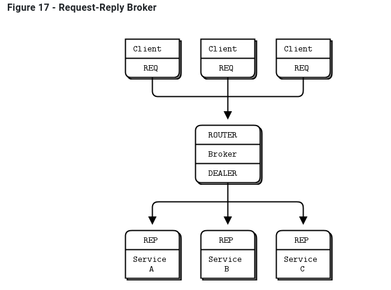

使用请求-应答代理可以使客户机/服务器体系结构更容易伸缩，因为客户机看不到worker，而worker也看不到客户机。唯一的静态节点是中间的代理。

### 2.2.7 ZeroMQ的内置代理函数 ZeroMQ’s Built-In Proxy Function

原来，上一节的rrbroker中的核心循环非常有用，并且可以重用。它让我们可以毫不费力地构建pub-sub转发器和共享队列以及其他小型中介。ZeroMQ将其封装在一个方法中，`zmq_proxy()`:

```C
zmq_proxy (frontend, backend, capture);
```

必须正确地连接、绑定和配置这两个(或者三个sockets，如果我们想捕获数据的话)。当我们调用zmq_proxy方法时，就像启动rrbroker的主循环一样。让我们重写 request-reply broker来调用zmq_proxy，并将其重新标记为一个听起来很昂贵的“消息队列”(人们已经为执行更少的代码向house收费):

```C
msgqueue: Message queue broker in C

//  Simple message queuing broker
//  Same as request-reply broker but using shared queue proxy

#include "zhelpers.h"

int main (void) 
{
    void *context = zmq_ctx_new ();

    //  Socket facing clients
    void *frontend = zmq_socket (context, ZMQ_ROUTER);
    int rc = zmq_bind (frontend, "tcp://*:5559");
    assert (rc == 0);

    //  Socket facing services
    void *backend = zmq_socket (context, ZMQ_DEALER);
    rc = zmq_bind (backend, "tcp://*:5560");
    assert (rc == 0);

    //  Start the proxy
    zmq_proxy (frontend, backend, NULL);

    //  We never get here...
    zmq_close (frontend);
    zmq_close (backend);
    zmq_ctx_destroy (context);
    return 0;
}
```


### 2.2.8 传输桥接 Transport Bridging

ZeroMQ用户经常会问，“我如何将我的ZeroMQ网络与技术X连接起来?”其中X是其他网络或消息传递技术。


答案很简单，就是建一座桥。桥接是一个小应用程序，它在一个socket上讲一个协议，并在另一个套接字上转换成 to/from第二个协议。协议解释器，如果你喜欢的话。ZeroMQ中常见的桥接问题是桥接两个传输或网络。
例如，我们将编写一个小代理，它位于发布者和一组订阅者之间，连接两个网络。前端socket (SUB)面向气象服务器所在的内部网络，后端(PUB)面向外部网络上的订阅者。它订阅前端socket 上的天气服务，并在后端socket 上重新发布数据。

```C
//wuproxy: Weather update proxy in C

//  Weather proxy device

#include "zhelpers.h"

int main (void)
{
    void *context = zmq_ctx_new ();

    //  This is where the weather server sits
    void *frontend = zmq_socket (context, ZMQ_XSUB);
    zmq_connect (frontend, "tcp://192.168.55.210:5556");

    //  This is our public endpoint for subscribers
    void *backend = zmq_socket (context, ZMQ_XPUB);
    zmq_bind (backend, "tcp://10.1.1.0:8100");

    //  Run the proxy until the user interrupts us
    zmq_proxy (frontend, backend, NULL);
    
    zmq_close (frontend);
    zmq_close (backend);
    zmq_ctx_destroy (context);
    return 0;
}
```

**它看起来与前面的代理示例非常相似，但关键部分是前端和后端sockets 位于两个不同的网络上。例如，我们可以使用这个模型将组播网络(pgm传输)连接到tcp publisher。**

## 2.3 处理错误

上面的C示例中都没有错误处理。有一些简单的规则，从POSIX约定开始:

* 如果创建对象的方法失败，则返回NULL。
* 处理数据的方法可能返回已处理的字节数，或在出现错误或故障时返回-1。
* 其他方法在成功时返回0，在错误或失败时返回-1。
* 错误代码在errno或zmq_errno()中提供。
* zmq_strerror()提供了用于日志记录的描述性错误文本。

```C
void *context = zmq_ctx_new ();
assert (context);
void *socket = zmq_socket (context, ZMQ_REP);
assert (socket);
int rc = zmq_bind (socket, "tcp://*:5555");
if (rc == -1) {
    printf ("E: bind failed: %s\n", strerror (errno));
    return -1;
}
```

有两个主要的例外情况，你应该作为非致命的处理:

* 当您的代码接收到带有ZMQ_DONTWAIT选项的消息并且没有等待的数据时，ZeroMQ将返回-1并再次将errno设置为EAGAIN。
* 当一个线程调用zmq_ctx_destroy()，而其他线程仍在执行阻塞工作时，zmq_ctx_destroy()调用关闭上下文，所有阻塞调用都以-1退出，errno设置为ETERM。

# 3 ZMQ发布订阅模式

参考 https://blog.csdn.net/qq_41453285/article/details/106877202

**在发布-订阅模式中，**有一个发布者用来发送消息，该模式中有很多订阅者会接收发布者发布的消息

**“发布-订阅”模型支持的套接字类型有4种：**

- **ZMQ_PUB**
- **ZMQ_SUB**
- **ZMQ_XPUB**
- **ZMQ_XSUB**

## 3.1 “PUB-SUB”套接字类型

PUB就是发布者，SUB就是订阅者

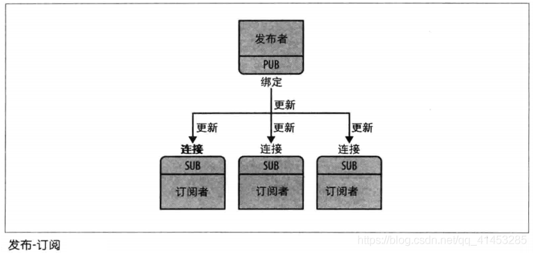

### 3.1.1 **ZMQ_PUB**

* 发布者使用类型为ZMQ_PUB的套接字来分发数据。发送的消息以扇出方式分发给所有连接的对等方
* 在ZMQ_PUB类型的套接字上不能执行zmq_msg_recv()等接收数据的函数
* 当ZMQ_PUB套接字由于已达到订阅者的高水位标记而进入静音状态时，将发送给有问题的订阅者的任何消息都将被丢弃，直到静音状态结束为止。关于“高水位标记”请参阅：
* 对于该套接字类型，zmq_msg_send()函数将永远不会阻塞 

| **ZMQ_PUB特性摘要** |                   |
| ------------------- | ----------------- |
| 兼容的对等套接字    | ZMQ_SUB、ZMQ_XSUB |
| 方向                | 单向              |
| 发送/接收模式       | 仅发送            |
| 入网路由策略        | 不适用（N/A）     |
| 外发路由策略        | 扇出（Fan out）   |
| 静音状态下的操作    | 丢弃              |

### 3.1.2 ZMQ_SUB

* 订阅者使用ZMQ_SUB类型的套接字来订阅发布者分发的数据
* ZMQ_SUB套接字创建完成之后，ZMQ_SUB套接字未订阅任何消息，请使用**zmq_setsockopt()的ZMQ_SUBSCRIBE选项指定要订阅的消息**
* 在ZMQ_PUB类型的套接字上不能执行zmq_msg_recv()等接收数据的函数

| **ZMQ_SUB特性摘要** |                   |
| ------------------- | ----------------- |
| 兼容的对等套接字    | ZMQ_PUB、ZMQ_XPUB |
| 方向                | 单向              |
| 发送/接收模式       | 仅接收            |
| 入网路由策略        | 公平排队          |
| 外发路由策略        | 不适用（N/A）     |

###  3.1.3 pub-sub示例

- **发布者：**类似于一个天气更新服务器，向订阅者发送天气更新，内容包括邮政编码、温度、湿度等信息

- **订阅者：**它监听发布者更新的数据流，过滤只接收与特定邮政编码是8的天气信息。

  **发布者代码**

  ```C
  /*
   * @Copyright:  Copyright(C) 2018-2028 YTCK All rights reserved.
   * @Description:
   * @Date: 2022-03-22 16:10:34
   * @Author: YingYongJiCheng
   * @LastEditors: YingYongJiCheng
   * @LastEditTime: 2022-05-17 11:06:55
   */
  // wuserver.c
  #include <stdio.h>
  #include <stdlib.h>
  #include <assert.h>
  #include <unistd.h>
  #include <string.h>
  #include <time.h>
  #include <zmq.h>
  
  // 随机生成0...num-1的随机数
  #define randof(num) (int)((float)(num)*random() / (RAND_MAX + 1.0))
  
  // 将string消息格式化为zmq_meg_t对象, 然后发往socket套接字上
  static int s_send(void* socket, char* string);
  
  int main()
  {
    // 1.初始化上下文
    void* context = zmq_ctx_new();
  
    // 2.创建、绑定套接字
    void* publisher = zmq_socket(context, ZMQ_PUB);
    assert(publisher != NULL);
  
    // 此处我们将发布者绑定到一个tcp节点上和一个ipc节点上, 但是本案例我们只使用tcp, ipc那个只是演示说明zmq的套接字可以绑定到多个节点上
    int rc = zmq_bind(publisher, "tcp://*:5555");
    assert(rc == 0);
    rc = zmq_bind(publisher, "ipc://weather.ipc");
    assert(rc == 0);
  
    // 3.初始化随机数发生器
    srandom((unsigned)time(NULL));
  
    // 4.循环发送数据
    while (1)
    {
      // 5.随机生成邮政编码、温度、适度
      int zipcode, temperature, relhumidity;
      zipcode     = randof(10);
      temperature = randof(215) - 80;
      relhumidity = randof(50) + 10;
  
      // 6.将消息发送给所有的订阅者
      char update[20];
      sprintf(update, "%d %d %d", zipcode, temperature, relhumidity);
      printf("send %s\n", update);
      rc = s_send(publisher, update);
      assert(rc);
  
      sleep(1);
    }
  
    // 7.关闭套接字、销毁上下文
    zmq_close(publisher);
    zmq_ctx_destroy(context);
  
    return 0;
  }
  
  static int s_send(void* socket, char* string)
  {
    // 初始化一个zmq_msg_t对象, 分配的大小为string的大小
    zmq_msg_t msg;
    zmq_msg_init_size(&msg, strlen(string));
    memcpy(zmq_msg_data(&msg), string, strlen(string));
  
    // 发送数据
    int rc = zmq_msg_send(&msg, socket, 0);
  
    // 关闭zmq_msg_t对象
    zmq_msg_close(&msg);
  
    return rc;
  }
  ```

  **订阅者代码**

  ```C
  /*
   * @Copyright:  Copyright(C) 2018-2028 YTCK All rights reserved.
   * @Description:
   * @Date: 2022-03-22 16:46:11
   * @Author: YingYongJiCheng
   * @LastEditors: YingYongJiCheng
   * @LastEditTime: 2022-05-17 16:36:28
   */
  // wuclient.c
  #include <stdio.h>
  #include <stdlib.h>
  #include <assert.h>
  #include <unistd.h>
  #include <string.h>
  #include <zmq.h>
  
  // 从socket接收数据, 并将数据返回
  char* s_recv(void* socket);
  
  int main(int argc, char* argv[])
  {
    // 1.初始化上下文
    void* context = zmq_ctx_new();
  
    // 2.创建套接字、连接发布者
    void* subscriber = zmq_socket(context, ZMQ_SUB);
    assert(subscriber != NULL);
    int rc = zmq_connect(subscriber, "tcp://localhost:5555");
    assert(rc == 0);
  
    // 3.因为自己是订阅者, 因此需要使用设置过滤器, 显式指定自己是否需要接收什么类型的消息
    //   程序运行时可以输入参数, 参数代表邮政编码, 如果参数为空, 那么就过滤10001的消息
    // char *filter = (argc > 1) ? argv[1] : "10001";
    char* filter = "8";
    rc           = zmq_setsockopt(subscriber, ZMQ_SUBSCRIBE, filter, strlen(filter));
    filter       = "5";
    rc           = zmq_setsockopt(subscriber, ZMQ_SUBSCRIBE, filter, strlen(filter));
  
    // rc = zmq_setsockopt(subscriber, ZMQ_SUBSCRIBE, "", 0);
  
    assert(rc == 0);
  
    // 4.从发布者那里接收消息, 接收10条自己想要的数据
    int  update_nbr;
    long total_temp = 0;
    // for (update_nbr = 0; update_nbr < 10; update_nbr++)
    while (1)
    {
      // 5.接收数据
      char* string = s_recv(subscriber);
      assert(string != NULL);
  
      // 6.将数据中的邮政编码、温度、适度分别存储变量中
      int zipcode, temperature, relhumidity;
      sscanf(string, "%d %d %d", &zipcode, &temperature, &relhumidity);
      printf("%s\n", string);
      total_temp += temperature;
      free(string);
    }
  
    // 7.接收完成之后, 打印一下平均温度
    // printf("Average tempature for zipcode '%s' was %dF\n", filter, (int)(total_temp / update_nbr));
  
    // 8.关闭套接字、销毁上下文
    zmq_close(subscriber);
    zmq_ctx_destroy(context);
  
    return 0;
  }
  
  char* s_recv(void* socket)
  {
    // 创建zmq_msg_t对象接收数据
    zmq_msg_t msg;
    zmq_msg_init(&msg);
    int size = zmq_msg_recv(&msg, socket, 0);
    if (size == -1)
    {
      return NULL;
    }
  
    // 将zmq_msg_t对象中的数据保存到字符串中
    char* string = (char*)malloc(size + 1);
    memcpy(string, zmq_msg_data(&msg), size);
  
    zmq_msg_close(&msg);
    string[size] = 0;
  
    return string;
  }
  ```

  **编译**

  ```shell
  g++ -o pub1 pub_1.cpp -L /opt/libs-x64/zeromq/zeromq-4.2.2/lib/ -lzmq -I /opt/libs-x64/zeromq/zeromq-4.2.2/include
  g++ -o sub1 sub_1.cpp -L /opt/libs-x64/zeromq/zeromq-4.2.2/lib/ -lzmq -I /opt/libs-x64/zeromq/zeromq-4.2.2/include
  ```

  **运行结果**

  发布者发送了大量数据，但是接收者只过滤接收邮政编码是8和5的数据

  

## 3.2 “XPUB-XSUB”套接字类型

- “XPUB-XSUB”套接字类型与“PUB-SUB”套接字类型相同，**也是属于发布-订阅**
- 在“PUB-SUB”中，订阅者通过zmq_connect()向发布者发起订阅；但是“XPUB-XSUB”套接字类型**允许订阅者通过发送一条订阅信息到发布者来完成订阅**

### 3.2.1 ZMQ_XPUB

- **用法与ZMQ_PUB大部分相同**
- **自己理解主要用于代理。也可以是用xpub发送xsub接收。但是没有必要。**
- **但是有一点与ZMQ_PUB不同：**ZMQ_XPUB(自己)的订阅方可以向自己发送一个订阅信息来进行订阅。订阅消息是字节1（用于订阅）或字节0（用于取消订阅），后跟订阅主体。也接收不带子/取消订阅前缀的消息，但对订阅状态没有影响

| **ZMQ_XPUB特性摘要** |                    |
| -------------------- | ------------------ |
| 兼容的对等套接字     | ZMQ_SUB、ZMQ_XSUB  |
| 方向                 | 单向               |
| 发送/接收模式        | 发送消息，接收订阅 |
| 入网路由策略         | 不适用（N/A）      |
| 外发路由策略         | 扇出（Fan out）    |
| 静音状态下的操作     | 丢弃               |

### 3.2.2 ZMQ_XSUB

- **用法与ZMQ_SUB大部分相同**
- **但是有一点与ZMQ_SUB不同：**自己可以向发布者发送一条订阅信息来进行订阅。订阅消息是字节1（用于订阅）或字节0（用于取消订阅），后跟订阅主体。也接收不带子/取消订阅前缀的消息，但对订阅状态没有影响（TODO 0和1不明白）可以参考 https://blog.csdn.net/lianshaohua/article/details/108776728和https://blog.csdn.net/lianshaohua/article/details/109511469

| **ZMQ_XSUB特性摘要** |                    |
| -------------------- | ------------------ |
| 兼容的对等套接字     | ZMQ_PUB、ZMQ_XPUB  |
| 方向                 | 单向               |
| 发送/接收模式        | 接收消息，发送订阅 |
| 入网路由策略         | 公平排队           |
| 外发路由策略         | 不适用（N/A）      |
| 静音状态下的操作     | 丢弃               |

## 3.3 XSUB、XPUB应用之“代理”

* 动态发现问题：在设计大型的分布式体系结构时，会遇到的问题之一是——“发现”。也就是说，部件如何认识对象，以及部件增减或减少时，如何更新这些消息，因此，我们称之为“动态发现”

* 动态发现解决方案①：

  简单的方式是通过硬编码（或配置）的网络架构来完全避免，一般通过手工操作。但是这种方案导致体系结构变得脆弱和笨重。例如一个系统有一个发布者和一百个订阅者，你需要对每一个订阅者配置发布者端点来让每个订阅者连接到发布者服务器。订阅者是动态的，发布者是静态的，如果你又新增了新的发布者，那么就需要再配置这一百个订阅者，工作量相当的大

* 动态发现解决方案②：通过中间层（代理）来实现，这种方法比较推荐

  * 在“发布-订阅”模型中，我们可以在中间增加一个新的代理节点，该节点绑定了XSUB套接字和XPUB套接字，发布者连接到XSUB中，订阅者连接到XPUB中。这样一来添加或者删除发布者或订阅者节点就变得微不足道了
  * 对于代理节点，其需要执行订阅转发：SUB套接字需要将自己的订阅信息作为特殊消息发送到代理的XPUB端点上，代理转发这些订阅消息到XSUB上，然后XSUB再将消息发送到PUB，从而最终完成SUB到PUB的订阅
  * 当完成订阅之后，PUB直接发送消息，SUB可以直接收到，不需要代理进行转发 （TODO 不明白，应该是还有转发吧）

  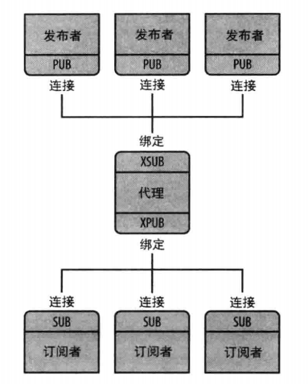


### 3.3.1 代理示例1

下面代码不使用zmq提供的代理接口实现，就像上面的图

**发布者1**

```C
/*
 * @Copyright:  Copyright(C) 2018-2028 YTCK All rights reserved.
 * @Description:
 * @Date: 2022-03-22 16:10:34
 * @Author: YingYongJiCheng
 * @LastEditors: YingYongJiCheng
 * @LastEditTime: 2022-05-17 11:30:05
 */
// pub1.cpp
#include <stdio.h>
#include <stdlib.h>
#include <assert.h>
#include <unistd.h>
#include <string.h>
#include <time.h>
#include <zmq.h>

// 随机生成0...num-1的随机数
#define randof(num) (int)((float)(num)*random() / (RAND_MAX + 1.0))

// 将string消息格式化为zmq_meg_t对象, 然后发往socket套接字上
static int s_send(void* socket, char* string);

int main()
{
  // 1.初始化上下文
  void* context = zmq_ctx_new();

  // 2.创建、绑定套接字
  void* publisher = zmq_socket(context, ZMQ_PUB);
  assert(publisher != NULL);

  // 此处我们将发布者绑定到一个tcp节点上和一个ipc节点上, 但是本案例我们只使用tcp, ipc那个只是演示说明zmq的套接字可以绑定到多个节点上
  int rc = zmq_connect(publisher, "tcp://localhost:5555");
  assert(rc == 0);

  // 3.初始化随机数发生器
  srandom((unsigned)time(NULL));

  // 4.循环发送数据
  while (1)
  {
    // 5.随机生成邮政编码、温度、适度
    int zipcode, temperature, relhumidity;
    zipcode     = randof(100000);
    temperature = randof(215) - 80;
    relhumidity = randof(50) + 10;

    // 6.将消息发送给所有的订阅者
    char update[20];
    sprintf(update, "puber%d %05d %d %d", 1, zipcode, temperature, relhumidity);
    printf("send %s\n", update);
    rc = s_send(publisher, update);
    assert(rc);

    sleep(1);
  }

  // 7.关闭套接字、销毁上下文
  zmq_close(publisher);
  zmq_ctx_destroy(context);

  return 0;
}

static int s_send(void* socket, char* string)
{
  // 初始化一个zmq_msg_t对象, 分配的大小为string的大小
  zmq_msg_t msg;
  zmq_msg_init_size(&msg, strlen(string));
  memcpy(zmq_msg_data(&msg), string, strlen(string));

  // 发送数据
  int rc = zmq_msg_send(&msg, socket, 0);

  // 关闭zmq_msg_t对象
  zmq_msg_close(&msg);

  return rc;
}
```

发布者2和发布者1几乎一致，就是发送的数据不同

**发布者2**

```C
/*
 * @Copyright:  Copyright(C) 2018-2028 YTCK All rights reserved.
 * @Description:
 * @Date: 2022-03-22 16:10:34
 * @Author: YingYongJiCheng
 * @LastEditors: YingYongJiCheng
 * @LastEditTime: 2022-05-17 11:30:10
 */
// pub2.cpp
#include <stdio.h>
#include <stdlib.h>
#include <assert.h>
#include <unistd.h>
#include <string.h>
#include <time.h>
#include <zmq.h>

// 随机生成0...num-1的随机数
#define randof(num) (int)((float)(num)*random() / (RAND_MAX + 1.0))

// 将string消息格式化为zmq_meg_t对象, 然后发往socket套接字上
static int s_send(void* socket, char* string);

int main()
{
  // 1.初始化上下文
  void* context = zmq_ctx_new();

  // 2.创建、绑定套接字
  void* publisher = zmq_socket(context, ZMQ_PUB);
  assert(publisher != NULL);

  // 此处我们将发布者绑定到一个tcp节点上和一个ipc节点上, 但是本案例我们只使用tcp, ipc那个只是演示说明zmq的套接字可以绑定到多个节点上
  int rc = zmq_connect(publisher, "tcp://localhost:5555");
  assert(rc == 0);

  // 3.初始化随机数发生器
  srandom((unsigned)time(NULL));

  // 4.循环发送数据
  while (1)
  {
    // 5.随机生成邮政编码、温度、适度
    int zipcode, temperature, relhumidity;
    zipcode     = randof(100000);
    temperature = randof(215) - 80;
    relhumidity = randof(50) + 10;

    // 6.将消息发送给所有的订阅者
    char update[20];
    sprintf(update, "puber%d %05d %d %d", 2, zipcode, temperature, relhumidity);
    printf("send %s\n", update);
    rc = s_send(publisher, update);
    assert(rc);

    sleep(1);
  }

  // 7.关闭套接字、销毁上下文
  zmq_close(publisher);
  zmq_ctx_destroy(context);

  return 0;
}

static int s_send(void* socket, char* string)
{
  // 初始化一个zmq_msg_t对象, 分配的大小为string的大小
  zmq_msg_t msg;
  zmq_msg_init_size(&msg, strlen(string));
  memcpy(zmq_msg_data(&msg), string, strlen(string));

  // 发送数据
  int rc = zmq_msg_send(&msg, socket, 0);

  // 关闭zmq_msg_t对象
  zmq_msg_close(&msg);

  return rc;
}
```

订阅者1

```C
/*
 * @Copyright:  Copyright(C) 2018-2028 YTCK All rights reserved.
 * @Description:
 * @Date: 2022-03-22 16:46:11
 * @Author: YingYongJiCheng
 * @LastEditors: YingYongJiCheng
 * @LastEditTime: 2022-05-17 11:04:55
 */
// sub1.cpp
#include <stdio.h>
#include <stdlib.h>
#include <assert.h>
#include <unistd.h>
#include <string.h>
#include <zmq.h>

// 从socket接收数据, 并将数据返回
char* s_recv(void* socket);

int main(int argc, char* argv[])
{
  // 1.初始化上下文
  void* context = zmq_ctx_new();

  // 2.创建套接字、连接发布者
  void* subscriber = zmq_socket(context, ZMQ_SUB);
  assert(subscriber != NULL);
  int rc = zmq_connect(subscriber, "tcp://localhost:5556");
  assert(rc == 0);

  // 3.因为自己是订阅者, 因此需要使用设置过滤器, 显式指定自己是否需要接收什么类型的消息
  //   程序运行时可以输入参数, 参数代表邮政编码, 如果参数为空, 那么就过滤10001的消息
  // char *filter = (argc > 1) ? argv[1] : "10001";
  // char* filter = "10001";
  // rc           = zmq_setsockopt(subscriber, ZMQ_SUBSCRIBE, filter, strlen(filter));
  rc = zmq_setsockopt(subscriber, ZMQ_SUBSCRIBE, "", 0);

  assert(rc == 0);

  // 4.从发布者那里接收消息, 接收10条自己想要的数据
  int  update_nbr;
  long total_temp = 0;
  // for (update_nbr = 0; update_nbr < 10; update_nbr++)
  while (1)
  {
    // 5.接收数据
    char* string = s_recv(subscriber);
    assert(string != NULL);

    printf("%s\n", string);
    // total_temp += temperature;
    free(string);
  }

  // 7.接收完成之后, 打印一下平均温度
  // printf("Average tempature for zipcode '%s' was %dF\n", filter, (int)(total_temp / update_nbr));

  // 8.关闭套接字、销毁上下文
  zmq_close(subscriber);
  zmq_ctx_destroy(context);

  return 0;
}

char* s_recv(void* socket)
{
  // 创建zmq_msg_t对象接收数据
  zmq_msg_t msg;
  zmq_msg_init(&msg);
  int size = zmq_msg_recv(&msg, socket, 0);
  if (size == -1)
  {
    return NULL;
  }

  // 将zmq_msg_t对象中的数据保存到字符串中
  char* string = (char*)malloc(size + 1);
  memcpy(string, zmq_msg_data(&msg), size);

  zmq_msg_close(&msg);
  string[size] = 0;

  return string;
}
```

订阅者2和订阅者1一模一样。

**运行结果**

pub1和pub2 经过borker代理后将消息发给了sub1和sub2.从日志看sub1和sub2都收到了pub1和pub2的数据。


### 3.3.2 代理示例2

使用zmq提供的内置代理函数zmq_proxy实现代码1的功能

发布者和订阅者代码一致。只是修改代理的代码如下

```C
//proxy.cpp
#include <stdio.h>
#include <stdlib.h>
#include <assert.h>
#include <unistd.h>
#include <string.h>
#include <time.h>
#include <zmq.h>

int main(void)
{
  void* context = zmq_ctx_new();

  //  This is where the weather server sits
  void* frontend = zmq_socket(context, ZMQ_XSUB);
  zmq_bind(frontend, "tcp://*:5555");

  //  This is our public endpoint for subscribers
  void* backend = zmq_socket(context, ZMQ_XPUB);
  zmq_bind(backend, "tcp://*:5556");

  //  Run the proxy until the user interrupts us
  zmq_proxy(frontend, backend, NULL);

  zmq_close(frontend);
  zmq_close(backend);
  zmq_ctx_destroy(context);
  return 0;
}

```

**运行结果**

和示例1一样，pub1和pub2 经过proxy代理后将消息发给了sub1和sub2.从日志看sub1和sub2都收到了pub1和pub2的数据。

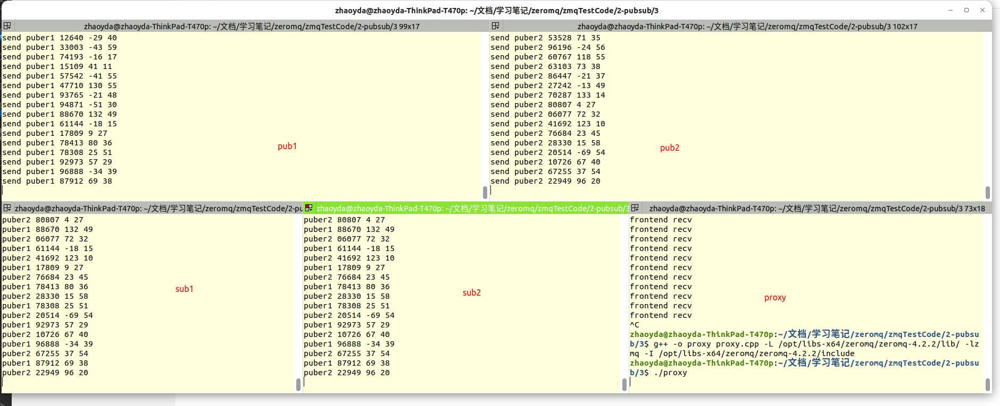

### 3.3.3 示例1和2的区别

* 示例1自己编写代理，示例2使用zmq内置代理
* 都可以实现代理功能，内置代理更加简单
* 自己编写代理可以在代理一层处理数据。内置代理不能（貌似没有必要）
* 就像2.2.8节里面说的，内置代理可以实现桥街传输（也就是两个不同的网络，没有测试过示例1可否连接两个网络。感觉可以）**内置代理与代理1示例非常相似，但关键部分是前端和后端sockets 位于两个不同的网络上。例如，我们可以使用这个模型将组播网络(pgm传输)连接到tcp publisher。**
* **总结：需要代理就用内置代理，简单可靠。**

## 3.4 三种代理

参考网址：https://blog.csdn.net/w_y_x_y/article/details/101106862

**场景一**

    一天，派大星来蟹堡王餐厅买蟹堡吃。
    派大星：嗨，章鱼哥，我想要跟海绵宝宝要一个巨无霸蟹黄堡。
    章鱼哥：好的，派大星。（扭头转向厨房）海绵宝宝，派大星想要一个巨无霸蟹黄堡！
    海绵宝宝：我准备好了！我准备好了！美味蟹黄堡马上就好～

在这个场景中，章鱼哥是broker。

**场景二**

    又一天，派大星来蟹堡王餐厅买蟹堡吃。
    派大星：嗨，章鱼哥，我想要跟你要一个巨无霸蟹黄堡。
    章鱼哥：好的，派大星。（扭头转向厨房）海绵宝宝，我想要一个巨无霸蟹黄堡！
    海绵宝宝：我准备好了！我准备好了！美味蟹黄堡马上就好～

在这个场景中，章鱼哥是proxy。

**场景三**

    这一天，派大星在蟹堡王餐厅吃蟹堡，突然它觉得不够辣。
    派大星：嗨，章鱼哥，能给我的蟹黄堡加点辣酱吗？
    章鱼哥：好的，派大星。（章鱼哥伸出它长长的手到厨房里拿辣酱，给派大星的蟹黄堡加了很多辣酱）好了，派大星，你的辣酱蟹黄堡。
    海绵宝宝：。。。 。。。
    过了一会，派大星觉得有点渴。
    派大星：嗨，章鱼哥，能给我的一杯海盐味的可乐吗？
    章鱼哥：好的，派大星。（章鱼哥从柜台旁边的可乐箱里拿了一瓶海盐味的可乐给派大星）好了，派大星，你的海盐味可乐。
    海绵宝宝：。。。 。。。
    又过了一会，派大星觉得还是有点饿。
    派大星：嗨，章鱼哥，我想再要一个美味蟹黄堡。
    章鱼哥：哦，派大星，下班时间到了，我拒绝为你服务。
    海绵宝宝：。。。我好闲啊。。。

在这个场景中，章鱼哥是agent。

| 三种代理 | 作用                                                         |
| -------- | ------------------------------------------------------------ |
| Broker   | Broker是一个独立主体，但没有自主决策能力，只负责订约过程。因此它也被称为中介性代理。 |
| Proxy    | Proxy对于客户端来说是服务端，对于服务端来说是客户端，它使客户端和服务端之间的交互是透明的，因此它也被称为透传性代理。 |
| Agent    | Agent是一个独立主体，负责完成任务但不负责执行任务，Agent具有一定的自主决策能力，如对服务请求的选择。因此它也被称为自主性代理／智能代理。 |

# 4 ZMQ请求-应答模式

原文链接：https://blog.csdn.net/qq_41453285/article/details/106878960

* 请求-响应模式由http://rfc.zeromq.org/spec:28正式定义

* 请求-应答模式应该是最常见的交互模式，如果连接之后，服务器终止，那么客户端也终止，从崩溃的过程中恢复不太容易

* 因此，做一个可靠的请求-应答模式很复杂，在很后面我们会有一部分系列文章介绍“可靠的请求-应答模式”

* “请求-响应模型”支持的套接字类型有4种：

  * ZMQ_REP

  * ZMQ_REQ

  * ZMQ_DEALER

  * ZMQ_ROUTER

## 4.1 REQ-REP套接字类型

- 请求-响应模式用于将请求**从ZMQ_REQ客户端发送到一个或多个ZMQ_REP服务**，并接收对每个发送的请求的后续答复
- **REQ-REP套接字对是步调一致的。**它们两者的次序必须有规则，不能同时发送或接收，否则无效果

### 4.1.1 ZMQ_REQ

* 客户端使用ZMQ_REQ类型的套接字向服务发送请求并从服务接收答复
* 此套接字类型仅允许zmq_send(request)和后续zmq_recv(reply)调用交替序列。发送的每个请求都在所有服务中轮流轮询，并且收到的每个答复都与最后发出的请求匹配
* 如果没有可用的服务，则套接字上的任何发送操作都应阻塞，直到至少有一项服务可用为止。REQ套接字不会丢弃消息

  **ZMQ_REQ特性摘要** 

| 兼容的对等套接字 | ZMQ_REP、ZMQ_ROUTER          |
| ---------------- | ---------------------------- |
| 方向             | 双向                         |
| 发送/接收模式    | 发送、接收、发送、接收...... |
| 入网路由策略     | 最后一位（Last peer）        |
| 外发路由策略     | 轮询                         |
| 静音状态下的操作 | 阻塞                         |

### 4.1.2 ZMQ_REP

* 服务使用ZMQ_REP类型的套接字来接收来自客户端的请求并向客户端发送回复

* 此套接字类型仅允许zmq_recv(request)和后续zmq_send(reply)调用的交替序列。接收到的每个请求都从

  有客户端中公平排队，并且发送的每个回复都路由到发出最后一个请求的客户端

* 如果原始请求者不再存在，则答复将被静默丢弃

  **ZMQ_REP特性摘要** 

| 兼容的对等套接字 | ZMQ_REQ、ZMQ_DEALER          |
| ---------------- | ---------------------------- |
| 方向             | 双向                         |
| 发送/接收模式    | 接收、发送、接收、发送...... |
| 入网路由策略     | 公平排队                     |
| 外发路由策略     | 最后一位（Last peer）        |
|                  |                              |

- **演示案例如下：**

  - 服务端创建REP套接字，阻塞等待客户端消息的到达，当客户端有消息达到时给客户端回送“World”字符串

  - 客户端创建REP套接字，向服务端发送字符串“Hello”，然后等待服务端回送消息

    

**服务端代码如下：**

```C
// https://github.com/dongyusheng/csdn-code/blob/master/ZeroMQ/hwserver.c
// hwserver.c
#include <stdio.h>
#include <string.h>
#include <assert.h>
#include <stdlib.h>
#include <unistd.h>
#include <zmq.h>
 
// 向socket发送数据, 数据为string
static int s_send(void *socket, char *string);
// 从socket接收数据, 并将数据以字符串的形式返回
static char *s_recv(void *socket);
 
int main()
{
    // 1.创建上下文
    void *context = zmq_ctx_new();
 
    // 2.创建、绑定套接字
    void *responder = zmq_socket(context, ZMQ_REP);
    zmq_bind(responder, "tcp://*:5555");
 
    int rc;
    // 3.循环接收数据、发送数据
    while(1)
    {
        // 4.接收数据
        char *request = s_recv(responder);
        assert(request != NULL);
        printf("Request: %s\n", request);
        free(request);
 
        // 休眠1秒再继续回复
        sleep(1);
 
        // 5.回送数据
        char *reply = "World";
        rc = s_send(responder, reply);
        assert(rc > 0);
    }
 
    // 6.关闭套接字、销毁上下文
    zmq_close(responder);
    zmq_ctx_destroy(context);
 
    return 0;
}
 
static int s_send(void *socket, char *string)
{
    int rc;
    
    zmq_msg_t msg;
    zmq_msg_init_size(&msg, 5);
    memcpy(zmq_msg_data(&msg), string, strlen(string));
    
    rc = zmq_msg_send(&msg, socket, 0);
    zmq_msg_close(&msg);
 
    return rc;
}
 
static char *s_recv(void *socket)
{
    int rc;
    zmq_msg_t msg;
    zmq_msg_init(&msg);
    
    rc = zmq_msg_recv(&msg, socket, 0);
    if(rc == -1)
        return NULL;
    
    char *string = (char*)malloc(rc + 1);
    memcpy(string, zmq_msg_data(&msg), rc);
    zmq_msg_close(&msg);
    
    string[rc] = 0;
    return string;
}
```

**客户端代码如下：**

```C
// https://github.com/dongyusheng/csdn-code/blob/master/ZeroMQ/hwclient.c
// hwclient.c
#include <stdio.h>
#include <stdlib.h>
#include <assert.h>
#include <string.h>
#include <zmq.h>
 
// 向socket发送数据, 数据为string
static int s_send(void *socket, char *string);
// 从socket接收数据, 并将数据以字符串的形式返回
static char *s_recv(void *socket);
 
int main()
{
    // 1.创建上下文
    void *context = zmq_ctx_new();
 
    // 2.创建套接字、连接服务器
    void *requester = zmq_socket(context, ZMQ_REQ);
    zmq_connect(requester, "tcp://localhost:5555");
 
    int rc;
    // 3.循环发送数据、接收数据
    while(1)
    {
        // 4.发送数据
        char *request = "Hello";
        rc = s_send(requester, request);
        assert(rc > 0);
 
        // 5.接收回复数据
        char *reply = s_recv(requester);
        assert(reply != NULL);
        printf("Reply: %s\n", reply);
        free(reply);
    }
 
    // 6.关闭套接字、销毁上下文
    zmq_close(requester);
    zmq_ctx_destroy(context);
 
    return 0;
}
 
static int s_send(void *socket, char *string)
{
    int rc;
    
    zmq_msg_t msg;
    zmq_msg_init_size(&msg, 5);
    memcpy(zmq_msg_data(&msg), string, strlen(string));
    
    rc = zmq_msg_send(&msg, socket, 0);
    zmq_msg_close(&msg);
 
    return rc;
}
 
static char *s_recv(void *socket)
{
    int rc;
    zmq_msg_t msg;
    zmq_msg_init(&msg);
    
    rc = zmq_msg_recv(&msg, socket, 0);
    if(rc == -1)
        return NULL;
    
    char *string = (char*)malloc(rc + 1);
    memcpy(string, zmq_msg_data(&msg), rc);
    zmq_msg_close(&msg);
    
    string[rc] = 0;
    return string;
}
```

**编译并运行如下，**左侧为服务端，右侧为客户端：


## 4.2 DEALER-ROUTER套接字类型

本文介绍“DEALER-ROUTER”的语法和代理演示案例，在后面的一个专题中我们将介绍如何使用“DEALER-ROUTER”来构建各种异步请求-应答流

### **4.2.1 ZMQ_DEALER**

* ZMQ_DEALER类型的套接字是用于扩展“请求/应答”套接字的高级模式
* 发送消息时：当ZMQ_DEALER套接字由于已达到所有对等点的最高水位而进入静音状态时，或者如果根本没有任何对等点，则套接字上的任何zmq_send()操作都应阻塞，直到静音状态结束或至少一个对等方变得可以发送；消息不会被丢弃
* 接收消息时：发送的每条消息都是在所有连接的对等方之间进行轮询，并且收到的每条消息都是从所有连接的对等方进行公平排队的
* 将ZMQ_DEALER套接字连接到ZMQ_REP套接字时，发送的每个消息都必须包含一个空的消息部分，定界符以及一个或多个主体部分

**ZMQ_DEALER特性摘要** 

| 兼容的对等套接字 | ZMQ_ROUTER、ZMQ_REP、ZMQ_DEALER |
| ---------------- | ------------------------------- |
| 方向             | 双向                            |
| 发送/接收模式    | 无限制                          |
| 入网路由策略     | 公平排队                        |
| 外发路由策略     | 轮询                            |
| 静音状态下的操作 | 阻塞                            |

### **4.2.2  ZMQ_ROUTER**

* ZMQ_ROUTER类型的套接字是用于扩展请求/答复套接字的高级套接字类型
* 当收到消息时：ZMQ_ROUTER套接字在将消息传递给应用程序之前，应在消息部分之前包含消息的始发对等方的路由ID。接收到的消息从所有连接的同级之间公平排队
* 发送消息时：
  * ZMQ_ROUTER套接字应删除消息的第一部分，并使用它来确定消息应路由到的对等方的_routing id _。如果该对等点不再存在或从未存在，则该消息将被静默丢弃
  * 但是，如果ZMQ_ROUTER_MANDATORY套接字选项设置为1，这两种情况下套接字都将失败并显示EHOSTUNREACH
* 高水位标记影响：
  * 当ZMQ_ROUTER套接字由于达到所有同位体的高水位线而进入静音状态时，发送到该套接字的任何消息都将被丢弃，直到静音状态结束为止。同样，任何路由到已达到单个高水位标记的对等方的消息也将被丢弃
  * 如果ZMQ_ROUTER_MANDATORY套接字选项设置为1，则在两种情况下套接字都应阻塞或返回EAGAIN
* ZMQ_ROUTER_MANDATORY套接字选项：
  * 当ZMQ_ROUTER套接字的ZMQ_ROUTER_MANDATORY标志设置为1时，套接字应在接收到来自一个或多个对等方的消息后生成ZMQ_POLLIN事件
  * 同样，当至少一个消息可以发送给一个或多个对等方时，套接字将生成ZMQ_POLLOUT事件
* 当ZMQ_REQ套接字连接到ZMQ_ROUTER套接字时，除了始发对等方的路由ID外，每个收到的消息都应包含一个空的定界符消息部分。因此，由应用程序看到的每个接收到的消息的整个结构变为：一个或多个路由ID部分，定界符部分，一个或多个主体部分。将回复发送到ZMQ_REQ套接字时，应用程序必须包括定界符部分

**ZMQ_ROUTER特性摘要** 

| 兼容的对等套接字 | ZMQ_DEALER、ZMQ_REQ、ZMQ_ROUTER |
| ---------------- | ------------------------------- |
| 方向             | 双向                            |
| 发送/接收模式    | 无限制                          |
| 入网路由策略     | 公平排队                        |
| 外发路由策略     | 看上面介绍                      |
| 静音状态下的操作 | 丢弃（见上面介绍）              |

### 4.2.3 共享队列/代理

在“REP-REQ”的演示案例中，我们只有一个客户端和一个服务端进行交流。但是实际中，我们通常允许多个客户端与多个服务端之间相互交流
将多个客户端连接到多个服务器的方法有两种：
    方法①：将每个客户端都连接到多个服务端点
    方法②：使用代理

方法①：

* 原理：一种是将每个客户端套接字连接到多个服务端点。REQ套接字随后会将请求发送到服务端上。比如说一个客户端连接了三个服务端点：A、B、C，之后发送请求R1、R4到服务A上，发送请求R2到服务B上、发送请求R3到服务C上（如下图所示）
* 对于这种设计来说，服务器属于静态部分，客户端属于动态部分，客户端的增减无所谓，但是服务器的增减确实致命的。假设现在有100个客户端都连接了服务器，如果此时新增了三台服务器，为了让客户端识别这新增的三台服务器，那么就需要将所有的客户端都停止重新配置然后再重新启动

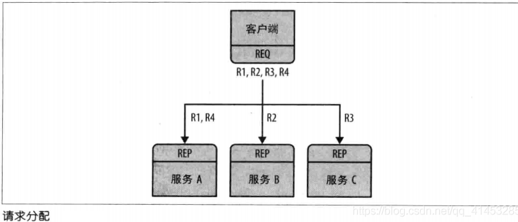

方法②：

* 我们可以编写一个小型消息排队代理，使我们具备灵活性

* 原理：该代理绑定到了两个端点，一个用于客户端的前端（ZMQ_ROUTER），另一个用于服务的后端（ZMQ_DEALER）。然后带来使用zmq_poll()来轮询这两个套接字的活动，当有消息时，代理会将消息在两个套接字之间频繁地输送

* 该代理其实并不显式管理任何队列，其只负责消息的传送，ØMQ会自动将消息在每个套接字上进行排队

* 使用zmq_poll()配合DEALER-ROUTER：

  * 在上面我们使用REQ-REP套接字时，会有一个严格同步的请求-响应对话，就是必须客户端先发送一个请求，然后服务端读取请求并发送应答，最后客户端读取应答，如此反复。如果客户端或服务端尝试破坏这种约束（例如，连续发送两个请求，而没有等待响应），那么将返回一个错误
  * 我们的代理必须是非阻塞的，可以使用zmq_poll()来轮询任何一个套接字上的活动，但我们不能使用REQ-REQ。幸运地是，有两个称为DEALER和ROUTER的套接字，它们能我们可以执行无阻塞的请求-响应

  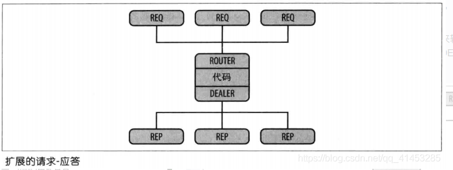

- **代理演示案例如下所示：****我们扩展了上面的“REQ-REP”演示案例：**REQ和ROUTER交流，DEALER与REP交流。代理节点从一个套接字读取消息，并将消息转发到其他套接字

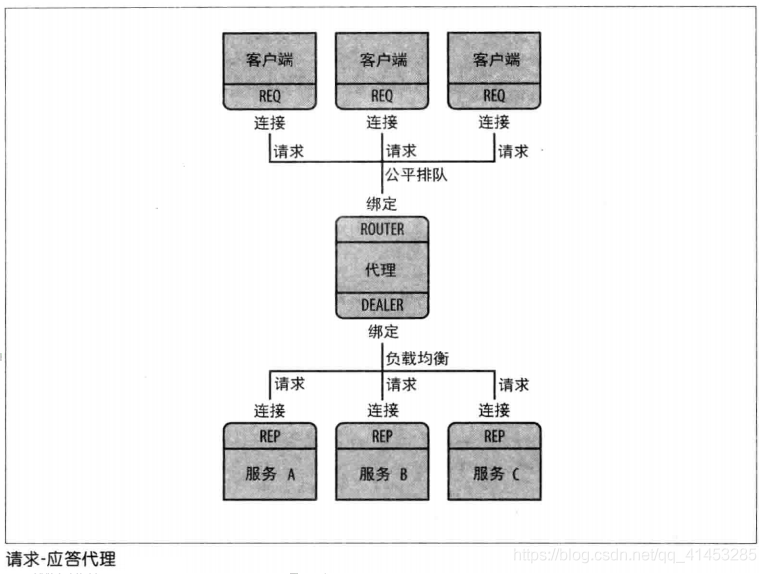

**客户端的代码如下：**将REQ套接字连接到代理的ROUTER节点上，向ROUTER节点发送“Hello”，接收到“World”的回复

```C
// rrclient.c
// https://github.com/dongyusheng/csdn-code/blob/master/ZeroMQ/rrclient.c
#include <stdio.h>
#include <stdlib.h>
#include <string.h>
#include <zmq.h>
 
// 向socket发送数据, 数据为string
static int s_send(void *socket, char *string);
// 从socket接收数据, 并将数据以字符串的形式返回
static char *s_recv(void *socket);
 
int main()
{
    int rc;
    // 1.初始化上下文
    void *context = zmq_ctx_new();
 
    // 2.创建套接字、连接代理的ROUTER端
    void *requester = zmq_socket(context, ZMQ_REQ);
    rc = zmq_connect(requester, "tcp://localhost:5559");
    if(rc == -1)
    {
        perror("zmq_connect");
        zmq_close(requester);
        zmq_ctx_destroy(context);
        return -1;
    }
 
    // 3.循环发送、接收数据(10次)
    int request_nbr;
    for(request_nbr = 0; request_nbr < 10; request_nbr++)
    {
        // 4.先发送数据
        rc = s_send(requester, "Hello");
        if(rc < 0)
        {
            perror("s_send");
            zmq_close(requester);
            zmq_ctx_destroy(context);
            return -1;
        }
        
        // 5.等待响应
        char *reply = s_recv(requester);
        if(reply == NULL)
        {
            perror("s_recv");
            free(reply);
            zmq_close(requester);
            zmq_ctx_destroy(context);
            return -1;
        }
        printf("Reply[%d]: %s\n", request_nbr + 1, reply);
        free(reply);
    }
 
    // 6.关闭套接字、销毁上下文
    zmq_close(requester);
    zmq_ctx_destroy(context);
 
    return 0;
}
 
static int s_send(void *socket, char *string)
{
    int rc;
    
    zmq_msg_t msg;
    zmq_msg_init_size(&msg, 5);
    memcpy(zmq_msg_data(&msg), string, strlen(string));
    
    rc = zmq_msg_send(&msg, socket, 0);
    zmq_msg_close(&msg);
 
    return rc;
}
 
static char *s_recv(void *socket)
{
    int rc;
    zmq_msg_t msg;
    zmq_msg_init(&msg);
    
    rc = zmq_msg_recv(&msg, socket, 0);
    if(rc == -1)
        return NULL;
    
    char *string = (char*)malloc(rc + 1);
    memcpy(string, zmq_msg_data(&msg), rc);
    zmq_msg_close(&msg);
    
    string[rc] = 0;
    return string;
}
```

- **服务端的代码如下：**将REP套接字连接到代理的DEALER节点上

```C
// rrworker.c
// https://github.com/dongyusheng/csdn-code/blob/master/ZeroMQ/rrworker.c
#include <stdio.h>
#include <stdlib.h>
#include <string.h>
#include <unistd.h>
#include <zmq.h>
 
// 向socket发送数据, 数据为string
static int s_send(void *socket, char *string);
// 从socket接收数据, 并将数据以字符串的形式返回
static char *s_recv(void *socket);
 
int main()
{
    int rc;
    // 1.初始化上下文
    void *context = zmq_ctx_new();
 
    // 2.创建套接字、连接代理的DEALER端
    void *responder = zmq_socket(context, ZMQ_REP);
    rc = zmq_connect(responder, "tcp://localhost:5560");
    if(rc == -1)
    {
        perror("zmq_connect");
        zmq_close(responder);
        zmq_ctx_destroy(context);
        return -1;
    }
 
    // 3.循环接收、响应
    while(1)
    {
        // 4.先等待接收数据
        char *request = s_recv(responder);
        if(request == NULL)
        {
            perror("s_recv");
            free(request);
            zmq_close(responder);
            zmq_ctx_destroy(context);
            return -1;
        }
        printf("Request: %s\n", request);
        free(request);
 
        // 休眠1秒再进行响应
        sleep(1);
        
        // 5.响应
        rc = s_send(responder, "World");
        if(rc < 0)
        {
            perror("s_send");
            zmq_close(responder);
            zmq_ctx_destroy(context);
            return -1;
        }
    }
 
    // 6.关闭套接字、销毁上下文
    zmq_close(responder);
    zmq_ctx_destroy(context);
 
    return 0;
}
 
static int s_send(void *socket, char *string)
{
    int rc;
    
    zmq_msg_t msg;
    zmq_msg_init_size(&msg, 5);
    memcpy(zmq_msg_data(&msg), string, strlen(string));
    
    rc = zmq_msg_send(&msg, socket, 0);
    zmq_msg_close(&msg);
 
    return rc;
}
 
static char *s_recv(void *socket)
{
    int rc;
    zmq_msg_t msg;
    zmq_msg_init(&msg);
    
    rc = zmq_msg_recv(&msg, socket, 0);
    if(rc == -1)
        return NULL;
    
    char *string = (char*)malloc(rc + 1);
    memcpy(string, zmq_msg_data(&msg), rc);
    zmq_msg_close(&msg);
    
    string[rc] = 0;
    return string;
}
```

- **代理端的代码如下：**
  - 创建一个ROUTER套接字与客户端相连接，创建一个DEALER套接字与服务端相连接
  - ROUTER套接字从客户端接收请求数据，并把请求数据发送给服务端
  - DEALER套接字从服务端接收响应数据，并把响应数据发送给客户端

```C
// rrbroker.c
// https://github.com/dongyusheng/csdn-code/blob/master/ZeroMQ/rrbroker.c
#include <stdio.h>
#include <stdio.h>
#include <stdlib.h>
#include <string.h>
#include <zmq.h>
 
int main()
{
    int rc;
    // 1.初始化上下文
    void *context = zmq_ctx_new();
 
    // 2.创建、绑定套接字
    void *frontend = zmq_socket(context, ZMQ_ROUTER);
    void *backend = zmq_socket(context, ZMQ_DEALER);
    // ZMQ_ROUTER绑定到5559, 接收客户端的请求
    rc = zmq_bind(frontend, "tcp://*:5559");
    if(rc == -1)
    {
        perror("zmq_bind");
        zmq_close(frontend);
        zmq_close(backend);
        zmq_ctx_destroy(context);
        return -1;
    }
    // ZMQ_DEALER绑定到5560, 接收服务端的回复
    rc = zmq_bind(backend, "tcp://*:5560");
    if(rc == -1)
    {
        perror("zmq_bind");
        zmq_close(frontend);
        zmq_close(backend);
        zmq_ctx_destroy(context);
        return -1;
    }
    // 3.初始化轮询集合
    zmq_pollitem_t items[] = {
        { frontend, 0, ZMQ_POLLIN, 0 },
        { backend, 0, ZMQ_POLLIN, 0 }
    };
 
    // 4.在套接字上切换消息
    while(1)
    {
        zmq_msg_t msg;
        //多部分消息检测
        int more;     
 
        // 5.调用zmq_poll轮询消息
        rc = zmq_poll(items, 2, -1);
        //zmq_poll出错
        if(rc == -1)     
        {
             perror("zmq_poll");
            zmq_close(frontend);
            zmq_close(backend);
            zmq_ctx_destroy(context);
            return -1;
        }
        //zmq_poll超时
        else if(rc == 0) 
            continue;
        else
        {
            // 6.如果ROUTER套接字有数据来
            if(items[0].revents & ZMQ_POLLIN)
            {
                while(1)
                {
                    // 从ROUTER上接收数据, 这么数据是客户端发送过来的"Hello"
                    zmq_msg_init(&msg);
                    zmq_msg_recv(&msg, frontend, 0);
 
                    // 查看是否是接收多部分消息, 如果后面还有数据要接收, 那么more会被置为1
                    size_t more_size = sizeof(more);
                    zmq_getsockopt(frontend, ZMQ_RCVMORE, &more, &more_size);
 
                    // 接收"Hello"之后, 将数据发送到DEALER上, DEALER会将"Hello"发送给服务端
                    zmq_msg_send(&msg, backend, more ? ZMQ_SNDMORE : 0);
                    zmq_msg_close(&msg);
 
                    // 如果没有多部分数据可以接收了, 那么退出循环
                    if(!more)
                        break;
                }
            }
            // 7.如果DEALER套接字有数据来
            if(items[1].revents & ZMQ_POLLIN)
            {
                
                while(1)
                {
                    // 接收服务端的响应"World"
                    zmq_msg_init(&msg);
                    zmq_msg_recv(&msg, backend, 0);
 
                    // 查看是否是接收多部分消息, 如果后面还有数据要接收, 那么more会被置为1
                    size_t more_size = sizeof(more);
                    zmq_getsockopt(backend, ZMQ_RCVMORE, &more, &more_size);
 
                    // 接收"World"之后, 将数据发送到ROUTER上, ROUTER会将"World"发送给客户端
                    zmq_msg_send(&msg, frontend, more ? ZMQ_SNDMORE : 0);
                    zmq_msg_close(&msg);
 
                    // 如果没有多部分数据可以接收了, 那么退出循环
                    if(!more)
                        break;
                }
            }
        }
    }
 
    // 8.关闭套接字、销毁上下文
    zmq_close(frontend);
    zmq_close(backend);
    zmq_ctx_destroy(context);
    
    return 0;
}
```

编译

```shell
gcc -o rrclient rrclient.c -lzmq
gcc -o rrworker rrworker.c -lzmq
gcc -o rrbroker rrbroker.c -lzmq
```

**一次运行如下，**左侧为客户端，中间为代理，右侧为服务端


**下面运行两个客户端，**0为代理，1、2为客户端，3位服务端。可以看到客户端的消息是有顺序到达客户端的，消息会自动进行排队

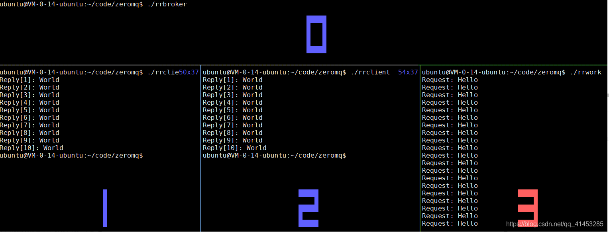

————————————————
版权声明：本文为CSDN博主「董哥的黑板报」的原创文章，遵循CC 4.0 BY-SA版权协议，转载请附上原文出处链接及本声明。
原文链接：https://blog.csdn.net/qq_41453285/article/details/106878960

————————————————
版权声明：本文为CSDN博主「董哥的黑板报」的原创文章，遵循CC 4.0 BY-SA版权协议，转载请附上原文出处链接及本声明。
原文链接：https://blog.csdn.net/qq_41453285/article/details/106878960


————————————————
版权声明：本文为CSDN博主「董哥的黑板报」的原创文章，遵循CC 4.0 BY-SA版权协议，转载请附上原文出处链接及本声明。
原文链接：https://blog.csdn.net/qq_41453285/article/details/106878960


————————————————
版权声明：本文为CSDN博主「董哥的黑板报」的原创文章，遵循CC 4.0 BY-SA版权协议，转载请附上原文出处链接及本声明。
原文链接：https://blog.csdn.net/qq_41453285/article/details/106878960

# tips

1. 关于bind和connect：例如pub和sub示例1，并不是pub必须调用bind，sub一定调用connect。实际是根据那一端是服务端（也就是单独的），那一端是客户端（多数的）来决定的。总是服务端调用bind，客户端调用connnect。

# 附录

比较新的中文参考

https://blog.csdn.net/weixin_34854320/article/details/112983028

https://www.cnblogs.com/neooelric/p/9020872.html

较旧的中文参考就是zmq中文目录下的内容

https://github.com/dongyusheng/csdn-code/

https://blog.csdn.net/qq_41453285/category_9981784.html

官方说明：https://zguide.zeromq.org/docs/chapter1/

官方API：http://api.zeromq.org/

博客 https://blog.csdn.net/qq_41453285/article/details/106865539