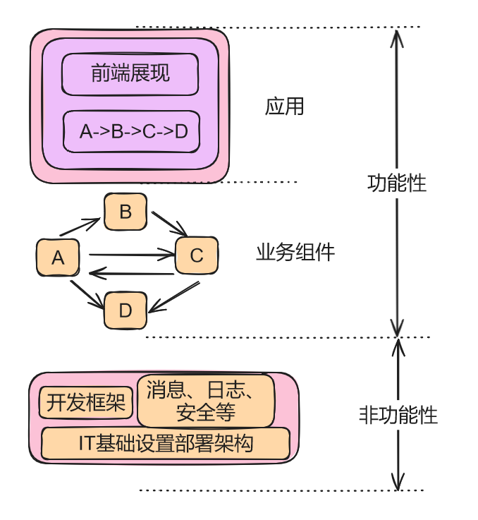
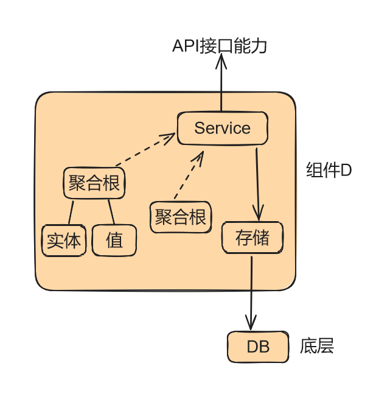

# 1 简介

一直没有系统的学过软件工程相关的内容，因此关于软件架构设计更是没有一个系统的了解。在B站刷到一个视频我觉得讲的算是深入浅出，可以理解一个大概，这里就针对这个视频进行一个学习笔记的记录，视频链接在附录中

# 2 软件架构设计核心

简单的理解架构：应该拆分出哪一些组件，组件和组件之间应该怎样的衔接。

从软件开发到软件架构设计的思维转变，软件架构设计的核心关键有以下两个方面：

* 大的问题（应用）分而治之（功能性，业务的理解）

  分为哪些业务模块或者业务组件（模块的分解），满足高内聚低耦合的要求

* 底层用什么技术支撑（非功能性，与业务无关）

  * 开发框架，包括非功能性设计要求（如消息、日志、安全等组件）（Paas技术平台）
  * 底层IT基础设置部署架构（Iaas平台）

## 2.1 功能性应用架构

上图中上半部分就是功能性的应用架构示意图，也分为两个方面

* 业务组件A、B、C、D的集成关系、交互接口（业务组件）
* 上层应用存在业务流程的实现（交互）（应用）

针对业务组件D进行细化

* 提供接口给其他组件
* 消费其他组件的接口
* 消费底层接口
* 提供上层应用接口

# 附录：

* 视频链接：https://www.bilibili.com/video/BV1ve4y1b7gH/?spm_id_from=333.788&vd_source=cde2e7b9bca1a7048a13eaf0b48210b6